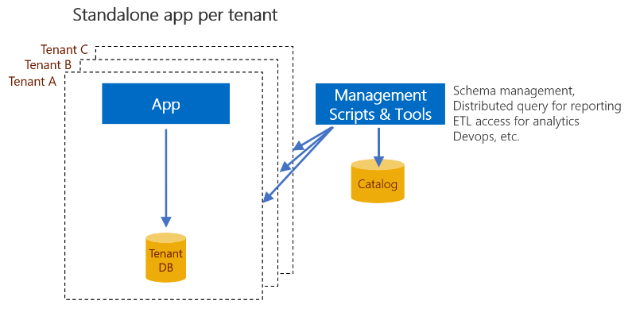
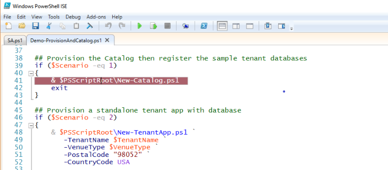
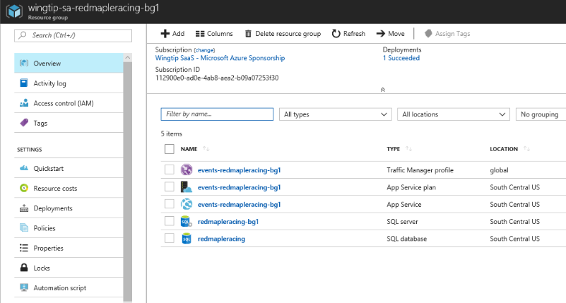

# Provision and catalog new tenants using the  application per tenant SaaS pattern
[!INCLUDE[appliesto-sqldb](../includes/appliesto-sqldb.md)]

This article covers the provisioning and cataloging of new tenants using the standalone app per tenant SaaS pattern.
This article has two major parts:
* Conceptual discussion of provisioning and cataloging new tenants
* A tutorial that highlights sample PowerShell code that accomplishes the provisioning and cataloging
    * The tutorial uses the Wingtip Tickets sample SaaS application, adapted to the standalone app per tenant pattern.

## Standalone application per tenant pattern

The standalone app per tenant pattern is one of several patterns for multi-tenant SaaS applications.  In this pattern, a standalone app is provisioned for each tenant. The application comprises application level components and an Azure SQL Database.  Each tenant app can be deployed in the vendor’s subscription.  Alternatively, Azure offers a [managed applications program](https://docs.microsoft.com/azure/managed-applications/overview) in which an app can be deployed in a tenant’s subscription and managed by the vendor on the tenant’s behalf.

   

When deploying an application for a tenant, the app and database are provisioned in a new resource group created for the tenant.  Using separate resource groups isolates each tenant's application resources and allows them to be managed independently. Within each resource group, each application instance is configured to access its corresponding database directly.  This connection model contrasts with other patterns that use a catalog to broker connections between the app and the database.  And as there is no resource sharing, each tenant database must be provisioned with sufficient resources to handle its peak load. This pattern tends to be used for SaaS applications with fewer tenants, where there is a strong emphasis on tenant isolation and less emphasis on resource costs.

## Using a tenant catalog with the application per tenant pattern

While each tenant’s app and database are fully isolated, various management and analytics scenarios may operate across tenants.  For example, applying a schema change for a new release of the application requires changes to the schema of each tenant database. Reporting and analytics scenarios may also require access to all the tenant databases regardless of where they are deployed.

   

The tenant catalog holds a mapping between a tenant identifier and a tenant database, allowing an identifier to be resolved to a server and database name.  In the Wingtip SaaS app, the tenant identifier is computed as a hash of the tenant name, although other schemes could be used.  While standalone applications don't need the catalog to manage connections, the catalog can be used to scope other actions to a set of tenant databases. For example, Elastic Query can use the catalog to determine the set of databases across which queries are distributed for cross-tenant reporting.

## Elastic Database Client Library

In the Wingtip sample application, the catalog is implemented by the shard management features of the [Elastic Database Client Library](elastic-database-client-library.md) (EDCL).  The library enables an application to create, manage, and use a shard map that is stored in a database. In the Wingtip Tickets sample, the catalog is stored in the *tenant catalog* database.  The shard maps a tenant key to the shard (database) in which that tenant’s data is stored.  EDCL functions manage a *global shard map* stored in tables in the *tenant catalog* database and a *local shard map* stored in each shard.

EDCL functions can be called from applications or PowerShell scripts to create and manage the entries in the shard map. Other EDCL functions can be used to retrieve the set of shards or connect to the correct database for given tenant key.

> [!IMPORTANT]
> Do not edit the data in the catalog database or the local shard map in the tenant databases directly. Direct updates are not supported due to the high risk of data corruption. Instead, edit the mapping data by using EDCL APIs only.

## Tenant provisioning

Each tenant requires a new Azure resource group, which must be created before resources can be provisioned within it. Once the resource group exists, an Azure Resource Management template can be used to deploy the application components and the database, and then configure the database connection. To initialize the database schema, the template can import a bacpac file.  Alternatively, the database can be created as a copy of a ‘template’ database.  The database is then further updated with initial venue data and registered in the catalog.

## Tutorial

In this tutorial you learn how to:

* Provision a catalog
* Register the sample tenant databases that you deployed earlier in the catalog
* Provision an additional tenant and register it in the catalog

An Azure Resource Manager template is used to deploy and configure the application, create the tenant database, and then import a bacpac file to initialize it. The import request may be queued for several minutes before it is actioned.

At the end of this tutorial, you have a set of standalone tenant applications, with each database registered in the catalog.

## Prerequisites

To complete this tutorial, make sure the following prerequisites are completed:

* Azure PowerShell is installed. For details, see [Getting started with Azure PowerShell](https://docs.microsoft.com/powershell/azure/get-started-azureps)
* The three sample tenant apps are deployed. To deploy these apps in less than five minutes, see [Deploy and explore the Wingtip Tickets SaaS Standalone Application pattern](../../sql-database/saas-standaloneapp-get-started-deploy.md).

## Provision the catalog

In this task, you learn how to provision the catalog used to register all the tenant databases. You will:

* **Provision the catalog database** using an Azure resource management template. The database is initialized by importing a bacpac file.
* **Register the sample tenant apps** that you deployed earlier.  Each tenant is registered using a key constructed from a hash of the tenant name.  The tenant name is also stored in an extension table in the catalog.

1. In PowerShell ISE, open *...\Learning Modules\UserConfig.psm* and update the **\<user\>** value to the value you used when deploying the three sample applications.  **Save the file**.
1. In PowerShell ISE, open *...\Learning Modules\ProvisionTenants\Demo-ProvisionAndCatalog.ps1* and set **$Scenario = 1**. Deploy the tenant catalog and register the pre-defined tenants.

1. Add a breakpoint by putting your cursor anywhere on the line that says, `& $PSScriptRoot\New-Catalog.ps1`, and then press **F9**.

    

1. Run the script by pressing **F5**.
1.	After script execution stops at the breakpoint, press **F11** to step into the New-Catalog.ps1 script.
1.	Trace the script's execution using the Debug menu options, F10 and F11, to step over or into called functions.
    *	For more information about debugging PowerShell scripts, see [Tips on working with and debugging PowerShell scripts](https://docs.microsoft.com/powershell/scripting/components/ise/how-to-debug-scripts-in-windows-powershell-ise).

Once the script completes, the catalog will exist and all the sample tenants will be registered.

Now look at the resources you created.

1. Open the [Azure portal](https://portal.azure.com/) and browse the resource groups.  Open the **wingtip-sa-catalog-\<user\>** resource group and note the catalog server and database.
1. Open the database in the portal and select *Data explorer* from the left-hand menu.  Click the Login command and then enter the Password = **P\@ssword1**.

1. Explore the schema of the *tenantcatalog* database.
   * The objects in the `__ShardManagement` schema are all provided by the Elastic Database Client Library.
   * The `Tenants` table and `TenantsExtended` view are extensions added in the sample that demonstrate how you can extend the catalog to provide additional value.
1. Run the query, `SELECT * FROM dbo.TenantsExtended`.

   

    As an alternative to using the Data Explorer you can connect to the database from SQL Server Management Studio. To do this, connect to the server wingtip-

    Note that you should not edit data directly in the catalog - always use the shard management APIs.

## Provision a new tenant application

In this task, you learn how to provision a single tenant application. You will:

* **Create a new resource group** for the tenant.
* **Provision the application and database** into the new resource group using an Azure resource management template.  This action includes initializing the database with common schema and reference data by importing a bacpac file.
* **Initialize the database with basic tenant information**. This action includes specifying the venue type, which determines the photograph used as the background on its events web site.
* **Register the database in the catalog database**.

1. In PowerShell ISE, open *...\Learning Modules\ProvisionTenants\Demo-ProvisionAndCatalog.ps1* and set **$Scenario = 2**. Deploy the tenant catalog and register the pre-defined tenants

1. Add a breakpoint in the script by putting your cursor anywhere on line 49 that says, `& $PSScriptRoot\New-TenantApp.ps1`, and then press **F9**.
1. Run the script by pressing **F5**.
1.	After script execution stops at the breakpoint, press **F11** to step into the New-Catalog.ps1 script.
1.	Trace the script's execution using the Debug menu options, F10 and F11, to step over or into called functions.

After the tenant has been provisioned, the new tenant's events website is opened.

   

You can then inspect the new resources created in the Azure portal.

   

## To stop billing, delete resource groups

When you have finished exploring the sample, delete all the resource groups you created to stop the associated billing.

## Additional resources

- To learn more about multi-tenant SaaS database applications, see [Design patterns for multi-tenant SaaS applications](saas-tenancy-app-design-patterns.md).

## Next steps

In this tutorial you learned:

> [!div class="checklist"]
> * How to deploy the Wingtip Tickets SaaS Standalone Application.
> * About the servers and databases that make up the app.
> * How to delete sample resources to stop related billing.

You can explore how the catalog is used to support various cross-tenant scenarios using the database-per-tenant version of the [Wingtip Tickets SaaS application](../../sql-database/saas-dbpertenant-wingtip-app-overview.md).
