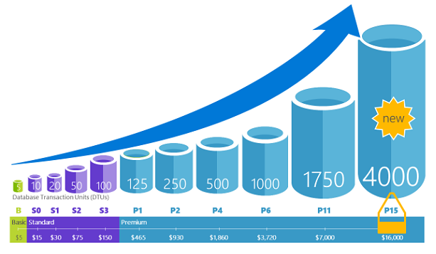

# Dynamically scale database resources with minimal downtime
[!INCLUDE[appliesto-sqldb-sqlmi](../includes/appliesto-sqldb-sqlmi.md)]

Azure SQL Database and SQL Managed Instance enable you to dynamically add more resources to your database with minimal [downtime](https://azure.microsoft.com/support/legal/sla/sql-database); however, there is a switch over period where connectivity is lost to the database for a short amount of time, which can be mitigated using retry logic.

## Overview

When demand for your app grows from a handful of devices and customers to millions, Azure SQL Database and SQL Managed Instance scale on the fly with minimal downtime. Scalability is one of the most important characteristics of platform as a service (PaaS) that enables you to dynamically add more resources to your service when needed. Azure SQL Database enables you to easily change resources (CPU power, memory, IO throughput, and storage) allocated to your databases.

You can mitigate performance issues due to increased usage of your application that cannot be fixed using indexing or query rewrite methods. Adding more resources enables you to quickly react when your database hits the current resource limits and needs more power to handle the incoming workload. Azure SQL Database also enables you to scale-down the resources when they are not needed to lower the cost.

You don’t need to worry about purchasing hardware and changing underlying infrastructure. Scaling a database can be easily done via the Azure portal using a slider.

Azure SQL Database offers the [DTU-based purchasing model](service-tiers-dtu.md) and the [vCore-based purchasing model](service-tiers-vcore.md), while Azure SQL Managed Instance offers just the [vCore-based purchasing model](service-tiers-vcore.md). 

- The [DTU-based purchasing model](service-tiers-dtu.md) offers a blend of compute, memory, and I/O resources in three service tiers to support lightweight to heavyweight database workloads: Basic, Standard, and Premium. Performance levels within each tier provide a different mix of these resources, to which you can add additional storage resources.
- The [vCore-based purchasing model](service-tiers-vcore.md) lets you choose the number of vCores, the amount or memory, and the amount and speed of storage. This purchasing model offers three service tiers: General Purpose, Business Critical, and Hyperscale.

You can build your first app on a small, single database at a low cost per month in the Basic, Standard, or General Purpose service tier and then change its service tier manually or programmatically at any time to the Premium or Business Critical service tier to meet the needs of your solution. You can adjust performance without downtime to your app or to your customers. Dynamic scalability enables your database to transparently respond to rapidly changing resource requirements and enables you to only pay for the resources that you need when you need them.

> [!NOTE]
> Dynamic scalability is different from autoscale. Autoscale is when a service scales automatically based on criteria, whereas dynamic scalability allows for manual scaling with a minimal downtime.

Single databases in Azure SQL Database support manual dynamic scalability, but not autoscale. For a more *automatic* experience, consider using elastic pools, which allow databases to share resources in a pool based on individual database needs.
However, there are scripts that can help automate scalability for a single database in Azure SQL Database. For an example, see [Use PowerShell to monitor and scale a single SQL Database](scripts/monitor-and-scale-database-powershell.md).

You can change [DTU service tiers](service-tiers-dtu.md) or [vCore characteristics](resource-limits-vcore-single-databases.md) at any time with minimal downtime to your application (generally averaging under four seconds). For many businesses and apps, being able to create databases and dial performance up or down on demand is enough, especially if usage patterns are relatively predictable. But if you have unpredictable usage patterns, it can make it hard to manage costs and your business model. For this scenario, you use an elastic pool with a certain number of eDTUs that are shared among multiple databases in the pool.

Azure SQL Database offers the ability to dynamically scale your databases:

- With a [single database](single-database-scale.md), you can use either [DTU](resource-limits-dtu-single-databases.md) or [vCore](resource-limits-vcore-single-databases.md) models to define maximum amount of resources that will be assigned to each database.
- [Elastic pools](elastic-pool-scale.md) enable you to define maximum resource limit per group of databases in the pool.

Azure SQL Managed Instance allows you to scale as well: 

- [SQL Managed Instance](../managed-instance/sql-managed-instance-paas-overview.md) uses [vCores](../managed-instance/sql-managed-instance-paas-overview.md#vcore-based-purchasing-model) mode and enables you to define maximum CPU cores and maximum of storage allocated to your instance. All databases within the managed instance will share the resources allocated to the instance.

Initiating scale up or scale down action in any of the flavors would restart database engine process and move it to a different virtual machine if needed. Moving database engine process to a new virtual machine is **online process** where you can continue using your existing Azure SQL Database service while the process is in progress. Once the target database engine is fully initialized and ready to process the queries, the connections will be [switched from source to target database engine](single-database-scale.md#impact).

> [!NOTE]
> You can expect a short connection break when the scale up/scale down process is finished. If you have implemented [Retry logic for standard transient errors](troubleshoot-common-connectivity-issues.md#retry-logic-for-transient-errors), you will not notice the failover.

## Alternative scale methods

Scaling resources is the easiest and the most effective way to improve performance of your database without changing either the database or application code. In some cases, even the highest service tiers, compute sizes, and performance optimizations might not handle your workload in a successful and cost-effective way. In that case you have these additional options to scale your database:

- [Read scale-out](read-scale-out.md) is an available feature where you are getting one read-only replica of your data where you can execute demanding read-only queries such as reports. A read-only replica will handle your read-only workload without affecting resource usage on your primary database.
- [Database sharding](elastic-scale-introduction.md) is a set of techniques that enables you to split your data into several databases and scale them independently.

## Next steps

- For information about improving database performance by changing database code, see [Find and apply performance recommendations](database-advisor-find-recommendations-portal.md).
- For information about letting built-in database intelligence optimize your database, see [Automatic tuning](automatic-tuning-overview.md).
- For information about read scale-out in Azure SQL Database, see how to [use read-only replicas to load balance read-only query workloads](read-scale-out.md).
- For information about a Database sharding, see [Scaling out with Azure SQL Database](elastic-scale-introduction.md).
