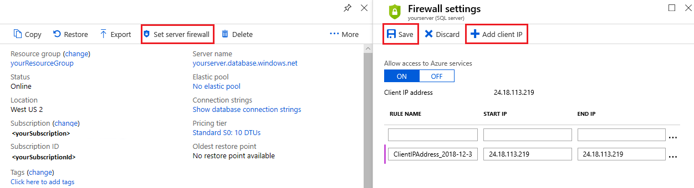
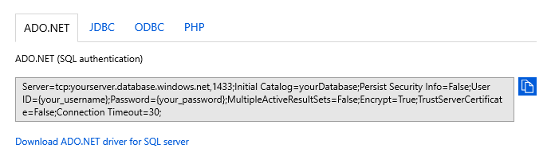
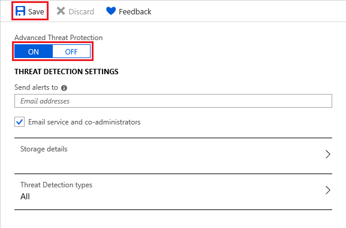
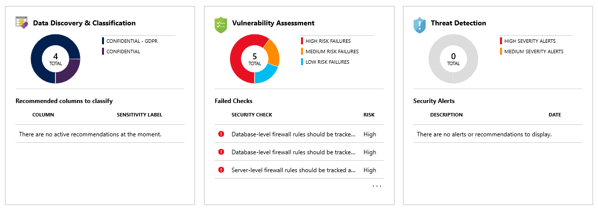
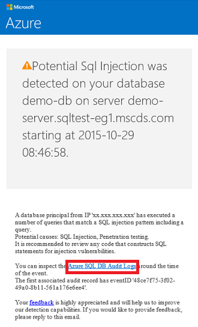
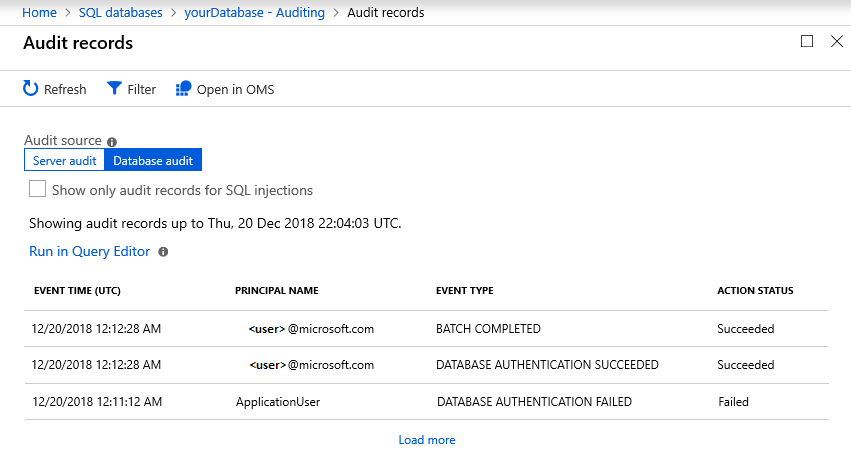
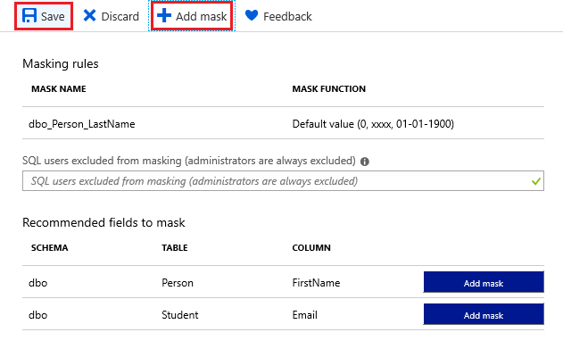
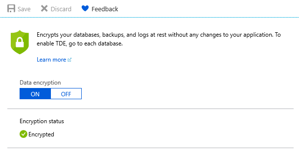

# Tutorial: Secure a database in Azure SQL Database
[!INCLUDE[appliesto-sqldb](../includes/appliesto-sqldb.md)]

In this tutorial you learn how to:

> [!div class="checklist"]
>
> - Create server-level and database-level firewall rules
> - Configure an Azure Active Directory (Azure AD) administrator
> - Manage user access with SQL authentication, Azure AD authentication, and secure connection strings
> - Enable security features, such as advanced data security, auditing, data masking, and encryption

Azure SQL Database secures data by allowing you to:

- Limit access using firewall rules
- Use authentication mechanisms that require identity
- Use authorization with role-based memberships and permissions
- Enable security features

> [!NOTE]
> Azure SQL Managed Instance is secured using network security rules and private endpoints as described in [Azure SQL Managed Instance](../managed-instance/sql-managed-instance-paas-overview.md) and [connectivity architecture](../managed-instance/connectivity-architecture-overview.md).

To learn more, see the [Azure SQL Database security overview](/azure/sql-database/sql-database-security-index) and [capabilities](security-overview.md) articles.

> [!TIP]
> The following Microsoft Learn module helps you learn for free about how to [Secure your database in Azure SQL Database](https://docs.microsoft.com/learn/modules/secure-your-azure-sql-database/).

## Prerequisites

To complete the tutorial, make sure you have the following prerequisites:

- [SQL Server Management Studio](/sql/ssms/download-sql-server-management-studio-ssms)
- A [server](logical-servers.md) and a single database
  - Create them with the [Azure portal](single-database-create-quickstart.md), [CLI](az-cli-script-samples-content-guide.md), or [PowerShell](powershell-script-content-guide.md)

If you don't have an Azure subscription, [create a free account](https://azure.microsoft.com/free/) before you begin.

## Sign in to the Azure portal

For all steps in the tutorial, sign in to the [Azure portal](https://portal.azure.com/)

## Create firewall rules

Databases in SQL Database are protected by firewalls in Azure. By default, all connections to the server and database are rejected. To learn more, see [server-level and database-level firewall rules](firewall-configure.md).

Set **Allow access to Azure services** to **OFF** for the most secure configuration. Then, create a [reserved IP (classic deployment)](/previous-versions/azure/virtual-network/virtual-networks-reserved-public-ip) for the resource that needs to connect, such as an Azure VM or cloud service, and only allow that IP address access through the firewall. If you're using the [resource manager](/azure/virtual-network/virtual-network-ip-addresses-overview-arm) deployment model, a dedicated public IP address is required for each resource.

> [!NOTE]
> SQL Database communicates over port 1433. If you're trying to connect from within a corporate network, outbound traffic over port 1433 may not be allowed by your network's firewall. If so, you can't connect to the server unless your administrator opens port 1433.

### Set up server-level firewall rules

Server-level IP firewall rules apply to all databases within the same server.

To set up a server-level firewall rule:

1. In the Azure portal, select **SQL databases** from the left-hand menu, and select your database on the **SQL databases** page.

    

    > [!NOTE]
    > Be sure to copy your fully qualified server name (such as *yourserver.database.windows.net*) for use later in the tutorial.

1. On the **Overview** page, select **Set server firewall**. The **Firewall settings** page for the server opens.

   1. Select **Add client IP** on the toolbar to add your current IP address to a new firewall rule. The rule can open port 1433 for a single IP address or a range of IP addresses. Select **Save**.

      

   1. Select **OK** and close the **Firewall settings** page.

You can now connect to any database in the server with the specified IP address or IP address range.

### Setup database firewall rules

Database-level firewall rules only apply to individual databases. The database will retain these rules during a server failover. Database-level firewall rules can only be configured using Transact-SQL (T-SQL) statements, and only after you've configured a server-level firewall rule.

To set up a database-level firewall rule:

1. Connect to the database, for example using [SQL Server Management Studio](connect-query-ssms.md).

1. In **Object Explorer**, right-click the database and select **New Query**.

1. In the query window, add this statement and modify the IP address to your public IP address:

    ```sql
    EXECUTE sp_set_database_firewall_rule N'Example DB Rule','0.0.0.4','0.0.0.4';
    ```

1. On the toolbar, select **Execute** to create the firewall rule.

> [!NOTE]
> You can also create a server-level firewall rule in SSMS by using the [sp_set_firewall_rule](/sql/relational-databases/system-stored-procedures/sp-set-firewall-rule-azure-sql-database?view=azuresqldb-current) command, though you must be connected to the *master* database.

## Create an Azure AD admin

Make sure you're using the appropriate Azure Active Directory (AD) managed domain. To select the AD domain, use the upper-right corner of the Azure portal. This process confirms the same subscription is used for both Azure AD and the logical SQL server hosting your database or data warehouse.

   

To set the Azure AD administrator:

1. In the Azure portal, on the **SQL server** page, select **Active Directory admin**. Next select **Set admin**.

      

    > [!IMPORTANT]
    > You need to be either a "Company Administrator" or "Global Administrator" to perform this task.

1. On the **Add admin** page, search and select the AD user or group and choose **Select**. All members and groups of your Active Directory are listed, and entries grayed out are not supported as Azure AD administrators. See [Azure AD features and limitations](authentication-aad-overview.md#azure-ad-features-and-limitations).

    

    > [!IMPORTANT]
    > Role-based access control (RBAC) only applies to the portal and isn't propagated to SQL Server.

1. At the top of the **Active Directory admin** page, select **Save**.

    The process of changing an administrator may take several minutes. The new administrator will appear in the **Active Directory admin** box.

> [!NOTE]
> When setting an Azure AD admin, the new admin name (user or group) cannot exist as a SQL Server login or user in the *master* database. If present, the setup will fail and roll back changes, indicating that such an admin name already exists. Since the SQL Server login or user is not part of Azure AD, any effort to connect the user using Azure AD authentication fails.

For information about configuring Azure AD, see:

- [Integrate your on-premises identities with Azure AD](../../active-directory/hybrid/whatis-hybrid-identity.md)
- [Add your own domain name to Azure AD](../../active-directory/fundamentals/add-custom-domain.md)
- [Microsoft Azure now supports federation with Windows Server AD](https://azure.microsoft.com/blog/20../../windows-azure-now-supports-federation-with-windows-server-active-directory/)
- [Administer your Azure AD directory](../../active-directory/fundamentals/active-directory-whatis.md)
- [Manage Azure AD using PowerShell](/powershell/azure/overview?view=azureadps-2.0)
- [Hybrid identity required ports and protocols](../../active-directory/hybrid/reference-connect-ports.md)

## Manage database access

Manage database access by adding users to the database, or allowing user access with secure connection strings. Connection strings are useful for external applications. To learn more, see [Manage logins and user accounts](logins-create-manage.md) and [AD authentication](authentication-aad-overview.md).

To add users, choose the database authentication type:

- **SQL authentication**, use a username and password for logins and are only valid in the context of a specific database within the server

- **Azure AD authentication**, use identities managed by Azure AD

### SQL authentication

To add a user with SQL authentication:

1. Connect to the database, for example using [SQL Server Management Studio](connect-query-ssms.md).

1. In **Object Explorer**, right-click the database and choose **New Query**.

1. In the query window, enter the following command:

    ```sql
    CREATE USER ApplicationUser WITH PASSWORD = 'YourStrongPassword1';
    ```

1. On the toolbar, select **Execute** to create the user.

1. By default, the user can connect to the database, but has no permissions to read or write data. To grant these permissions, execute the following commands in a new query window:

    ```sql
    ALTER ROLE db_datareader ADD MEMBER ApplicationUser;
    ALTER ROLE db_datawriter ADD MEMBER ApplicationUser;
    ```

> [!NOTE]
> Create non-administrator accounts at the database level, unless they need to execute administrator tasks like creating new users.

### Azure AD authentication

Azure Active Directory authentication requires that database users are created as contained. A contained database user maps to an identity in the Azure AD directory associated with the database and has no login in the *master* database. The Azure AD identity can either be for an individual user or a group. For more information, see [Contained database users, make your database portable](/sql/relational-databases/security/contained-database-users-making-your-database-portable) and review the [Azure AD tutorial](authentication-aad-configure.md) on how to authenticate using Azure AD.

> [!NOTE]
> Database users (excluding administrators) cannot be created using the Azure portal. Azure RBAC roles do not propagate to SQL servers, databases, or data warehouses. They are only used to manage Azure resources and do not apply to database permissions.
>
> For example, the *SQL Server Contributor* role does not grant access to connect to a database or data warehouse. This permission must be granted within the database using T-SQL statements.

> [!IMPORTANT]
> Special characters like colon `:` or ampersand `&` are not supported in user names in the T-SQL `CREATE LOGIN` and `CREATE USER` statements.

To add a user with Azure AD authentication:

1. Connect to your server in Azure using an Azure AD account with at least the *ALTER ANY USER* permission.

1. In **Object Explorer**, right-click the database and select **New Query**.

1. In the query window, enter the following command and modify `<Azure_AD_principal_name>` to the principal name of the Azure AD user or the display name of the Azure AD group:

   ```sql
   CREATE USER <Azure_AD_principal_name> FROM EXTERNAL PROVIDER;
   ```

> [!NOTE]
> Azure AD users are marked in the database metadata with type `E (EXTERNAL_USER)` and type `X (EXTERNAL_GROUPS)` for groups. For more information, see [sys.database_principals](/sql/relational-databases/system-catalog-views/sys-database-principals-transact-sql).

### Secure connection strings

To ensure a secure, encrypted connection between the client application and SQL Database, a connection string must be configured to:

- Request an encrypted connection
- Not trust the server certificate

The connection is established using Transport Layer Security (TLS) and reduces the risk of a man-in-the-middle attack. Connection strings are available per database and are pre-configured to support client drivers such as ADO.NET, JDBC, ODBC, and PHP. For information about TLS and connectivity, see [TLS considerations](connect-query-content-reference-guide.md#tls-considerations-for-database-connectivity).

To copy a secure connection string:

1. In the Azure portal, select **SQL databases** from the left-hand menu, and select your database on the **SQL databases** page.

1. On the **Overview** page, select **Show database connection strings**.

1. Select a driver tab and copy the complete connection string.

    

## Enable security features

Azure SQL Database provides security features that are accessed using the Azure portal. These features are available for both the database and server, except for data masking, which is only available on the database. To learn more, see [Advanced data security](advanced-data-security.md), [Auditing](../../azure-sql/database/auditing-overview.md), [Dynamic data masking](dynamic-data-masking-overview.md), and [Transparent data encryption](transparent-data-encryption-tde-overview.md).

### Advanced data security

The advanced data security feature detects potential threats as they occur and provides security alerts on anomalous activities. Users can explore these suspicious events using the auditing feature, and determine if the event was to access, breach, or exploit data in the database. Users are also provided a security overview that includes a vulnerability assessment and the data discovery and classification tool.

> [!NOTE]
> An example threat is SQL injection, a process where attackers inject malicious SQL into application inputs. An application can then unknowingly execute the malicious SQL and allow attackers access to breach or modify data in the database.

To enable advanced data security:

1. In the Azure portal, select **SQL databases** from the left-hand menu, and select your database on the **SQL databases** page.

1. On the **Overview** page, select the **Server name** link. The server page will open.

1. On the **SQL server** page, find the **Security** section and select **Advanced Data Security**.

   1. Select **ON** under **Advanced Data Security** to enable the feature. Choose a storage account for saving vulnerability assessment results. Then select **Save**.

      

      You can also configure emails to receive security alerts, storage details, and threat detection types.

1. Return to the **SQL databases** page of your database and select **Advanced Data Security** under the **Security** section. Here you'll find various security indicators available for the database.

    

If anomalous activities are detected, you receive an email with information on the event. This includes the nature of the activity, database, server, event time, possible causes, and recommended actions to investigate and mitigate the potential threat. If such an email is received, select the **Azure SQL Auditing Log** link to launch the Azure portal and show relevant auditing records for the time of the event.

   

### Auditing

The auditing feature tracks database events and writes events to an audit log in either Azure storage, Azure Monitor logs, or to an event hub. Auditing helps maintain regulatory compliance, understand database activity, and gain insight into discrepancies and anomalies that could indicate potential security violations.

To enable auditing:

1. In the Azure portal, select **SQL databases** from the left-hand menu, and select your database on the **SQL databases** page.

1. In the **Security** section, select **Auditing**.

1. Under **Auditing** settings, set the following values:

   1. Set **Auditing** to **ON**.

   1. Select **Audit log destination** as any of the following:

       - **Storage**, an Azure storage account where event logs are saved and can be downloaded as *.xel* files

          > [!TIP]
          > Use the same storage account for all audited databases to get the most from auditing report templates.

       - **Log Analytics**, which automatically stores events for query or further analysis

           > [!NOTE]
           > A **Log Analytics workspace** is required to support advanced features such as analytics, custom alert rules, and Excel or Power BI exports. Without a workspace, only the query editor is available.

       - **Event Hub**, which allows events to be routed for use in other applications

   1. Select **Save**.

      

1. Now you can select **View audit logs** to view database events data.

    

> [!IMPORTANT]
> See [SQL database auditing](../../azure-sql/database/auditing-overview.md) on how to further customize audit events using PowerShell or REST API.

### Dynamic data masking

The data masking feature will automatically hide sensitive data in your database.

To enable data masking:

1. In the Azure portal, select **SQL databases** from the left-hand menu, and select your database on the **SQL databases** page.

1. In the **Security** section, select **Dynamic Data Masking**.

1. Under **Dynamic data masking** settings, select **Add mask** to add a masking rule. Azure will automatically populate available database schemas, tables, and columns to choose from.

    

1. Select **Save**. The selected information is now masked for privacy.

    

### Transparent data encryption

The encryption feature automatically encrypts your data at rest, and requires no changes to applications accessing the encrypted database. For new databases, encryption is on by default. You can also encrypt data using SSMS and the [Always encrypted](always-encrypted-certificate-store-configure.md) feature.

To enable or verify encryption:

1. In the Azure portal, select **SQL databases** from the left-hand menu, and select your database on the **SQL databases** page.

1. In the **Security** section, select **Transparent data encryption**.

1. If necessary, set **Data encryption** to **ON**. Select **Save**.

    

> [!NOTE]
> To view encryption status, connect to the database using [SSMS](connect-query-ssms.md) and query the `encryption_state` column of the [sys.dm_database_encryption_keys](/sql/relational-databases/system-dynamic-management-views/sys-dm-database-encryption-keys-transact-sql) view. A state of `3` indicates the database is encrypted.

## Next steps

In this tutorial, you've learned to improve the security of your database with just a few simple steps. You learned how to:

> [!div class="checklist"]
>
> - Create server-level and database-level firewall rules
> - Configure an Azure Active Directory (AD) administrator
> - Manage user access with SQL authentication, Azure AD authentication, and secure connection strings
> - Enable security features, such as advanced data security, auditing, data masking, and encryption

Advance to the next tutorial to learn how to implement geo-distribution.

> [!div class="nextstepaction"]
>[Implement a geo-distributed database](geo-distributed-application-configure-tutorial.md)
