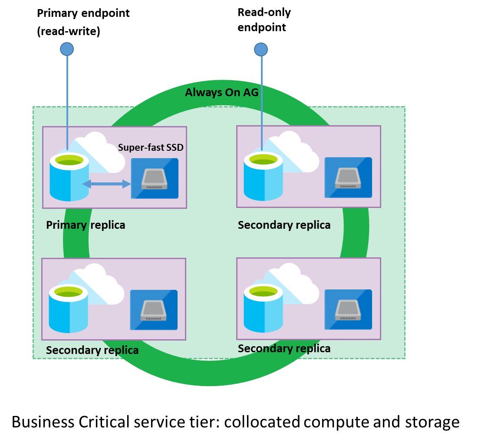

# Business Critical tier - Azure SQL Database and Azure SQL Managed Instance 
[!INCLUDE[appliesto-sqldb-sqlmi](../includes/appliesto-sqldb-sqlmi.md)]

> [!NOTE]
> Business Critical tier is called Premium in the DTU purchasing model. For a comparison of the vCore-based purchasing model with the DTU-based purchasing model, see [Azure SQL Database purchasing models and resources](purchasing-models.md).

Azure SQL Database and Azure SQL Managed Instance are both based on SQL Server database engine architecture that is adjusted for the cloud environment in order to ensure 99.99% availability even in the cases of infrastructure failures. There are three architectural models that are used:
- General Purpose/Standard 
- Business Critical/Premium
- Hyperscale

Premium/Business Critical service tier model is based on a cluster of database engine processes. This architectural model relies on a fact that there is always a quorum of available database engine nodes and has minimal performance impact on your workload even during maintenance activities. The hyperscale service tier is currently only available for Azure SQL Database (not SQL Managed Instance), and is a highly scalable storage and compute performance tier that leverages the Azure architecture to scale out the storage and compute resources for a database in Azure SQL Database substantially beyond the limits available for the General Purpose and Business Critical service tiers.

Azure upgrades and patches underlying operating system, drivers, and SQL Server database engine transparently with the minimal down-time for end users. 

Premium availability is enabled in Premium and Business Critical service tiers and it is designed for intensive workloads that cannot tolerate any performance impact due to the ongoing maintenance operations.

Compute and storage is integrated on the single node in the premium model. High availability in this architectural model is achieved by replication of compute (SQL Server database engine process) and storage (locally attached SSD) deployed to a  four node cluster, using technology similar to SQL Server [Always On availability groups](https://docs.microsoft.com/sql/database-engine/availability-groups/windows/overview-of-always-on-availability-groups-sql-server).

Both the SQL Server database engine process and underlying .mdf/.ldf files are placed on the same node with locally attached SSD storage providing low latency to your workload. High availability is implemented using technology similar to SQL Server [Always On availability groups](https://docs.microsoft.com/sql/database-engine/availability-groups/windows/overview-of-always-on-availability-groups-sql-server). Every database is a cluster of database nodes with one primary database that is accessible for customer workloads, and a three secondary processes containing copies of data. The primary node constantly pushes changes to the secondary nodes in order to ensure that the data is available on secondary replicas if the primary node fails for any reason. Failover is handled by the SQL Server database engine – one secondary replica becomes the primary node and a new secondary replica is created to ensure there are enough nodes in the cluster. The workload is automatically redirected to the new primary node.

In addition, Business Critical cluster has built-in [Read Scale-Out](read-scale-out.md) capability that provides free-of charge built-in read-only node that can be used to run read-only queries (for example reports) that should not affect performance of your primary workload.

## When to choose this service tier

Business Critical service tier is designed for applications that require low-latency responses from the underlying SSD storage (1-2 ms in average), fast recovery if the underlying infrastructure fails, or need to off-load reports, analytics, and read-only queries to the free of charge readable secondary replica of the primary database.

The key reasons why you should choose Business Critical service tier instead of General Purpose tier are:
-	**Low I/O latency requirements** – workloads that need a fast response from the storage layer (1-2 milliseconds in average) should use Business Critical tier. 
-	**Frequent communication between application and database**. Applications that cannot leverage application-layer caching or [request batching](../performance-improve-use-batching.md) and need to send many SQL queries that must be quickly processed are good candidates for the Business Critical tier.
-	**Large number of updates** – insert, update, and delete operations modify the data pages in memory (dirty page) that must be saved to data files with `CHECKPOINT` operation. Potential database engine process crash or a failover of the database with a large number of dirty pages might increase recovery time in General Purpose tier. Use Business Critical tier if you have a workload that causes many in-memory changes. 
-	**Long running transactions that modify data**. Transactions that are opened for a longer time prevent log file truncation, which might increase log size and number of [Virtual log files (VLF)](https://docs.microsoft.com/sql/relational-databases/sql-server-transaction-log-architecture-and-management-guide#physical_arch). High number of VLFs can slow down recovery of database after failover.
-	**Workload with reporting and analytic queries** that can be redirected to the free-of-charge secondary read-only replica.
- **Higher resiliency and faster recovery from failures**. In a case of system failure, the database on primary instance will be disabled and one of the secondary replicas will be immediately became new read-write primary database that is ready to process queries. The database engine doesn't need to analyze and redo transactions from the log file and load all data in the memory buffer.
- **Advanced data corruption protection**. Business Critical tier leverages database replicas behind-the-scenes for business continuity purposes, and so the service also then leverages automatic page repair, which is the same technology used for SQL Server database [mirroring and availability groups](https://docs.microsoft.com/sql/sql-server/failover-clusters/automatic-page-repair-availability-groups-database-mirroring). In the event that a replica cannot read a page due to a data integrity issue, a fresh copy of the page will be retrieved from another replica, replacing the unreadable page without data loss or customer downtime. This functionality is applicable in General Purpose tier if the database has geo-secondary replica.
- **Higher availability** - Business Critical tier in Multi-AZ configuration guarantees 99.995% availability, compared to 99.99% of General Purpose tier.
- **Fast geo-recovery** - Business Critical tier configured with geo-replication has a guaranteed Recovery point objective (RPO) of 5 sec and Recovery time objective (RTO) of 30 sec for 100% of deployed hours.

## Next steps

- Find resource characteristics (number of cores, I/O, memory) of Business Critical tier in [SQL Managed Instance](../managed-instance/resource-limits.md#service-tier-characteristics), Single database in [vCore model](resource-limits-vcore-single-databases.md#business-critical---provisioned-compute---gen4) or [DTU model](resource-limits-dtu-single-databases.md#premium-service-tier), or Elastic pool in [vCore model](resource-limits-vcore-elastic-pools.md#business-critical---provisioned-compute---gen4) and [DTU model](resource-limits-dtu-elastic-pools.md#premium-elastic-pool-limits).
- Learn about [General Purpose](service-tier-general-purpose.md) and [Hyperscale](service-tier-hyperscale.md) tiers.
- Learn about [Service Fabric](../../service-fabric/service-fabric-overview.md).
- For more options for high availability and disaster recovery, see [Business Continuity](business-continuity-high-availability-disaster-recover-hadr-overview.md).
