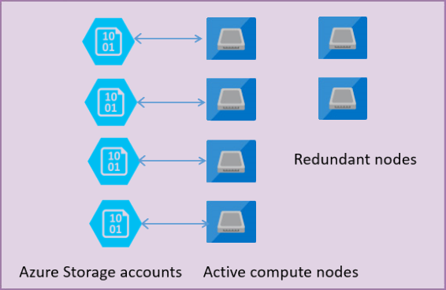

# General Purpose service tier - Azure SQL Database and Azure SQL Managed Instance
[!INCLUDE[appliesto-sqldb-sqlmi](../includes/appliesto-sqldb-sqlmi.md)]

> [!NOTE]
> The General Purpose service tier in the vCore-based purchasing model is called the standard service tier in the DTU-based purchasing model. For a comparison of the vCore-based purchasing model with the DTU-based purchasing model, see [purchasing models and resources](purchasing-models.md).

Azure SQL Database and Azure SQL Managed Instance are based on the SQL Server database engine architecture adapted for the cloud environment in order to ensure 99.99% availability even in the cases of infrastructure failures. 

There are two service tiers used by Azure SQL Database and SQL Managed Instance: 

- General Purpose
- Business Critical

Azure SQL Database also has a third service tier, which is currently unavailable for Azure SQL Managed Instance:

- Hyperscale

The architectural model for the General Purpose service tier is based on a separation of compute and storage. This architectural model relies on high availability and reliability of Azure Blob storage that transparently replicates database files and guarantees no data loss if underlying infrastructure failure happens.

The following figure shows four nodes in standard architectural model with the separated compute and storage layers.

In the architectural model for the General Purpose service tier, there are two layers:

- A stateless compute layer that is running the `sqlservr.exe` process and contains only transient and cached data (for example – plan cache, buffer pool, column store pool). This stateless node is operated by Azure Service Fabric that initializes process, controls health of the node, and performs failover to another place if necessary.
- A stateful data layer with database files (.mdf/.ldf) that are stored in Azure Blob storage. Azure Blob storage guarantees that there will be no data loss of any record that is placed in any database file. Azure Storage has built-in data availability/redundancy that ensures that every record in log file or page in data file will be preserved even if the process crashes.

Whenever the database engine or operating system is upgraded, some part of underlying infrastructure fails, or if some critical issue is detected in the `sqlservr.exe` process, Azure Service Fabric will move the stateless process to another stateless compute node. There is a set of spare nodes that is waiting to run new compute service if a failover of the primary node happens in order to minimize failover time. Data in Azure storage layer is not affected, and data/log files are attached to newly initialized process. This process guarantees 99.99% availability, but it might have some performance impacts on heavy workloads that are running due to transition time and the fact the new node starts with cold cache.

## When to choose this service tier

The General Purpose service tier is a default service tier in Azure SQL Database and Azure SQL Managed Instance that is designed for most of generic workloads. If you need a fully managed database engine with 99.99% SLA with storage latency between 5 and 10 ms that match SQL Server on an Azure virtual machine in most of the cases, the General Purpose tier is the option for you.

## Next steps

- Find resource characteristics (number of cores, I/O, memory) of the General Purpose/standard tier in [SQL Managed Instance](../managed-instance/resource-limits.md#service-tier-characteristics), single database in [vCore model](resource-limits-vcore-single-databases.md#general-purpose---provisioned-compute---gen4) or [DTU model](resource-limits-dtu-single-databases.md#single-database-storage-sizes-and-compute-sizes), or elastic pool in [vCore model](resource-limits-vcore-elastic-pools.md#general-purpose---provisioned-compute---gen4) and [DTU model](resource-limits-dtu-elastic-pools.md#standard-elastic-pool-limits).
- Learn about [Business Critical](service-tier-business-critical.md) and [Hyperscale](service-tier-hyperscale.md) tiers.
- Learn about [Service Fabric](../../service-fabric/service-fabric-overview.md).
- For more options for high availability and disaster recovery, see [Business Continuity](business-continuity-high-availability-disaster-recover-hadr-overview.md).
