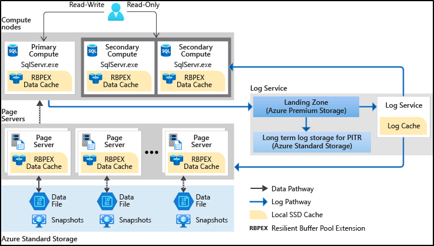

# Hyperscale service tier

Azure SQL Database is based on SQL Server Database Engine architecture that is adjusted for the cloud environment in order to ensure 99.99% availability even in the cases of infrastructure failures. There are three architectural models that are used in Azure SQL Database:

- General Purpose/Standard
- Hyperscale
- Business Critical/Premium

The Hyperscale service tier in Azure SQL Database is the newest service tier in the vCore-based purchasing model. This service tier is a highly scalable storage and compute performance tier that leverages the Azure architecture to scale out the storage and compute resources for an Azure SQL Database substantially beyond the limits available for the General Purpose and Business Critical service tiers.

> [!NOTE]
>
> - For details on the General Purpose and Business Critical service tiers in the vCore-based purchasing model, see [General Purpose](service-tier-general-purpose.md) and [Business Critical](service-tier-business-critical.md) service tiers. For a comparison of the vCore-based purchasing model with the DTU-based purchasing model, see [Azure SQL Database purchasing models and resources](purchasing-models.md).
> - The Hyperscale service tier is currently only available for Azure SQL Database, and not Azure SQL Managed Instance.

## What are the Hyperscale capabilities

The Hyperscale service tier in Azure SQL Database provides the following additional capabilities:

- Support for up to 100 TB of database size
- Nearly instantaneous database backups (based on file snapshots stored in Azure Blob storage) regardless of size with no IO impact on compute resources  
- Fast database restores (based on file snapshots) in minutes rather than hours or days (not a size of data operation)
- Higher overall performance due to higher log throughput and faster transaction commit times regardless of data volumes
- Rapid scale out - you can provision one or more read-only nodes for offloading your read workload and for use as hot-standbys
- Rapid Scale up - you can, in constant time, scale up your compute resources to accommodate heavy workloads when needed, and then scale the compute resources back down when not needed.

The Hyperscale service tier removes many of the practical limits traditionally seen in cloud databases. Where most other databases are limited by the resources available in a single node, databases in the Hyperscale service tier have no such limits. With its flexible storage architecture, storage grows as needed. In fact, Hyperscale databases aren't created with a defined max size. A Hyperscale database grows as needed - and you're billed only for the capacity you use. For read-intensive workloads, the Hyperscale service tier provides rapid scale-out by provisioning additional read replicas as needed for offloading read workloads.

Additionally, the time required to create database backups or to scale up or down is no longer tied to the volume of data in the database. Hyperscale databases can be backed up virtually instantaneously. You can also scale a database in the tens of terabytes up or down in minutes. This capability frees you from concerns about being boxed in by your initial configuration choices.

For more information about the compute sizes for the Hyperscale service tier, see [Service tier characteristics](service-tiers-vcore.md#service-tiers).

## Who should consider the Hyperscale service tier

The Hyperscale service tier is intended for most business workloads as it provides great flexibility and high performance with independently scalable compute and storage resources. With the ability to autoscale storage up to 100 TB, it's a great choice for customers who:

- Have large databases on-premises and want to modernize their applications by moving to the cloud
- Are already in the cloud and are limited by the maximum database size restrictions of other service tiers (1-4 TB)
- Have smaller databases, but require fast vertical and horizontal compute scaling, high performance, instant backup, and fast database restore.

The Hyperscale service tier supports a broad range of SQL Server workloads, from pure OLTP to pure analytics, but it's primarily optimized for OLTP and hybrid transaction and analytical processing (HTAP) workloads.

> [!IMPORTANT]
> Elastic pools do not support the Hyperscale service tier.

## Hyperscale pricing model

Hyperscale service tier is only available in [vCore model](service-tiers-vcore.md). To align with the new architecture, the pricing model is slightly different from General Purpose or Business Critical service tiers:

- **Compute**:

  The Hyperscale compute unit price is per replica. The [Azure Hybrid Benefit](https://azure.microsoft.com/pricing/hybrid-benefit/) price is applied to read scale replicas automatically. We create a primary replica and one read-only replica per Hyperscale database by default.  Users may adjust the total number of replicas including the primary from 1-5.

- **Storage**:

  You don't need to specify the max data size when configuring a Hyperscale database. In the hyperscale tier, you're charged for storage for your database based on actual allocation. Storage is automatically allocated between 40 GB and 100 TB, in 10-GB increments. Multiple data files can grow at the same time if needed. A Hyperscale database is created with a starting size of 10 GB and it starts growing by 10 GB every 10 minutes, until it reaches the size of 40 GB.

For more information about Hyperscale pricing, see [Azure SQL Database Pricing](https://azure.microsoft.com/pricing/details/sql-database/single/)

## Distributed functions architecture

Unlike traditional database engines that have centralized all of the data management functions in one location/process (even so called distributed databases in production today have multiple copies of a monolithic data engine), a Hyperscale database separates the query processing engine, where the semantics of various data engines diverge, from the components that provide long-term storage and durability for the data. In this way, the storage capacity can be smoothly scaled out as far as needed (initial target is 100 TB). Read-only replicas share the same storage components so no data copy is required to spin up a new readable replica.

The following diagram illustrates the different types of nodes in a Hyperscale database:



A Hyperscale database contains the following different types of components:

### Compute

The compute node is where the relational engine lives. This is where language, query, and transaction processing occur. All user interactions with a Hyperscale database happen through these compute nodes. Compute nodes have SSD-based caches (labeled RBPEX - Resilient Buffer Pool Extension in the preceding diagram) to minimize the number of network round trips required to fetch a page of data. There is one primary compute node where all the read-write workloads and transactions are processed. There are one or more secondary compute nodes that act as hot standby nodes for failover purposes, as well as act as read-only compute nodes for offloading read workloads (if this functionality is desired).

The database engine running on Hyperscale compute nodes is the same as in other Azure SQL Database service tiers. When users interact with the database engine on Hyperscale compute nodes, the supported surface area and engine behavior are the same as in other service tiers, with the exception of [known limitations](#known-limitations).

### Page server

Page servers are systems representing a scaled-out storage engine.  Each page server is responsible for a subset of the pages in the database.  Nominally, each page server controls either up to 128 GB or up to 1 TB of data. No data is shared on more than one page server (outside of page server replicas that are kept for redundancy and availability). The job of a page server is to serve database pages out to the compute nodes on demand, and to keep the pages updated as transactions update data. Page servers are kept up to date by playing log records from the log service. Page servers also maintain covering SSD-based caches to enhance performance. Long-term storage of data pages is kept in Azure Storage for additional reliability.

### Log service

The log service accepts log records from the primary compute replica, persists them in a durable cache, and forwards the log records to the rest of compute replicas (so they can update their caches) as well as the relevant page server(s), so that the data can be updated there. In this way, all data changes from the primary compute replica are propagated through the log service to all the secondary compute replicas and page servers. Finally, the log records are pushed out to long-term storage in Azure Storage, which is a virtually infinite storage repository. This mechanism removes the need for frequent log truncation. The log service also has local memory and SSD caches to speed up access to log records.

### Azure storage

Azure Storage contains all data files in a database. Page servers keep data files in Azure Storage up to date. This storage is used for backup purposes, as well as for replication between Azure regions. Backups are implemented using storage snapshots of data files. Restore operations using snapshots are fast regardless of data size. Data can be restored to any point in time within the backup retention period of the database.

## Backup and restore

Backups are file-snapshot based and hence they're nearly instantaneous. Storage and compute separation enables pushing down the backup/restore operation to the storage layer to reduce the processing burden on the primary compute replica. As a result, database backup doesn't impact performance of the primary compute node. Similarly, point in time recovery (PITR) is done by reverting to file snapshots, and as such is not a size of data operation. Restore of a Hyperscale database in the same Azure region is a constant-time operation, and even multiple-terabyte databases can be restored in minutes instead of hours or days. Creation of new databases by restoring an existing backup also takes advantage of this feature: creating database copies for development or testing purposes, even of multi-terabyte databases, is doable in minutes.

For geo-restore of Hyperscale databases, see [Restoring a Hyperscale database to a different region](#restoring-a-hyperscale-database-to-a-different-region).

## Scale and performance advantages

With the ability to rapidly spin up/down additional read-only compute nodes, the Hyperscale architecture allows significant read scale capabilities and can also free up the primary compute node for serving more write requests. Also, the compute nodes can be scaled up/down rapidly due to the shared-storage architecture of the Hyperscale architecture.

## Create a Hyperscale database

A Hyperscale database can be created using the [Azure portal](https://portal.azure.com), [T-SQL](/sql/t-sql/statements/create-database-transact-sql), [PowerShell](/powershell/module/azurerm.sql/new-azurermsqldatabase), or [CLI](/cli/azure/sql/db#az_sql_db_create). Hyperscale databases are available only using the [vCore-based purchasing model](service-tiers-vcore.md).

The following T-SQL command creates a Hyperscale database. You must specify both the edition and service objective in the `CREATE DATABASE` statement. Refer to the [resource limits](./resource-limits-vcore-single-databases.md#hyperscale---provisioned-compute---gen4) for a list of valid service objectives.

```sql
-- Create a Hyperscale Database
CREATE DATABASE [HyperscaleDB1] (EDITION = 'Hyperscale', SERVICE_OBJECTIVE = 'HS_Gen5_4');
GO
```

This will create a Hyperscale database on Gen5 hardware with four cores.

## Upgrade existing database to Hyperscale

You can move your existing databases in Azure SQL Database to Hyperscale using the [Azure portal](https://portal.azure.com), [T-SQL](/sql/t-sql/statements/alter-database-transact-sql), [PowerShell](/powershell/module/azurerm.sql/set-azurermsqldatabase), or [CLI](/cli/azure/sql/db#az_sql_db_update). At this time, this is a one-way migration. You can't move databases from Hyperscale to another service tier, other than by exporting and importing data. For proofs of concept (POCs), we recommend making a copy of your production databases, and migrating the copy to Hyperscale. Migrating an existing database in Azure SQL Database to the Hyperscale tier is a size of data operation.

The following T-SQL command moves a database into the Hyperscale service tier. You must specify both the edition and service objective in the `ALTER DATABASE` statement.

```sql
-- Alter a database to make it a Hyperscale Database
ALTER DATABASE [DB2] MODIFY (EDITION = 'Hyperscale', SERVICE_OBJECTIVE = 'HS_Gen5_4');
GO
```

## Connect to a read-scale replica of a Hyperscale database

In Hyperscale databases, the `ApplicationIntent` argument in the connection string provided by the client dictates whether the connection is routed to the write replica or to a read-only secondary replica. If the `ApplicationIntent` set to `READONLY` and the database doesn't have a secondary replica, connection will be routed to the primary replica and defaults to `ReadWrite` behavior.

```cmd
-- Connection string with application intent
Server=tcp:<myserver>.database.windows.net;Database=<mydatabase>;ApplicationIntent=ReadOnly;User ID=<myLogin>;Password=<myPassword>;Trusted_Connection=False; Encrypt=True;
```

Hyperscale secondary replicas are all identical, using the same Service Level Objective as the primary replica. If more than one secondary replica is present, the workload is distributed across all available secondaries. Each secondary replica is updated independently. Thus, different replicas could have different data latency relative to the primary replica.

## Database high availability in Hyperscale

As in all other service tiers, Hyperscale guarantees data durability for committed transactions regardless of compute replica availability. The extent of downtime due to the primary replica becoming unavailable depends on the type of failover (planned vs. unplanned), and on the presence of at least one secondary replica. In a planned failover (i.e. a maintenance event), the system either creates the new primary replica before initiating a failover, or uses an existing secondary replica as the failover target. In an unplanned failover (i.e. a hardware failure on the primary replica), the system uses a secondary replica as a failover target if one exists, or creates a new primary replica from the pool of available compute capacity. In the latter case, downtime duration is longer due to extra steps required to create the new primary replica.

For Hyperscale SLA, see [SLA for Azure SQL Database](https://azure.microsoft.com/support/legal/sla/sql-database/).

## Disaster recovery for Hyperscale databases

### Restoring a Hyperscale database to a different region

If you need to restore a Hyperscale database in Azure SQL Database to a region other than the one it's currently hosted in, as part of a disaster recovery operation or drill, relocation, or any other reason, the primary method is to do a geo-restore of the database. This involves exactly the same steps as what you would use to restore any other database in SQL Database to a different region:

1. Create a [server](logical-servers.md) in the target region if you don't already have an appropriate server there.  This server should be owned by the same subscription as the original (source) server.
2. Follow the instructions in the [geo-restore](./recovery-using-backups.md#geo-restore) topic of the page on restoring a database in Azure SQL Database from automatic backups.

> [!NOTE]
> Because the source and target are in separate regions, the database cannot share snapshot storage with the source database as in non-geo restores, which complete quickly regardless of database size. In the case of a geo-restore of a Hyperscale database, it will be a size-of-data operation, even if the target is in the paired region of the geo-replicated storage. Therefore, a geo-restore will take time proportional to the size of the database being restored. If the target is in the paired region, data transfer will be within a region, which will be significantly faster than a cross-region data transfer, but it will still be a size-of-data operation.

## <a name=regions></a>Available regions

The Azure SQL Database Hyperscale tier is available in all regions but enabled by default in the following regions listed below. If you want to create a Hyperscale database in a region where Hyperscale is not enabled by default, you can send an onboarding request via Azure portal. For instructions, see [Request quota increases for Azure SQL Database](quota-increase-request.md) for instructions. When submitting your request, use the following guidelines:

- Use the [Region access](quota-increase-request.md#region) SQL Database quota type.
- In the description, add the compute SKU/total cores including readable replicas, and indicate that you are requesting Hyperscale capacity.
- Also specify a projection of the total size of all databases over time in TB.

Enabled Regions:
- Australia East
- Australia Southeast
- Australia Central
- Brazil South
- Canada Central
- Canada East
- Central US
- China East 2
- China North 2
- East Asia
- East US
- East Us 2
- France Central
- Germany West Central
- Japan East
- Japan West
- Korea Central
- Korea South
- North Central US
- North Europe
- Norway East
- Norway West
- South Africa North
- South Central US
- Southeast Asia
- Switzerland West
- UK South
- UK West
- US DoD Central
- US DoD East
- Us Govt Arizona
- US Govt Texas
- West Central US
- West Europe
- West US
- West US 2

## Known limitations

These are the current limitations to the Hyperscale service tier as of GA.  We're actively working to remove as many of these limitations as possible.

| Issue | Description |
| :---- | :--------- |
| The Manage Backups pane for a server doesn't show Hyperscale databases. These will be filtered from the view.  | Hyperscale has a separate method for managing backups, so the Long-Term Retention and Point-in-Time backup retention settings don't apply. Accordingly, Hyperscale databases don't appear in the Manage Backup pane.<br><br>For databases migrated to Hyperscale from other Azure SQL Database service tiers, pre-migration backups are kept for the duration of [backup retention](automated-backups-overview.md#backup-retention) period of the source database. These backups can be used to [restore](recovery-using-backups.md#programmatic-recovery-using-automated-backups) the source database to a point in time before migration.|
| Point-in-time restore | A non-Hyperscale database can't be restored as a Hyperscale database, and a Hyperscale database can't be restored as a non-Hyperscale database. For a non-Hyperscale database that has been migrated to Hyperscale by changing its service tier, restore to a point in time before migration and within the backup retention period of the database is supported [programmatically](recovery-using-backups.md#programmatic-recovery-using-automated-backups). The restored database will be non-Hyperscale. |
| When changing Azure SQL Database service tier to Hyperscale, the operation fails if the database has any data files larger than 1 TB | In some cases, it may be possible to work around this issue by [shrinking](file-space-manage.md#shrinking-data-files) the large files to be less than 1 TB before attempting to change the service tier to Hyperscale. Use the following query to determine the current size of database files. `SELECT file_id, name AS file_name, size * 8. / 1024 / 1024 AS file_size_GB FROM sys.database_files WHERE type_desc = 'ROWS'`;|
| SQL Managed Instance | Azure SQL Managed Instance isn't currently supported with Hyperscale databases. |
| Elastic Pools |  Elastic Pools aren't currently supported with Hyperscale.|
| Migration to Hyperscale is currently a one-way operation | Once a database is migrated to Hyperscale, it can't be migrated directly to a non-Hyperscale service tier. At present, the only way to migrate a database from Hyperscale to non-Hyperscale is to export/import using a bacpac file or other data movement technologies (Bulk Copy, Azure Data Factory, Azure Databricks, SSIS, etc.) Bacpac export/import from Azure portal, from PowerShell using [New-AzSqlDatabaseExport](/powershell/module/az.sql/new-azsqldatabaseexport) or [New-AzSqlDatabaseImport](/powershell/module/az.sql/new-azsqldatabaseimport), from Azure CLI using [az sql db export](/cli/azure/sql/db#az_sql_db_export) and [az sql db import](/cli/azure/sql/db#az_sql_db_import), and from [REST API](/rest/api/sql/) is not supported. Bacpac import/export for smaller Hyperscale databases (up to 200 GB) is supported using SSMS and [SqlPackage](/sql/tools/sqlpackage) version 18.4 and later. For larger databases, bacpac export/import may take a long time, and may fail for various reasons.|
| Migration of databases with In-Memory OLTP objects | Hyperscale supports a subset of In-Memory OLTP objects, including memory-optimized table types, table variables, and natively compiled modules. However, when any kind of In-Memory OLTP objects are present in the database being migrated, migration from Premium and Business Critical service tiers to Hyperscale is not supported. To migrate such a database to Hyperscale, all In-Memory OLTP objects and their dependencies must be dropped. After the database is migrated, these objects can be recreated. Durable and non-durable memory-optimized tables are not currently supported in Hyperscale, and must be changed to disk tables.|
| Geo Replication  | You can't yet configure geo-replication for Azure SQL Database Hyperscale. |
| Database Copy | Database copy on Hyperscale is now in public preview. |
| Intelligent Database Features | With the exception of the "Force Plan" option, all other Automatic Tuning options aren't yet supported on Hyperscale: options may appear to be enabled, but there won't be any recommendations or actions made. |
| Query Performance Insights | Query Performance Insights is currently not supported for Hyperscale databases. |
| Shrink Database | DBCC SHRINKDATABASE or DBCC SHRINKFILE isn't currently supported for Hyperscale databases. |
| Database integrity check | DBCC CHECKDB isn't currently supported for Hyperscale databases. DBCC CHECKFILEGROUP and DBCC CHECKTABLE may be used as a workaround. See [Data Integrity in Azure SQL Database](https://azure.microsoft.com/blog/data-integrity-in-azure-sql-database/) for details on data integrity management in Azure SQL Database. |

## Next steps

- For an FAQ on Hyperscale, see [Frequently asked questions about Hyperscale](service-tier-hyperscale-frequently-asked-questions-faq.md).
- For information about service tiers, see [Service tiers](purchasing-models.md)
- See [Overview of resource limits on a server](resource-limits-logical-server.md) for information about limits at the server and subscription levels.
- For purchasing model limits for a single database, see [Azure SQL Database vCore-based purchasing model limits for a single database](resource-limits-vcore-single-databases.md).
- For a features and comparison list, see [SQL common features](features-comparison.md).
