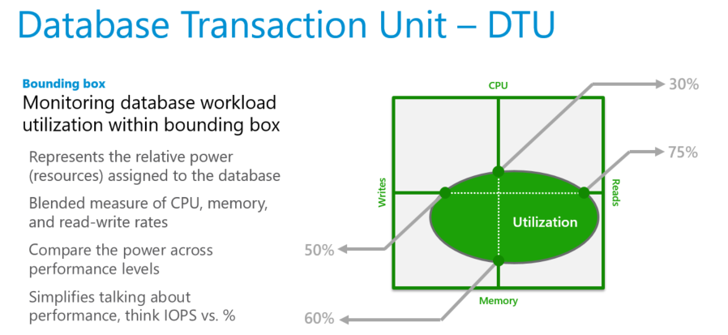

# DTU-based purchasing model overview 
[!INCLUDE[appliesto-sqldb](../includes/appliesto-sqldb.md)]

In this article, learn about the DTU-based purchasing model for Azure SQL Database.

To learn more, review [vCore-based purchasing model](service-tiers-vcore.md) and [compare purchasing models](purchasing-models.md). 

## Database transaction units (DTUs)

A database transaction unit (DTU) represents a blended measure of CPU, memory, reads, and writes. Service tiers in the DTU-based purchasing model are differentiated by a range of compute sizes with a fixed amount of included storage, fixed retention period for backups, and fixed price. All service tiers in the DTU-based purchasing model provide flexibility of changing compute sizes with minimal [downtime](https://azure.microsoft.com/support/legal/sla/azure-sql-database); however, there is a switch over period where connectivity is lost to the database for a short amount of time, which can be mitigated using retry logic. Single databases and elastic pools are billed hourly based on service tier and compute size.

For a single database at a specific compute size within a [service tier](single-database-scale.md), Azure SQL Database guarantees a certain level of resources for that database (independent of any other database). This guarantee provides a predictable level of performance. The amount of resources allocated for a database is calculated as a number of DTUs and is a bundled measure of compute, storage, and I/O resources.

The ratio among these resources is originally determined by an [online transaction processing (OLTP) benchmark workload](dtu-benchmark.md) designed to be typical of real-world OLTP workloads. When your workload exceeds the amount of any of these resources, your throughput is throttled, resulting in slower performance and time-outs.

For single databases, the resources used by your workload don't impact the resources available to other databases in the Azure cloud. Likewise, the resources used by other workloads don't impact the resources available to your database.

DTUs are most useful for understanding the relative resources that are allocated for databases at different compute sizes and service tiers. For example:

- Doubling the DTUs by increasing the compute size of a database equates to doubling the set of resources available to that database.
- A premium service tier P11 database with 1750 DTUs provides 350 times more DTU compute power than a basic service tier database with 5 DTUs.  

To gain deeper insight into the resource (DTU) consumption of your workload, use [query-performance insights](query-performance-insight-use.md) to:

- Identify the top queries by CPU/duration/execution count that can potentially be tuned for improved performance. For example, an I/O-intensive query might benefit from [in-memory optimization techniques](../in-memory-oltp-overview.md) to make better use of the available memory at a certain service tier and compute size.
- Drill down into the details of a query to view its text and its history of resource usage.
- Access performance-tuning recommendations that show actions taken by [SQL Database Advisor](database-advisor-implement-performance-recommendations.md).

### Elastic database transaction units (eDTUs)

Rather than provide a dedicated set of resources (DTUs) that might not always be needed, you can place these databases into an [elastic pool](elastic-pool-overview.md). The databases in an elastic pool use a single instance of the database engine and share the same pool of resources.

The shared resources in an elastic pool are measured by elastic database transaction units (eDTUs). Elastic pools provide a simple, cost-effective solution to manage performance goals for multiple databases that have widely varying and unpredictable usage patterns. An elastic pool guarantees that all the resources can't be consumed by one database in the pool, while ensuring that each database in the pool always has a minimum amount of necessary resources available.

A pool is given a set number of eDTUs for a set price. In the elastic pool, individual databases can autoscale within the configured boundaries. A database under a heavier load will consume more eDTUs to meet demand. Databases under lighter loads will consume fewer eDTUs. Databases with no load will consume no eDTUs. Because resources are provisioned for the entire pool, rather than per database, elastic pools simplify your management tasks and provide a predictable budget for the pool.

You can add additional eDTUs to an existing pool with minimal database downtime. Similarly, if you no longer need extra eDTUs, remove them from an existing pool at any time. You can also add databases to or remove databases from a pool at any time. To reserve eDTUs for other databases, limit the number of eDTUs databases can use under a heavy load. If a database has consistently high resource utilization that impacts other databases in the pool, move it out of the pool and configure it as a single database with a predictable amount of required resources.

#### Workloads that benefit from an elastic pool of resources

Pools are well suited for databases with a low resource-utilization average and relatively infrequent utilization spikes. For more information, see [When should you consider a SQL Database elastic pool?](elastic-pool-overview.md).

## Determine the number of DTUs needed by a workload

If you want to migrate an existing on-premises or SQL Server virtual machine workload to SQL Database, see [SKU recommendations](/sql/dma/dma-sku-recommend-sql-db) to approximate the number of DTUs needed. For an existing SQL Database workload, use [query-performance insights](query-performance-insight-use.md) to understand your database-resource consumption (DTUs) and gain deeper insights for optimizing your workload. The [sys.dm_db_resource_stats](/sql/relational-databases/system-dynamic-management-views/sys-dm-db-resource-stats-azure-sql-database) dynamic management view (DMV) lets you view resource consumption for the last hour. The [sys.resource_stats](/sql/relational-databases/system-catalog-views/sys-resource-stats-azure-sql-database) catalog view displays resource consumption for the last 14 days, but at a lower fidelity of five-minute averages.

## Determine DTU utilization

To determine the average percentage of DTU/eDTU utilization relative to the DTU/eDTU limit of a database or an elastic pool, use the following formula:

`avg_dtu_percent = MAX(avg_cpu_percent, avg_data_io_percent, avg_log_write_percent)`

The input values for this formula can be obtained from [sys.dm_db_resource_stats](/sql/relational-databases/system-dynamic-management-views/sys-dm-db-resource-stats-azure-sql-database), [sys.resource_stats](/sql/relational-databases/system-catalog-views/sys-resource-stats-azure-sql-database), and [sys.elastic_pool_resource_stats](/sql/relational-databases/system-catalog-views/sys-elastic-pool-resource-stats-azure-sql-database) DMVs. In other words, to determine the percentage of DTU/eDTU utilization toward the DTU/eDTU limit of a database or an elastic pool, pick the largest percentage value from the following: `avg_cpu_percent`, `avg_data_io_percent`, and `avg_log_write_percent` at a given point in time.

> [!NOTE]
> The DTU limit of a database is determined by CPU, reads, writes, and memory available to the database. However, because the SQL Database engine typically uses all available memory for its data cache to improve performance, the `avg_memory_usage_percent` value will usually be close to 100 percent, regardless of current database load. Therefore, even though memory does indirectly influence the DTU limit, it is not used in the DTU utilization formula.

## Hardware configuration

In the DTU-based purchasing model, customers cannot choose the hardware configuration used for their databases. While a given database usually stays on a specific type of hardware for a long time (commonly for multiple months), there are certain events that can cause a database to be moved to different hardware.

For example, a database can be moved to different hardware if it's scaled up or down to a different service objective, or if the current infrastructure in a datacenter is approaching its capacity limits, or if the currently used hardware is being decommissioned due to its end of life.

If a database is moved to different hardware, workload performance can change. The DTU model guarantees that the throughput and response time of the [DTU benchmark](dtu-benchmark.md) workload will remain substantially identical as the database moves to a different hardware type, as long as its service objective (the number of DTUs) stays the same.

However, across the wide spectrum of customer workloads running in Azure SQL Database, the impact of using different hardware for the same service objective can be more pronounced. Different workloads may benefit from different hardware configurations and features. Therefore, for workloads other than the [DTU benchmark](dtu-benchmark.md), it's possible to see performance differences if the database moves from one type of hardware to another.

For example, an application that is sensitive to network latency can see better performance on Gen5 hardware vs. Gen4 due to the use of Accelerated Networking in Gen5, but an application using intensive read IO can see better performance on Gen4 hardware versus Gen5 due to a higher memory per core ratio on Gen4.

Customers can use the [vCore](service-tiers-vcore.md) model to choose their preferred hardware configuration during database creation and scaling. In the vCore model, detailed resource limits of each service objective in each hardware configuration are documented for [single databases](resource-limits-vcore-single-databases.md) and [elastic pools](resource-limits-vcore-elastic-pools.md). For more information about hardware in the vCore model, see [Hardware configuration for SQL Database](./service-tiers-sql-database-vcore.md#hardware-configuration) or [Hardware configuration for SQL Managed Instance](../managed-instance/service-tiers-managed-instance-vcore.md#hardware-configurations).

## Compare service tiers

Choosing a service tier depends primarily on business continuity, storage, and performance requirements.

||Basic|Standard|Premium|
| :-- | --: |--:| --:|
|**Target workload**|Development and production|Development and production|Development and production|
|**Uptime SLA**|99.99%|99.99%|99.99%|
|**Maximum backup retention**|7 days|35 days|35 days|
|**CPU**|Low|Low, Medium, High|Medium, High|
|**IOPS (approximate)**\* |1-4 IOPS per DTU| 1-4 IOPS per DTU | >25 IOPS per DTU|
|**IO latency (approximate)**|5 ms (read), 10 ms (write)|5 ms (read), 10 ms (write)|2 ms (read/write)|
|**Columnstore indexing** |N/A|S3 and above|Supported|
|**In-memory OLTP**|N/A|N/A|Supported|

\* All read and write IOPS against data files, including background IO (checkpoint and lazy writer)

> [!IMPORTANT]
> The Basic, S0, S1 and S2 service objectives provide less than one vCore (CPU).  For CPU-intensive workloads, a service objective of S3 or greater is recommended. 
>
> In the Basic, S0, and S1 service objectives, database files are stored in Azure Standard Storage, which uses hard disk drive (HDD)-based storage media. These service objectives are best suited for development, testing, and other infrequently accessed workloads that are less sensitive to performance variability.
>

> [!TIP]
> To see actual [resource governance](resource-limits-logical-server.md#resource-governance) limits for a database or elastic pool, query the [sys.dm_user_db_resource_governance](/sql/relational-databases/system-dynamic-management-views/sys-dm-user-db-resource-governor-azure-sql-database) view.

> [!NOTE]
> You can get a free database in Azure SQL Database at the Basic service tier in conjunction with an Azure free account to explore Azure. For information, see [Create a managed cloud database with your Azure free account](https://azure.microsoft.com/free/services/sql-database/).

## Resource limits

Resource limits differ for single and pooled databases. 

### Single database storage limits

Compute sizes are expressed in terms of Database Transaction Units (DTUs) for single databases and elastic Database Transaction Units (eDTUs) for elastic pools. To learn more, review [Resource limits for single databases](resource-limits-dtu-single-databases.md). 

||Basic|Standard|Premium|
| :-- | --: | --: | --: |
| **Maximum storage size** | 2 GB | 1 TB | 4 TB  |
| **Maximum DTUs** | 5 | 3000 | 4000 |

> [!IMPORTANT]
> Under some circumstances, you may need to shrink a database to reclaim unused space. For more information, see [Manage file space in Azure SQL Database](file-space-manage.md).

### Elastic pool limits

To learn more, review [Resource limits for pooled databases](resource-limits-dtu-elastic-pools.md). 

|| **Basic** | **Standard** | **Premium** |
| :-- | --: | --: | --: |
| **Maximum storage size per database**  | 2 GB | 1 TB | 1 TB |
| **Maximum storage size per pool** | 156 GB | 4 TB | 4 TB |
| **Maximum eDTUs per database** | 5 | 3000 | 4000 |
| **Maximum eDTUs per pool** | 1600 | 3000 | 4000 |
| **Maximum number of databases per pool** | 500  | 500 | 100 |

> [!IMPORTANT]
> More than 1 TB of storage in the Premium tier is currently available in all regions except: China East, China North, Germany Central, and Germany Northeast. In these regions, the storage max in the Premium tier is limited to 1 TB.  For more information, see [P11-P15 current limitations](single-database-scale.md#p11-and-p15-constraints-when-max-size-greater-than-1-tb).  
> [!IMPORTANT]
> Under some circumstances, you may need to shrink a database to reclaim unused space. For more information, see [manage file space in Azure SQL Database](file-space-manage.md).

## DTU Benchmark

Physical characteristics (CPU, memory, IO) associated with each DTU measure are calibrated using a benchmark that simulates real-world database workload.

Learn about the schema, transaction types used, workload mix, users and pacing, scaling rules, and metrics associated with the [DTU benchmark](dtu-benchmark.md).

## Compare DTU-based and vCore purchasing models

While the DTU-based purchasing model is based on a bundled measure of compute, storage, and I/O resources, by comparison the [vCore purchasing model for Azure SQL Database](service-tiers-sql-database-vcore.md) allows you to independently choose and scale compute and storage resources.

The vCore-based purchasing model also allows you to use [Azure Hybrid Benefit](https://azure.microsoft.com/pricing/hybrid-benefit/) for SQL Server to save costs, and offers [Serverless](serverless-tier-overview.md) and [Hyperscale](service-tier-hyperscale.md) options for Azure SQL Database that are not available in the DTU-based purchasing model.

Learn more in [Compare vCore and DTU-based purchasing models of Azure SQL Database](purchasing-models.md).

## Next steps

Learn more about purchasing models and related concepts in the following articles:

- For details on specific compute sizes and storage size choices available for single databases, see [SQL Database DTU-based resource limits for single databases](resource-limits-dtu-single-databases.md#single-database-storage-sizes-and-compute-sizes).
- For details on specific compute sizes and storage size choices available for elastic pools, see [SQL Database DTU-based resource limits](resource-limits-dtu-elastic-pools.md#elastic-pool-storage-sizes-and-compute-sizes).
- For information on the benchmark associated with the DTU-based purchasing model, see [DTU benchmark](dtu-benchmark.md).
- [Compare vCore and DTU-based purchasing models of Azure SQL Database](purchasing-models.md).
