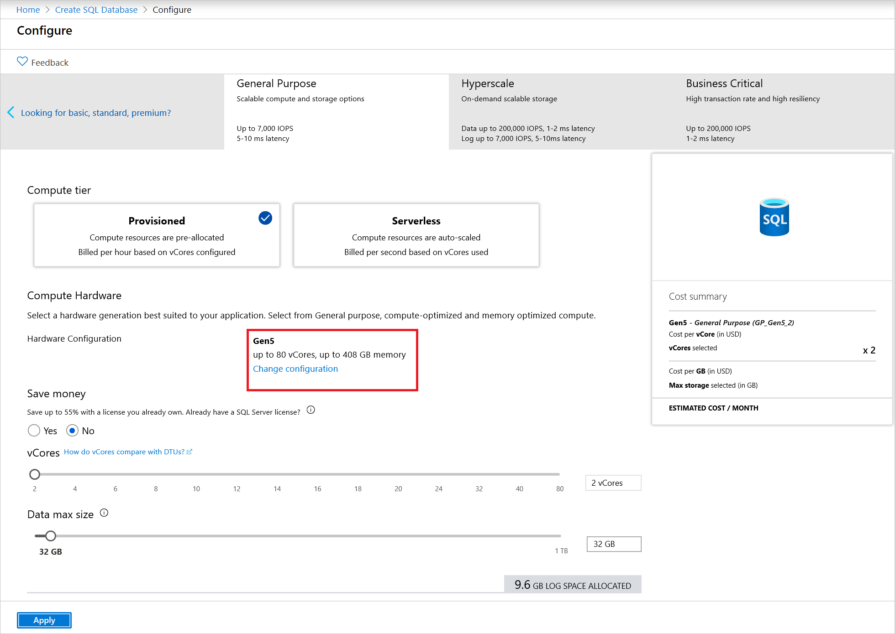
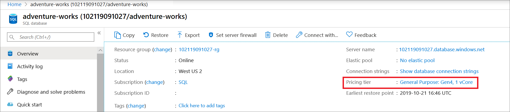
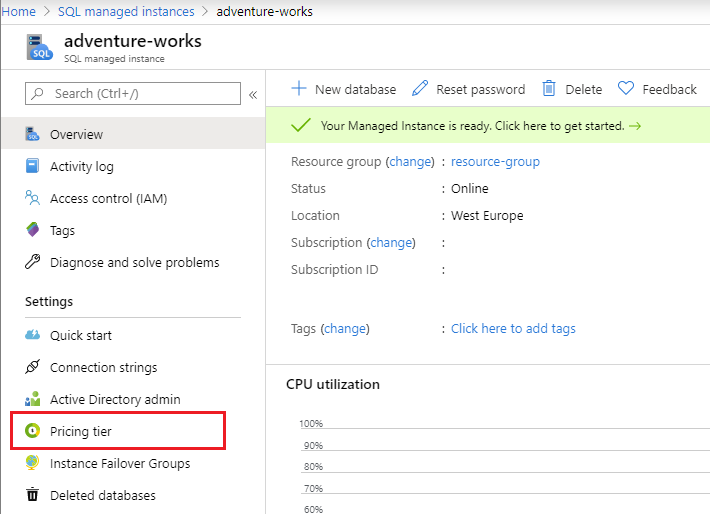

# vCore model overview - Azure SQL Database and Azure SQL Managed Instance 
[!INCLUDE[appliesto-sqldb-sqlmi](../includes/appliesto-sqldb-sqlmi.md)]

The virtual core (vCore) purchasing model used by Azure SQL Database and Azure SQL Managed Instance provides several benefits:

- Higher compute, memory, I/O, and storage limits.
- Control over the hardware generation to better match compute and memory requirements of the workload.
- Pricing discounts for [Azure Hybrid Benefit (AHB)](../azure-hybrid-benefit.md) and [Reserved Instance (RI)](reserved-capacity-overview.md).
- Greater transparency in the hardware details that power the compute, that facilitates planning for migrations from on-premises deployments.

## Service tiers

Service tier options in the vCore model include General Purpose, Business Critical, and Hyperscale. The service tier generally defines the storage architecture, space and I/O limits, and business continuity options related to availability and disaster recovery.

|-|**General Purpose**|**Business Critical**|**Hyperscale**|
|---|---|---|---|
|Best for|Most business workloads. Offers budget-oriented, balanced, and scalable compute and storage options. |Offers business applications the highest resilience to failures by using several isolated replicas, and provides the highest I/O performance per database replica.|Most business workloads with highly scalable storage and read-scale requirements.  Offers higher resilience to failures by allowing configuration of more than one isolated database replica. |
|Storage|Uses remote storage.<br/>**SQL Database provisioned compute**:<br/>5 GB – 4 TB<br/>**Serverless compute**:<br/>5 GB - 3 TB<br/>**SQL Managed Instance**: 32 GB - 8 TB |Uses local SSD storage.<br/>**SQL Database provisioned compute**:<br/>5 GB – 4 TB<br/>**SQL Managed Instance**:<br/>32 GB - 4 TB |Flexible autogrow of storage as needed. Supports up to 100 TB of storage. Uses local SSD storage for local buffer-pool cache and local data storage. Uses Azure remote storage as final long-term data store. |
|IOPS and throughput (approximate)|**SQL Database**: See resource limits for [single databases](resource-limits-vcore-single-databases.md) and [elastic pools](resource-limits-vcore-elastic-pools.md).<br/>**SQL Managed Instance**: See [Overview Azure SQL Managed Instance resource limits](../managed-instance/resource-limits.md#service-tier-characteristics).|See resource limits for [single databases](resource-limits-vcore-single-databases.md) and [elastic pools](resource-limits-vcore-elastic-pools.md).|Hyperscale is a multi-tiered architecture with caching at multiple levels. Effective IOPS and throughput will depend on the workload.|
|Availability|1 replica, no read-scale replicas|3 replicas, 1 [read-scale replica](read-scale-out.md),<br/>zone-redundant high availability (HA)|1 read-write replica, plus 0-4 [read-scale replicas](read-scale-out.md)|
|Backups|[Read-access geo-redundant storage (RA-GRS)](../../storage/common/geo-redundant-design.md), 1-35 days (7 days by default)|[RA-GRS](../..//storage/common/geo-redundant-design.md), 1-35 days (7 days by default)|Snapshot-based backups in Azure remote storage. Restores use these snapshots for fast recovery. Backups are instantaneous and don't impact compute I/O performance. Restores are fast and aren't a size-of-data operation (taking minutes rather than hours or days).|
|In-memory|Not supported|Supported|Not supported|
|||


### Choosing a service tier

For information on selecting a service tier for your particular workload, see the following articles:

- [When to choose the General Purpose service tier](service-tier-general-purpose.md#when-to-choose-this-service-tier)
- [When to choose the Business Critical service tier](service-tier-business-critical.md#when-to-choose-this-service-tier)
- [When to choose the Hyperscale service tier](service-tier-hyperscale.md#who-should-consider-the-hyperscale-service-tier)


## Compute tiers

Compute tier options in the vCore model include the provisioned and serverless compute tiers.


### Provisioned compute

The provisioned compute tier provides a specific amount of compute resources that are continuously provisioned independent of workload activity, and bills for the amount of compute provisioned at a fixed price per hour.


### Serverless compute

The [serverless compute tier](serverless-tier-overview.md) auto-scales compute resources based on workload activity, and bills for the amount of compute used per second.


## Hardware generations

Hardware generation options in the vCore model include Gen 4/5, M-series, Fsv2-series, and DC-series. The hardware generation generally defines the compute and memory limits and other characteristics that impact the performance of the workload.

### Gen4/Gen5

- Gen4/Gen5 hardware provides balanced compute and memory resources, and is suitable for most database workloads that do not have higher memory, higher vCore, or faster single vCore requirements as provided by Fsv2-series or M-series.

For regions where Gen4/Gen5 is available, see [Gen4/Gen5 availability](#gen4gen5-1).

### Fsv2-series

- Fsv2-series is a compute optimized hardware option delivering low CPU latency and high clock speed for the most CPU demanding workloads.
- Depending on the workload, Fsv2-series can deliver more CPU performance per vCore than Gen5, and the 72 vCore size can provide more CPU performance for less cost than 80 vCores on Gen5. 
- Fsv2 provides less memory and tempdb per vCore than other hardware so workloads sensitive to those limits may want to consider Gen5 or M-series instead.  

Fsv2-series in only supported in the General Purpose tier. For regions where Fsv2-series is available, see [Fsv2-series availability](#fsv2-series-1).

### M-series

- M-series is a memory optimized hardware option for workloads demanding more memory and higher compute limits than provided by Gen5.
- M-series provides 29 GB per vCore and up to 128 vCores, which increases the memory limit relative to Gen5 by 8x to nearly 4 TB.

M-series is only supported in the Business Critical tier and does not support zone redundancy.  For regions where M-series is available, see [M-series availability](#m-series-1).

#### Azure offer types supported by M-series

To access M-series, the subscription must be a paid offer type including Pay-As-You-Go or Enterprise Agreement (EA).  For a complete list of Azure offer types supported by M-series, see [current offers without spending limits](https://azure.microsoft.com/support/legal/offer-details).

<!--
To enable M-series hardware for a subscription and region, a support request must be opened. The subscription must be a paid offer type including Pay-As-You-Go or Enterprise Agreement (EA).  If the support request is approved, then the selection and provisioning experience of M-series follows the same pattern as for other hardware generations. For regions where M-series is available, see [M-series availability](#m-series).
-->

### DC-series

> [!NOTE]
> DC-series is currently in **public preview**.

- DC-series hardware uses Intel processors with Software Guard Extensions (Intel SGX) technology.
- DC-series is required for [Always Encrypted with secure enclaves](/sql/relational-databases/security/encryption/always-encrypted-enclaves), which is not supported with other hardware configurations.
- DC-series is designed for workloads that process sensitive data and demand confidential query processing capabilities, provided by Always Encrypted with secure enclaves.
- DC-series hardware provides balanced compute and memory resources.

DC-series is only supported for the Provisioned compute (Serverless is not supported) and it does not support zone redundancy. For regions where DC-series is available, see [DC-series availability](#dc-series-1).

#### Azure offer types supported by DC-series

To access DC-series, the subscription must be a paid offer type including Pay-As-You-Go or Enterprise Agreement (EA).  For a complete list of Azure offer types supported by DC-series, see [current offers without spending limits](https://azure.microsoft.com/support/legal/offer-details).

### Compute and memory specifications


|Hardware generation  |Compute  |Memory  |
|:---------|:---------|:---------|
|Gen4     |- Intel® E5-2673 v3 (Haswell) 2.4 GHz processors<br>- Provision up to 24 vCores (1 vCore = 1 physical core)  |- 7 GB per vCore<br>- Provision up to 168 GB|
|Gen5     |**Provisioned compute**<br>- Intel® E5-2673 v4 (Broadwell) 2.3-GHz, Intel® SP-8160 (Skylake)\*, and Intel® 8272CL (Cascade Lake) 2.5 GHz\* processors<br>- Provision up to 80 vCores (1 vCore = 1 hyper-thread)<br><br>**Serverless compute**<br>- Intel® E5-2673 v4 (Broadwell) 2.3-GHz and Intel® SP-8160 (Skylake)* processors<br>- Auto-scale up to 40 vCores (1 vCore = 1 hyper-thread)|**Provisioned compute**<br>- 5.1 GB per vCore<br>- Provision up to 408 GB<br><br>**Serverless compute**<br>- Auto-scale up to 24 GB per vCore<br>- Auto-scale up to 120 GB max|
|Fsv2-series     |- Intel® 8168 (Skylake) processors<br>- Featuring a sustained all core turbo clock speed of 3.4 GHz and a maximum single core turbo clock speed of 3.7 GHz.<br>- Provision up to 72 vCores (1 vCore = 1 hyper-thread)|- 1.9 GB per vCore<br>- Provision up to 136 GB|
|M-series     |- Intel® E7-8890 v3 2.5 GHz and Intel® 8280M 2.7 GHz (Cascade Lake) processors<br>- Provision up to 128 vCores (1 vCore = 1 hyper-thread)|- 29 GB per vCore<br>- Provision up to 3.7 TB|
|DC-series     | - Intel XEON E-2288G processors<br>- Featuring Intel Software Guard Extension (Intel SGX))<br>- Provision up to 8 vCores (1 vCore = 1 physical core) | 4.5 GB per vCore |

\* In the [sys.dm_user_db_resource_governance](/sql/relational-databases/system-dynamic-management-views/sys-dm-user-db-resource-governor-azure-sql-database) dynamic management view, hardware generation for databases using Intel® SP-8160 (Skylake) processors appears as Gen6, while hardware generation for databases using Intel® 8272CL (Cascade Lake) appears as Gen7. Resource limits for all Gen5 databases are the same regardless of processor type (Broadwell, Skylake, or Cascade Lake).

For more information on resource limits, see [Resource limits for single databases (vCore)](resource-limits-vcore-single-databases.md), or [Resource limits for elastic pools (vCore)](resource-limits-vcore-elastic-pools.md).

### Selecting a hardware generation

In the Azure portal, you can select the hardware generation for a database or pool in SQL Database at the time of creation, or you can change the hardware generation of an existing database or pool.

**To select a hardware generation when creating a SQL Database or pool**

For detailed information, see [Create a SQL Database](single-database-create-quickstart.md).

On the **Basics** tab, select the **Configure database** link in the **Compute + storage** section, and then select the **Change configuration** link:

  

Select the desired hardware generation:

  


**To change the hardware generation of an existing SQL Database or pool**

For a database, on the Overview page, select the **Pricing tier** link:

  

For a pool, on the Overview page, select **Configure**.

Follow the steps to change configuration, and select the hardware generation as described in the previous steps.

**To select a hardware generation when creating a SQL Managed Instance**

For detailed information, see [Create a SQL Managed Instance](../managed-instance/instance-create-quickstart.md).

On the **Basics** tab, select the **Configure database** link in the **Compute + storage** section, and then select desired hardware generation:

  
  
**To change the hardware generation of an existing SQL Managed Instance**

# [The Azure portal](#tab/azure-portal)

From the SQL Managed Instance page, select **Pricing tier** link placed under the Settings section



On the Pricing tier page, you will be able to change hardware generation as described in the previous steps.

# [PowerShell](#tab/azure-powershell)

Use the following PowerShell script:

```powershell-interactive
Set-AzSqlInstance -Name "managedinstance1" -ResourceGroupName "ResourceGroup01" -ComputeGeneration Gen5
```

For more details, check [Set-AzSqlInstance](/powershell/module/az.sql/set-azsqlinstance) command.

# [The Azure CLI](#tab/azure-cli)

Use the following CLI command:

```azurecli-interactive
az sql mi update -g mygroup -n myinstance --family Gen5
```

For more details, check [az sql mi update](/cli/azure/sql/mi#az_sql_mi_update) command.

---

### Hardware availability

#### <a name="gen4gen5-1"></a> Gen4/Gen5

Gen4 hardware is [being phased out](https://azure.microsoft.com/updates/gen-4-hardware-on-azure-sql-database-approaching-end-of-life-in-2020/) and is no longer available for new deployments. All new databases must be deployed on Gen5 hardware.

Gen5 is available in all public regions worldwide.

#### Fsv2-series

Fsv2-series is available in the following regions:
Australia Central, Australia Central 2, Australia East, Australia Southeast, Brazil South, Canada Central, East Asia, East Us, France Central, India Central, Korea Central, Korea South, North Europe, South Africa North, Southeast Asia, UK South, UK West, West Europe, West Us 2.


#### M-series

M-series is available in the following regions:
East US, North Europe, West Europe, West US 2.
<!--
M-series may also have limited availability in additional regions. You can request a different region than listed here, but fulfillment in a different region may not be possible.

To enable M-series availability in a subscription, access must be requested by [filing a new support request](#create-a-support-request-to-enable-m-series).


##### Create a support request to enable M-series: 

1. Select **Help + support** in the portal.
2. Select **New support request**.

On the **Basics** page, provide the following:

1. For **Issue type**, select **Service and subscription limits (quotas)**.
2. For **Subscription** = select the subscription to enable M-series.
3. For **Quota type**, select **SQL database**.
4. Select **Next** to go to the **Details** page.

On the **Details** page, provide the following:

1. In the **PROBLEM DETAILS** section select the **Provide details** link. 
2. For **SQL Database quota type** select **M-series**.
3. For **Region**, select the region to enable M-series.
    For regions where M-series is available, see [M-series availability](#m-series).

Approved support requests are typically fulfilled within 5 business days.
-->

#### DC-series

> [!NOTE]
> DC-series is currently in **public preview**.

DC-series is available in the following regions: Canada Central, Canada East, East US, North Europe, UK South, West Europe, West US.

If you need DC-series in a currently unsupported region, [submit a support ticket](https://portal.azure.com/#blade/Microsoft_Azure_Support/HelpAndSupportBlade/newsupportrequest) following the instructions in [Request quota increases for Azure SQL Database and SQL Managed Instance](quota-increase-request.md).

## Next steps

To get started, see: 
- [Creating a SQL Database using the Azure portal](single-database-create-quickstart.md)
- [Creating a SQL Managed Instance using the Azure portal](../managed-instance/instance-create-quickstart.md)

For pricing details, see the [Azure SQL Database pricing page](https://azure.microsoft.com/pricing/details/sql-database/single/).

For details about the specific compute and storage sizes available in the general purpose and business critical service tiers, see:

- [vCore-based resource limits for Azure SQL Database](resource-limits-vcore-single-databases.md).
- [vCore-based resource limits for pooled Azure SQL Database](resource-limits-vcore-elastic-pools.md).
- [vCore-based resource limits for Azure SQL Managed Instance](../managed-instance/resource-limits.md).
