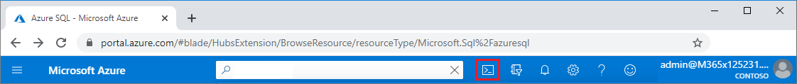

# Quickstart: Create an Azure SQL Database single database

In this quickstart, you create a [single database](single-database-overview.md) in Azure SQL Database using either the Azure portal, a PowerShell script, or an Azure CLI script. You then query the database using **Query editor** in the Azure portal.

A single database is the quickest and simplest option for Azure SQL Database. 

You can create a single database in the *provisioned* or *serverless* compute tier. A provisioned database is pre-allocated a fixed amount of compute resources, including CPU and memory, and uses one of two [purchasing models](purchasing-models.md). This quickstart creates a provisioned database using the [vCore-based](service-tiers-vcore.md) purchasing model, but you can also choose a [DTU-based](service-tiers-dtu.md) model.

The serverless compute tier is only available in the vCore-based purchasing model, and has an autoscaled range of compute resources, including CPU and memory. To create a single database in the serverless compute tier, see [Create a serverless database](serverless-tier-overview.md#create-a-new-database-in-the-serverless-compute-tier).

## Prerequisite

- An active Azure subscription. If you don't have one, [create a free account](https://azure.microsoft.com/free/).

## Create a single database

All the methods in this article set up a firewall rule (on the server) to allow the computer you're using to access the database. For more information about creating server-level firewall rules, see [Create a server-level firewall](../database/firewall-create-server-level-portal-quickstart.md). You can also set database-level firewall rules. See [Create a database-level firewall rule](/sql/relational-databases/system-stored-procedures/sp-set-database-firewall-rule-azure-sql-database).

# [Portal](#tab/azure-portal)

To create a single database in the Azure portal this quickstart uses the Azure SQL page:

1. Browse to [Azure SQL Select SQL Deployment option](https://portal.azure.com/#create/Microsoft.AzureSQL).
1. Under **SQL databases**, leave **Resource type** set to **Single database**, and select **Create**.

   

1. On the **Basics** tab of the **Create SQL Database** form, under **Project details**, select the desired Azure **Subscription**.
1. For **Resource group**, select **Create new**, enter *myResourceGroup*, and select **OK**.
1. For **Database name** enter *mySampleDatabase*.
1. For **Server**, select **Create new**, and fill out the **New server** form with the following values:
   - **Server name**: Enter *mysqlserver*, and add some characters for uniqueness. We can't provide an exact server name because server names must be globally unique for all servers in Azure, not just unique within a subscription.
   - **Server admin login**: Enter *azureuser*.
   - **Password**: Enter a password that meets requirements, and enter it again in the **Confirm password** field.
   - **Location**: Select a location from the dropdown list.

   Select **OK**.

1. Leave **Want to use SQL elastic pool** set to **No**.
1. Under **Compute + storage**, select **Configure database**.
1. This quickstart uses a serverless database, so select **Serverless**, and then select **Apply**. 

      

1. Select **Next: Networking** at the bottom of the page.

   

1. On the **Networking** tab, for **Connectivity method**, select **Public endpoint**.
1. For **Firewall rules**, set **Add current client IP address** to **Yes**. Leave **Allow Azure services and resources to access this server** set to **No**.
1. Select **Next: Additional settings** at the bottom of the page.

   
  

1. On the **Additional settings** tab, in the **Data source** section, for **Use existing data**, select **Sample**.
1. Select **Review + create** at the bottom of the page.

   

1. On the **Review + create** page, after reviewing, select **Create**.

# [Azure CLI](#tab/azure-cli)

You can create an Azure resource group, server, and single database using the Azure command-line interface (Azure CLI). If you don't want to use the Azure Cloud Shell, [install Azure CLI](/cli/azure/install-azure-cli) on your computer.

To run the following code sample in Azure Cloud Shell, select **Try it** in the code sample title bar. When the Cloud Shell opens, select **Copy** in the code sample title bar, and paste the code sample into the Cloud Shell window. In the code, replace `<Subscription ID>` with your Azure Subscription ID, and for `$startip` and `$endip`, replace `0.0.0.0` with the public IP address of the computer you're using.

Follow the onscreen prompts to sign in to Azure and run the code.

You can also use the Azure Cloud Shell from the Azure portal, by selecting the Cloud Shell icon on the top bar.

   

The first time you use Cloud Shell in the portal, select **Bash** in the **Welcome** dialog. Subsequent sessions will use Azure CLI in a Bash environment, or you can select **Bash** from the Cloud Shell control bar.

The following Azure CLI code creates a resource group, server, single database, and server-level IP firewall rule for access to the server. Make sure to record the generated resource group and server names, so you can manage these resources later.

```azurecli-interactive
#!/bin/bash

# Sign in to Azure and set execution context (if necessary)
az login
az account set --subscription <Subscription ID>

# Set the resource group name and location for your server
resourceGroupName=myResourceGroup-$RANDOM
location=westus2

# Set an admin login and password for your database
adminlogin=azureuser
password=Azure1234567

# Set a server name that is unique to Azure DNS (<server_name>.database.windows.net)
servername=server-$RANDOM

# Set the ip address range that can access your database
startip=0.0.0.0
endip=0.0.0.0

# Create a resource group
az group create \
    --name $resourceGroupName \
    --location $location

# Create a server in the resource group
az sql server create \
    --name $servername \
    --resource-group $resourceGroupName \
    --location $location  \
    --admin-user $adminlogin \
    --admin-password $password

# Configure a server-level firewall rule for the server
az sql server firewall-rule create \
    --resource-group $resourceGroupName \
    --server $servername \
    -n AllowYourIp \
    --start-ip-address $startip \
    --end-ip-address $endip

# Create a gen5 2 vCore database in the server
az sql db create \
    --resource-group $resourceGroupName \
    --server $servername \
    --name mySampleDatabase \
    --sample-name AdventureWorksLT \
    --edition GeneralPurpose \
    --family Gen5 \
    --capacity 2 \
```

The preceding code uses these Azure CLI commands:

| Command | Description |
|---|---|
| [az account set](/cli/azure/account?view=azure-cli-latest#az-account-set) | Sets a subscription to be the current active subscription. |
| [az group create](/cli/azure/group#az-group-create) | Creates a resource group in which all resources are stored. |
| [az sql server create](/cli/azure/sql/server#az-sql-server-create) | Creates a server that hosts databases and elastic pools. |
| [az sql server firewall-rule create](/cli/azure/sql/server/firewall-rule##az-sql-server-firewall-rule-create) | Creates a server-level firewall rule. |
| [az sql db create](/cli/azure/sql/db#az-sql-db-create?view=azure-cli-latest) | Creates a database. |

For more Azure SQL Database Azure CLI samples, see [Azure CLI samples](../database/az-cli-script-samples-content-guide.md).

# [PowerShell](#tab/azure-powershell)

You can create a resource group, server, and single database using Windows PowerShell. If you don't want to use the Azure Cloud Shell, [install the Azure PowerShell module](/powershell/azure/install-az-ps).

[!INCLUDE [updated-for-az](../../../includes/updated-for-az.md)]

To run the following code sample in the Azure Cloud Shell, select **Try it** in the code title bar. When the Cloud Shell opens, select **Copy** in the code sample title bar, and paste the code sample into the Cloud Shell window. In the code, replace `<Subscription ID>` with your Azure Subscription ID, and for `$startIp` and `$endIp`, replace `0.0.0.0` with the public IP address of the computer you're using.

Follow the onscreen prompts to sign in to Azure and run the code.

You can also use Azure Cloud Shell from the Azure portal, by selecting the Cloud Shell icon on the top bar.

   

The first time you use Cloud Shell from the portal, select **PowerShell** on the **Welcome** dialog. Subsequent sessions will use PowerShell, or you can select it from the Cloud Shell control bar.

The following PowerShell code creates an Azure resource group, server, single database, and firewall rule for access to the server. Make sure to record the generated resource group and server names, so you can manage these resources later.

   ```powershell-interactive
   # Set variables for your server and database
   $subscriptionId = '<SubscriptionID>'
   $resourceGroupName = "myResourceGroup-$(Get-Random)"
   $location = "West US"
   $adminLogin = "azureuser"
   $password = "Azure1234567"
   $serverName = "mysqlserver-$(Get-Random)"
   $databaseName = "mySampleDatabase"

   # The ip address range that you want to allow to access your server
   $startIp = "0.0.0.0"
   $endIp = "0.0.0.0"

   # Show randomized variables
   Write-host "Resource group name is" $resourceGroupName
   Write-host "Server name is" $serverName

   # Connect to Azure
   Connect-AzAccount

   # Set subscription ID
   Set-AzContext -SubscriptionId $subscriptionId

   # Create a resource group
   Write-host "Creating resource group..."
   $resourceGroup = New-AzResourceGroup -Name $resourceGroupName -Location $location -Tag @{Owner="SQLDB-Samples"}
   $resourceGroup

   # Create a server with a system wide unique server name
   Write-host "Creating primary server..."
   $server = New-AzSqlServer -ResourceGroupName $resourceGroupName `
      -ServerName $serverName `
      -Location $location `
      -SqlAdministratorCredentials $(New-Object -TypeName System.Management.Automation.PSCredential `
      -ArgumentList $adminLogin, $(ConvertTo-SecureString -String $password -AsPlainText -Force))
   $server

   # Create a server firewall rule that allows access from the specified IP range
   Write-host "Configuring firewall for primary server..."
   $serverFirewallRule = New-AzSqlServerFirewallRule -ResourceGroupName $resourceGroupName `
      -ServerName $serverName `
      -FirewallRuleName "AllowedIPs" -StartIpAddress $startIp -EndIpAddress $endIp
   $serverFirewallRule

   # Create General Purpose Gen4 database with 1 vCore
   Write-host "Creating a gen5 2 vCore database..."
   $database = New-AzSqlDatabase  -ResourceGroupName $resourceGroupName `
      -ServerName $serverName `
      -DatabaseName $databaseName `
      -Edition GeneralPurpose `
      -VCore 2 `
      -ComputeGeneration Gen5 `
      -MinimumCapacity 2 `
      -SampleName "AdventureWorksLT"
   $database
   ```

The preceding code uses these PowerShell cmdlets:

| Command | Notes |
|---|---|
| [New-AzResourceGroup](/powershell/module/az.resources/new-azresourcegroup) | Creates a resource group in which all resources are stored. |
| [New-AzSqlServer](/powershell/module/az.sql/new-azsqlserver) | Creates a server that hosts databases and elastic pools. |
| [New-AzSqlServerFirewallRule](/powershell/module/az.sql/new-azsqlserverfirewallrule) | Creates a server-level firewall rule for a server. |
| [New-AzSqlDatabase](/powershell/module/az.sql/new-azsqldatabase) | Creates a database. |

For more Azure SQL Database PowerShell samples, see [Azure PowerShell samples](../database/powershell-script-content-guide.md).

---


<!--end of include-->

## Query the database

Once your database is created, you can use the built-in **Query editor** in the Azure portal to connect to the database and query the data.

1. In the portal, search for and select **SQL databases**, and then select your database from the list.
1. On the **SQL Database** page for your database, select **Query editor (preview)** in the left menu.
1. Enter your server admin login information, and select **OK**.

   

1. Enter the following query in the **Query editor** pane.

   ```sql
   SELECT TOP 20 pc.Name as CategoryName, p.name as ProductName
   FROM SalesLT.ProductCategory pc
   JOIN SalesLT.Product p
   ON pc.productcategoryid = p.productcategoryid;
   ```

1. Select **Run**, and then review the query results in the **Results** pane.

   

1. Close the **Query editor** page, and select **OK** when prompted to discard your unsaved edits.

## Clean up resources

Keep the resource group, server, and single database to go on to the next steps, and learn how to connect and query your database with different methods.

When you're finished using these resources, you can delete the resource group you created, which will also delete the server and single database within it.

### [The Azure portal](#tab/azure-portal)

To delete **myResourceGroup** and all its resources using the Azure portal:

1. In the portal, search for and select **Resource groups**, and then select **myResourceGroup** from the list.
1. On the resource group page, select **Delete resource group**.
1. Under **Type the resource group name**, enter *myResourceGroup*, and then select **Delete**.

### [The Azure CLI](#tab/azure-cli)

To delete the resource group and all its resources, run the following Azure CLI command, using the name of your resource group:

```azurecli-interactive
az group delete --name <your resource group>
```

### [PowerShell](#tab/azure-powershell)

To delete the resource group and all its resources, run the following PowerShell cmdlet, using the name of your resource group:

```azurepowershell-interactive
Remove-AzResourceGroup -Name <your resource group>
```

---

## Next steps

[Connect and query](connect-query-content-reference-guide.md) your database using different tools and languages:
> [!div class="nextstepaction"]
> [Connect and query using SQL Server Management Studio](connect-query-ssms.md)
>
> [Connect and query using Azure Data Studio](/sql/azure-data-studio/quickstart-sql-database?toc=/azure/sql-database/toc.json)

Want to optimize and save on your cloud spending?

> [!div class="nextstepaction"]
> [Start analyzing costs with Cost Management](https://docs.microsoft.com/azure/cost-management-billing/costs/quick-acm-cost-analysis?WT.mc_id=costmanagementcontent_docsacmhorizontal_-inproduct-learn)