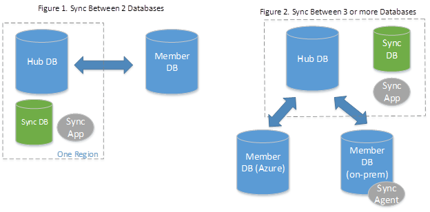
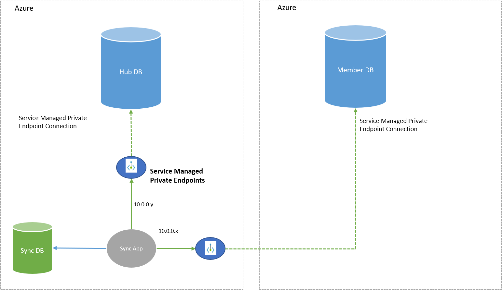

# What is SQL Data Sync for Azure?

SQL Data Sync is a service built on Azure SQL Database that lets you synchronize the data you select bi-directionally across multiple databases, both on-premises and in the cloud. 

> [!IMPORTANT]
> Azure SQL Data Sync does not support Azure SQL Managed Instance at this time.

## Overview 

Data Sync is based around the concept of a sync group. A sync group is a group of databases that you want to synchronize.

Data Sync uses a hub and spoke topology to synchronize data. You define one of the databases in the sync group as the hub database. The rest of the databases are member databases. Sync occurs only between the hub and individual members.

- The **Hub Database** must be an Azure SQL Database.
- The **member databases** can be either databases in Azure SQL Database or in instances of SQL Server.
- The **Sync Metadata Database** contains the metadata and log for Data Sync. The Sync Metadata Database has to be an Azure SQL Database located in the same region as the Hub Database. The Sync Metadata Database is customer created and customer owned. You can only have one Sync Metadata Database per region and subscription. Sync Metadata Database cannot be deleted or renamed while sync groups or sync agents exist. Microsoft recommends to create a new, empty database for use as the Sync Metadata Database. Data Sync creates tables in this database and runs a frequent workload.

> [!NOTE]
> If you're using an on premises database as a member database, you have to [install and configure a local sync agent](sql-data-sync-sql-server-configure.md#add-on-prem).

A sync group has the following properties:

- The **Sync Schema** describes which data is being synchronized.
- The **Sync Direction** can be bi-directional or can flow in only one direction. That is, the Sync Direction can be *Hub to Member*, or *Member to Hub*, or both.
- The **Sync Interval** describes how often synchronization occurs.
- The **Conflict Resolution Policy** is a group level policy, which can be *Hub wins* or *Member wins*.

## When to use

Data Sync is useful in cases where data needs to be kept updated across several databases in Azure SQL Database or SQL Server. Here are the main use cases for Data Sync:

- **Hybrid Data Synchronization:** With Data Sync, you can keep data synchronized between your databases in SQL Server and Azure SQL Database to enable hybrid applications. This capability may appeal to customers who are considering moving to the cloud and would like to put some of their application in Azure.
- **Distributed Applications:** In many cases, it's beneficial to separate different workloads across different databases. For example, if you have a large production database, but you also need to run a reporting or analytics workload on this data, it's helpful to have a second database for this additional workload. This approach minimizes the performance impact on your production workload. You can use Data Sync to keep these two databases synchronized.
- **Globally Distributed Applications:** Many businesses span several regions and even several countries/regions. To minimize network latency, it's best to have your data in a region close to you. With Data Sync, you can easily keep databases in regions around the world synchronized.

Data Sync isn't the preferred solution for the following scenarios:

| Scenario | Some recommended solutions |
|----------|----------------------------|
| Disaster Recovery | [Azure geo-redundant backups](automated-backups-overview.md) |
| Read Scale | [Use read-only replicas to load balance read-only query workloads (preview)](read-scale-out.md) |
| ETL (OLTP to OLAP) | [Azure Data Factory](https://azure.microsoft.com/services/data-factory/) or [SQL Server Integration Services](/sql/integration-services/sql-server-integration-services) |
| Migration from SQL Server to Azure SQL Database. However, SQL Data Sync can be used after the migration is completed, to ensure that the source and target are kept in sync.  | [Azure Database Migration Service](https://azure.microsoft.com/services/database-migration/) |
|||

## How it works

- **Tracking data changes:** Data Sync tracks changes using insert, update, and delete triggers. The changes are recorded in a side table in the user database. Note that BULK INSERT doesn't fire triggers by default. If FIRE_TRIGGERS isn't specified, no insert triggers execute. Add the FIRE_TRIGGERS option so Data Sync can track those inserts. 
- **Synchronizing data:** Data Sync is designed in a hub and spoke model. The hub syncs with each member individually. Changes from the hub are downloaded to the member and then changes from the member are uploaded to the hub.
- **Resolving conflicts:** Data Sync provides two options for conflict resolution, *Hub wins* or *Member wins*.
  - If you select *Hub wins*, the changes in the hub always overwrite changes in the member.
  - If you select *Member wins*, the changes in the member overwrite changes in the hub. If there's more than one member, the final value depends on which member syncs first.

## Compare with Transactional Replication

| | Data Sync | Transactional Replication |
|---|---|---|
| **Advantages** | - Active-active support - Bi-directional between on-premises and Azure SQL Database | - Lower latency - Transactional consistency - Reuse existing topology after migration  -Azure SQL Managed Instance support |
| **Disadvantages** | - No transactional consistency - Higher performance impact | - Can't publish from Azure SQL Database  -    High maintenance cost |

## Private link for Data Sync (preview)
The new private link (preview) feature allows you to choose a service managed private endpoint to establish a secure connection between the sync service and your member/hub databases during the data synchronization process. A service managed private endpoint is a private IP address within a specific virtual network and subnet. Within Data Sync, the service managed private endpoint is created by Microsoft and is exclusively used by the Data Sync service for a given sync operation. 
Before setting up the private link, read the [general requirements](sql-data-sync-data-sql-server-sql-database.md#general-requirements) for the feature. 

> [!NOTE]
> You must manually approve the service managed private endpoint in the **Private endpoint connections** page of the Azure portal during the sync group deployment or by using PowerShell.

## Get started 

### Set up Data Sync in the Azure portal

- [Set up Azure SQL Data Sync](sql-data-sync-sql-server-configure.md)
- Data Sync Agent - [Data Sync Agent for Azure SQL Data Sync](sql-data-sync-agent-overview.md)

### Set up Data Sync with PowerShell

- [Use PowerShell to sync between multiple databases in Azure SQL Database](scripts/sql-data-sync-sync-data-between-sql-databases.md)
- [Use PowerShell to sync between a database in Azure SQL Database and a databases in a SQL Server instance](scripts/sql-data-sync-sync-data-between-azure-onprem.md)

### Set up Data Sync with REST API
- [Use REST API to sync between multiple databases in Azure SQL Database](scripts/sql-data-sync-sync-data-between-sql-databases-rest-api.md)

### Review the best practices for Data Sync

- [Best practices for Azure SQL Data Sync](sql-data-sync-best-practices.md)

### Did something go wrong

- [Troubleshoot issues with Azure SQL Data Sync](./sql-data-sync-troubleshoot.md)

## Consistency and performance

### Eventual consistency

Since Data Sync is trigger-based, transactional consistency isn't guaranteed. Microsoft guarantees that all changes are made eventually and that Data Sync doesn't cause data loss.

### Performance impact

Data Sync uses insert, update, and delete triggers to track changes. It creates side tables in the user database for change tracking. These change tracking activities have an impact on your database workload. Assess your service tier and upgrade if needed.

Provisioning and deprovisioning during sync group creation, update, and deletion may also impact the database performance.

##  Requirements and limitations

### General requirements

- Each table must have a primary key. Don't change the value of the primary key in any row. If you have to change a primary key value, delete the row and recreate it with the new primary key value.

> [!IMPORTANT]
> Changing the value of an existing primary key will result in the following faulty behavior:
> - Data between hub and member can be lost even though sync does not report any issue.
> - Sync can fail because the tracking table has a non-existing row from source due to the primary key change.

- Snapshot isolation must be enabled for both Sync members and hub. For more info, see [Snapshot Isolation in SQL Server](/dotnet/framework/data/adonet/sql/snapshot-isolation-in-sql-server).

- In order to use private link with Data Sync, both the member and hub databases must be hosted in Azure (same or different regions), in the same cloud type (e.g. both in public cloud or both in government cloud). Additionally, to use private link, Microsoft.Network resource providers must be Registered for the subscriptions that host the hub and member servers. Lastly, you must manually approve the private link for Data Sync during the sync configuration, within the “Private endpoint connections” section in the Azure portal or through PowerShell. For more details on how to approve the private link, see [Set up SQL Data Sync](./sql-data-sync-sql-server-configure.md). Once you approve the service managed private endpoint, all communication between the sync service and the member/hub databases will happen over the private link. Existing sync groups can be updated to have this feature enabled.

### General limitations

- A table can't have an identity column that isn't the primary key.
- A table must have a clustered index to use data sync.
- A primary key can't have the following data types: sql_variant, binary, varbinary, image, xml.
- Be cautious when you use the following data types as a primary key, because the supported precision is only to the second: time, datetime, datetime2, datetimeoffset.
- The names of objects (databases, tables, and columns) can't contain the printable characters period (.), left square bracket ([), or right square bracket (]).
- A table name can't contain printable characters: ! " # $ % ' ( ) * + - space
- Azure Active Directory authentication isn't supported.
- If there are tables with the same name but different schema (for example, dbo.customers and sales.customers) only one of the tables can be added into sync.
- Columns with User-Defined Data Types aren't supported
- Moving servers between different subscriptions isn't supported. 
- If two primary keys are only different in case (e.g. Foo and foo), Data Sync won't support this scenario.

#### Unsupported data types

- FileStream
- SQL/CLR UDT
- XMLSchemaCollection (XML supported)
- Cursor, RowVersion, Timestamp, Hierarchyid

#### Unsupported column types

Data Sync can't sync read-only or system-generated columns. For example:

- Computed columns.
- System-generated columns for temporal tables.

#### Limitations on service and database dimensions

| **Dimensions**                                                  | **Limit**              | **Workaround**              |
|-----------------------------------------------------------------|------------------------|-----------------------------|
| Maximum number of sync groups any database can belong to.       | 5                      |                             |
| Maximum number of endpoints in a single sync group              | 30                     |                             |
| Maximum number of on-premises endpoints in a single sync group. | 5                      | Create multiple sync groups |
| Database, table, schema, and column names                       | 50 characters per name |                             |
| Tables in a sync group                                          | 500                    | Create multiple sync groups |
| Columns in a table in a sync group                              | 1000                   |                             |
| Data row size on a table                                        | 24 Mb                  |                             |

> [!NOTE]
> There may be up to 30 endpoints in a single sync group if there is only one sync group. If there is more than one sync group, the total number of endpoints across all sync groups cannot exceed 30. If a database belongs to multiple sync groups, it is counted as multiple endpoints, not one.

### Network requirements

> [!NOTE]
> If you use private link, these network requirements do not apply. 

When the sync group is established, the Data Sync service needs to connect to the hub database. At the time when you establish the sync group, the Azure SQL server must have the following configuration in its `Firewalls and virtual networks` settings:

 * *Deny public network access* must be set to *Off*.
 * *Allow Azure services and resources to access this server* must be set to *Yes*, or you must create IP rules for the [IP addresses used by Data Sync service](network-access-controls-overview.md#data-sync).

Once the sync group is created and provisioned, you can then disable these settings. The sync agent will connect directly to the hub database, and you can use the server's [firewall IP rules](firewall-configure.md) or [private endpoints](private-endpoint-overview.md) to allow the agent to access the hub server.

> [!NOTE]
> If you change the sync group's schema settings, you will need to allow the Data Sync service to access the server again so that the hub database can be re-provisioned.

## FAQ about SQL Data Sync

### How much does the SQL Data Sync service cost

There's no charge for the SQL Data Sync service itself. However, you still collect data transfer charges for data movement in and out of your SQL Database instance. For more information, see [data transfer charges](https://azure.microsoft.com/pricing/details/bandwidth/).

### What regions support Data Sync

SQL Data Sync is available in all regions.

### Is a SQL Database account required

Yes. You must have a SQL Database account to host the hub database.

### Can I use Data Sync to sync between SQL Server databases only

Not directly. You can sync between SQL Server databases indirectly, however, by creating a Hub database in Azure, and then adding the on-premises databases to the sync group.

### Can I use Data Sync to sync between databases in SQL Database that belong to different subscriptions

Yes. You can sync between databases that belong to resource groups owned by different subscriptions.

- If the subscriptions belong to the same tenant, and you have permission to all subscriptions, you can configure the sync group in the Azure portal.
- Otherwise, you have to use PowerShell to add the sync members that belong to different subscriptions.

### Can I use Data Sync to sync between databases in SQL Database that belong to different clouds (like Azure Public Cloud and Azure China 21Vianet)

Yes. You can sync between databases that belong to different clouds. You have to use PowerShell to add the sync members that belong to the different subscriptions.

### Can I use Data Sync to seed data from my production database to an empty database, and then sync them

Yes. Create the schema manually in the new database by scripting it from the original. After you create the schema, add the tables to a sync group to copy the data and keep it synced.

### Should I use SQL Data Sync to back up and restore my databases

It isn't recommended to use SQL Data Sync to create a backup of your data. You can't back up and restore to a specific point in time because SQL Data Sync synchronizations aren't versioned. Furthermore, SQL Data Sync doesn't back up other SQL objects, such as stored procedures, and doesn't do the equivalent of a restore operation quickly.

For one recommended backup technique, see [Copy a database in Azure SQL Database](database-copy.md).

### Can Data Sync sync encrypted tables and columns

- If a database uses Always Encrypted, you can sync only the tables and columns that are *not* encrypted. You can't sync the encrypted columns, because Data Sync can't decrypt the data.
- If a column uses Column-Level Encryption (CLE), you can sync the column, as long as the row size is less than the maximum size of 24 Mb. Data Sync treats the column encrypted by key (CLE) as normal binary data. To decrypt the data on other sync members, you need to have the same certificate.

### Is collation supported in SQL Data Sync

Yes. SQL Data Sync supports collation in the following scenarios:

- If the selected sync schema tables aren't already in your hub or member databases, then when you deploy the sync group, the service automatically creates the corresponding tables and columns with the collation settings selected in the empty destination databases.
- If the tables to be synced already exist in both your hub and member databases, SQL Data Sync requires that the primary key columns have the same collation between hub and member databases to successfully deploy the sync group. There are no collation restrictions on columns other than the primary key columns.

### Is federation supported in SQL Data Sync

Federation Root Database can be used in the SQL Data Sync Service without any limitation. You can't add the Federated Database endpoint to the current version of SQL Data Sync.

### Can I use Data Sync to sync data exported from Dynamics 365 using bring your own database (BYOD) feature?

The Dynamics 365 bring your own database feature lets administrators export data entities from the application into their own Microsoft Azure SQL database. Data Sync can be used to sync this data into other databases if data is exported using **incremental push** (full push is not supported) and **enable triggers in target database** is set to **yes**.

## Next steps

### Update the schema of a synced database

Do you have to update the schema of a database in a sync group? Schema changes aren't automatically replicated. For some solutions, see the following articles:

- [Automate the replication of schema changes with SQL Data Sync in Azure](./sql-data-sync-update-sync-schema.md)
- [Use PowerShell to update the sync schema in an existing sync group](scripts/update-sync-schema-in-sync-group.md)

### Monitor and troubleshoot

Is SQL Data Sync doing as expected? To monitor activity and troubleshoot issues, see the following articles:

- [Monitor SQL Data Sync with Azure Monitor logs](./monitor-tune-overview.md)
- [Troubleshoot issues with Azure SQL Data Sync](./sql-data-sync-troubleshoot.md)

### Learn more about Azure SQL Database

For more info about Azure SQL Database, see the following articles:

- [SQL Database Overview](sql-database-paas-overview.md)
- [Database Lifecycle Management](/previous-versions/sql/sql-server-guides/jj907294(v=sql.110))
