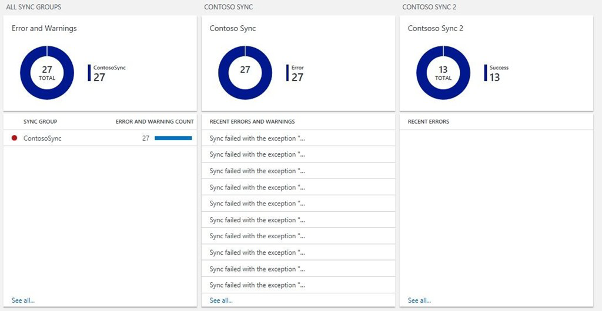
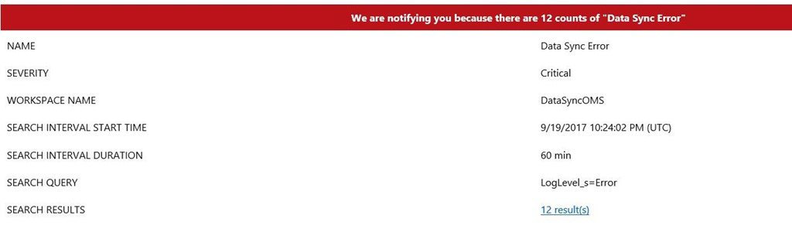

# Monitor SQL Data Sync with Azure Monitor logs 

To check the SQL Data Sync activity log and detect errors and warnings, you previously had to check SQL Data Sync manually in the Azure portal, or use PowerShell or the REST API. Follow the steps in this article to configure a custom solution that improves the Data Sync monitoring experience. You can customize this solution to fit your scenario.

[!INCLUDE [azure-monitor-log-analytics-rebrand](../../../includes/azure-monitor-log-analytics-rebrand.md)]

For an overview of SQL Data Sync, see [Sync data across multiple cloud and on-premises databases with SQL Data Sync in Azure](sql-data-sync-data-sql-server-sql-database.md).

> [!IMPORTANT]
> SQL Data Sync does **not** support Azure SQL Managed Instance at this time.

## Monitoring Dashboard for all your sync groups 

You no longer need to look through the logs of each sync group individually to look for issues. You can monitor all your sync groups from any of your subscriptions in one place by using a custom Azure Monitor view. This view surfaces the information that matters to SQL Data Sync customers.

## Automated Email notifications

You no longer need to check the log manually in the Azure portal or through PowerShell or the REST API. With [Azure Monitor logs](https://docs.microsoft.com/azure/log-analytics/log-analytics-overview), you can create alerts that go directly to the email addresses of the people that need to see them when an error occurs.

## How do you set up these monitoring features? 

Implement a custom Azure Monitor logs monitoring solution for SQL Data Sync in less than an hour by doing the following things:

You need to configure three components:

-   A PowerShell runbook to feed SQL Data Sync log data to Azure Monitor logs.

-   An Azure Monitor alert for email notifications.

-   An Azure Monitor View for monitoring.

### Samples to download

Download the following two samples:

-   [Data Sync Log PowerShell Runbook](https://github.com/Microsoft/sql-server-samples/blob/master/samples/features/sql-data-sync/DataSyncLogPowerShellRunbook.ps1)

-   [Data Sync Azure Monitor View](https://github.com/Microsoft/sql-server-samples/blob/master/samples/features/sql-data-sync/DataSyncLogOmsView.omsview)

### Prerequisites

Make sure you have set up the following things:

-   An Azure Automation account

-   Log Analytics workspace

## PowerShell Runbook to get SQL Data Sync Log 

Use a PowerShell runbook hosted in Azure Automation to pull the SQL Data Sync log data and send it to Azure Monitor logs. A sample script is included. As a prerequisite, you need to have an Azure Automation account. Then you need to create a runbook and schedule it to run. 

### Create a runbook

For more info about creating a runbook, see [My first PowerShell runbook](https://docs.microsoft.com/azure/automation/automation-first-runbook-textual-powershell).

1.  Under your Azure Automation account, select the **Runbooks** tab under Process Automation.

2.  Select **Add a Runbook** at the top-left corner of the Runbooks page.

3.  Select **Import an existing Runbook**.

4.  Under **Runbook file**, use the given `DataSyncLogPowerShellRunbook` file. Set the **Runbook type** as `PowerShell`. Give the runbook a name.

5.  Select **Create**. You now have a runbook.

6.  Under your Azure Automation Account, select the **Variables** tab under Shared Resources.

7.  Select **Add a variable** on the Variables page. Create a variable to store the last execution time for the runbook. If you have multiple runbooks, you need one variable for each runbook.

8.  Set the variable name as `DataSyncLogLastUpdatedTime` and set its Type as DateTime.

9.  Select the runbook and click the edit button at the top of the page.

10. Make the changes required for your account and your SQL Data Sync configuration. (For more detailed information, see the sample script.)

    1.  Azure information.

    2.  sync group information.

    3.  Azure Monitor logs information. Find this information in Azure portal | Settings | Connected Sources. For more information about sending data to Azure Monitor logs, see [Send data to Azure Monitor logs with the HTTP Data Collector API (preview)](../../azure-monitor/platform/data-collector-api.md).

11. Run the runbook in the Test pane. Check to make sure it was successful.

    If you have errors, make sure you have the latest PowerShell module installed. You can install the latest PowerShell module in the **Modules Gallery** in your Automation Account.

12. Click **Publish**

### Schedule the runbook

To schedule the runbook:

1.  Under the runbook, select the **Schedules** tab under Resources.

2.  Select **Add a Schedule** on the Schedules page.

3.  Select **Link a Schedule to your runbook**.

4.  Select **Create a new schedule.**

5.  Set **Recurrence** to Recurring and set the interval you want. Use the same interval here, in the script, and in Azure Monitor logs.

6.  Select **Create**.

### Check the automation

To monitor whether your automation is running as expected, under **Overview** for your automation account, find the **Job Statistics** view under **Monitoring**. Pin this view to your dashboard for easy viewing. Successful runs of the runbook show as "Completed" and Failed runs show as "Failed."

## Create an Azure Monitor Reader Alert for Email Notifications

To create an alert that uses Azure Monitor logs, do the following things. As a prerequisite, you need to have Azure Monitor logs linked with a Log Analytics workspace.

1.  In the Azure portal, select **Log Search**.

2.  Create a query to select the errors and warnings by sync group within the interval you selected. For example:

    `DataSyncLog_CL | where LogLevel_s != "Success" | summarize AggregatedValue = count() by bin(TimeGenerated,60m),SyncGroupName_s`

3.  After running the query, select the bell that says **Alert**.

4.  Under **Generate alert based on**, select **Metric Measurement**.

    1.  Set the Aggregate Value to **Greater than**.

    2.  After **Greater than**, enter the threshold to elapse before you receive notifications. Transient errors are expected in Data Sync. To reduce noise, set the threshold to 5.

5.  Under **Actions**, set **Email notification** to "Yes." Enter the desired email recipients.

6.  Click **Save**. The specified recipients now receive email notifications when errors occur.

## Create an Azure Monitor View for Monitoring

This step creates an Azure Monitor view to visually monitor all the specified sync groups. The view includes several components:

-   An overview tile, which shows how many errors, successes, and warnings all the sync groups have.

-   A tile for all sync groups, which shows the count of errors and warnings per sync group. Groups with no issues don't appear on this tile.

-   A tile for each sync group, which shows the number of errors, successes, and warnings, and the recent error messages.

To configure the Azure Monitor view, do the following things:

1.  On the Log Analytics workspace home page, select the plus on the left to open the **view designer**.

2.  Select **Import** on the top bar of the view designer. Then select the "DataSyncLogOMSView" sample file.

3.  The sample view is for managing two sync groups. Edit this view to fit your scenario. Click **edit** and make the following changes:

    1.  Create new "Donut & List" objects from the Gallery as needed.

    2.  In each tile, update the queries with your information.

        1.  On each tile, change the TimeStamp_t interval as desired.

        2.  On the tiles for each sync group, update the sync group names.

    3.  On each tile, update the title as needed.

4.  Click **Save** and the view is ready.

## Cost of this solution

In most cases, this solution is free.

**Azure Automation:** There may be a cost incurred with the Azure Automation account, depending on your usage. The first 500 minutes of job run time per month are free. In most cases, this solution is expected to use less than 500 minutes per month. To avoid charges, schedule the runbook to run at an interval of two hours or more. For more info, see [Automation pricing](https://azure.microsoft.com/pricing/details/automation/).

**Azure Monitor logs:** There may be a cost associated with Azure Monitor logs depending on your usage. The free tier includes 500 MB of ingested data per day. In most cases, this solution is expected to ingest less than 500 MB per day. To decrease the usage, use the failure-only filtering included in the runbook. If you're using more than 500 MB per day, upgrade to the paid tier to avoid the risk of analytics stopping when the limitation is reached. For more info, see [Azure Monitor logs pricing](https://azure.microsoft.com/pricing/details/log-analytics/).

## Code samples

Download the code samples described in this article from the following locations:

-   [Data Sync Log PowerShell Runbook](https://github.com/Microsoft/sql-server-samples/blob/master/samples/features/sql-data-sync/DataSyncLogPowerShellRunbook.ps1)

-   [Data Sync Azure Monitor View](https://github.com/Microsoft/sql-server-samples/blob/master/samples/features/sql-data-sync/DataSyncLogOmsView.omsview)

## Next steps
For more info about SQL Data Sync, see:

-   Overview - [Sync data across multiple cloud and on-premises databases with SQL Data Sync in Azure](sql-data-sync-data-sql-server-sql-database.md)
-   Set up Data Sync
    - In the portal - [Tutorial: Set up SQL Data Sync to sync data between Azure SQL Database and SQL Server](sql-data-sync-sql-server-configure.md)
    - With PowerShell
        -  [Use PowerShell to sync between multiple databases in Azure SQL Database](scripts/sql-data-sync-sync-data-between-sql-databases.md)
        -  [Use PowerShell to sync between a database in Azure SQL Database and a database in a SQL Server instance](scripts/sql-data-sync-sync-data-between-azure-onprem.md)
-   Data Sync Agent - [Data Sync Agent for SQL Data Sync in Azure](sql-data-sync-agent-overview.md)
-   Best practices - [Best practices for SQL Data Sync in Azure](sql-data-sync-best-practices.md)
-   Troubleshoot - [Troubleshoot issues with SQL Data Sync in Azure](sql-data-sync-troubleshoot.md)
-   Update the sync schema
    -   With Transact-SQL - [Automate the replication of schema changes in SQL Data Sync in Azure](sql-data-sync-update-sync-schema.md)
    -   With PowerShell - [Use PowerShell to update the sync schema in an existing sync group](scripts/update-sync-schema-in-sync-group.md)

For more info about SQL Database, see:

-   [SQL Database Overview](../../sql-database/sql-database-technical-overview.md)
-   [Database Lifecycle Management](https://msdn.microsoft.com/library/jj907294.aspx)
