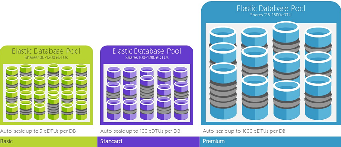

# What is Azure SQL Database?
[!INCLUDE[appliesto-sqldb](../includes/appliesto-sqldb.md)]

Azure SQL Database is a fully managed platform as a service (PaaS) database engine that handles most of the database management functions such as upgrading, patching, backups, and monitoring without user involvement. Azure SQL Database is always running on the latest stable version of the SQL Server database engine and patched OS with 99.99% availability. PaaS capabilities that are built into Azure SQL Database enable you to focus on the domain-specific database administration and optimization activities that are critical for your business.

With Azure SQL Database, you can create a highly available and high-performance data storage layer for the applications and solutions in Azure. SQL Database can be the right choice for a variety of modern cloud applications because it enables you to process both relational data and [non-relational structures](../multi-model-features.md), such as graphs, JSON, spatial, and XML.

Azure SQL Database is based on the latest stable version of the [Microsoft SQL Server database engine](https://docs.microsoft.com/sql/sql-server/sql-server-technical-documentation?toc=/azure/sql-database/toc.json). You can use advanced query processing features, such as [high-performance in-memory technologies](../in-memory-oltp-overview.md) and [intelligent query processing](https://docs.microsoft.com/sql/relational-databases/performance/intelligent-query-processing?toc=/azure/sql-database/toc.json). In fact, the newest capabilities of SQL Server are released first to SQL Database, and then to SQL Server itself. You get the newest SQL Server capabilities with no overhead for patching or upgrading, tested across millions of databases. 

SQL Database enables you to easily define and scale performance within two different purchasing models: a [vCore-based purchasing model](service-tiers-vcore.md) and a [DTU-based purchasing model](service-tiers-dtu.md). SQL Database is a fully managed service that has built-in high availability, backups, and other common maintenance operations. Microsoft handles all patching and updating of the SQL and operating system code. You don't have to manage the underlying infrastructure.

## Deployment models

Azure SQL Database provides the following deployment options for a database:

- [Single database](single-database-overview.md) represents a fully managed, isolated database. You might use this option if you have modern cloud applications and microservices that need a single reliable data source. A single database is similar to a [contained database](https://docs.microsoft.com/sql/relational-databases/databases/contained-databases?toc=/azure/sql-database/toc.json) in the [SQL Server database engine](https://docs.microsoft.com/sql/sql-server/sql-server-technical-documentation?toc=/azure/sql-database/toc.json).
- [Elastic pool](elastic-pool-overview.md) is a collection of [single databases](single-database-overview.md) with a shared set of resources, such as CPU or memory. Single databases can be moved into and out of an elastic pool.

> [!IMPORTANT]
> To understand the feature differences between SQL Database and SQL Server, as well as the differences among different Azure SQL Database options, see [SQL Database features](features-comparison.md).

SQL Database delivers predictable performance with multiple resource types, service tiers, and compute sizes. It provides dynamic scalability with no downtime, built-in intelligent optimization, global scalability and availability, and advanced security options. These capabilities allow you to focus on rapid app development and accelerating your time-to-market, rather than on managing virtual machines and infrastructure. SQL Database is currently in 38 datacenters around the world, so you can run your database in a datacenter near you.

## Scalable performance and pools

You can define the amount of resources assigned. 
- With single databases, each database is isolated from others and is portable. Each has its own guaranteed amount of compute, memory, and storage resources. The amount of the resources assigned to the database is dedicated to that database, and isn't shared with other databases in Azure. You can dynamically [scale single database resources](single-database-scale.md) up and down. The single database option provides different compute, memory, and storage resources for different needs. For example, you can get 1 to 80 vCores, or 32 GB to 4 TB. The [hyperscale service tier](service-tier-hyperscale.md) for single databases enables you to scale to 100 TB, with fast backup and restore capabilities.
- With elastic pools, you can assign resources that are shared by all databases in the pool. You can create a new database, or move the existing single databases into a resource pool to maximize the use of resources and save money. This option also gives you the ability to dynamically [scale elastic pool resources](elastic-pool-scale.md) up and down.

You can build your first app on a small, single database at a low cost per month in the general-purpose service tier. You can then change its service tier manually or programmatically at any time to the business-critical service tier, to meet the needs of your solution. You can adjust performance without downtime to your app or to your customers. Dynamic scalability enables your database to transparently respond to rapidly changing resource requirements. You pay for only the resources that you need when you need them.

*Dynamic scalability* is different from *autoscale*. Autoscale is when a service scales automatically based on criteria, whereas dynamic scalability allows for manual scaling without downtime. The single database option supports manual dynamic scalability, but not autoscale. For a more automatic experience, consider using elastic pools, which allow databases to share resources in a pool based on individual database needs. Another option is to use scripts that can help automate scalability for a single database. For an example, see [Use PowerShell to monitor and scale a single database](scripts/monitor-and-scale-database-powershell.md).

### Purchasing models

SQL Database offers the following purchasing models:
- The [vCore-based purchasing model](service-tiers-vcore.md) lets you choose the number of vCores, the amount of memory, and the amount and speed of storage. The vCore-based purchasing model also allows you to use [Azure Hybrid Benefit for SQL Server](https://azure.microsoft.com/pricing/hybrid-benefit/) to gain cost savings. For more information about the Azure Hybrid Benefit, see the "Frequently asked questions" section later in this article.
- The [DTU-based purchasing model](service-tiers-dtu.md) offers a blend of compute, memory, and I/O resources in three service tiers, to support light to heavy database workloads. Compute sizes within each tier provide a different mix of these resources, to which you can add additional storage resources.
- The [serverless model](serverless-tier-overview.md) automatically scales compute based on workload demand, and bills for the amount of compute used per second. The serverless compute tier also automatically pauses databases during inactive periods when only storage is billed, and automatically resumes databases when activity returns.

### Service tiers

Azure SQL Database offers three service tiers that are designed for different types of applications:
- [General Purpose/Standard](service-tier-general-purpose.md) service tier designed for common workloads. It offers budget-oriented balanced compute and storage options.
- [Business Critical/Premium](service-tier-business-critical.md) service tier designed for OLTP applications with high transaction rate and lowest-latency I/O. It offers the highest resilience to failures by using several isolated replicas.
- [Hyperscale](service-tier-hyperscale.md) service tier designed for very large OLTP database and the ability to autoscale storage and scale compute fluidly.    

### Elastic pools to maximize resource utilization

For many businesses and applications, being able to create single databases and dial performance up or down on demand is enough, especially if usage patterns are relatively predictable. Unpredictable usage patterns can make it hard to manage costs and your business model. [Elastic pools](elastic-pool-overview.md) are designed to solve this problem. You allocate performance resources to a pool rather than an individual database. You pay for the collective performance resources of the pool rather than for single database performance.

   

With elastic pools, you don't need to focus on dialing database performance up and down as demand for resources fluctuates. The pooled databases consume the performance resources of the elastic pool as needed. Pooled databases consume but don't exceed the limits of the pool, so your cost remains predictable even if individual database usage doesn't.

You can [add and remove databases to the pool](elastic-pool-overview.md), scaling your app from a handful of databases to thousands, all within a budget that you control. You can also control the minimum and maximum resources available to databases in the pool, to ensure that no database in the pool uses all the pool resources, and that every pooled database has a guaranteed minimum amount of resources. To learn more about design patterns for software as a service (SaaS) applications that use elastic pools, see [Design patterns for multi-tenant SaaS applications with SQL Database](saas-tenancy-app-design-patterns.md).

Scripts can help with monitoring and scaling elastic pools. For an example, see [Use PowerShell to monitor and scale an elastic pool in Azure SQL Database](scripts/monitor-and-scale-pool-powershell.md).

### Blend single databases with pooled databases

You can blend single databases with elastic pools, and change the service tiers of single databases and elastic pools to adapt to your situation. You can also mix and match other Azure services with SQL Database to meet your unique app design needs, drive cost and resource efficiencies, and unlock new business opportunities.

## Extensive monitoring and alerting capabilities

Azure SQL Database provides advanced monitoring and troubleshooting features that help you get deeper insights into workload characteristics. These features and tools include:
 - The built-in monitoring capabilities provided by the latest version of the SQL Server database engine. They enable you to find real-time performance insights. 
 - PaaS monitoring capabilities provided by Azure that enable you to monitor and troubleshoot a large number of database instances.

[Query Store](https://docs.microsoft.com/sql/relational-databases/performance/best-practice-with-the-query-store), a built-in SQL Server monitoring feature, records the performance of your queries in real time, and enables you to identify the potential performance issues and the top resource consumers. Automatic tuning and recommendations provide advice regarding the queries with the regressed performance and missing or duplicated indexes. Automatic tuning in SQL Database enables you to either manually apply the scripts that can fix the issues, or let SQL Database apply the fix. SQL Database can also test and verify that the fix provides some benefit, and retain or revert the change depending on the outcome. In addition to Query Store and automatic tuning capabilities, you can use standard [DMVs and XEvent](monitoring-with-dmvs.md) to monitor the workload performance.

Azure provides [built-in performance monitoring](performance-guidance.md) and [alerting](alerts-insights-configure-portal.md) tools, combined with performance ratings, that enable you to monitor the status of thousands of databases. Using these tools, you can quickly assess the impact of scaling up or down, based on your current or projected performance needs. Additionally, SQL Database can [emit metrics and resource logs](metrics-diagnostic-telemetry-logging-streaming-export-configure.md) for easier monitoring. You can configure SQL Database to store resource usage, workers and sessions, and connectivity into one of these Azure resources:

- **Azure Storage**: For archiving vast amounts of telemetry for a small price.
- **Azure Event Hubs**: For integrating SQL Database telemetry with your custom monitoring solution or hot pipelines.
- **Azure Monitor logs**: For a built-in monitoring solution with reporting, alerting, and mitigating capabilities.

## Availability capabilities

Azure SQL Database enables your business to continue operating during disruptions. In a traditional SQL Server environment, you generally have at least two machines locally set up. These machines have exact, synchronously maintained, copies of the data to protect against a failure of a single machine or component. This environment provides high availability, but it doesn't protect against a natural disaster destroying your datacenter.

Disaster recovery assumes that a catastrophic event is geographically localized enough to have another machine or set of machines with a copy of your data far away. In SQL Server, you can use Always On Availability Groups running in async mode to get this capability. People often don't want to wait for replication to happen that far away before committing a transaction, so there's potential for data loss when you do unplanned failovers.

Databases in the Premium and Business Critical service tiers already [do something similar](high-availability-sla.md#premium-and-business-critical-service-tier-availability) to the synchronization of an availability group. Databases in lower service tiers provide redundancy through storage by using a [different but equivalent mechanism](high-availability-sla.md#basic-standard-and-general-purpose-service-tier-availability). Built-in logic helps protect against a single machine failure. The active geo-replication feature gives you the ability to protect against disaster where a whole region is destroyed.

Azure Availability Zones tries to protect against the outage of a single datacenter building within a single region. It helps you protect against the loss of power or network to a building. In SQL Database, you place the different replicas in different availability zones (different buildings, effectively).

In fact, the service level agreement [(SLA)](https://azure.microsoft.com/support/legal/sla/) of Azure, powered by a global network of Microsoft-managed datacenters, helps keep your app running 24/7. The Azure platform fully manages every database, and it guarantees no data loss and a high percentage of data availability. Azure automatically handles patching, backups, replication, failure detection, underlying potential hardware, software or network failures, deploying bug fixes, failovers, database upgrades, and other maintenance tasks. Standard availability is achieved by a separation of compute and storage layers. Premium availability is achieved by integrating compute and storage on a single node for performance, and then implementing technology similar to Always On Availability Groups. For a full discussion of the high availability capabilities of Azure SQL Database, see [SQL Database availability](high-availability-sla.md). 

In addition, SQL Database provides built-in [business continuity and global scalability](business-continuity-high-availability-disaster-recover-hadr-overview.md) features. These include:

- [Automatic backups](automated-backups-overview.md):

  SQL Database automatically performs full, differential, and transaction log backups of databases to enable you to restore to any point in time. For single databases and pooled databases, you can configure SQL Database to store full database backups to Azure Storage for long-term backup retention. For managed instances, you can also perform copy-only backups for long-term backup retention.

- [Point-in-time restores](recovery-using-backups.md):

  All SQL Database deployment options support recovery to any point in time within the automatic backup retention period for any database.
- [Active geo-replication](active-geo-replication-overview.md):

  The single database and pooled databases options allow you to configure up to four readable secondary databases in either the same or globally distributed Azure datacenters. For example, if you have a SaaS application with a catalog database that has a high volume of concurrent read-only transactions, use active geo-replication to enable global read scale. This removes bottlenecks on the primary that are due to read workloads. For managed instances, use auto-failover groups.
- [Auto-failover groups](auto-failover-group-overview.md):

  All SQL Database deployment options allow you to use failover groups to enable high availability and load balancing at global scale. This includes transparent geo-replication and failover of large sets of databases, elastic pools, and managed instances. Failover groups enable the creation of globally distributed SaaS applications, with minimal administration overhead. This leaves all the complex monitoring, routing, and failover orchestration to SQL Database.
- [Zone-redundant databases](high-availability-sla.md):

  SQL Database allows you to provision Premium or Business Critical databases or elastic pools across multiple availability zones. Because these databases and elastic pools have multiple redundant replicas for high availability, placing these replicas into multiple availability zones provides higher resilience. This includes the ability to recover automatically from the datacenter scale failures, without data loss.

## Built-in intelligence

With SQL Database, you get built-in intelligence that helps you dramatically reduce the costs of running and managing databases, and that maximizes both performance and security of your application. Running millions of customer workloads around the clock, SQL Database collects and processes a massive amount of telemetry data, while also fully respecting customer privacy. Various algorithms continuously evaluate the telemetry data so that the service can learn and adapt with your application.

### Automatic performance monitoring and tuning

SQL Database provides detailed insight into the queries that you need to monitor. SQL Database learns about your database patterns, and enables you to adapt your database schema to your workload. SQL Database provides [performance tuning recommendations](database-advisor-implement-performance-recommendations.md), where you can review tuning actions and apply them.

However, constantly monitoring a database is a hard and tedious task, especially when you're dealing with many databases. [Intelligent Insights](intelligent-insights-overview.md) does this job for you by automatically monitoring SQL Database performance at scale. It informs you of performance degradation issues, it identifies the root cause of each issue, and it provides performance improvement recommendations when possible.

Managing a huge number of databases might be impossible to do efficiently even with all available tools and reports that SQL Database and Azure provide. Instead of monitoring and tuning your database manually, you might consider delegating some of the monitoring and tuning actions to SQL Database by using [automatic tuning](automatic-tuning-overview.md). SQL Database automatically applies recommendations, tests, and verifies each of its tuning actions to ensure the performance keeps improving. This way, SQL Database automatically adapts to your workload in a controlled and safe way. Automatic tuning means that the performance of your database is carefully monitored and compared before and after every tuning action. If the performance doesn't improve, the tuning action is reverted.

Many of our partners that run [SaaS multi-tenant apps](saas-tenancy-app-design-patterns.md) on top of SQL Database are relying on automatic performance tuning to make sure their applications always have stable and predictable performance. For them, this feature tremendously reduces the risk of having a performance incident in the middle of the night. In addition, because part of their customer base also uses SQL Server, they're using the same indexing recommendations provided by SQL Database to help their SQL Server customers.

Two automatic tuning aspects are [available in SQL Database](automatic-tuning-overview.md):

- **Automatic index management**: Identifies indexes that should be added in your database, and indexes that should be removed.
- **Automatic plan correction**: Identifies problematic plans and fixes SQL plan performance problems.

### Adaptive query processing

You can use [adaptive query processing](/sql/relational-databases/performance/intelligent-query-processing), including interleaved execution for multi-statement table-valued functions, batch mode memory grant feedback, and batch mode adaptive joins. Each of these adaptive query processing features applies similar "learn and adapt" techniques, helping further address performance issues related to historically intractable query optimization problems.

## Advanced security and compliance

SQL Database provides a range of [built-in security and compliance features](../../active-directory/identity-protection/security-overview.md) to help your application meet various security and compliance requirements.

> [!IMPORTANT]
> Microsoft has certified Azure SQL Database (all deployment options) against a number of compliance standards. For more information, see the [Microsoft Azure Trust Center](https://gallery.technet.microsoft.com/Overview-of-Azure-c1be3942), where you can find the most current list of SQL Database compliance certifications.

### Advance threat protection

Advanced data security is a unified package for advanced SQL security capabilities. It includes functionality for discovering and classifying sensitive data, managing your database vulnerabilities, and detecting anomalous activities that might indicate a threat to your database. It provides a single location for enabling and managing these capabilities.

- [Data discovery and classification](data-discovery-and-classification-overview.md):

  This feature provides capabilities built into Azure SQL Database for discovering, classifying, labeling, and protecting the sensitive data in your databases. It provides visibility into your database classification state, and tracks the access to sensitive data within the database and beyond its borders.
- [Vulnerability assessment](sql-vulnerability-assessment.md):

  This service can discover, track, and help you remediate potential database vulnerabilities. It provides visibility into your security state, and includes actionable steps to resolve security issues, and enhance your database fortifications.
- [Threat detection](threat-detection-configure.md):

  This feature detects anomalous activities that indicate unusual and potentially harmful attempts to access or exploit your database. It continuously monitors your database for suspicious activities, and provides immediate security alerts on potential vulnerabilities, SQL injection attacks, and anomalous database access patterns. Threat detection alerts provide details of the suspicious activity, and recommend action on how to investigate and mitigate the threat.

### Auditing for compliance and security

[Auditing](../../azure-sql/database/auditing-overview.md) tracks database events and writes them to an audit log in your Azure storage account. Auditing can help you maintain regulatory compliance, understand database activity, and gain insight into discrepancies and anomalies that might indicate business concerns or suspected security violations.

### Data encryption

SQL Database helps secure your data by providing encryption. For data in motion, it uses [transport layer security](https://support.microsoft.com/kb/3135244). For data at rest, it uses [transparent data encryption](https://docs.microsoft.com/sql/relational-databases/security/encryption/transparent-data-encryption-azure-sql). For data in use, it uses [Always Encrypted](https://docs.microsoft.com/sql/relational-databases/security/encryption/always-encrypted-database-engine).

### Azure Active Directory integration and multi-factor authentication

SQL Database enables you to centrally manage identities of database user and other Microsoft services with [Azure Active Directory integration](authentication-aad-overview.md). This capability simplifies permission management and enhances security. Azure Active Directory supports [multi-factor authentication](authentication-mfa-ssms-overview.md) to increase data and application security, while supporting a single sign-in process.

## Easy-to-use tools

SQL Database makes building and maintaining applications easier and more productive. SQL Database allows you to focus on what you do best: building great apps. You can manage and develop in SQL Database by using tools and skills you already have.

|Tool|Description|
|:---|:---|
|[The Azure portal](https://portal.azure.com/)|A web-based application for managing all Azure services.|
|[Azure Data Studio](/sql/azure-data-studio/)|A cross-platform database tool that runs on Windows, MacOS, and Linux.|
|[SQL Server Management Studio](https://docs.microsoft.com/sql/ssms/download-sql-server-management-studio-ssms)|A free, downloadable client application for managing any SQL infrastructure, from SQL Server to SQL Database.|
|[SQL Server Data Tools in Visual Studio](https://docs.microsoft.com/sql/ssdt/download-sql-server-data-tools-ssdt)|A free, downloadable client application for developing SQL Server relational databases, databases in Azure SQL Database, Integration Services packages, Analysis Services data models, and Reporting Services reports.|
|[Visual Studio Code](https://code.visualstudio.com/docs)|A free, downloadable, open-source code editor for Windows, macOS, and Linux. It supports extensions, including the [mssql extension](https://aka.ms/mssql-marketplace) for querying Microsoft SQL Server, Azure SQL Database, and Azure SQL Data Warehouse.|

SQL Database supports building applications with Python, Java, Node.js, PHP, Ruby, and .NET on macOS, Linux, and Windows. SQL Database supports the same [connection libraries](connect-query-content-reference-guide.md#libraries) as SQL Server.

[!INCLUDE [sql-database-create-manage-portal](../includes/sql-database-create-manage-portal.md)]

## SQL Database frequently asked questions

### Can I control when patching downtime occurs?

No. The impact of patching is generally not noticeable if you [employ retry logic](develop-overview.md#resiliency) in your app. For more information, see [Planning for Azure maintenance events in Azure SQL Database](planned-maintenance.md).

## Engage with the SQL Server engineering team

- [DBA Stack Exchange](https://dba.stackexchange.com/questions/tagged/sql-server): Ask database administration questions.
- [Stack Overflow](https://stackoverflow.com/questions/tagged/sql-server): Ask development questions.
- [Microsoft Q&A question page](https://docs.microsoft.com/answers/topics/azure-synapse-analytics.html): Ask technical questions.
- [Feedback](https://aka.ms/sqlfeedback): Report bugs and request features.
- [Reddit](https://www.reddit.com/r/SQLServer/): Discuss SQL Server.

## Next steps

- See the [pricing page](https://azure.microsoft.com/pricing/details/sql-database/) for cost comparisons and calculators regarding single databases and elastic pools.
- See these quickstarts to get started:

  - [Create a database in the Azure portal](single-database-create-quickstart.md)  
  - [Create a database with the Azure CLI](az-cli-script-samples-content-guide.md)
  - [Create a database using PowerShell](powershell-script-content-guide.md)

- For a set of Azure CLI and PowerShell samples, see:
  - [Azure CLI samples for SQL Database](az-cli-script-samples-content-guide.md)
  - [Azure PowerShell samples for SQL Database](powershell-script-content-guide.md)

- For information about new capabilities as they're announced, see [Azure Roadmap for SQL Database](https://azure.microsoft.com/roadmap/?category=databases).
- See the [Azure SQL Database blog](https://azure.microsoft.com/blog/topics/database), where SQL Server product team members blog about SQL Database news and features.

