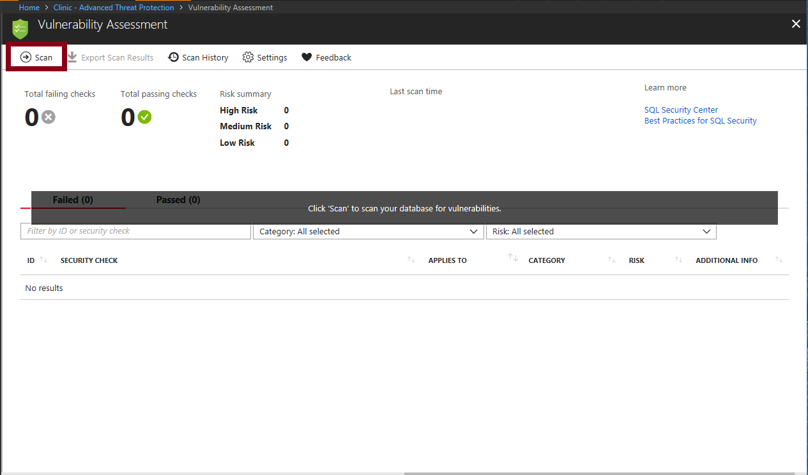
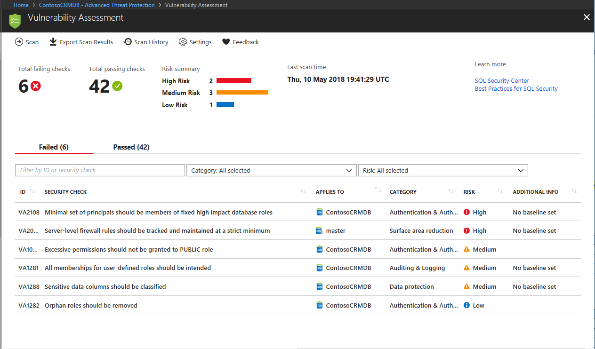
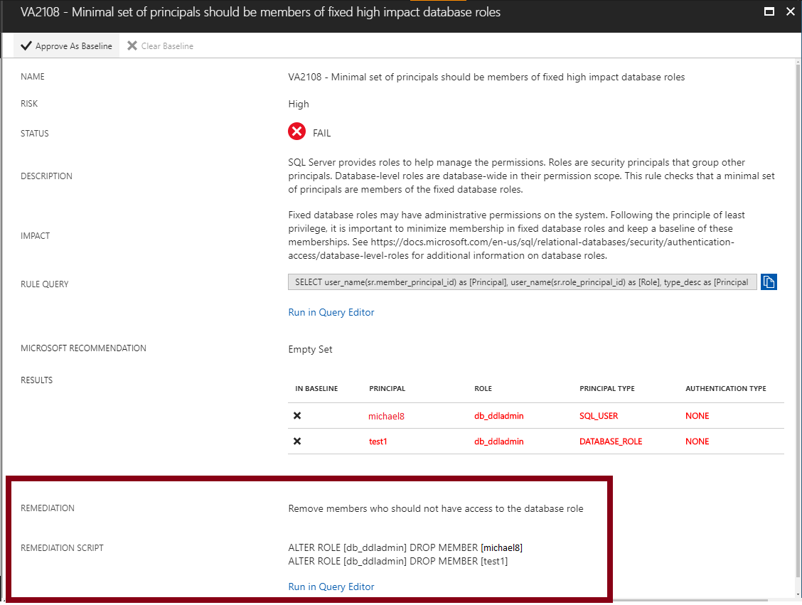
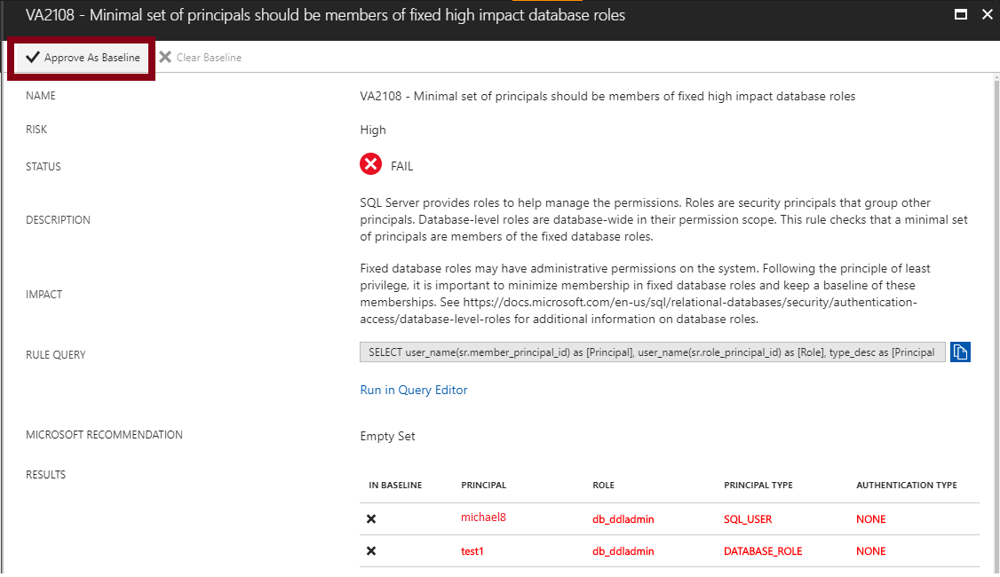
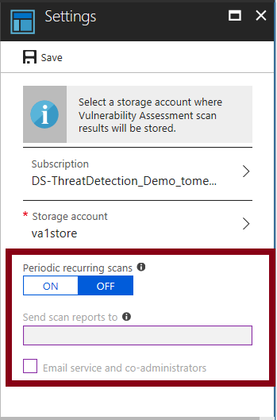

# SQL Vulnerability Assessment helps you identify database vulnerabilities
[!INCLUDE[appliesto-sqldb-sqlmi](../includes/appliesto-sqldb-sqlmi.md)]

SQL Vulnerability Assessment is an easy-to-configure service that can discover, track, and help you remediate potential database vulnerabilities. Use it to proactively improve your database security.

Vulnerability Assessment is part of the [Advanced Data Security](advanced-data-security.md) offering, which is a unified package for advanced SQL security capabilities. Vulnerability Assessment can be accessed and managed via the central SQL Advanced Data Security portal.

> [!NOTE]
> Vulnerability Assessment is supported for Azure SQL Database, Azure SQL Managed Instance, and Azure Synapse Analytics (formerly Azure SQL Data Warehouse). Databases in Azure SQL Database, Azure SQL Managed Instance, and Azure Synapse Analytics are referred to collectively in the remainder of this article as databases, and the server is referring to the [server](logical-servers.md) that hosts databases for Azure SQL Database and Azure Synapse.

## Vulnerability Assessment

SQL Vulnerability Assessment is a service that provides visibility into your security state. Vulnerability Assessment includes actionable steps to resolve security issues and enhance your database security. It can help you:

- Meet compliance requirements that require database scan reports.
- Meet data privacy standards.
- Monitor a dynamic database environment where changes are difficult to track.

Vulnerability Assessment is a scanning service built into Azure SQL Database. The service employs a knowledge base of rules that flag security vulnerabilities. It highlights deviations from best practices, such as misconfigurations, excessive permissions, and unprotected sensitive data.

The rules are based on Microsoft's best practices and focus on the security issues that present the biggest risks to your database and its valuable data. They cover database-level issues and server-level security issues, like server firewall settings and server-level permissions. These rules also represent many of the requirements from various regulatory bodies to meet their compliance standards.

Results of the scan include actionable steps to resolve each issue and provide customized remediation scripts where applicable. You can customize an assessment report for your environment by setting an acceptable baseline for:

- Permission configurations
- Feature configurations
- Database settings

## Implement Vulnerability Assessment

The following steps implement the vulnerability assessment:

### 1. Run a scan

1. Go to your Azure SQL Database, SQL Managed Instance, or Azure Synapse resource in the [Azure portal](https://portal.azure.com).

1. Under the **Security** heading, select **Advanced Data Security**.

1. Then click **Select Storage** on the **Vulnerability Assessment** pane to open the Vulnerability Assessment settings pane for either the entire server or managed instance.  

1. Configure a storage account where your scan results for all databases on the server or managed instance will be stored. For information about storage accounts, see [About Azure storage accounts](../../storage/common/storage-account-create.md). After storage is configured, select **Scan** to scan your database for vulnerabilities.



  > [!NOTE]
  > The scan is lightweight and safe. It takes a few seconds to run and is entirely read-only. It doesn't make any changes to your database.

### 2. View the report

When your scan is finished, your scan report is automatically displayed in the Azure portal. The report presents an overview of your security state. It lists how many issues were found and their respective severities. Results include warnings on deviations from best practices and a snapshot of your security-related settings, such as database principals and roles and their associated permissions. The scan report also provides a map of sensitive data discovered in your database. It includes recommendations to classify that data by using [data discovery and classification](data-discovery-and-classification-overview.md).



### 3. Analyze the results and resolve issues

Review your results and determine the findings in the report that are true security issues in your environment. Drill down to each failed result to understand the impact of the finding and why each security check failed. Use the actionable remediation information provided by the report to resolve the issue.



### 4. Set your baseline

As you review your assessment results, you can mark specific results as being an acceptable *baseline* in your environment. The baseline is essentially a customization of how the results are reported. Results that match the baseline are considered as passing in subsequent scans. After you've established your baseline security state, Vulnerability Assessment only reports on deviations from the baseline. In this way, you can focus your attention on the relevant issues.



### 5. Run a new scan to see your customized tracking report

After you finish setting up your **Rule Baselines**, run a new scan to view the customized report. Vulnerability Assessment now reports only the security issues that deviate from your approved baseline state.


Vulnerability Assessment can now be used to monitor that your database maintains a high level of security at all times, and that your organizational policies are met. If compliance reports are required, Vulnerability Assessment reports can be helpful to facilitate the compliance process.

### 6. Set up periodic recurring scans

Go to the Vulnerability Assessment settings to turn on **Periodic recurring scans**. This setting configures Vulnerability Assessment to automatically run a scan on your database once per week. A scan result summary is sent to the email addresses you provide.



### 7. Export an assessment report

Select **Export Scan Results** to create a downloadable Excel report of your scan result. This report contains a summary tab that displays a summary of the assessment. The report includes all failed checks. It also includes a **Results** tab that contains the full set of results from the scan. The results include all checks that were run and the result details for each.

### 8. View scan history

Select **Scan History** in the Vulnerability Assessment pane to view a history of all scans previously run on this database. Select a particular scan in the list to view the detailed results of that scan.

Vulnerability Assessment can now be used to monitor that your database maintains a high level of security at all times, and that your organizational policies are met. If compliance reports are required, Vulnerability Assessment reports can be helpful to facilitate the compliance process.

## Manage vulnerability assessments by using Azure PowerShell

[!INCLUDE [updated-for-az](../../../includes/updated-for-az.md)]
> [!IMPORTANT]
> The PowerShell Azure Resource Manager module is still supported, but all future development is for the Az.Sql module. For these cmdlets, see [AzureRM.Sql](https://docs.microsoft.com/powershell/module/AzureRM.Sql/). The arguments for the commands in the Az module and in the AzureRm modules are substantially identical.

You can use Azure PowerShell cmdlets to programmatically manage your vulnerability assessments. The supported cmdlets are:

| Cmdlet name as a link | Description |
| :-------------------- | :---------- |
| [Clear-AzSqlDatabaseVulnerabilityAssessmentRuleBaseline](https://docs.microsoft.com/powershell/module/az.sql/Clear-azSqlDatabaseVulnerabilityAssessmentRuleBaseline) | Clears the Vulnerability Assessment rule baseline.<br/>First, set the baseline before you use this cmdlet to clear it. |
| [Clear-AzSqlDatabaseVulnerabilityAssessmentSetting](https://docs.microsoft.com/powershell/module/az.sql/Clear-azSqlDatabaseVulnerabilityAssessmentSetting) | Clears the Vulnerability Assessment settings of a database. |
| [Convert-AzSqlDatabaseVulnerabilityAssessmentScan](https://docs.microsoft.com/powershell/module/az.sql/Convert-azSqlDatabaseVulnerabilityAssessmentScan) | Converts Vulnerability Assessment scan results to an Excel file. |
| [Get-AzSqlDatabaseVulnerabilityAssessmentRuleBaseline](https://docs.microsoft.com/powershell/module/az.sql/Get-azSqlDatabaseVulnerabilityAssessmentRuleBaseline) | Gets the Vulnerability Assessment rule baseline for a given rule. |
| [Get-AzSqlDatabaseVulnerabilityAssessmentScanRecord](https://docs.microsoft.com/powershell/module/az.sql/Get-azSqlDatabaseVulnerabilityAssessmentScanRecord) | Gets all Vulnerability Assessment scan records associated with a given database. |
| [Get-AzSqlDatabaseVulnerabilityAssessmentSetting](https://docs.microsoft.com/powershell/module/az.sql/Get-azSqlDatabaseVulnerabilityAssessmentSetting) | Returns the Vulnerability Assessment settings of a database. |
| [Set-AzSqlDatabaseVulnerabilityAssessmentRuleBaseline](https://docs.microsoft.com/powershell/module/az.sql/Set-azSqlDatabaseVulnerabilityAssessmentRuleBaseline) | Sets the Vulnerability Assessment rule baseline. |
| [Start-AzSqlDatabaseVulnerabilityAssessmentScan](https://docs.microsoft.com/powershell/module/az.sql/Start-azSqlDatabaseVulnerabilityAssessmentScan) | Triggers the start of a Vulnerability Assessment scan. |
| [Update-AzSqlDatabaseVulnerabilityAssessmentSetting](https://docs.microsoft.com/powershell/module/az.sql/Update-azSqlDatabaseVulnerabilityAssessmentSetting) | Updates the Vulnerability Assessment settings of a database. |
| &nbsp; | &nbsp; |

For a script example, see [Azure SQL Vulnerability Assessment PowerShell support](https://blogs.msdn.microsoft.com/sqlsecurity/20../../azure-sql-vulnerability-assessment-now-with-powershell-support/).

## Manage Vulnerability Assessment baseline rules by using Resource Manager templates

To configure Vulnerability Assessment baselines by using Azure Resource Manager templates, use the `Microsoft.Sql/servers/databases/vulnerabilityAssessments/rules/baselines` type.

Ensure that you have enabled `vulnerabilityAssessments` before you add baselines.

Here's an example for defining Baseline Rule VA2065 to masterdb and VA1143 to userdb as resources in a Resource Manager template:

```json
   "resources": [
      {
         "type": "Microsoft.Sql/servers/databases/vulnerabilityAssessments/rules/baselines",
         "apiVersion": "2018-06-01-preview",
         "name": "[concat(parameters('server_name'),'/', parameters('database_name') , '/default/VA2065/master')]",
         "properties": {
            "baselineResults": [
               {
                  "result": [
                     "FirewallRuleName3",
                     "StartIpAddress",
                     "EndIpAddress"
                  ]
               },
               {
                  "result": [
                     "FirewallRuleName4",
                     "62.92.15.68",
                     "62.92.15.68"
                  ]
               }
            ]
         },
         "type": "Microsoft.Sql/servers/databases/vulnerabilityAssessments/rules/baselines",
         "apiVersion": "2018-06-01-preview",
         "name": "[concat(parameters('server_name'),'/', parameters('database_name'), '/default/VA2130/Default')]",
         "dependsOn": [
            "[resourceId('Microsoft.Sql/servers/vulnerabilityAssessments', parameters('server_name'), 'Default')]"
         ],
         "properties": {
            "baselineResults": [
               {
                  "result": [
                     "dbo"
                  ]
               }
            ]
         }
      }
   ]
```

For master database and user database, the resource names are defined differently:

- Master database - "name": "[concat(parameters('server_name'),'/', parameters('database_name') , '/default/VA2065/<b>master</b>')]",
- User database - "name": "[concat(parameters('server_name'),'/', parameters('database_name') , '/default/VA2065/<b>default</b>')]",

To handle Boolean types as true/false, set the baseline result with binary input like "1"/"0".

```json
   {
      "type": "Microsoft.Sql/servers/databases/vulnerabilityAssessments/rules/baselines",
      "apiVersion": "2018-06-01-preview",
      "name": "[concat(parameters('server_name'),'/', parameters('database_name'), '/default/VA1143/Default')]",

      "dependsOn": [
         "[resourceId('Microsoft.Sql/servers/vulnerabilityAssessments', parameters('server_name'), 'Default')]"
      ],

      "properties": {
         "baselineResults": [
            {
               "result": [
                  "1"
               ]
            }
         ]
      }

   }
```

## Next steps  

- Learn more about [Advanced Data Security](advanced-data-security.md).
- Learn more about [data discovery and classification](data-discovery-and-classification-overview.md).
