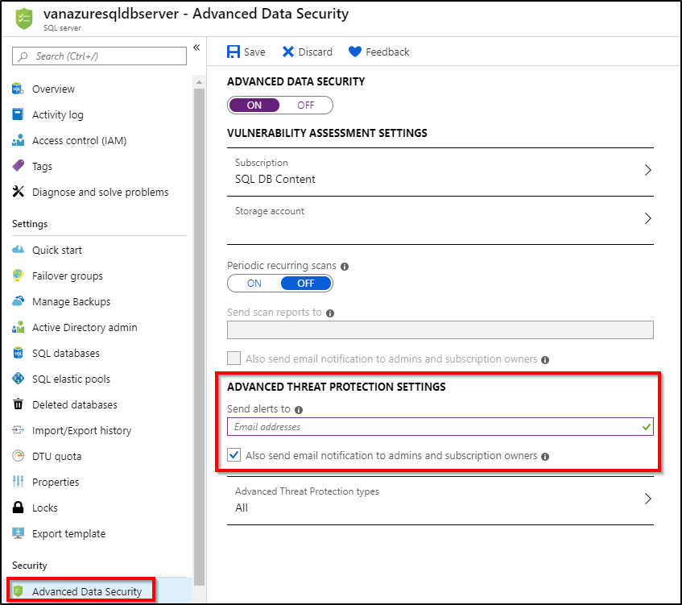

# Configure Advanced Threat Protection for Azure SQL Database
[!INCLUDE[appliesto-sqldb](../includes/appliesto-sqldb.md)]

[Advanced Threat Protection](threat-detection-overview.md) for Azure SQL Database detects anomalous activities indicating unusual and potentially harmful attempts to access or exploit databases. Advanced Threat Protection can identify **Potential SQL injection**, **Access from unusual location or data center**, **Access from unfamiliar principal or potentially harmful application**, and **Brute force SQL credentials** - see more details in [Advanced Threat Protection alerts](threat-detection-overview.md#alerts).

You can receive notifications about the detected threats via [email notifications](threat-detection-overview.md#explore-detection-of-a-suspicious-event) or [Azure portal](threat-detection-overview.md#explore-alerts-in-the-azure-portal)

[Advanced Threat Protection](threat-detection-overview.md) is part of the [advanced data security](advanced-data-security.md) offering, which is a unified package for advanced SQL security capabilities. Advanced Threat Protection can be accessed and managed via the central SQL Advanced Data Security portal.

## Set up Advanced Threat Protection in the Azure portal

1. Sign into the [Azure portal](https://portal.azure.com).
2. Navigate to the configuration page of the server you want to protect. In the security settings, select **Advanced Data Security**.
3. On the **Advanced Data Security** configuration page:

   - Enable Advanced Data Security on the server.
   - In **Advanced Threat Protection Settings**, in the **Send alerts to** text box, provide the list of emails to receive security alerts upon detection of anomalous database activities.
  
   

## Set up Advanced Threat Protection using PowerShell

For a script example, see [Configure auditing and Advanced Threat Protection using PowerShell](scripts/auditing-threat-detection-powershell-configure.md).

## Next steps

- Learn more about [Advanced Threat Protection](threat-detection-overview.md).
- Learn more about [Advanced Threat Protection in SQL Managed Instance](../managed-instance/threat-detection-configure.md).  
- Learn more about [advanced data security](advanced-data-security.md).
- Learn more about [auditing](../../azure-sql/database/auditing-overview.md)
- Learn more about [Azure security center](https://docs.microsoft.com/azure/security-center/security-center-intro)
- For more information on pricing, see the [SQL Database pricing page](https://azure.microsoft.com/pricing/details/sql-database/)  
