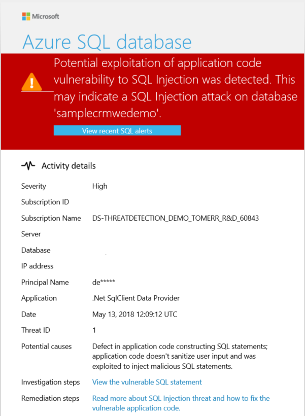
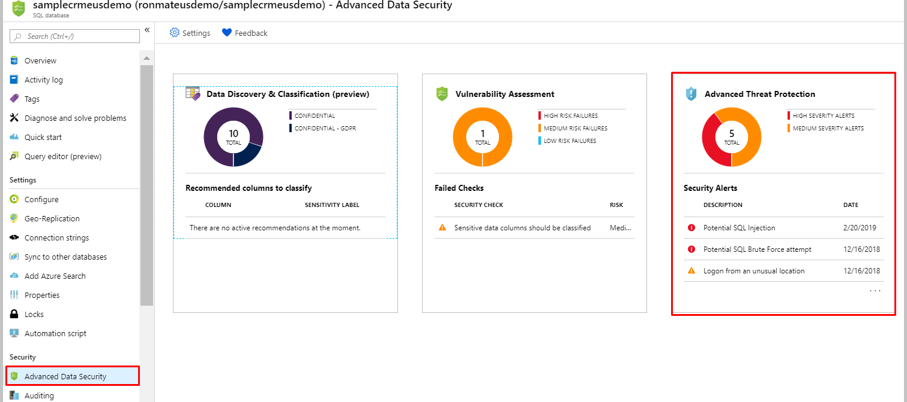

# Advanced Threat Protection for Azure SQL Database, SQL Managed Instance, and Azure Synapse Analytics
[!INCLUDE[appliesto-sqldb-sqlmi-asa](../includes/appliesto-sqldb-sqlmi-asa.md)]

Advanced Threat Protection for [Azure SQL Database](sql-database-paas-overview.md), [Azure SQL Managed Instance](../managed-instance/sql-managed-instance-paas-overview.md) and [Azure Synapse Analytics](../../synapse-analytics/sql-data-warehouse/sql-data-warehouse-overview-what-is.md) detects anomalous activities indicating unusual and potentially harmful attempts to access or exploit databases.

Advanced Threat Protection is part of the [Advanced data security](advanced-data-security.md) offering, which is a unified package for advanced SQL security capabilities. Advanced Threat Protection can be accessed and managed via the central SQL ADS portal.

## Overview

Advanced Threat Protection provides a new layer of security, which enables customers to detect and respond to potential threats as they occur by providing security alerts on anomalous activities. Users receive an alert upon suspicious database activities, potential vulnerabilities, and SQL injection attacks, as well as anomalous database access and queries patterns. Advanced Threat Protection integrates alerts with [Azure Security Center](https://azure.microsoft.com/services/security-center/), which include details of suspicious activity and recommend action on how to investigate and mitigate the threat. Advanced Threat Protection makes it simple to address potential threats to the database without the need to be a security expert or manage advanced security monitoring systems.

For a full investigation experience, it is recommended to enable auditing, which writes database events to an audit log in your Azure storage account.  To enable auditing, see [Auditing for Azure SQL Database and Azure Synapse](../../azure-sql/database/auditing-overview.md) or [Auditing for Azure SQL Managed Instance](../managed-instance/auditing-configure.md).

## Alerts

Advanced Threat Protection for Azure SQL Database detects anomalous activities indicating unusual and potentially harmful attempts to access or exploit databases. For a list of alerts for Azure SQL Database, see the [Alerts for SQL Database and SQL Data Warehouse in Azure Security Center](https://docs.microsoft.com/azure/security-center/alerts-reference#alerts-sql-db-and-warehouse).

## Explore detection of a suspicious event

You receive an email notification upon detection of anomalous database activities. The email provides information on the suspicious security event including the nature of the anomalous activities, database name, server name, application name, and the event time. In addition, the email provides information on possible causes and recommended actions to investigate and mitigate the potential threat to the database.

1. Click the **View recent SQL alerts** link in the email to launch the Azure portal and show the Azure Security Center alerts page, which provides an overview of active threats detected on the database.

   

1. Click a specific alert to get additional details and actions for investigating this threat and remediating future threats.

   For example, SQL injection is one of the most common Web application security issues on the Internet that is used to attack data-driven applications. Attackers take advantage of application vulnerabilities to inject malicious SQL statements into application entry fields, breaching or modifying data in the database. For SQL Injection alerts, the alert’s details include the vulnerable SQL statement that was exploited.

   

## Explore alerts in the Azure portal

Advanced Threat Protection integrates its alerts with [Azure security center](https://azure.microsoft.com/services/security-center/). Live SQL Advanced Threat Protection tiles within the database and SQL ADS blades in the Azure portal track the status of active threats.

Click **Advanced Threat Protection alert** to launch the Azure Security Center alerts page and get an overview of active SQL threats detected on the database.

   

   

## Next steps

- Learn more about [Advanced Threat Protection in Azure SQL Database & Azure Synapse](threat-detection-configure.md).
- Learn more about [Advanced Threat Protection in Azure SQL Managed Instance](../managed-instance/threat-detection-configure.md).
- Learn more about [Advanced data security](advanced-data-security.md).
- Learn more about [Azure SQL Database auditing](../../azure-sql/database/auditing-overview.md)
- Learn more about [Azure security center](https://docs.microsoft.com/azure/security-center/security-center-intro)
- For more information on pricing, see the [Azure SQL Database pricing page](https://azure.microsoft.com/pricing/details/sql-database/)  
