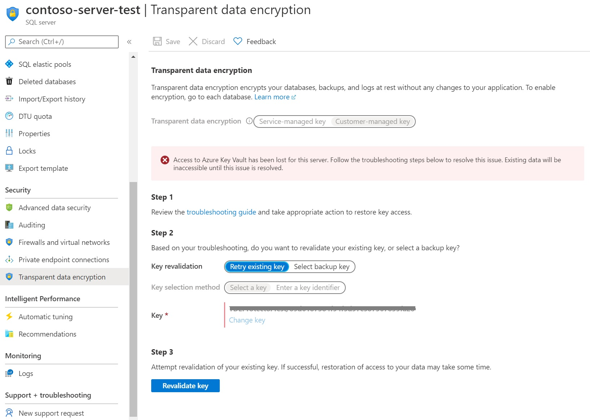
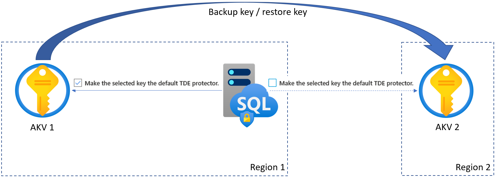
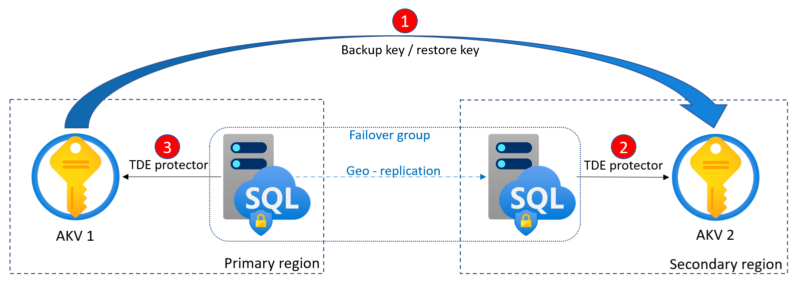

# Azure SQL Transparent Data Encryption with customer-managed key
[!INCLUDE[appliesto-sqldb-sqlmi-asa](../includes/appliesto-sqldb-sqlmi-asa.md)]

Azure SQL [Transparent Data Encryption (TDE)](/sql/relational-databases/security/encryption/transparent-data-encryption) with customer-managed key enables Bring Your Own Key (BYOK) scenario for data protection at rest, and allows organizations to implement separation of duties in the management of keys and data. With customer-managed transparent data encryption, customer is responsible for and in a full control of a key lifecycle management (key creation, upload, rotation, deletion), key usage permissions, and auditing of operations on keys.

In this scenario, the key used for encryption of the Database Encryption Key (DEK), called TDE protector, is a customer-managed asymmetric key stored in a customer-owned and customer-managed [Azure Key Vault (AKV)](../../key-vault/general/security-overview.md), a cloud-based external key management system. Key Vault is highly available and scalable secure storage for RSA cryptographic keys, optionally backed by FIPS 140-2 Level 2 validated hardware security modules (HSMs). It doesn't allow direct access to a stored key, but provides services of encryption/decryption using the key to the authorized entities. The key can be generated by the key vault, imported, or [transferred to the key vault from an on-prem HSM device](../../key-vault/keys/hsm-protected-keys.md).

For Azure SQL Database and Azure Synapse Analytics, the TDE protector is set at the server level and is inherited by all encrypted databases associated with that server. For Azure SQL Managed Instance, the TDE protector is set at the instance level and is inherited by all encrypted databases on that instance. The term *server* refers both to a server in SQL Database and Azure Synapse and to a managed instance in SQL Managed Instance throughout this document, unless stated differently.

> [!IMPORTANT]
> For those using service-managed TDE who would like to start using customer-managed TDE, data remains encrypted during the process of switching over, and there is no downtime nor re-encryption of the database files. Switching from a service-managed key to a customer-managed key only requires re-encryption of the DEK, which is a fast and online operation.

> [!NOTE]
>  To provide Azure SQL customers with two layers of encryption of data at rest, infrastructure encryption (using AES-256 encryption algorithm) with platform managed keys is being rolled out. This provides an addition layer of encryption at rest along with TDE with customer-managed keys, which is already available. For Azure SQL Database and Managed Instance, all databases, including the master database and other system databases, will be encrypted when infrastructure encryption is turned on. 
At this time, customers must request access to this capability. If you are interested in this capability, contact AzureSQLDoubleEncryptionAtRest@service.microsoft.com .

## Benefits of the customer-managed TDE

Customer-managed TDE provides the following benefits to the customer:

- Full and granular control over usage and management of the TDE protector;

- Transparency of the TDE protector usage;

- Ability to implement separation of duties in the management of keys and data within the organization;

- Key Vault administrator can revoke key access permissions to make encrypted database inaccessible;

- Central management of keys in AKV;

- Greater trust from your end customers, since AKV is designed such that Microsoft cannot see nor extract encryption keys;

## How customer-managed TDE works

For server to be able to use TDE protector stored in AKV for encryption of the DEK, key vault administrator needs to give the following access rights to the server using its unique Azure Active Directory (Azure AD) identity:

- **get** - for retrieving the public part and properties of the key in the Key Vault

- **wrapKey** - to be able to protect (encrypt) DEK

- **unwrapKey** - to be able to unprotect (decrypt) DEK

Key vault administrator can also [enable logging of key vault audit events](../../azure-monitor/insights/key-vault-insights-overview.md), so they can be audited later.

When server is configured to use a TDE protector from AKV, the server sends the DEK of each TDE-enabled database to the key vault for encryption. Key vault returns the encrypted DEK, which is then stored in the user database.

When needed, server sends protected DEK to the key vault for decryption.

Auditors can use Azure Monitor to review key vault AuditEvent logs, if logging is enabled.

[!INCLUDE [sql-database-akv-permission-delay](../includes/sql-database-akv-permission-delay.md)]

## Requirements for configuring customer-managed TDE

### Requirements for configuring AKV

- Key vault and SQL Database/managed instance must belong to the same Azure Active Directory tenant. Cross-tenant key vault and server interactions are not supported. To move resources afterwards, TDE with AKV will have to be reconfigured. Learn more about [moving resources](../../azure-resource-manager/management/move-resource-group-and-subscription.md).

- [Soft-delete](../../key-vault/general/soft-delete-overview.md) feature must be enabled on the key vault, to protect from data loss accidental key (or key vault) deletion happens. Soft-deleted resources are retained for 90 days, unless recovered or purged by the customer in the meantime. The *recover* and *purge* actions have their own permissions associated in a key vault access policy. Soft-delete feature is off by default and can be enabled via [PowerShell](../../key-vault/general/key-vault-recovery.md?tabs=azure-powershell) or [the CLI](../../key-vault/general/key-vault-recovery.md?tabs=azure-cli). It cannot be enabled via the Azure portal.  

- Grant the server or managed instance access to the key vault (get, wrapKey, unwrapKey) using its Azure Active Directory identity. When using the Azure portal, the Azure AD identity gets automatically created. When using PowerShell or the CLI, the Azure AD identity must be explicitly created and completion should be verified. See [Configure TDE with BYOK](transparent-data-encryption-byok-configure.md) and [Configure TDE with BYOK for SQL Managed Instance](../managed-instance/scripts/transparent-data-encryption-byok-powershell.md) for detailed step-by-step instructions when using PowerShell.

- When using firewall with AKV, you must enable option *Allow trusted Microsoft services to bypass the firewall*.

### Requirements for configuring TDE protector

- TDE protector can be only asymmetric, RSA or RSA HSM key. The supported key lengths are 2048 bytes and 3072 bytes.

- The key activation date (if set) must be a date and time in the past. Expiration date (if set) must be a future date and time.

- The key must be in the *Enabled* state.

- If you are importing existing key into the key vault, make sure to provide it in the supported file formats (`.pfx`, `.byok`, or `.backup`).

> [!NOTE]
> Azure SQL now supports using a RSA key stored in a Managed HSM as TDE Protector. This feature is in **public preview**. 
Azure Key Vault Managed HSM is a fully managed, highly available, single-tenant, standards-compliant cloud service that enables you to safeguard cryptographic keys for your cloud applications, using FIPS 140-2 Level 3 validated HSMs. Learn more about [Managed HSMs](../../key-vault/managed-hsm/index.yml).

## Recommendations when configuring customer-managed TDE

### Recommendations when configuring AKV

- Associate at most 500 General Purpose or 200 Business Critical databases in total with a key vault in a single subscription to ensure high availability when server accesses the TDE protector in the key vault. These figures are based on the experience and documented in the [key vault service limits](../../key-vault/general/service-limits.md). The intention here is to prevent issues after server failover, as it will trigger as many key operations against the vault as there are databases in that server.

- Set a resource lock on the key vault to control who can delete this critical resource and prevent accidental or unauthorized deletion. Learn more about [resource locks](../../azure-resource-manager/management/lock-resources.md).

- Enable auditing and reporting on all encryption keys: Key vault provides logs that are easy to inject into other security information and event management tools. Operations Management Suite [Log Analytics](../../azure-monitor/insights/key-vault-insights-overview.md) is one example of a service that is already integrated.

- Link each server with two key vaults that reside in different regions and hold the same key material, to ensure high availability of encrypted databases. Mark only the key from the key vault in the same region as a TDE protector. System will automatically switch to the key vault in the remote region if there is an outage affecting the key vault in the same region.

### Recommendations when configuring TDE protector

- Keep a copy of the TDE protector on a secure place or escrow it to the escrow service.

- If the key is generated in the key vault, create a key backup before using the key in AKV for the first time. Backup can be restored to an Azure Key Vault only. Learn more about the [Backup-AzKeyVaultKey](/powershell/module/az.keyvault/backup-azkeyvaultkey) command.

- Create a new backup whenever any changes are made to the key (for example, key attributes, tags, ACLs).

- **Keep previous versions** of the key in the key vault when rotating keys, so older database backups can be restored. When the TDE protector is changed for a database, old backups of the database **are not updated** to use the latest TDE protector. At restore time, each backup needs the TDE protector it was encrypted with at creation time. Key rotations can be performed following the instructions at [Rotate the Transparent Data Encryption Protector Using PowerShell](transparent-data-encryption-byok-key-rotation.md).

- Keep all previously used keys in AKV even after switching to service-managed keys. It ensures database backups can be restored with the TDE protectors stored in AKV.  TDE protectors created with Azure Key Vault have to be maintained until all remaining stored backups have been created with service-managed keys. Make recoverable backup copies of these keys using [Backup-AzKeyVaultKey](/powershell/module/az.keyvault/backup-azkeyvaultkey).

- To remove a potentially compromised key during a security incident without the risk of data loss, follow the steps from the [Remove a potentially compromised key](transparent-data-encryption-byok-remove-tde-protector.md).

## Inaccessible TDE protector

When transparent data encryption is configured to use a customer-managed key, continuous access to the TDE protector is required for the database to stay online. If the server loses access to the customer-managed TDE protector in AKV, in up to 10 minutes a database will start denying all connections with the corresponding error message and change its state to *Inaccessible*. The only action allowed on a database in the Inaccessible state is deleting it.

> [!NOTE]
> If the database is inaccessible due to an intermittent networking outage, there is no action required and the databases will come back online automatically.

After access to the key is restored, taking database back online requires extra time and steps, which may vary based on the time elapsed without access to the key and the size of the data in the database:

- If key access is restored within 8 hours, the database will autoheal within next hour.

- If key access is restored after more than 8 hours, autoheal is not possible and bringing back the database requires extra steps on the portal and can take a significant amount of time depending on the size of the database. Once the database is back online, previously configured server-level settings such as [failover group](auto-failover-group-overview.md) configuration, point-in-time-restore history, and tags **will be lost**. Therefore, it's recommended implementing a notification system that allows you to identify and address the underlying key access issues within 8 hours.

Below is a view of the extra steps required on the portal to bring an inaccessible database back online.

### Accidental TDE protector access revocation

It may happen that someone with sufficient access rights to the key vault accidentally disables server access to the key by:

- revoking the key vault's *get*, *wrapKey*, *unwrapKey* permissions from the server

- deleting the key

- deleting the key vault

- changing the key vault's firewall rules

- deleting the managed identity of the server in Azure Active Directory

Learn more about [the common causes for database to become inaccessible](/sql/relational-databases/security/encryption/troubleshoot-tde?view=azuresqldb-current&preserve-view=true#common-errors-causing-databases-to-become-inaccessible).

## Monitoring of the customer-managed TDE

To monitor database state and to enable alerting for loss of TDE protector access, configure the following Azure features:

- [Azure Resource Health](../../service-health/resource-health-overview.md). An inaccessible database that has lost access to the TDE protector will show as "Unavailable" after the first connection to the database has been denied.
- [Activity Log](../../service-health/alerts-activity-log-service-notifications-portal.md) when access to the TDE protector in the customer-managed key vault fails, entries are added to the activity log.  Creating alerts for these events will enable you to reinstate access as soon as possible.
- [Action Groups](../../azure-monitor/alerts/action-groups.md) can be defined to send you notifications and alerts based on your preferences, for example, Email/SMS/Push/Voice, Logic App, Webhook, ITSM, or Automation Runbook.

## Database backup and restore with customer-managed TDE

Once a database is encrypted with TDE using a key from Key Vault, any newly generated backups are also encrypted with the same TDE protector. When the TDE protector is changed, old backups of the database **are not updated** to use the latest TDE protector.

To restore a backup encrypted with a TDE protector from Key Vault, make sure that the key material is available to the target server. Therefore, we recommend that you keep all the old versions of the TDE protector in key vault, so database backups can be restored.

> [!IMPORTANT]
> At any moment there can be not more than one TDE protector set for a server. It's the key marked with "Make the key the default TDE protector" in the Azure portal blade. However, multiple additional keys can be linked to a server without marking them as a TDE protector. These keys are not used for protecting DEK, but can be used during restore from a backup, if backup file is encrypted with the key with the corresponding thumbprint.

If the key that is needed for restoring a backup is no longer available to the target server, the following error message is returned on the restore try:
"Target server `<Servername>` does not have access to all AKV URIs created between \<Timestamp #1> and \<Timestamp #2>. Retry operation after restoring all AKV URIs."

To mitigate it, run the [Get-AzSqlServerKeyVaultKey](/powershell/module/az.sql/get-azsqlserverkeyvaultkey) cmdlet for the target server or [Get-AzSqlInstanceKeyVaultKey](/powershell/module/az.sql/get-azsqlinstancekeyvaultkey) for the target managed instance to return the list of available keys and identify the missing ones. To ensure all backups can be restored, make sure the target server for the restore has access to all of keys needed. These keys don't need to be marked as TDE protector.

To learn more about backup recovery for SQL Database, see [Recover a database in SQL Database](recovery-using-backups.md). To learn more about backup recovery for dedicated SQL pool in Azure Synapse Analytics, see [Recover a dedicated SQL pool](../../synapse-analytics/sql-data-warehouse/backup-and-restore.md). For SQL Server's native backup/restore with SQL Managed Instance, see [Quickstart: Restore a database to SQL Managed Instance](../managed-instance/restore-sample-database-quickstart.md)

Additional consideration for log files: Backed up log files remain encrypted with the original TDE protector, even if it was rotated and the database is now using a new TDE protector.  At restore time, both keys will be needed to restore the database.  If the log file is using a TDE protector stored in Azure Key Vault, this key will be needed at restore time, even if the database has been changed to use service-managed TDE in the meantime.

## High availability with customer-managed TDE

Even in cases when there is no configured geo-redundancy for server, it is highly recommended to configure the server to use two different key vaults in two different regions with the same key material. The key in the secondary key vault in the other region should not be marked as TDE protector, and it's not even allowed. If there is an outage affecting the primary key vault, and only then, the system will automatically switch to the other linked key with the same thumbprint in the secondary key vault, if it exists. Note though that switch will not happen if TDE protector is inaccessible because of revoked access rights, or because key or key vault is deleted, as it may indicate that customer intentionally wanted to restrict server from accessing the key. Providing the same key material to two key vaults in different regions can be done by creating the key outside of the key vault, and importing them into both key vaults. 

Alternatively, it can be accomplished by generating key using the primary key vault colocated in the same region as the server and cloning the key into a key vault in a different Azure region. Use the [Backup-AzKeyVaultKey](/powershell/module/az.keyvault/Backup-AzKeyVaultKey) cmdlet to retrieve the key in encrypted format from the primary key vault and then use the [Restore-AzKeyVaultKey](/powershell/module/az.keyvault/restore-azkeyvaultkey) cmdlet and specify a key vault in the second region to clone the key. Alternatively, use the Azure portal to back up and restore the key. Key backup/restore operation is only allowed between key vaults within the same Azure subscription and [Azure geography](https://azure.microsoft.com/global-infrastructure/geographies/).  

## Geo-DR and customer-managed TDE

In both [active geo-replication](active-geo-replication-overview.md) and [failover groups](auto-failover-group-overview.md) scenarios, each server involved requires a separate key vault, that must be colocated with the server in the same Azure region. Customer is responsible for keeping the key material across the key vaults consistent, so that geo-secondary is in sync and can take over using the same key from its local key vault if primary becomes inaccessible due to an outage in the region and a failover is triggered. Up to four secondaries can be configured, and chaining (secondaries of secondaries) is not supported.

To avoid issues while establishing or during geo-replication due to incomplete key material, it's important to follow these rules when configuring customer-managed TDE:

- All key vaults involved must have same properties, and same access rights for respective servers.

- All key vaults involved must contain identical key material. It applies not just to the current TDE protector, but to the all previous TDE protectors that may be used in the backup files.

- Both initial setup and rotation of the TDE protector must be done on the secondary first, and then on primary.

To test a failover, follow the steps in [Active geo-replication overview](active-geo-replication-overview.md). Testing failover should be done regularly to validate that SQL Database has maintained access permission to both key vaults.

## Next steps

You may also want to check the following PowerShell sample scripts for the common operations with customer-managed TDE:

- [Rotate the Transparent Data Encryption Protector for SQL Database Using PowerShell](transparent-data-encryption-byok-key-rotation.md)

- [Remove a Transparent Data Encryption (TDE) protector for SQL Database using PowerShell](transparent-data-encryption-byok-remove-tde-protector.md)

- [Manage Transparent Data Encryption in SQL Managed Instance with your own key using PowerShell](../managed-instance/scripts/transparent-data-encryption-byok-powershell.md?toc=%2fpowershell%2fmodule%2ftoc.json)