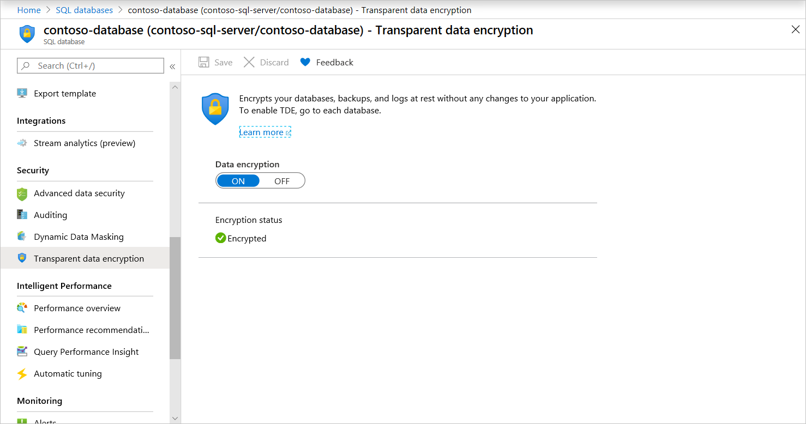
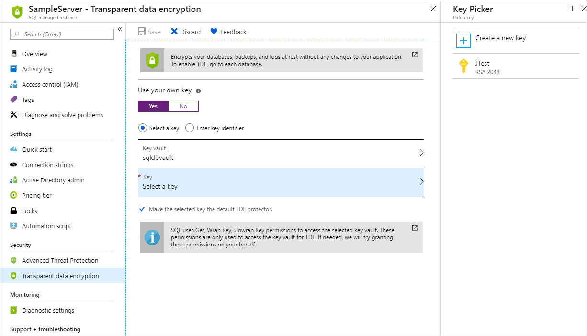

# Transparent data encryption for SQL Database, SQL Managed Instance, and Azure Synapse Analytics
[!INCLUDE[appliesto-sqldb-sqlmi-asa](../includes/appliesto-sqldb-sqlmi-asa.md)]

[Transparent data encryption (TDE)](/sql/relational-databases/security/encryption/transparent-data-encryption) helps protect Azure SQL Database, Azure SQL Managed Instance, and Azure Synapse Analytics against the threat of malicious offline activity by encrypting data at rest. It performs real-time encryption and decryption of the database, associated backups, and transaction log files at rest without requiring changes to the application. By default, TDE is enabled for all newly deployed SQL Databases and must be manually enabled for older databases of Azure SQL Database, Azure SQL Managed Instance. TDE must be manually enabled for Azure Synapse Analytics.

TDE performs real-time I/O encryption and decryption of the data at the page level. Each page is decrypted when it's read into memory and then encrypted before being written to disk. TDE encrypts the storage of an entire database by using a symmetric key called the Database Encryption Key (DEK). On database startup, the encrypted DEK is decrypted and then used for decryption and re-encryption of the database files in the SQL Server database engine process. DEK is protected by the TDE protector. TDE protector is either a service-managed certificate (service-managed transparent data encryption) or an asymmetric key stored in [Azure Key Vault](../../key-vault/general/security-features.md) (customer-managed transparent data encryption).

For Azure SQL Database and Azure Synapse, the TDE protector is set at the [server](logical-servers.md) level and is inherited by all databases associated with that server. For Azure SQL Managed Instance, the TDE protector is set at the instance level and it is inherited by all encrypted databases on that instance. The term *server* refers both to server and instance throughout this document, unless stated differently.

> [!IMPORTANT]
> All newly created databases in SQL Database are encrypted by default by using service-managed transparent data encryption. Existing SQL databases created before May 2017 and SQL databases created through restore, geo-replication, and database copy are not encrypted by default. Existing SQL Managed Instance databases created before February 2019 are not encrypted by default. SQL Managed Instance databases created through restore inherit encryption status from the source.

> [!NOTE]
> TDE cannot be used to encrypt system databases, such as the **master** database, in Azure SQL Database and Azure SQL Managed Instance. The **master** database contains objects that are needed to perform the TDE operations on the user databases. It is recommended to not store any sensitive data in the system databases. [Infrastructure encryption](transparent-data-encryption-byok-overview.md#doubleencryption) is now being rolled out which encrypts the system databases including master. 

## Service-managed transparent data encryption

In Azure, the default setting for TDE is that the DEK is protected by a built-in server certificate. The built-in server certificate is unique for each server and the encryption algorithm used is AES 256. If a database is in a geo-replication relationship, both the primary and geo-secondary databases are protected by the primary database's parent server key. If two databases are connected to the same server, they also share the same built-in certificate. Microsoft automatically rotates these certificates in compliance with the internal security policy and the root key is protected by a Microsoft internal secret store. Customers can verify SQL Database and SQL Managed Instance compliance with internal security policies in independent third-party audit reports available on the [Microsoft Trust Center](https://servicetrust.microsoft.com/).

Microsoft also seamlessly moves and manages the keys as needed for geo-replication and restores.

## Customer-managed transparent data encryption - Bring Your Own Key

Customer-managed TDE is also referred to as Bring Your Own Key (BYOK) support for TDE. In this scenario, the TDE Protector that encrypts the DEK is a customer-managed asymmetric key, which is stored in a customer-owned and managed Azure Key Vault (Azure's cloud-based external key management system) and never leaves the key vault. The TDE Protector can be [generated by the key vault or transferred to the key vault](../../key-vault/keys/hsm-protected-keys.md) from an on-premises hardware security module (HSM) device. SQL Database, SQL Managed Instance, and Azure Synapse need to be granted permissions to the customer-owned key vault to decrypt and encrypt the DEK. If permissions of the server to the key vault are revoked, a database will be inaccessible, and all data is encrypted

With TDE with Azure Key Vault integration, users can control key management tasks including key rotations, key vault permissions, key backups, and enable auditing/reporting on all TDE protectors using Azure Key Vault functionality. Key Vault provides central key management, leverages tightly monitored HSMs, and enables separation of duties between management of keys and data to help meet compliance with security policies.
To learn more about BYOK for Azure SQL Database and Azure Synapse, see [Transparent data encryption with Azure Key Vault integration](transparent-data-encryption-byok-overview.md).

To start using TDE with Azure Key Vault integration, see the how-to guide [Turn on transparent data encryption by using your own key from Key Vault](transparent-data-encryption-byok-configure.md).

## Move a transparent data encryption-protected database

You don't need to decrypt databases for operations within Azure. The TDE settings on the source database or primary database are transparently inherited on the target. Operations that are included involve:

- Geo-restore
- Self-service point-in-time restore
- Restoration of a deleted database
- Active geo-replication
- Creation of a database copy
- Restore of backup file to Azure SQL Managed Instance

> [!IMPORTANT]
> Taking manual COPY-ONLY backup of a database encrypted by service-managed TDE is not supported in Azure SQL Managed Instance, since the certificate used for encryption is not accessible. Use point-in-time-restore feature to move this type of database to another SQL Managed Instance, or switch to customer-managed key.

When you export a TDE-protected database, the exported content of the database isn't encrypted. This exported content is stored in unencrypted BACPAC files. Be sure to protect the BACPAC files appropriately and enable TDE after import of the new database is finished.

For example, if the BACPAC file is exported from a SQL Server instance, the imported content of the new database isn't automatically encrypted. Likewise, if the BACPAC file is imported to a SQL Server instance, the new database also isn't automatically encrypted.

The one exception is when you export a database to and from SQL Database. TDE is enabled on the new database, but the BACPAC file itself still isn't encrypted.

## Manage transparent data encryption

# [The Azure portal](#tab/azure-portal)

Manage TDE in the Azure portal.

To configure TDE through the Azure portal, you must be connected as the Azure Owner, Contributor, or SQL Security Manager.

Enable and disable TDE on the database level. For Azure SQL Managed Instance use Transact-SQL (T-SQL) to turn TDE on and off on a database. For Azure SQL Database and Azure Synapse, you can manage TDE for the database in the [Azure portal](https://portal.azure.com) after you've signed in with the Azure Administrator or Contributor account. Find the TDE settings under your user database. By default, service-managed transparent data encryption is used. A TDE certificate is automatically generated for the server that contains the database.

  

You set the TDE master key, known as the TDE protector, at the server or instance level. To use TDE with BYOK support and protect your databases with a key from Key Vault, open the TDE settings under your server.

# [PowerShell](#tab/azure-powershell)

Manage TDE by using PowerShell.

[!INCLUDE [updated-for-az](../../../includes/updated-for-az.md)]
> [!IMPORTANT]
> The PowerShell Azure Resource Manager module is still supported, but all future development is for the Az.Sql module. For these cmdlets, see [AzureRM.Sql](/powershell/module/AzureRM.Sql/). The arguments for the commands in the Az module and in the AzureRm modules are substantially identical.

To configure TDE through PowerShell, you must be connected as the Azure Owner, Contributor, or SQL Security Manager.

### Cmdlets for Azure SQL Database and Azure Synapse

Use the following cmdlets for Azure SQL Database and Azure Synapse:

| Cmdlet | Description |
| --- | --- |
| [Set-AzSqlDatabaseTransparentDataEncryption](/powershell/module/az.sql/set-azsqldatabasetransparentdataencryption) |Enables or disables transparent data encryption for a database.|
| [Get-AzSqlDatabaseTransparentDataEncryption](/powershell/module/az.sql/get-azsqldatabasetransparentdataencryption) |Gets the transparent data encryption state for a database. |
| [Get-AzSqlDatabaseTransparentDataEncryptionActivity](/powershell/module/az.sql/get-azsqldatabasetransparentdataencryptionactivity) |Checks the encryption progress for a database. |
| [Add-AzSqlServerKeyVaultKey](/powershell/module/az.sql/add-azsqlserverkeyvaultkey) |Adds a Key Vault key to a server. |
| [Get-AzSqlServerKeyVaultKey](/powershell/module/az.sql/get-azsqlserverkeyvaultkey) |Gets the Key Vault keys for a server  |
| [Set-AzSqlServerTransparentDataEncryptionProtector](/powershell/module/az.sql/set-azsqlservertransparentdataencryptionprotector) |Sets the transparent data encryption protector for a server. |
| [Get-AzSqlServerTransparentDataEncryptionProtector](/powershell/module/az.sql/get-azsqlservertransparentdataencryptionprotector) |Gets the transparent data encryption protector |
| [Remove-AzSqlServerKeyVaultKey](/powershell/module/az.sql/remove-azsqlserverkeyvaultkey) |Removes a Key Vault key from a server. |
|  | |

> [!IMPORTANT]
> For Azure SQL Managed Instance, use the T-SQL [ALTER DATABASE](/sql/t-sql/statements/alter-database-azure-sql-database) command to turn TDE on and off on a database level, and check [sample PowerShell script](transparent-data-encryption-byok-configure.md) to manage TDE on an instance level.

# [Transact-SQL](#tab/azure-TransactSQL)

Manage TDE by using Transact-SQL.

Connect to the database by using a login that is an administrator or member of the **dbmanager** role in the master database.

| Command | Description |
| --- | --- |
| [ALTER DATABASE (Azure SQL Database)](/sql/t-sql/statements/alter-database-azure-sql-database) | SET ENCRYPTION ON/OFF encrypts or decrypts a database |
| [sys.dm_database_encryption_keys](/sql/relational-databases/system-dynamic-management-views/sys-dm-database-encryption-keys-transact-sql) |Returns information about the encryption state of a database and its associated database encryption keys |
| [sys.dm_pdw_nodes_database_encryption_keys](/sql/relational-databases/system-dynamic-management-views/sys-dm-pdw-nodes-database-encryption-keys-transact-sql) |Returns information about the encryption state of each Azure Synapse node and its associated database encryption keys |
|  | |

You can't switch the TDE protector to a key from Key Vault by using Transact-SQL. Use PowerShell or the Azure portal.

# [REST API](#tab/azure-RESTAPI)

Manage TDE by using the REST API.

To configure TDE through the REST API, you must be connected as the Azure Owner, Contributor, or SQL Security Manager.
Use the following set of commands for Azure SQL Database and Azure Synapse:

| Command | Description |
| --- | --- |
|[Create Or Update Server](/rest/api/sql/servers/createorupdate)|Adds an Azure Active Directory identity to a server. (used to grant access to Key Vault)|
|[Create Or Update Server Key](/rest/api/sql/serverkeys/createorupdate)|Adds a Key Vault key to a server.|
|[Delete Server Key](/rest/api/sql/serverkeys/delete)|Removes a Key Vault key from a server. |
|[Get Server Keys](/rest/api/sql/serverkeys/get)|Gets a specific Key Vault key from a server.|
|[List Server Keys By Server](/rest/api/sql/serverkeys/listbyserver)|Gets the Key Vault keys for a server. |
|[Create Or Update Encryption Protector](/rest/api/sql/encryptionprotectors/createorupdate)|Sets the TDE protector for a server.|
|[Get Encryption Protector](/rest/api/sql/encryptionprotectors/get)|Gets the TDE protector for a server.|
|[List Encryption Protectors By Server](/rest/api/sql/encryptionprotectors/listbyserver)|Gets the TDE protectors for a server. |
|[Create Or Update Transparent Data Encryption Configuration](/rest/api/sql/transparentdataencryptions/createorupdate)|Enables or disables TDE for a database.|
|[Get Transparent Data Encryption Configuration](/rest/api/sql/transparentdataencryptions/get)|Gets the TDE configuration for a database.|
|[List Transparent Data Encryption Configuration Results](/rest/api/sql/transparentdataencryptionactivities/listbyconfiguration)|Gets the encryption result for a database.|

## See Also

- SQL Server running on an Azure virtual machine also can use an asymmetric key from Key Vault. The configuration steps are different from using an asymmetric key in SQL Database and SQL Managed Instance. For more information, see [Extensible key management by using Azure Key Vault (SQL Server)](/sql/relational-databases/security/encryption/extensible-key-management-using-azure-key-vault-sql-server).
- For a general description of TDE, see [Transparent data encryption](/sql/relational-databases/security/encryption/transparent-data-encryption).
- To learn more about TDE with BYOK support for Azure SQL Database, Azure SQL Managed Instance and Azure Synapse, see [Transparent data encryption with Bring Your Own Key support](transparent-data-encryption-byok-overview.md).
- To start using TDE with Bring Your Own Key support, see the how-to guide, [Turn on transparent data encryption by using your own key from Key Vault](transparent-data-encryption-byok-configure.md).
- For more information about Key Vault, see [Secure access to a key vault](../../key-vault/general/security-features.md).