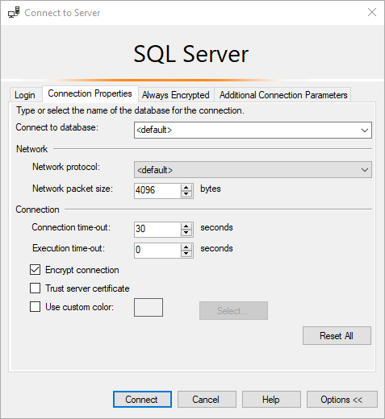

# Troubleshooting connectivity issues and other errors with Azure SQL Database and Azure SQL Managed Instance
[!INCLUDE[appliesto-sqldb-sqlmi](../includes/appliesto-sqldb-sqlmi.md)]

You receive error messages when the connection to Azure SQL Database or Azure SQL Managed Instance fails. These connection problems can be caused by reconfiguration, firewall settings, a connection timeout, incorrect login information, or failure to apply best practices and design guidelines during the [application design](develop-overview.md) process. Additionally, if the maximum limit on some Azure SQL Database or SQL Managed Instance resources is reached, you can no longer connect.

## Transient fault error messages (40197, 40613 and others)

The Azure infrastructure has the ability to dynamically reconfigure servers when heavy workloads arise in the SQL Database service.  This dynamic behavior might cause your client program to lose its connection to the database or instance. This kind of error condition is called a *transient fault*. Database reconfiguration events occur because of a planned event (for example, a software upgrade) or an unplanned event (for example, a process crash, or load balancing). Most reconfiguration events are generally short-lived and should be completed in less than 60 seconds at most. However, these events can occasionally take longer to finish, such as when a large transaction causes a long-running recovery. The following table lists various transient errors that applications can receive when connecting to Azure SQL Database.

### List of transient fault error codes

| Error code | Severity | Description |
| ---:| ---:|:--- |
| 926 |14 |Database 'replicatedmaster' cannot be opened. It has been marked SUSPECT by recovery. See the SQL Server errorlog for more information.<br/><br/>This error may be logged on SQL Managed Instance errorlog, for a short period of time, during the last stage of a reconfiguration, while the old primary is shutting down its log.<br/>Other, non-transient scenarios involving this error message are described in the [MSSQL Errors documentation](/sql/relational-databases/errors-events/mssqlserver-926-database-engine-error).|
| 4060 |16 |Cannot open database "%.&#x2a;ls" requested by the login. The login failed. For more information, see [Errors 4000 to 4999](/sql/relational-databases/errors-events/database-engine-events-and-errors#errors-4000-to-4999)|
| 40197 |17 |The service has encountered an error processing your request. Please try again. Error code %d.<br/><br/>You receive this error when the service is down due to software or hardware upgrades, hardware failures, or any other failover problems. The error code (%d) embedded within the message of error 40197 provides additional information about the kind of failure or failover that occurred. Some examples of the error codes are embedded within the message of error 40197 are 40020, 40143, 40166, and 40540.<br/><br/>Reconnecting automatically connects you to a healthy copy of your database. Your application must catch error 40197, log the embedded error code (%d) within the message for troubleshooting, and try reconnecting to SQL Database until the resources are available, and your connection is established again. For more information, see [Transient errors](troubleshoot-common-connectivity-issues.md#transient-errors-transient-faults).|
| 40501 |20 |The service is currently busy. Retry the request after 10 seconds. Incident ID: %ls. Code: %d. For more information, see: <br/>&bull; &nbsp;[Logical SQL server resource limits](resource-limits-logical-server.md)<br/>&bull; &nbsp;[DTU-based limits for single databases](service-tiers-dtu.md)<br/>&bull; &nbsp;[DTU-based limits for elastic pools](resource-limits-dtu-elastic-pools.md)<br/>&bull; &nbsp;[vCore-based limits for single databases](resource-limits-vcore-single-databases.md)<br/>&bull; &nbsp;[vCore-based limits for elastic pools](resource-limits-vcore-elastic-pools.md)<br/>&bull; &nbsp;[Azure SQL Managed Instance resource limits](../managed-instance/resource-limits.md).|
| 40613 |17 |Database '%.&#x2a;ls' on server '%.&#x2a;ls' is not currently available. Please retry the connection later. If the problem persists, contact customer support, and provide them the session tracing ID of '%.&#x2a;ls'.<br/><br/> This error may occur if there is already an existing dedicated administrator connection (DAC) established to the database. For more information, see [Transient errors](troubleshoot-common-connectivity-issues.md#transient-errors-transient-faults).|
| 49918 |16 |Cannot process request. Not enough resources to process request.<br/><br/>The service is currently busy. Please retry the request later. For more information, see: <br/>&bull; &nbsp;[Logical SQL server resource limits](resource-limits-logical-server.md)<br/>&bull; &nbsp;[DTU-based limits for single databases](service-tiers-dtu.md)<br/>&bull; &nbsp;[DTU-based limits for elastic pools](resource-limits-dtu-elastic-pools.md)<br/>&bull; &nbsp;[vCore-based limits for single databases](resource-limits-vcore-single-databases.md)<br/>&bull; &nbsp;[vCore-based limits for elastic pools](resource-limits-vcore-elastic-pools.md)<br/>&bull; &nbsp;[Azure SQL Managed Instance resource limits](../managed-instance/resource-limits.md). |
| 49919 |16 |Cannot process create or update request. Too many create or update operations in progress for subscription "%ld".<br/><br/>The service is busy processing multiple create or update requests for your subscription or server. Requests are currently blocked for resource optimization. Query [sys.dm_operation_status](/sql/relational-databases/system-dynamic-management-views/sys-dm-operation-status-azure-sql-database) for pending operations. Wait until pending create or update requests are complete or delete one of your pending requests and retry your request later. For more information, see: <br/>&bull; &nbsp;[Logical SQL server resource limits](resource-limits-logical-server.md)<br/>&bull; &nbsp;[DTU-based limits for single databases](service-tiers-dtu.md)<br/>&bull; &nbsp;[DTU-based limits for elastic pools](resource-limits-dtu-elastic-pools.md)<br/>&bull; &nbsp;[vCore-based limits for single databases](resource-limits-vcore-single-databases.md)<br/>&bull; &nbsp;[vCore-based limits for elastic pools](resource-limits-vcore-elastic-pools.md)<br/>&bull; &nbsp;[Azure SQL Managed Instance resource limits](../managed-instance/resource-limits.md). |
| 49920 |16 |Cannot process request. Too many operations in progress for subscription "%ld".<br/><br/>The service is busy processing multiple requests for this subscription. Requests are currently blocked for resource optimization. Query [sys.dm_operation_status](/sql/relational-databases/system-dynamic-management-views/sys-dm-operation-status-azure-sql-database) for operation status. Wait until pending requests are complete or delete one of your pending requests and retry your request later. For more information, see: <br/>&bull; &nbsp;[Logical SQL server resource limits](resource-limits-logical-server.md)<br/>&bull; &nbsp;[DTU-based limits for single databases](service-tiers-dtu.md)<br/>&bull; &nbsp;[DTU-based limits for elastic pools](resource-limits-dtu-elastic-pools.md)<br/>&bull; &nbsp;[vCore-based limits for single databases](resource-limits-vcore-single-databases.md)<br/>&bull; &nbsp;[vCore-based limits for elastic pools](resource-limits-vcore-elastic-pools.md)<br/>&bull; &nbsp;[Azure SQL Managed Instance resource limits](../managed-instance/resource-limits.md). |
| 4221 |16 |Login to read-secondary failed due to long wait on 'HADR_DATABASE_WAIT_FOR_TRANSITION_TO_VERSIONING'. The replica is not available for login because row versions are missing for transactions that were in-flight when the replica was recycled. The issue can be resolved by rolling back or committing the active transactions on the primary replica. Occurrences of this condition can be minimized by avoiding long write transactions on the primary. |
| 615 | 21 | Could not find database ID %d, name  '%.&#x2a;ls' .  Error Code 615.   <br/> This means in-memory cache is not in-sync with SQL server instance and lookups are retrieving stale database ID. <br/> <br/>SQL logins use in-memory cache to get the database name to ID mapping. The cache should be in sync with backend database and updated whenever attach and detach of database to/from the SQL server instance occurs. <br/>You receive this error when detach workflow fail to clean-up the in-memory cache on time  and subsequent lookups to the database point to stale database ID. <br/><br/>Try reconnecting to SQL Database until the resource are available, and the connection is established again.  For more information, see  [Transient errors](troubleshoot-common-connectivity-issues.md#transient-errors-transient-faults).|

### Steps to resolve transient connectivity issues

1. Check the [Microsoft Azure Service Dashboard](https://azure.microsoft.com/status) for any known outages that occurred during the time during which the errors were reported by the application.
2. Applications that connect to a cloud service such as Azure SQL Database should expect periodic reconfiguration events and implement retry logic to handle these errors instead of surfacing application errors to users.
3. As a database approaches its resource limits, it can seem to be a transient connectivity issue. See [Resource limits](resource-limits-logical-server.md#what-happens-when-resource-limits-are-reached).
4. If connectivity problems continue, or if the duration for which your application encounters the error exceeds 60 seconds or if you see multiple occurrences of the error in a given day, file an Azure support request by selecting **Get Support** on the [Azure Support](https://azure.microsoft.com/support/options) site.

#### Implementing Retry Logic

It is strongly recommended that your client program has retry logic so that it could reestablish a connection after giving the transient fault time to correct itself.  We recommend that you delay for 5 seconds before your first retry. Retrying after a delay shorter than 5-seconds risks overwhelming the cloud service. For each subsequent retry the delay should grow exponentially, up to a maximum of 60 seconds.

For code examples of retry logic, see:

- [Connect resiliently to SQL with ADO.NET](/sql/connect/ado-net/step-4-connect-resiliently-sql-ado-net)
- [Connect resiliently to SQL with PHP](/sql/connect/php/step-4-connect-resiliently-to-sql-with-php)

For additional information on handling transient errors in your application review [Troubleshooting transient connection errors to SQL Database](troubleshoot-common-connectivity-issues.md)

A discussion of the *blocking period* for clients that use ADO.NET is available in [Connection Pooling (ADO.NET)](/dotnet/framework/data/adonet/sql-server-connection-pooling).

## A network-related or instance-specific error occurred while establishing a connection to your server

The issue occurs if the application can't connect to the server.

To resolve this issue, try the steps (in the order presented) in the [Steps to fix common connection issues](#steps-to-fix-common-connection-issues) section.

## The server/instance was not found or was not accessible (errors 26, 40, 10053)

### Error 26: Error Locating server specified

`System.Data.SqlClient.SqlException: A network-related or instance-specific error occurred while establishing a connection to SQL Server. The server was not found or was not accessible. Verify that the instance name is correct and that SQL Server is configured to allow remote connections.(provider: SQL Network Interfaces, error: 26 – Error Locating Server/Instance Specified)`

#### Error 40: Could not open a connection to the server

`A network-related or instance-specific error occurred while establishing a connection to SQL Server. The server was not found or was not accessible. Verify that the instance name is correct and that SQL Server is configured to allow remote connections. (provider: Named Pipes Provider, error: 40 - Could not open a connection to SQL Server)`

#### Error 10053: A transport-level error has occurred when receiving results from the server

`10053: A transport-level error has occurred when receiving results from the server. (Provider: TCP Provider, error: 0 - An established connection was aborted by the software in your host machine)`

These issues occur if the application can't connect to the server.

To resolve these issues, try the steps (in the order presented) in the [Steps to fix common connection issues](#steps-to-fix-common-connection-issues) section.

## Cannot connect to server due to firewall issues

### Error 40615: Cannot connect to < servername >

To resolve this issue, [configure firewall settings on SQL Database through the Azure portal](firewall-configure.md).

### Error 5: Cannot connect to < servername >

To resolve this issue, make sure that port 1433 is open for outbound connections on all firewalls between the client and the internet.

## Unable to log in to the server (errors 18456, 40531)

### Login failed for user '< User name >'

`Login failed for user '<User name>'.This session has been assigned a tracing ID of '<Tracing ID>'. Provide this tracing ID to customer support when you need assistance. (Microsoft SQL Server, Error: 18456)`

To resolve this issue, contact your service administrator to provide you with a valid user name and password.

Typically, the service administrator can use the following steps to add the login credentials:

1. Log in to the server by using SQL Server Management Studio (SSMS).
2. Run the following SQL query in the `master` database to check whether the login name is disabled:

   ```sql
   SELECT name, is_disabled FROM sys.sql_logins;
   ```

3. If the corresponding name is disabled, enable it by using the following statement:

   ```sql
   ALTER LOGIN <User name> ENABLE;
   ```

4. If the SQL login user name doesn't exist, edit and run the following SQL query to create a new SQL login:

   ```sql
   CREATE LOGIN <SQL_login_name, sysname, login_name>
   WITH PASSWORD = '<password, sysname, Change_Password>';
   GO
   ```

5. In SSMS Object Explorer, expand **Databases**.
6. Select the database that you want to grant the user permission to.
7. Right-click **Security**, and then select **New**, **User**.
8. In the generated script with placeholders (sample shown below), replace template parameters by following the steps [here](/sql/ssms/template/replace-template-parameters) and execute it:

   ```sql
   CREATE USER [<user_name, sysname, user_name>]
   FOR LOGIN [<login_name, sysname, login_name>]
   WITH DEFAULT_SCHEMA = [<default_schema, sysname, dbo>];
   GO

   -- Add user to the database owner role
   EXEC sp_addrolemember N'db_owner', N'<user_name, sysname, user_name>';
   GO
   ```

   You can also use `sp_addrolemember` to map specific users to specific database roles.

   > [!NOTE]
   > In Azure SQL Database, consider the newer [ALTER ROLE](/sql/t-sql/statements/alter-role-transact-sql) syntax for managing database role membership.  

For more information, see [Managing databases and logins in Azure SQL Database](./logins-create-manage.md).

## Connection timeout expired errors

### System.Data.SqlClient.SqlException (0x80131904): Connection Timeout Expired

`System.Data.SqlClient.SqlException (0x80131904): Connection Timeout Expired. The timeout period elapsed while attempting to consume the pre-login handshake acknowledgement. This could be because the pre-login handshake failed or the server was unable to respond back in time. The duration spent while attempting to connect to this server was - [Pre-Login] initialization=3; handshake=29995;`

### System.Data.SqlClient.SqlException (0x80131904): Timeout expired

`System.Data.SqlClient.SqlException (0x80131904): Timeout expired. The timeout period elapsed prior to completion of the operation or the server is not responding.`

### System.Data.Entity.Core.EntityException: The underlying provider failed on Open

`System.Data.Entity.Core.EntityException: The underlying provider failed on Open. -> System.Data.SqlClient.SqlException: Timeout expired. The timeout period elapsed prior to completion of the operation or the server is not responding. -> System.ComponentModel.Win32Exception: The wait operation timed out`

### Cannot connect to < server name >

`Cannot connect to <server name>.ADDITIONAL INFORMATION:Connection Timeout Expired. The timeout period elapsed during the post-login phase. The connection could have timed out while waiting for server to complete the login process and respond; Or it could have timed out while attempting to create multiple active connections. The duration spent while attempting to connect to this server was - [Pre-Login] initialization=231; handshake=983; [Login] initialization=0; authentication=0; [Post-Login] complete=13000; (Microsoft SQL Server, Error: -2) For help, click: http://go.microsoft.com/fwlink?ProdName=Microsoft%20SQL%20Server&EvtSrc=MSSQLServer&EvtID=-2&LinkId=20476 The wait operation timed out`

These exceptions can occur either because of connection or query issues. To confirm that this error is caused by connectivity issues, see [Confirm whether an error is caused by a connectivity issue](#confirm-whether-an-error-is-caused-by-a-connectivity-issue).

Connection timeouts occur because the application can't connect to the server. To resolve this issue, try the steps (in the order presented) in the [Steps to fix common connection issues](#steps-to-fix-common-connection-issues) section.

## Resource governance errors

Azure SQL Database uses a resource governance implementation based on [Resource Governor](/sql/relational-databases/resource-governor/resource-governor) to enforce resource limits. Learn more about [resource management in Azure SQL Database](resource-limits-logical-server.md).

The most common resource governance errors are listed first with details, followed by a table of resource governance error messages.

### Error 10928: Resource ID : 1. The request limit for the database is *%d* and has been reached.

The detailed error message in this case reads: `Resource ID : 1. The request limit for the database is %d and has been reached. See 'http://go.microsoft.com/fwlink/?LinkId=267637' for assistance.`

This error message indicates that the worker limit for Azure SQL Database has been reached. A value will be present instead of the placeholder *%d*. This value indicates the worker limit for your database at the time the limit was reached.

> [!NOTE]
> The initial offering of Azure SQL Database supported only single threaded queries. At that time, the number of requests was always equivalent to the number of workers. Error message 10928 in Azure SQL Database contains the wording "The request limit for the database is *N* and has been reached" for backwards compatibility purposes. The limit reached is actually the number of workers. If your max degree of parallelism (MAXDOP) setting is equal to zero or is greater than one, the number of workers may be much higher than the number of requests, and the limit may be reached much sooner than when MAXDOP is equal to one.
> 
> Learn more about [Sessions, workers, and requests](resource-limits-logical-server.md#sessions-workers-and-requests).

#### Connect with the Dedicated Admin Connection (DAC) if needed

If a live incident is ongoing where the worker limit has been approached or reached, you may receive Error 10928 when you connect using [SQL Server Management Studio](/sql/ssms/download-sql-server-management-studio-ssms) (SSMS) or [Azure Data Studio](/sql/azure-data-studio/what-is). One session can connect using the [Diagnostic Connection for Database Administrators (DAC)](/sql/database-engine/configure-windows/diagnostic-connection-for-database-administrators#connecting-with-dac) even when the maximum worker threshold has been reached.

To establish a connection with the DAC from SSMS:

- From the menu, select **File > New > Database Engine Query**
- From the connection dialog box in the Server Name field, enter `admin:<fully_qualified_server_name>` (this will be something like `admin:servername.database.windows.net`).
- Select **Options >>**
- Select the **Connection Properties** tab
- In the **Connect to database:** box, type the name of your database
- Select **Connect**.

If you receive Error 40613, `Database '%.&#x2a;ls' on server '%.&#x2a;ls' is not currently available. Please retry the connection later. If the problem persists, contact customer support, and provide them the session tracing ID of '%.&#x2a;ls'`, this may indicate that another session is already connected to the DAC. Only one session may connect to the DAC for a single database or an elastic pool at a time.

If you encounter the error 'Failed to connect to server' after selecting **Connect**, the DAC session may still have been established successfully if you are using a version of [SSMS prior to 18.9](/sql/ssms/release-notes-ssms#bug-fixes-in-189). Early versions of SSMS attempted to provide Intellisense for connections to the DAC. This failed, as the DAC supports only a single worker and Intellisense requires a separate worker. 

You cannot use a DAC connection with Object Explorer.

#### Review your max_worker_percent usage

To find resource consumption statistics for your database for 14 days, query the [sys.resource_stats](/sql/relational-databases/system-catalog-views/sys-resource-stats-azure-sql-database) system catalog view. The `max_worker_percent` column shows the percentage of workers used relative to the worker limit for your database. Connect to the master database on your [logical server](logical-servers.md) to query `sys.resource_stats`.

```sql
SELECT start_time, end_time, database_name, sku, avg_cpu_percent, max_worker_percent, max_session_percent 
FROM sys.resource_stats;
```

You can also query resource consumption statistics from the last hour from the
[sys.dm_db_resource_stats](/sql/relational-databases/system-dynamic-management-views/sys-dm-db-resource-stats-azure-sql-database) dynamic management view. Connect directly to your database to query `sys.dm_db_resource_stats`.

```sql
SELECT end_time, avg_cpu_percent, max_worker_percent, max_session_percent
FROM sys.dm_db_resource_stats;
```
#### Lower worker usage when possible

Blocking chains can cause a sudden surge in the number of workers in a database. A large volume of concurrent parallel queries may cause a high number of workers. Increasing your [max degree of parallelism (MAXDOP](configure-max-degree-of-parallelism.md)) or setting MAXDOP to zero can increase the number of active workers.

Triage an incident with insufficient workers by following these steps:

1. Investigate if blocking is occurring or if you can identify a large volume of concurrent workers. Run the following query to examine current requests and check for blocking when your database is returning Error 10928. You may need to [connect with the Dedicated Admin Connection (DAC)](#connect-with-the-dedicated-admin-connection-dac-if-needed) to execute the query.
    
    ```sql
    SELECT
        r.session_id, r.request_id, r.blocking_session_id, r.start_time, 
        r.status, r.command, DB_NAME(r.database_id) AS database_name,
        (SELECT COUNT(*) 
            FROM sys.dm_os_tasks AS t 
            WHERE t.session_id=r.session_id and t.request_id=r.request_id) AS worker_count,
        i.parameters, i.event_info AS input_buffer,
        r.last_wait_type, r.open_transaction_count, r.total_elapsed_time, r.cpu_time,
        r.logical_reads, r.writes, s.login_time, s.login_name, s.program_name, s.host_name
    FROM sys.dm_exec_requests as r
    JOIN sys.dm_exec_sessions as s on r.session_id=s.session_id
    OUTER APPLY sys.dm_exec_input_buffer (r.session_id,r.request_id) AS i
    WHERE s.is_user_process=1;
    GO
    ```
    1. Look for rows with a `blocking_session_id` to identify blocked sessions. Find each `blocking_session_id` in the list to determine if that session is also blocked. This will eventually lead you to the head blocker. Tune the head blocker query.

       > [!NOTE]
       > For more thorough information on troubleshooting long running or blocking queries, see [Understand and resolve Azure SQL Database blocking problems](understand-resolve-blocking.md).
    
    1. To identify a large volume of concurrent workers, review the number of requests overall and the `worker_count` column for each request. `Worker_count` is the number of workers at the time sampled and may change over time as the request is executed. Tune queries to reduce resource utilization if the cause of increased workers is concurrent queries that are running at their optimal degree of parallelism. For more information, see [Query Tuning/Hinting](performance-guidance.md#query-tuning-and-hinting).

1. Evaluate the [maximum degree of parallelism (MAXDOP)](configure-max-degree-of-parallelism.md) setting for the database.

#### Increase worker limits

If the database consistently reaches its limit despite addressing blocking, optimizing queries, and validating your MAXDOP setting, consider adding more resources to the database to increase the worker limit.

Find resource limits for Azure SQL Database by service tier and compute size:

- [Resource limits for single databases using the vCore purchasing model](resource-limits-vcore-single-databases.md)
- [Resource limits for elastic pools using the vCore purchasing model](resource-limits-vcore-elastic-pools.md)
- [Resource limits for single databases using the DTU purchasing model](resource-limits-dtu-single-databases.md)
- [Resources limits for elastic pools using the DTU purchasing model](resource-limits-dtu-elastic-pools.md)

Learn more about [Azure SQL Database resource governance of workers](./resource-limits-logical-server.md#sessions-workers-and-requests).

### Error 10929: Resource ID: 1

`10929: Resource ID: 1. The %s minimum guarantee is %d, maximum limit is %d and the current usage for the database is %d. However, the server is currently too busy to support requests greater than %d for this database. See http://go.microsoft.com/fwlink/?LinkId=267637 for assistance. Otherwise, please try again later.`

### Error 40501: The service is currently busy

`40501: The service is currently busy. Retry the request after 10 seconds. Incident ID: %ls. Code: %d.`

This is an engine throttling error, an indication that resource limits are being exceeded.

For more information about resource limits, see [Logical SQL server resource limits](./resource-limits-logical-server.md).

### Error 40544: The database has reached its size quota

`40544: The database has reached its size quota. Partition or delete data, drop indexes, or consult the documentation for possible resolutions. Incident ID: <ID>. Code: <code>.`

This error occurs when the database has reached its size quota.

The following steps can either help you work around the problem or provide you with more options:

1. Check the current size of the database by using the dashboard in the Azure portal.

   > [!NOTE]
   > To identify which tables are consuming the most space and are therefore potential candidates for cleanup, run the following SQL query:

   ```sql
   SELECT o.name,
    SUM(p.row_count) AS 'Row Count',
    SUM(p.reserved_page_count) * 8.0 / 1024 AS 'Table Size (MB)'
   FROM sys.objects o
   JOIN sys.dm_db_partition_stats p on p.object_id = o.object_id
   GROUP BY o.name
   ORDER BY [Table Size (MB)] DESC;
   GO
   ```

2. If the current size does not exceed the maximum size supported for your edition, you can use ALTER DATABASE to increase the MAXSIZE setting.
3. If the database is already past the maximum supported size for your edition, try one or more of the following steps:

   - Perform normal database cleanup activities. For example, clean up the unwanted data by using truncate/delete, or move data out by using SQL Server Integration Services (SSIS) or the bulk copy program (bcp) utility.
   - Partition or delete data, drop indexes, or consult the documentation for possible resolutions.
   - For database scaling, see [Scale single database resources](./single-database-scale.md) and [Scale elastic pool resources](./elastic-pool-scale.md).

### Error 40549: Session is terminated because you have a long-running transaction

`40549: Session is terminated because you have a long-running transaction. Try shortening your transaction.`

If you repeatedly encounter this error, try to resolve the issue by following these steps:

1. Run the following query to see any open sessions that have a high value for the `duration_ms` column:

    ```sql
    SELECT
        r.start_time, DATEDIFF(ms,start_time, SYSDATETIME()) as duration_ms, 
    	r.session_id, r.request_id, r.blocking_session_id,  
        r.status, r.command, DB_NAME(r.database_id) AS database_name,
        i.parameters, i.event_info AS input_buffer,
        r.last_wait_type, r.open_transaction_count, r.total_elapsed_time, r.cpu_time,
        r.logical_reads, r.writes, s.login_time, s.login_name, s.program_name, s.host_name
    FROM sys.dm_exec_requests as r
    JOIN sys.dm_exec_sessions as s on r.session_id=s.session_id
    OUTER APPLY sys.dm_exec_input_buffer (r.session_id,r.request_id) AS i
    WHERE s.is_user_process=1
    ORDER BY start_time ASC;
    GO
    ```
    You may choose to ignore rows where the `input_buffer` column shows a query reading from `sys.fn_MSxe_read_event_stream`: these requests are related to Extended Event sessions. 
1. Review the `blocking_session_id` column to see if blocking is contributing to long-running transactions.

    > [!NOTE]
    > For more information on troubleshooting blocking in Azure SQL Database, see [Understand and resolve Azure SQL Database blocking problems](understand-resolve-blocking.md).

1. Consider batching your queries. For information on batching, see [How to use batching to improve SQL Database application performance](../performance-improve-use-batching.md).

### Error 40551: The session has been terminated because of excessive TEMPDB usage

`40551: The session has been terminated because of excessive TEMPDB usage. Try modifying your query to reduce the temporary table space usage.`

To work around this issue, follow these steps:

1. Change the queries to reduce temporary table space usage.
2. Drop temporary objects after they're no longer needed.
3. Truncate tables or remove unused tables.

### Error 40552: The session has been terminated because of excessive transaction log space usage

`40552: The session has been terminated because of excessive transaction log space usage. Try modifying fewer rows in a single transaction.`

To resolve this issue, try the following methods:

- The issue can occur because of insert, update, or delete operations.
Try to reduce the number of rows that are operated on immediately by implementing batching or splitting into multiple smaller transactions.
- The issue can occur because of index rebuild operations. To work around this issue, make sure the number of rows that are affected in the table * (average size of field that's updated in bytes + 80) < 2 gigabytes (GB).

  > [!NOTE]
  > For an index rebuild, the average size of the field that's updated should be substituted by the average index size.

  > [!NOTE]
  > For more information on troubleshooting a full transaction log in Azure SQL Database and Azure SQL Managed Instance, see [Troubleshooting transaction log errors with Azure SQL Database and Azure SQL Managed Instance](troubleshoot-transaction-log-errors-issues.md).


### Error 40553: The session has been terminated because of excessive memory usage

`40553: The session has been terminated because of excessive memory usage. Try modifying your query to process fewer rows.`

To work around this issue, try to optimize the query.

For an in-depth troubleshooting procedure, see [Is my query running fine in the cloud?](/archive/blogs/sqlblog/is-my-query-running-fine-in-the-cloud).

For more information on other out of memory errors and sample queries, see [Troubleshoot out of memory errors with Azure SQL Database](troubleshoot-memory-errors-issues.md).

### Table of resource governance error messages

| Error code | Severity | Description |
| ---:| ---:|:--- |
| 10928 |20 |Resource ID: %d. The %s limit for the database is %d and has been reached. See 'http://go.microsoft.com/fwlink/?LinkId=267637' for assistance..<br/><br/>The Resource ID indicates the resource that has reached the limit. When Resource ID = 1, this indicates a worker limit has been reached. Learn more in [Error 10928: Resource ID : 1. The request limit for the database is *%d* and has been reached.](#error-10928-resource-id--1-the-request-limit-for-the-database-is-d-and-has-been-reached) When Resource ID = 2, this indicates the session limit has been reached.<br/><br/>Learn more about resource limits: <br/>&bull; &nbsp;[Logical SQL server resource limits](resource-limits-logical-server.md)<br/>&bull; &nbsp;[DTU-based limits for single databases](service-tiers-dtu.md)<br/>&bull; &nbsp;[DTU-based limits for elastic pools](resource-limits-dtu-elastic-pools.md)<br/>&bull; &nbsp;[vCore-based limits for single databases](resource-limits-vcore-single-databases.md)<br/>&bull; &nbsp;[vCore-based limits for elastic pools](resource-limits-vcore-elastic-pools.md)<br/>&bull; &nbsp;[Azure SQL Managed Instance resource limits](../managed-instance/resource-limits.md). |
| 10929 |20 |Resource ID: %d. The %s minimum guarantee is %d, maximum limit is %d, and the current usage for the database is %d. However, the server is currently too busy to support requests greater than %d for this database. The Resource ID indicates the resource that has reached the limit. For worker threads, the Resource ID = 1. For sessions, the Resource ID = 2. For more information, see: <br/>&bull; &nbsp;[Logical SQL server resource limits](resource-limits-logical-server.md)<br/>&bull; &nbsp;[DTU-based limits for single databases](service-tiers-dtu.md)<br/>&bull; &nbsp;[DTU-based limits for elastic pools](resource-limits-dtu-elastic-pools.md)<br/>&bull; &nbsp;[vCore-based limits for single databases](resource-limits-vcore-single-databases.md)<br/>&bull; &nbsp;[vCore-based limits for elastic pools](resource-limits-vcore-elastic-pools.md)<br/>&bull; &nbsp;[Azure SQL Managed Instance resource limits](../managed-instance/resource-limits.md). <br/>Otherwise, try again later. |
| 40544 |20 |The database has reached its size quota. Partition or delete data, drop indexes, or consult the documentation for possible resolutions. For database scaling, see [Scale single database resources](single-database-scale.md) and [Scale elastic pool resources](elastic-pool-scale.md).|
| 40549 |16 |Session is terminated because you have a long-running transaction. Try shortening your transaction. For information on batching, see [How to use batching to improve SQL Database application performance](../performance-improve-use-batching.md).|
| 40550 |16 |The session has been terminated because it has acquired too many locks. Try reading or modifying fewer rows in a single transaction. For information on batching, see [How to use batching to improve SQL Database application performance](../performance-improve-use-batching.md).|
| 40551 |16 |The session has been terminated because of excessive `TEMPDB` usage. Try modifying your query to reduce the temporary table space usage.<br/><br/>If you are using temporary objects, conserve space in the `TEMPDB` database by dropping temporary objects after they are no longer needed by the session. For more information on tempdb usage in SQL Database, see [Tempdb database in SQL Database](/sql/relational-databases/databases/tempdb-database#tempdb-database-in-sql-database).|
| 40552 |16 |The session has been terminated because of excessive transaction log space usage. Try modifying fewer rows in a single transaction. For information on batching, see [How to use batching to improve SQL Database application performance](../performance-improve-use-batching.md).<br/><br/>If you perform bulk inserts using the `bcp.exe` utility or the `System.Data.SqlClient.SqlBulkCopy` class, try using the `-b batchsize` or `BatchSize` options to limit the number of rows copied to the server in each transaction. If you are rebuilding an index with the `ALTER INDEX` statement, try using the `REBUILD WITH ONLINE = ON` option. For information on transaction log sizes for the vCore purchasing model, see: <br/>&bull; &nbsp;[vCore-based limits for single databases](resource-limits-vcore-single-databases.md)<br/>&bull; &nbsp;[vCore-based limits for elastic pools](resource-limits-vcore-elastic-pools.md)<br/>&bull; &nbsp;[Azure SQL Managed Instance resource limits](../managed-instance/resource-limits.md).|
| 40553 |16 |The session has been terminated because of excessive memory usage. Try modifying your query to process fewer rows.<br/><br/>Reducing the number of `ORDER BY` and `GROUP BY` operations in your Transact-SQL code reduces the memory requirements of your query. For database scaling, see [Scale single database resources](single-database-scale.md) and [Scale elastic pool resources](elastic-pool-scale.md). For more information on out of memory errors and sample queries, see [Troubleshoot out of memory errors with Azure SQL Database](troubleshoot-memory-errors-issues.md).|

## Elastic pool errors

The following errors are related to creating and using elastic pools:

| Error code | Severity | Description | Corrective action |
|:--- |:--- |:--- |:--- |
| 1132 | 17 |The elastic pool has reached its storage limit. The storage usage for the elastic pool cannot exceed (%d) MBs. Attempting to write data to a database when the storage limit of the elastic pool has been reached. For information on resource limits, see: <br/>&bull; &nbsp;[DTU-based limits for elastic pools](resource-limits-dtu-elastic-pools.md)<br/>&bull; &nbsp;[vCore-based limits for elastic pools](resource-limits-vcore-elastic-pools.md). <br/> |Consider increasing the DTUs of and/or adding storage to the elastic pool if possible in order to increase its storage limit, reduce the storage used by individual databases within the elastic pool, or remove databases from the elastic pool. For elastic pool scaling, see [Scale elastic pool resources](elastic-pool-scale.md). For more information on removing unused space from databases, see [Manage file space for databases in Azure SQL Database](file-space-manage.md).|
| 10929 | 16 |The %s minimum guarantee is %d, maximum limit is %d, and the current usage for the database is %d. However, the server is currently too busy to support requests greater than %d for this database. For information on resource limits, see: <br/>&bull; &nbsp;[DTU-based limits for elastic pools](resource-limits-dtu-elastic-pools.md)<br/>&bull; &nbsp;[vCore-based limits for elastic pools](resource-limits-vcore-elastic-pools.md). <br/> Otherwise, try again later. DTU / vCore min per database; DTU / vCore max per database. The total number of [concurrent workers](resource-limits-logical-server.md#sessions-workers-and-requests) across all databases in the elastic pool attempted to exceed the pool limit. |Consider increasing the DTUs or vCores of the elastic pool if possible in order to increase its worker limit, or remove databases from the elastic pool. |
| 40844 | 16 |Database '%ls' on Server '%ls' is a '%ls' edition database in an elastic pool and cannot have a continuous copy relationship.  |N/A |
| 40857 | 16 |Elastic pool not found for server: '%ls', elastic pool name: '%ls'. Specified elastic pool does not exist in the specified server. | Provide a valid elastic pool name. |
| 40858 | 16 |Elastic pool '%ls' already exists in server: '%ls'. Specified elastic pool already exists in the specified server. | Provide new elastic pool name. |
| 40859 | 16 |Elastic pool does not support service tier '%ls'. Specified service tier is not supported for elastic pool provisioning. |Provide the correct edition or leave service tier blank to use the default service tier. |
| 40860 | 16 |Elastic pool '%ls' and service objective '%ls' combination is invalid. Elastic pool and service tier can be specified together only if resource type is specified as 'ElasticPool'. |Specify correct combination of elastic pool and service tier. |
| 40861 | 16 |The database edition '%.*ls' cannot be different than the elastic pool service tier which is '%.*ls'. The database edition is different than the elastic pool service tier. |Do not specify a database edition that is different than the elastic pool service tier.  Note that the database edition does not need to be specified. |
| 40862 | 16 |Elastic pool name must be specified if the elastic pool service objective is specified. Elastic pool service objective does not uniquely identify an elastic pool. |Specify the elastic pool name if using the elastic pool service objective. |
| 40864 | 16 |The DTUs for the elastic pool must be at least (%d) DTUs for service tier '%.*ls'. Attempting to set the DTUs for the elastic pool below the minimum limit. |Retry setting the DTUs for the elastic pool to at least the minimum limit. |
| 40865 | 16 |The DTUs for the elastic pool cannot exceed (%d) DTUs for service tier '%.*ls'. Attempting to set the DTUs for the elastic pool above the maximum limit. |Retry setting the DTUs for the elastic pool to no greater than the maximum limit. |
| 40867 | 16 |The DTU max per database must be at least (%d) for service tier '%.*ls'. Attempting to set the DTU max per database below the supported limit. | Consider using the elastic pool service tier that supports the desired setting. |
| 40868 | 16 |The DTU max per database cannot exceed (%d) for service tier '%.*ls'. Attempting to set the DTU max per database beyond the supported limit. | Consider using the elastic pool service tier that supports the desired setting. |
| 40870 | 16 |The DTU min per database cannot exceed (%d) for service tier '%.*ls'. Attempting to set the DTU min per database beyond the supported limit. | Consider using the elastic pool service tier that supports the desired setting. |
| 40873 | 16 |The number of databases (%d) and DTU min per database (%d) cannot exceed the DTUs of the elastic pool (%d). Attempting to specify DTU min for databases in the elastic pool that exceeds the DTUs of the elastic pool. | Consider increasing the DTUs of the elastic pool, or decrease the DTU min per database, or decrease the number of databases in the elastic pool. |
| 40877 | 16 |An elastic pool cannot be deleted unless it does not contain any databases. The elastic pool contains one or more databases and therefore cannot be deleted. |Remove databases from the elastic pool in order to delete it. |
| 40881 | 16 |The elastic pool '%.*ls' has reached its database count limit.  The database count limit for the elastic pool cannot exceed (%d) for an elastic pool with (%d) DTUs. Attempting to create or add database to elastic pool when the database count limit of the elastic pool has been reached. | Consider increasing the DTUs of the elastic pool if possible in order to increase its database limit, or remove databases from the elastic pool. |
| 40889 | 16 |The DTUs or storage limit for the elastic pool '%.*ls' cannot be decreased since that would not provide sufficient storage space for its databases. Attempting to decrease the storage limit of the elastic pool below its storage usage. | Consider reducing the storage usage of individual databases in the elastic pool or remove databases from the pool in order to reduce its DTUs or storage limit. |
| 40891 | 16 |The DTU min per database (%d) cannot exceed the DTU max per database (%d). Attempting to set the DTU min per database higher than the DTU max per database. |Ensure the DTU min per databases does not exceed the DTU max per database. |
| TBD | 16 |The storage size for an individual database in an elastic pool cannot exceed the max size allowed by '%.*ls' service tier elastic pool. The max size for the database exceeds the max size allowed by the elastic pool service tier. |Set the max size of the database within the limits of the max size allowed by the elastic pool service tier. |

## Cannot open database "master" requested by the login. The login failed

This issue occurs because the account doesn't have permission to access the `master` database. But by default, SQL Server Management Studio (SSMS) tries to connect to the `master` database.

To resolve this issue, follow these steps:

1. On the login screen of SSMS, select **Options**, and then select **Connection Properties**.
2. In the **Connect to database** field, enter the user's default database name as the default login database, and then select **Connect**.

   

## Confirm whether an error is caused by a connectivity issue

To confirm whether an error is caused by a connectivity issue, review the stack trace for frames that show calls to open a connection like the following ones (note the reference to the **SqlConnection** class):

```
System.Data.SqlClient.SqlConnection.TryOpen(TaskCompletionSource`1 retry)
 at System.Data.SqlClient.SqlConnection.Open()
 at AzureConnectionTest.Program.Main(String[] args)
ClientConnectionId:<Client connection ID>
```

When the exception is triggered by query issues, you'll notice a call stack that's similar to the following (note the reference to the **SqlCommand** class). In this situation, [tune your queries](/archive/blogs/sqlblog/is-my-query-running-fine-in-the-cloud).

```
  at System.Data.SqlClient.SqlCommand.ExecuteReader()
  at AzureConnectionTest.Program.Main(String[] args)
  ClientConnectionId:<Client ID>
```

For additional guidance on fine-tuning performance, see the following resources:

- [How to maintain Azure SQL indexes and statistics](https://techcommunity.microsoft.com/t5/Azure-Database-Support-Blog/How-to-maintain-Azure-SQL-Indexes-and-Statistics/ba-p/368787)
- [Manual tune query performance in Azure SQL Database](./performance-guidance.md)
- [Monitoring performance Azure SQL Database by using dynamic management views](./monitoring-with-dmvs.md)
- [Operating the Query Store in Azure SQL Database](/sql/relational-databases/performance/best-practice-with-the-query-store#Insight)

## Steps to fix common connection issues

1. Make sure that TCP/IP is enabled as a client protocol on the application server. For more information, see [Configure client protocols](/sql/database-engine/configure-windows/configure-client-protocols). On application servers where you don't have SQL tools installed, verify that TCP/IP is enabled by running **cliconfg.exe** (SQL Server Client Network utility).
2. Check the application's connection string to make sure it's configured correctly. For example, make sure that the connection string specifies the correct port (1433) and fully qualified server name.
See [Get connection information](./connect-query-ssms.md#get-server-connection-information).
3. Try increasing the connection timeout value. We recommend using a connection timeout of at least 30 seconds.
4. Test the connectivity between the application server and the Azure SQL Database by using [SQL Server Management Studio (SSMS)](./connect-query-ssms.md), a UDL file, ping, or telnet. For more information, see [Troubleshooting connectivity issues](https://support.microsoft.com/help/4009936/solving-connectivity-errors-to-sql-server) and [Diagnostics for connectivity issues](./troubleshoot-common-connectivity-issues.md#diagnostics).

   > [!NOTE]
   > As a troubleshooting step, you can also test connectivity on a different client computer.

5. As a best practice, make sure that the retry logic is in place. For more information about retry logic, see [Troubleshoot transient faults and connection errors to SQL Database](./troubleshoot-common-connectivity-issues.md).

If these steps don't resolve your problem, try to collect more data and then contact support. If your application is a cloud service, enable logging. This step returns a UTC time stamp of the failure. Additionally, SQL Database returns the tracing ID. [Microsoft Customer Support Services](https://azure.microsoft.com/support/options/) can use this information.

For more information about how to enable logging, see [Enable diagnostics logging for apps in Azure App Service](../../app-service/troubleshoot-diagnostic-logs.md).

## Next steps

- [Azure SQL Database connectivity architecture](./connectivity-architecture.md)
- [Azure SQL Database and Azure Synapse Analytics network access controls](./network-access-controls-overview.md)

## See also

- [Troubleshooting transaction log errors with Azure SQL Database and Azure SQL Managed Instance](troubleshoot-transaction-log-errors-issues.md)
- [Troubleshoot transient connection errors in SQL Database and SQL Managed Instance](troubleshoot-common-connectivity-issues.md)
