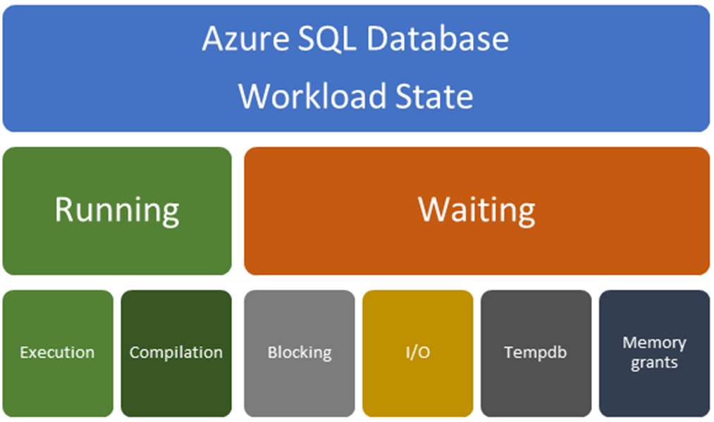

# Detectable types of query performance bottlenecks in Azure SQL Database
[!INCLUDE[appliesto-sqldb-sqlmi](includes/appliesto-sqldb-sqlmi.md)]

When trying to resolve a performance bottleneck, start by determining whether the bottleneck is occurring while the query is in a running state or a waiting state. Different resolutions apply depending upon this determination. Use the following diagram to help understand the factors that can cause either a running-related problem or a waiting-related problem. Problems and resolutions relating to each type of problem are discussed in this article.

You can use Azure SQL Database [Intelligent Insights](database/intelligent-insights-troubleshoot-performance.md#detectable-database-performance-patterns) or SQL Server [DMVs](database/monitoring-with-dmvs.md) to detect these types of performance bottlenecks.



**Running-related problems**: Running-related problems are generally related to compilation problems resulting in a suboptimal query plan or execution problems related to insufficient or overused resources.
**Waiting-related problems**: Waiting-related problems are generally related to:

- Locks (blocking)
- I/O
- Contention related to TempDB usage
- Memory grant waits

## Compilation problems resulting in a suboptimal query plan

A suboptimal plan generated by the SQL Query Optimizer may be the cause of slow query performance. The SQL Query Optimizer might produce a suboptimal plan because of a missing index, stale statistics, an incorrect estimate of the number of rows to be processed, or an inaccurate estimate of the required memory. If you know the query was executed faster in the past or on another instance, compare the actual execution plans to see if they're different.

- Identify any missing indexes using one of these methods:

  - Use [Intelligent Insights](database/intelligent-insights-troubleshoot-performance.md#missing-index).
  - [Database Advisor](database/database-advisor-implement-performance-recommendations.md) for single and pooled databases.
  - DMVs. This example shows you the impact of a missing index, how to detect a [missing indexes](database/performance-guidance.md#identifying-and-adding-missing-indexes) using DMVs, and the impact of implementing the missing index recommendation.
- Try to apply [query hints](https://docs.microsoft.com/sql/t-sql/queries/hints-transact-sql-query), [update statistics](https://docs.microsoft.com/sql/t-sql/statements/update-statistics-transact-sql), or [rebuild indexes](https://docs.microsoft.com/sql/relational-databases/indexes/reorganize-and-rebuild-indexes) to get the better plan. Enable [automatic plan correction](../azure-sql/database/automatic-tuning-overview.md) in Azure SQL Database to automatically mitigate these problems.

  This [example](database/performance-guidance.md#query-tuning-and-hinting) shows the impact of a suboptimal query plan due to a parameterized query, how to detect this condition, and how to use a query hint to resolve.

- Try changing the database compatibility level and implementing intelligent query processing. The SQL Query Optimizer may generate a different query plan depending upon the compatibility level for your database. Higher compatibility levels provide more [intelligent query processing capabilities](https://docs.microsoft.com/sql/relational-databases/performance/intelligent-query-processing).

  - For more information on query processing, see [Query Processing Architecture Guide](https://docs.microsoft.com/sql/relational-databases/query-processing-architecture-guide).
  - To change database compatibility levels and read more about the differences between compatibility levels, see [ALTER DATABASE](https://docs.microsoft.com/sql/t-sql/statements/alter-database-transact-sql-compatibility-level).
  - To read more about cardinality estimation, see [Cardinality Estimation](https://docs.microsoft.com/sql/relational-databases/performance/cardinality-estimation-sql-server)

## Resolving queries with suboptimal query execution plans

The following sections discuss how to resolve queries with suboptimal query execution plan.

### <a name="ParamSniffing"></a> Queries that have parameter sensitive plan (PSP) problems

A parameter sensitive plan (PSP) problem happens when the query optimizer generates a query execution plan that's optimal only for a specific parameter value (or set of values) and the cached plan is then not optimal for parameter values that are used in consecutive executions. Plans that aren't optimal can then cause query performance problems and degrade overall workload throughput.

For more information on parameter sniffing and query processing, see the [Query-processing architecture guide](/sql/relational-databases/query-processing-architecture-guide#ParamSniffing).

Several workarounds can mitigate PSP problems. Each workaround has associated tradeoffs and drawbacks:

- Use the [RECOMPILE](https://docs.microsoft.com/sql/t-sql/queries/hints-transact-sql-query) query hint at each query execution. This workaround trades compilation time and increased CPU for better plan quality. The `RECOMPILE` option is often not possible for workloads that require a high throughput.
- Use the [OPTION (OPTIMIZE FOR…)](https://docs.microsoft.com/sql/t-sql/queries/hints-transact-sql-query) query hint to override the actual parameter value with a typical parameter value that produces a plan that's good enough for most parameter value possibilities. This option requires a good understanding of optimal parameter values and associated plan characteristics.
- Use the [OPTION (OPTIMIZE FOR UNKNOWN)](https://docs.microsoft.com/sql/t-sql/queries/hints-transact-sql-query) query hint to override the actual parameter value and instead use the density vector average. You can also do this by capturing the incoming parameter values in local variables and then using the local variables within the predicates instead of using the parameters themselves. For this fix, the average density must be *good enough*.
- Disable parameter sniffing entirely by using the [DISABLE_PARAMETER_SNIFFING](https://docs.microsoft.com/sql/t-sql/queries/hints-transact-sql-query) query hint.
- Use the [KEEPFIXEDPLAN](https://docs.microsoft.com/sql/t-sql/queries/hints-transact-sql-query) query hint to prevent recompilations in cache. This workaround assumes that the good-enough common plan is the one in cache already. You can also disable automatic statistics updates to reduce the chances that the good plan will be evicted and a new bad plan will be compiled.
- Force the plan by explicitly using the [USE PLAN](https://docs.microsoft.com/sql/t-sql/queries/hints-transact-sql-query) query hint by rewriting the query and adding the hint in the query text. Or set a specific plan by using Query Store or by enabling [automatic tuning](../azure-sql/database/automatic-tuning-overview.md).
- Replace the single procedure with a nested set of procedures that can each be used based on conditional logic and the associated parameter values.
- Create dynamic string execution alternatives to a static procedure definition.

For more information about resolving PSP problems, see these blog posts:

- [I smell a parameter](https://docs.microsoft.com/archive/blogs/queryoptteam/i-smell-a-parameter)
- [Conor vs. dynamic SQL vs. procedures vs. plan quality for parameterized queries](https://blogs.msdn.microsoft.com/conor_cunningham_msft/2009/06/03/conor-vs-dynamic-sql-vs-procedures-vs-plan-quality-for-parameterized-queries/)
- [SQL query optimization techniques in SQL Server: Parameter sniffing](https://www.sqlshack.com/query-optimization-techniques-in-sql-server-parameter-sniffing/)

### Compile activity caused by improper parameterization

When a query has literals, either the database engine automatically parameterizes the statement or a user explicitly parameterizes the statement to reduce the number of compilations. A high number of compilations for a query using the same pattern but different literal values can result in high CPU usage. Similarly, if you only partially parameterize a query that continues to have literals, the database engine doesn't parameterize the query further.

Here's an example of a partially parameterized query:

```sql
SELECT *
FROM t1 JOIN t2 ON t1.c1 = t2.c1
WHERE t1.c1 = @p1 AND t2.c2 = '961C3970-0E54-4E8E-82B6-5545BE897F8F'
```

In this example, `t1.c1` takes `@p1`, but `t2.c2` continues to take GUID as literal. In this case, if you change the value for `c2`, the query is treated as a different query, and a new compilation will happen. To reduce compilations in this example, you would also parameterize the GUID.

The following query shows the count of queries by query hash to determine whether a query is properly parameterized:

```sql
SELECT TOP 10
  q.query_hash
  , count (distinct p.query_id ) AS number_of_distinct_query_ids
  , min(qt.query_sql_text) AS sampled_query_text
FROM sys.query_store_query_text AS qt
  JOIN sys.query_store_query AS q
     ON qt.query_text_id = q.query_text_id
  JOIN sys.query_store_plan AS p
     ON q.query_id = p.query_id
  JOIN sys.query_store_runtime_stats AS rs
     ON rs.plan_id = p.plan_id
  JOIN sys.query_store_runtime_stats_interval AS rsi
     ON rsi.runtime_stats_interval_id = rs.runtime_stats_interval_id
WHERE
  rsi.start_time >= DATEADD(hour, -2, GETUTCDATE())
  AND query_parameterization_type_desc IN ('User', 'None')
GROUP BY q.query_hash
ORDER BY count (distinct p.query_id) DESC
```

### Factors that affect query plan changes

A query execution plan recompilation might result in a generated query plan that differs from the original cached plan. An existing original plan might be automatically recompiled for various reasons:

- Changes in the schema are referenced by the query
- Data changes to the tables are referenced by the query
- Query context options were changed

A compiled plan might be ejected from the cache for various reasons, such as:

- Instance restarts
- Database-scoped configuration changes
- Memory pressure
- Explicit requests to clear the cache

If you use a RECOMPILE hint, a plan won't be cached.

A recompilation (or fresh compilation after cache eviction) can still result in the generation of a query execution plan that's identical to the original. When the plan changes from the prior or original plan, these explanations are likely:

- **Changed physical design**: For example, newly created indexes more effectively cover the requirements of a query. The new indexes might be used on a new compilation if the query optimizer decides that using that new index is more optimal than using the data structure that was originally selected for the first version of the query execution. Any physical changes to the referenced objects might result in a new plan choice at compile time.

- **Server resource differences**: When a plan in one system differs from the plan in another system, resource availability, such as the number of available processors, can influence which plan gets generated. For example, if one system has more processors, a parallel plan might be chosen.

- **Different statistics**: The statistics associated with the referenced objects might have changed or might be materially different from the original system's statistics. If the statistics change and a recompilation happens, the query optimizer uses the statistics starting from when they changed. The revised statistics' data distributions and frequencies might differ from those of the original compilation. These changes are used to create cardinality estimates. (*Cardinality estimates* are the number of rows that are expected to flow through the logical query tree.) Changes to cardinality estimates might lead you to choose different physical operators and associated orders of operations. Even minor changes to statistics can result in a changed query execution plan.

- **Changed database compatibility level or cardinality estimator version**: Changes to the database compatibility level can enable new strategies and features that might result in a different query execution plan. Beyond the database compatibility level, a disabled or enabled trace flag 4199 or a changed state of the database-scoped configuration QUERY_OPTIMIZER_HOTFIXES can also influence query execution plan choices at compile time. Trace flags 9481 (force legacy CE) and 2312 (force default CE) also affect the plan.

## Resource limits issues

Slow query performance not related to suboptimal query plans and missing indexes are generally related to insufficient or overused resources. If the query plan is optimal, the query (and the database) might be hitting the resource limits for the database, elastic pool, or managed instance. An example might be excess log write throughput for the service level.

- Detecting resource issues using the Azure portal: To see if resource limits are the problem, see [SQL Database resource monitoring](database/monitor-tune-overview.md#azure-sql-database-and-azure-sql-managed-instance-resource-monitoring). For single databases and elastic pools, see [Database Advisor performance recommendations](database/database-advisor-implement-performance-recommendations.md) and [Query Performance Insights](database/query-performance-insight-use.md).
- Detecting resource limits using [Intelligent Insights](database/intelligent-insights-troubleshoot-performance.md#reaching-resource-limits)
- Detecting resource issues using [DMVs](database/monitoring-with-dmvs.md):

  - The [sys.dm_db_resource_stats](database/monitoring-with-dmvs.md#monitor-resource-use) DMV returns CPU, I/O, and memory consumption for the database. One row exists for every 15-second interval, even if there's no activity in the database. Historical data is maintained for one hour.
  - The [sys.resource_stats](database/monitoring-with-dmvs.md#monitor-resource-use) DMV returns CPU usage and storage data for Azure SQL Database. The data is collected and aggregated in five-minute intervals.
  - [Many individual queries that cumulatively consume high CPU](database/monitoring-with-dmvs.md#many-individual-queries-that-cumulatively-consume-high-cpu)

If you identify the problem as insufficient resource, you can upgrade resources to increase the capacity of your database to absorb the CPU requirements. For more information, see [Scale single database resources in Azure SQL Database](database/single-database-scale.md) and [Scale elastic pool resources in Azure SQL Database](database/elastic-pool-scale.md). For information about scaling a managed instance, see [Service-tier resource limits](managed-instance/resource-limits.md#service-tier-characteristics)

## Performance problems caused by increased workload volume

An increase in application traffic and workload volume can cause increased CPU usage. But you must be careful to properly diagnose this problem. When you see a high-CPU problem, answer these questions to determine whether the increase is caused by changes to the workload volume:

- Are the queries from the application the cause of the high-CPU problem?
- For the [top CPU-consuming queries that you can identify](database/monitoring-with-dmvs.md#the-cpu-issue-occurred-in-the-past):

  - Were multiple execution plans associated with the same query? If so, why?
  - For queries with the same execution plan, were the execution times consistent? Did the execution count increase? If so, the workload increase is likely causing performance problems.

In summary, if the query execution plan didn't execute differently but CPU usage increased along with execution count, the performance problem is likely related to a workload increase.

It's not always easy to identify a workload volume change that's driving a CPU problem. Consider these factors:

- **Changed resource usage**: For example, consider a scenario where CPU usage increased to 80 percent for an extended period of time. CPU usage alone doesn't mean the workload volume changed. Regressions in the query execution plan and changes in data distribution can also contribute to more resource usage even though the application executes the same workload.

- **The appearance of a new query**: An application might drive a new set of queries at different times.

- **An increase or decrease in the number of requests**: This scenario is the most obvious measure of a workload. The number of queries doesn't always correspond to more resource utilization. However, this metric is still a significant signal, assuming other factors are unchanged.

Use Intelligent Insights to detect [workload increases](database/intelligent-insights-troubleshoot-performance.md#workload-increase) and [plan regressions](database/intelligent-insights-troubleshoot-performance.md#plan-regression).

## Waiting-related problems

Once you have eliminated a suboptimal plan and *Waiting-related* problems that are related to execution problems, the performance problem is generally the queries are probably waiting for some resource. Waiting-related problems might be caused by:

- **Blocking**:

  One query might hold the lock on objects in the database while others try to access the same objects. You can identify blocking queries by using [DMVs](database/monitoring-with-dmvs.md#monitoring-blocked-queries) or [Intelligent Insights](database/intelligent-insights-troubleshoot-performance.md#locking).
- **IO problems**

  Queries might be waiting for the pages to be written to the data or log files. In this case, check the `INSTANCE_LOG_RATE_GOVERNOR`, `WRITE_LOG`, or `PAGEIOLATCH_*` wait statistics in the DMV. See using DMVs to [identify IO performance issues](database/monitoring-with-dmvs.md#identify-io-performance-issues).
- **TempDB problems**

  If the workload uses temporary tables or there are TempDB spills in the plans, the queries might have a problem with TempDB throughput. See using DMVs to [identity TempDB issues](database/monitoring-with-dmvs.md#identify-tempdb-performance-issues).
- **Memory-related problems**

  If the workload doesn't have enough memory, the page life expectancy might drop, or the queries might get less memory than they need. In some cases, built-in intelligence in Query Optimizer will fix memory-related problems. See using DMVs to [identify memory grant issues](database/monitoring-with-dmvs.md#identify-memory-grant-wait-performance-issues).

### Methods to show top wait categories

These methods are commonly used to show the top categories of wait types:

- Use Intelligent Insights to identify queries with performance degradation due to [increased waits](database/intelligent-insights-troubleshoot-performance.md#increased-wait-statistic)
- Use [Query Store](https://docs.microsoft.com/sql/relational-databases/performance/monitoring-performance-by-using-the-query-store) to find wait statistics for each query over time. In Query Store, wait types are combined into wait categories. You can find the mapping of wait categories to wait types in [sys.query_store_wait_stats](https://docs.microsoft.com/sql/relational-databases/system-catalog-views/sys-query-store-wait-stats-transact-sql#wait-categories-mapping-table).
- Use [sys.dm_db_wait_stats](https://docs.microsoft.com/sql/relational-databases/system-dynamic-management-views/sys-dm-db-wait-stats-azure-sql-database) to return information about all the waits encountered by threads that executed during a query operation. You can use this aggregated view to diagnose performance problems with Azure SQL Database and also with specific queries and batches. Queries can be waiting on resources, queue waits, or external waits.
- Use [sys.dm_os_waiting_tasks](https://docs.microsoft.com/sql/relational-databases/system-dynamic-management-views/sys-dm-os-waiting-tasks-transact-sql) to return information about the queue of tasks that are waiting on some resource.

In high-CPU scenarios, Query Store and wait statistics might not reflect CPU usage if:

- High-CPU-consuming queries are still executing.
- The high-CPU-consuming queries were running when a failover happened.

DMVs that track Query Store and wait statistics show results for only successfully completed and timed-out queries. They don't show data for currently executing statements until the statements finish. Use the dynamic management view [sys.dm_exec_requests](https://docs.microsoft.com/sql/relational-databases/system-dynamic-management-views/sys-dm-exec-requests-transact-sql) to track currently executing queries and the associated worker time.

> [!TIP]
> Additional tools:
>
> - [TigerToolbox waits and latches](https://github.com/Microsoft/tigertoolbox/tree/master/Waits-and-Latches)
> - [TigerToolbox usp_whatsup](https://github.com/Microsoft/tigertoolbox/tree/master/usp_WhatsUp)

## Next steps

[SQL Database monitoring and tuning overview](database/monitor-tune-overview.md)
