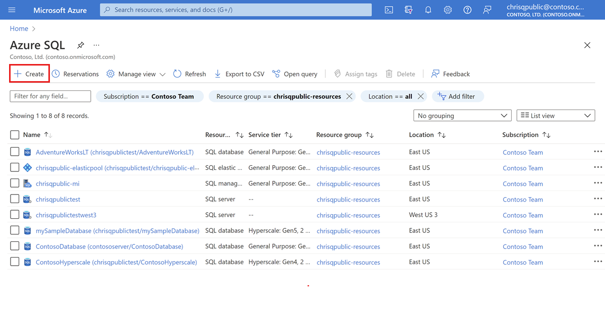
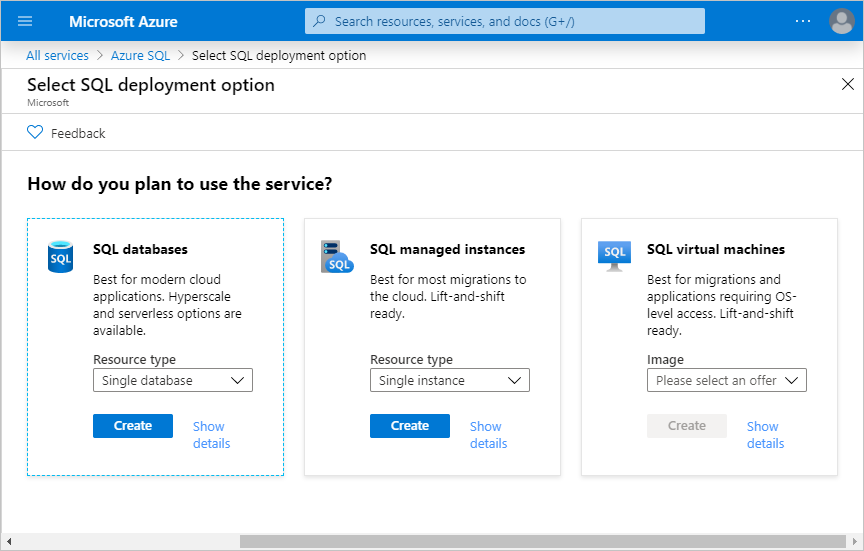

## Create and manage Azure SQL resources with the Azure portal

The Azure portal provides a single page where you can manage [all of your Azure SQL resources](https://go.microsoft.com/fwlink/?linkid=2100641) including your SQL virtual machines.

To access the **Azure SQL** page, from the Azure portal menu, select **Azure SQL** or search for and select **Azure SQL** in any page.

> [!NOTE]
> **Azure SQL** provides a quick and easy way to access all of your SQL resources in the Azure portal, including single and pooled database in Azure SQL Database as well as the logical SQL server hosting them, SQL Managed Instances, and SQL virtual machines.  [Azure SQL](../azure-sql-iaas-vs-paas-what-is-overview.md) is not a service or resource, but rather a family of SQL-related services. 

To manage existing resources, select the desired item in the list. To create new Azure SQL resources, select **+ Add**. 

After selecting **+ Add**, view additional information about the different options by selecting **Show details** on any tile.

For details, see:

- [Create a single database](../database/single-database-create-quickstart.md)
- [Create an elastic pool](../database/elastic-pool-overview.md#creating-a-new-sql-database-elastic-pool-using-the-azure-portal)
- [Create a managed instance](../managed-instance/instance-create-quickstart.md)
- [Create a SQL virtual machine](../virtual-machines/windows/sql-vm-create-portal-quickstart.md)