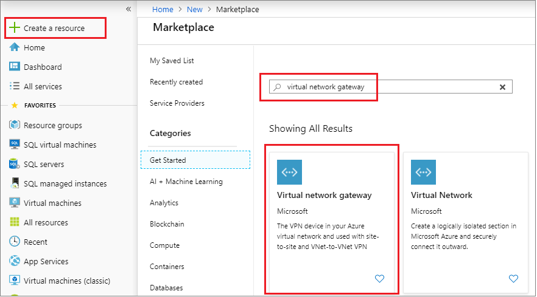

# Configure an auto-failover group for Azure SQL Managed Instance
[!INCLUDE[appliesto-sqldb-sqlmi](../includes/appliesto-sqldb-sqlmi.md)]

> [!div class="op_single_selector"]
> * [Azure SQL Database](../database/auto-failover-group-configure-sql-db.md)
> * [Azure SQL Managed Instance](auto-failover-group-configure-sql-mi.md)

This topic teaches you how to configure an [auto-failover group](auto-failover-group-sql-mi.md) for Azure SQL Managed Instance using the Azure portal and Azure PowerShell. For an end-to-end experience, review the [Auto-failover group tutorial](failover-group-add-instance-tutorial.md). 

> [!NOTE]
> This article covers auto-failover groups for Azure SQL Managed Instance. For Azure SQL Database, see [Configure auto-failover groups in SQL Database](../database/auto-failover-group-configure-sql-db.md). 


## Prerequisites

Consider the following prerequisites:

- The secondary managed instance must be empty.
- The subnet range for the secondary virtual network must not overlap the subnet range of the primary virtual network.
- The collation and time zone of the secondary managed instance must match that of the primary managed instance.
- When connecting the two gateways, the **Shared Key** should be the same for both connections.
- You will need to either configure [ExpressRoute](../../expressroute/expressroute-howto-circuit-portal-resource-manager.md) or create a gateway for the virtual network of each SQL Managed Instance, connect the two gateways, and then create the failover group. 
- Deploy both managed instances to [paired regions](../../availability-zones/cross-region-replication-azure.md) for performance reasons. Managed instances residing in geo-paired regions have much better performance compared to unpaired regions. 

## Create primary virtual network gateway

If you have not configured [ExpressRoute](../../expressroute/expressroute-howto-circuit-portal-resource-manager.md), you can create the primary virtual network gateway with the Azure portal, or PowerShell.

> [!NOTE]
> The SKU of the gateway affects throughput performance. This article deploys a gateway with the most basic SKU (`HwGw1`). Deploy a higher SKU (example: `VpnGw3`) to achieve higher throughput. For all available options, see [Gateway SKUs](../../vpn-gateway/vpn-gateway-about-vpngateways.md#benchmark) 

# [Portal](#tab/azure-portal)

Create the primary virtual network gateway using the Azure portal.

1. In the [Azure portal](https://portal.azure.com), go to your resource group and select the **Virtual network** resource for your primary managed instance.
1. Select **Subnets** under **Settings** and then select to add a new **Gateway subnet**. Leave the default values.

   

1. Once the subnet gateway is created, select **Create a resource** from the left navigation pane and then type `Virtual network gateway` in the search box. Select the **Virtual network gateway** resource published by **Microsoft**.

   

1. Fill out the required fields to configure the gateway your primary managed instance.

   The following table shows the values necessary for the gateway for the primary managed instance:

    | **Field** | Value |
    | --- | --- |
    | **Subscription** |  The subscription where your primary managed instance is. |
    | **Name** | The name for your virtual network gateway. |
    | **Region** | The region where your primary managed instance is. |
    | **Gateway type** | Select **VPN**. |
    | **VPN Type** | Select **Route-based** |
    | **SKU**| Leave default of `VpnGw1`. |
    | **Location**| The location where your secondary managed instance and secondary virtual network is.   |
    | **Virtual network**| Select the virtual network for your secondary managed instance. |
    | **Public IP address**| Select **Create new**. |
    | **Public IP address name**| Enter a name for your IP address. |


1. Leave the other values as default, and then select **Review + create** to review the settings for your virtual network gateway.

   

1. Select **Create** to create your new virtual network gateway.

# [PowerShell](#tab/azure-powershell)

Create the primary virtual network gateway using PowerShell.

   ```powershell-interactive
   $primaryResourceGroupName = "<Primary-Resource-Group>"
   $primaryVnetName = "<Primary-Virtual-Network-Name>"
   $primaryGWName = "<Primary-Gateway-Name>"
   $primaryGWPublicIPAddress = $primaryGWName + "-ip"
   $primaryGWIPConfig = $primaryGWName + "-ipc"
   $primaryGWAsn = 61000

   # Get the primary virtual network
   $vnet1 = Get-AzVirtualNetwork -Name $primaryVnetName -ResourceGroupName $primaryResourceGroupName
   $primaryLocation = $vnet1.Location

   # Create primary gateway
   Write-host "Creating primary gateway..."
   $subnet1 = Get-AzVirtualNetworkSubnetConfig -Name GatewaySubnet -VirtualNetwork $vnet1
   $gwpip1= New-AzPublicIpAddress -Name $primaryGWPublicIPAddress -ResourceGroupName $primaryResourceGroupName `
            -Location $primaryLocation -AllocationMethod Dynamic
   $gwipconfig1 = New-AzVirtualNetworkGatewayIpConfig -Name $primaryGWIPConfig `
            -SubnetId $subnet1.Id -PublicIpAddressId $gwpip1.Id

   $gw1 = New-AzVirtualNetworkGateway -Name $primaryGWName -ResourceGroupName $primaryResourceGroupName `
       -Location $primaryLocation -IpConfigurations $gwipconfig1 -GatewayType Vpn `
       -VpnType RouteBased -GatewaySku VpnGw1 -EnableBgp $true -Asn $primaryGWAsn
   $gw1
   ```

---

## Create secondary virtual network gateway

Create the secondary virtual network gateway using the Azure portal or PowerShell.

# [Portal](#tab/azure-portal)

Repeat the steps in the previous section to create the virtual network subnet and gateway for the secondary managed instance. Fill out the required fields to configure the gateway for your secondary managed instance.

The following table shows the values necessary for the gateway for the secondary managed instance:

   | **Field** | Value |
   | --- | --- |
   | **Subscription** |  The subscription where your secondary managed instance is. |
   | **Name** | The name for your virtual network gateway, such as `secondary-mi-gateway`. |
   | **Region** | The region where your secondary managed instance is. |
   | **Gateway type** | Select **VPN**. |
   | **VPN Type** | Select **Route-based** |
   | **SKU**| Leave default of `VpnGw1`. |
   | **Location**| The location where your secondary managed instance and secondary virtual network is.   |
   | **Virtual network**| Select the virtual network that was created in section 2, such as `vnet-sql-mi-secondary`. |
   | **Public IP address**| Select **Create new**. |
   | **Public IP address name**| Enter a name for your IP address, such as `secondary-gateway-IP`. |


   

# [PowerShell](#tab/azure-powershell)

Create the secondary virtual network gateway using PowerShell.

   ```powershell-interactive
   $secondaryResourceGroupName = "<Secondary-Resource-Group>"
   $secondaryVnetName = "<Secondary-Virtual-Network-Name>"
   $secondaryGWName = "<Secondary-Gateway-Name>"
   $secondaryGWPublicIPAddress = $secondaryGWName + "-IP"
   $secondaryGWIPConfig = $secondaryGWName + "-ipc"
   $secondaryGWAsn = 62000

   # Get the secondary virtual network
   $vnet2 = Get-AzVirtualNetwork -Name $secondaryVnetName -ResourceGroupName $secondaryResourceGroupName
   $secondaryLocation = $vnet2.Location

   # Create the secondary gateway
   Write-host "Creating secondary gateway..."
   $subnet2 = Get-AzVirtualNetworkSubnetConfig -Name GatewaySubnet -VirtualNetwork $vnet2
   $gwpip2= New-AzPublicIpAddress -Name $secondaryGWPublicIPAddress -ResourceGroupName $secondaryResourceGroupName `
            -Location $secondaryLocation -AllocationMethod Dynamic
   $gwipconfig2 = New-AzVirtualNetworkGatewayIpConfig -Name $secondaryGWIPConfig `
            -SubnetId $subnet2.Id -PublicIpAddressId $gwpip2.Id

   $gw2 = New-AzVirtualNetworkGateway -Name $secondaryGWName -ResourceGroupName $secondaryResourceGroupName `
       -Location $secondaryLocation -IpConfigurations $gwipconfig2 -GatewayType Vpn `
       -VpnType RouteBased -GatewaySku VpnGw1 -EnableBgp $true -Asn $secondaryGWAsn

   $gw2
   ```

---

## Connect the gateways

Create connections between the two gateways using the Azure portal or PowerShell.

Two connections need to be created - the connection from the primary gateway to the secondary gateway, and then the connection from the secondary gateway to the primary gateway.

The shared key used for both connections should be the same for each connection.

# [Portal](#tab/azure-portal)

Create connections between the two gateways using the Azure portal.

1. Select **Create a resource** from the [Azure portal](https://portal.azure.com).
1. Type `connection` in the search box and then press enter to search, which takes you to the **Connection** resource, published by Microsoft.
1. Select **Create** to create your connection.
1. On the **Basics** tab, select the following values and then select **OK**.
    1. Select `VNet-to-VNet` for the **Connection type**.
    1. Select your subscription from the drop-down.
    1. Select the resource group for your managed instance in the drop-down.
    1. Select the location of your primary managed instance from the drop-down.
1. On the **Settings** tab, select or enter the following values and then select **OK**:
    1. Choose the primary network gateway for the **First virtual network gateway**, such as `Primary-Gateway`.  
    1. Choose the secondary network gateway for the **Second virtual network gateway**, such as `Secondary-Gateway`.
    1. Select the checkbox next to **Establish bidirectional connectivity**.
    1. Either leave the default primary connection name, or rename it to a value of your choice.
    1. Provide a **Shared key (PSK)** for the connection, such as `mi1m2psk`.

   

1. On the **Summary** tab, review the settings for your bidirectional connection and then select **OK** to create your connection.

# [PowerShell](#tab/azure-powershell)

Create connections between the two gateways using PowerShell.

   ```powershell-interactive
   $vpnSharedKey = "mi1mi2psk"
   $primaryResourceGroupName = "<Primary-Resource-Group>"
   $primaryGWConnection = "<Primary-connection-name>"
   $primaryLocation = "<Primary-Region>"
   $secondaryResourceGroupName = "<Secondary-Resource-Group>"
   $secondaryGWConnection = "<Secondary-connection-name>"
   $secondaryLocation = "<Secondary-Region>"
  
   # Connect the primary to secondary gateway
   Write-host "Connecting the primary gateway"
   New-AzVirtualNetworkGatewayConnection -Name $primaryGWConnection -ResourceGroupName $primaryResourceGroupName `
       -VirtualNetworkGateway1 $gw1 -VirtualNetworkGateway2 $gw2 -Location $primaryLocation `
       -ConnectionType Vnet2Vnet -SharedKey $vpnSharedKey -EnableBgp $true
   $primaryGWConnection

   # Connect the secondary to primary gateway
   Write-host "Connecting the secondary gateway"

   New-AzVirtualNetworkGatewayConnection -Name $secondaryGWConnection -ResourceGroupName $secondaryResourceGroupName `
       -VirtualNetworkGateway1 $gw2 -VirtualNetworkGateway2 $gw1 -Location $secondaryLocation `
       -ConnectionType Vnet2Vnet -SharedKey $vpnSharedKey -EnableBgp $true
   $secondaryGWConnection
   ```

---

## Create the failover group

Create the failover group for your managed instances by using the Azure portal or PowerShell.

# [Portal](#tab/azure-portal)

Create the failover group for your SQL Managed Instances by using the Azure portal.

1. Select **Azure SQL** in the left-hand menu of the [Azure portal](https://portal.azure.com). If **Azure SQL** is not in the list, select **All services**, then type Azure SQL in the search box. (Optional) Select the star next to **Azure SQL** to favorite it and add it as an item in the left-hand navigation.
1. Select the primary managed instance you want to add to the failover group.  
1. Under **Settings**, navigate to **Instance Failover Groups** and then choose to **Add group** to open the **Instance Failover Group** page.

   

1. On the **Instance Failover Group** page, type the name of your failover group and then choose the secondary managed instance from the drop-down. Select **Create** to create your failover group.

   

1. Once failover group deployment is complete, you will be taken back to the **Failover group** page.

# [PowerShell](#tab/azure-powershell)

Create the failover group for your managed instances using PowerShell.

   ```powershell-interactive
   $primaryResourceGroupName = "<Primary-Resource-Group>"
   $failoverGroupName = "<Failover-Group-Name>"
   $primaryLocation = "<Primary-Region>"
   $secondaryLocation = "<Secondary-Region>"
   $primaryManagedInstance = "<Primary-Managed-Instance-Name>"
   $secondaryManagedInstance = "<Secondary-Managed-Instance-Name>"

   # Create failover group
   Write-host "Creating the failover group..."
   $failoverGroup = New-AzSqlDatabaseInstanceFailoverGroup -Name $failoverGroupName `
        -Location $primaryLocation -ResourceGroupName $primaryResourceGroupName -PrimaryManagedInstanceName $primaryManagedInstance `
        -PartnerRegion $secondaryLocation -PartnerManagedInstanceName $secondaryManagedInstance `
        -FailoverPolicy Automatic -GracePeriodWithDataLossHours 1
   $failoverGroup
   ```

---

## Test failover

Test failover of your failover group using the Azure portal or PowerShell.

# [Portal](#tab/azure-portal)

Test failover of your failover group using the Azure portal.

1. Navigate to your _secondary_ managed instance within the [Azure portal](https://portal.azure.com) and select **Instance Failover Groups** under settings.
1. Review which managed instance is the primary, and which managed instance is the secondary.
1. Select **Failover** and then select **Yes** on the warning about TDS sessions being disconnected.

   

1. Review which manged instance is the primary and which instance is the secondary. If failover succeeded, the two instances should have switched roles.

   

1. Go to the new _secondary_ managed instance and select **Failover** once again to fail the primary instance back to the primary role.

# [PowerShell](#tab/azure-powershell)

Test failover of your failover group using PowerShell.

   ```powershell-interactive
   $primaryResourceGroupName = "<Primary-Resource-Group>"
   $secondaryResourceGroupName = "<Secondary-Resource-Group>"
   $failoverGroupName = "<Failover-Group-Name>"
   $primaryLocation = "<Primary-Region>"
   $secondaryLocation = "<Secondary-Region>"
   $primaryManagedInstance = "<Primary-Managed-Instance-Name>"
   $secondaryManagedInstance = "<Secondary-Managed-Instance-Name>"

   # Verify the current primary role
   Get-AzSqlDatabaseInstanceFailoverGroup -ResourceGroupName $primaryResourceGroupName `
       -Location $secondaryLocation -Name $failoverGroupName

   # Failover the primary managed instance to the secondary role
   Write-host "Failing primary over to the secondary location"
   Get-AzSqlDatabaseInstanceFailoverGroup -ResourceGroupName $secondaryResourceGroupName `
       -Location $secondaryLocation -Name $failoverGroupName | Switch-AzSqlDatabaseInstanceFailoverGroup
   Write-host "Successfully failed failover group to secondary location"

   # Verify the current primary role
   Get-AzSqlDatabaseInstanceFailoverGroup -ResourceGroupName $primaryResourceGroupName `
       -Location $secondaryLocation -Name $failoverGroupName

   # Fail primary managed instance back to primary role
   Write-host "Failing primary back to primary role"
   Get-AzSqlDatabaseInstanceFailoverGroup -ResourceGroupName $primaryResourceGroupName `
       -Location $primaryLocation -Name $failoverGroupName | Switch-AzSqlDatabaseInstanceFailoverGroup
   Write-host "Successfully failed failover group to primary location"

   # Verify the current primary role
   Get-AzSqlDatabaseInstanceFailoverGroup -ResourceGroupName $primaryResourceGroupName `
       -Location $secondaryLocation -Name $failoverGroupName
   ```

---


## Locate listener endpoint

Once your failover group is configured, update the connection string for your application to the listener endpoint. This will keep your application connected to the failover group listener, rather than the primary database, elastic pool, or instance database. That way, you don't have to manually update the connection string every time your database entity fails over, and traffic is routed to whichever entity is currently primary.

The listener endpoint is in the form of `fog-name.database.windows.net`, and is visible in the Azure portal, when viewing the failover group:


## <a name="creating-a-failover-group-between-managed-instances-in-different-subscriptions"></a> Create group between instances in different subscriptions

You can create a failover group between SQL Managed Instances in two different subscriptions, as long as subscriptions are associated to the same [Azure Active Directory Tenant](../../active-directory/fundamentals/active-directory-whatis.md#terminology). When using PowerShell API, you can do it by specifying the `PartnerSubscriptionId` parameter for the secondary SQL Managed Instance. When using REST API, each instance ID included in the `properties.managedInstancePairs` parameter can have its own Subscription ID.
  
> [!IMPORTANT]
> Azure portal does not support creation of failover groups across different subscriptions. Also, for the existing failover groups across different subscriptions and/or resource groups, failover cannot be initiated manually via portal from the primary SQL Managed Instance. Initiate it from the geo-secondary instance instead.

## Change the secondary region

Let's assume that instance A is the primary instance, instance B is the existing secondary instance, and instance C is the new secondary instance in the third region. To make the transition, follow these steps:

1. Create instance C with same size as A and in the same DNS zone.
2. Delete the failover group between instances A and B. At this point the logins will be failing because the SQL aliases for the failover group listeners have been deleted and the gateway will not recognize the failover group name. The secondary databases will be disconnected from the primaries and will become read-write databases.
3. Create a failover group with the same name between instance A and C. Follow the instructions in [failover group with SQL Managed Instance tutorial](failover-group-add-instance-tutorial.md). This is a size-of-data operation and will complete when all databases from instance A are seeded and synchronized.
4. Delete instance B if not needed to avoid unnecessary charges.

> [!NOTE]
> After step 2 and until step 3 is completed the databases in instance A will remain unprotected from a catastrophic failure of instance A.

## Change the primary region 

Let's assume instance A is the primary instance, instance B is the existing secondary instance, and instance C is the new primary instance in the third region. To make the transition, follow these steps:

1. Create instance C with same size as B and in the same DNS zone.
2. Connect to instance B and manually failover to switch the primary instance to B. Instance A will become the new secondary instance automatically.
3. Delete the failover group between instances A and B. At this point login attempts using failover group endpoints will be failing. The secondary databases on A will be disconnected from the primaries and will become read-write databases.
4. Create a failover group with the same name between instance A and C. Follow the instructions in the [failover group with managed instance tutorial](failover-group-add-instance-tutorial.md). This is a size-of-data operation and will complete when all databases from instance A are seeded and synchronized. At this point login attempts will stop failing.
5. Delete instance A if not needed to avoid unnecessary charges.

> [!CAUTION]
> After step 3 and until step 4 is completed the databases in instance A will remain unprotected from a catastrophic failure of instance A.

> [!IMPORTANT]
> When the failover group is deleted, the DNS records for the listener endpoints are also deleted. At that point, there is a non-zero probability of somebody else creating a failover group with the same name. Because failover group names must be globally unique, this will prevent you from using the same name again. To minimize this risk, don't use generic failover group names.

## <a name="enabling-geo-replication-between-managed-instances-and-their-vnets"></a> Enabling geo-replication between MI virtual networks

When you set up a failover group between primary and secondary SQL Managed Instances in two different regions, each instance is isolated using an independent virtual network. To allow replication traffic between these VNets ensure these prerequisites are met:

- The two instances of SQL Managed Instance need to be in different Azure regions.
- The two instances of SQL Managed Instance need to be the same service tier, and have the same storage size.
- Your secondary instance of SQL Managed Instance must be empty (no user databases).
- The virtual networks used by the instances of SQL Managed Instance need to be connected through a [VPN Gateway](../../vpn-gateway/vpn-gateway-about-vpngateways.md) or [Express Route](../../expressroute/expressroute-howto-circuit-portal-resource-manager.md). When two virtual networks connect through an on-premises network, ensure there is no firewall rule blocking ports 5022, and 11000-11999. Global VNet Peering is supported with the limitation described in the note below.

   > [!IMPORTANT]
   > [On 9/22/2020 support for global virtual network peering for newly created virtual clusters was announced](https://azure.microsoft.com/updates/global-virtual-network-peering-support-for-azure-sql-managed-instance-now-available/). It means that global virtual network peering is supported for SQL managed instances created in empty subnets after the announcement date, as well for all the subsequent managed instances created in those subnets. For all the other SQL managed instances peering support is limited to the networks in the same region due to the [constraints of global virtual network peering](../../virtual-network/virtual-network-manage-peering.md#requirements-and-constraints). See also the relevant section of the [Azure Virtual Networks frequently asked questions](../../virtual-network/virtual-networks-faq.md#what-are-the-constraints-related-to-global-vnet-peering-and-load-balancers) article for more details. To be able to use global virtual network peering for SQL managed instances from virtual clusters created before the announcement date, consider configuring non-default [maintenance window](../database/maintenance-window.md) on the instances, as it will move the instances into new virtual clusters that support global virtual network peering.

- The two SQL Managed Instance VNets cannot have overlapping IP addresses.
- You need to set up your Network Security Groups (NSG) such that ports 5022 and the range 11000~12000 are open inbound and outbound for connections from the subnet of the other managed instance. This is to allow replication traffic between the instances.

   > [!IMPORTANT]
   > Misconfigured NSG security rules leads to stuck database seeding operations.

- The secondary SQL Managed Instance is configured with the correct DNS zone ID. DNS zone is a property of a SQL Managed Instance and underlying virtual cluster, and its ID is included in the host name address. The zone ID is generated as a random string when the first SQL Managed Instance is created in each VNet and the same ID is assigned to all other instances in the same subnet. Once assigned, the DNS zone cannot be modified. SQL Managed Instances included in the same failover group must share the DNS zone. You accomplish this by passing the primary instance's zone ID as the value of DnsZonePartner parameter when creating the secondary instance.

   > [!NOTE]
   > For a detailed tutorial on configuring failover groups with SQL Managed Instance, see [add a SQL Managed Instance to a failover group](../managed-instance/failover-group-add-instance-tutorial.md).

## Permissions


<!--
There is some overlap of content in the following articles, be sure to make changes to all if necessary:
/azure-sql/auto-failover-group-overview.md
/azure-sql/database/auto-failover-group-sql-db.md
/azure-sql/database/auto-failover-group-configure-sql-db.md
/azure-sql/managed-instance/auto-failover-group-sql-mi.md
/azure-sql/managed-instance/auto-failover-group-configure-sql-mi.md
-->

Permissions for a failover group are managed via [Azure role-based access control (Azure RBAC)](../../role-based-access-control/overview.md). 

Azure RBAC write access is necessary to create and manage failover groups. The [SQL Server Contributor](../../role-based-access-control/built-in-roles.md#sql-server-contributor) role has all the necessary permissions to manage failover groups.

The following table lists specific permission scopes for Azure SQL Managed Instance: 

| **Action** | **Permission** | **Scope**|
| :---- | :---- | :---- | 
|**Create failover group**| Azure RBAC write access | Primary managed instance </br> Secondary managed instance|
| **Update failover group** Azure RBAC write access | Failover group </br> All databases within the managed instance|
| **Fail over failover group** | Azure RBAC write access | Failover group on new primary managed instance |


## Next steps

For detailed steps configuring a failover group, see the following tutorials:

- [Add a single database to a failover group](../database/failover-group-add-single-database-tutorial.md)
- [Add an elastic pool to a failover group](../database/failover-group-add-elastic-pool-tutorial.md)
- [Add a managed instance to a failover group](../managed-instance/failover-group-add-instance-tutorial.md)

For an overview of the feature, see [auto-failover groups](auto-failover-group-sql-mi.md).
