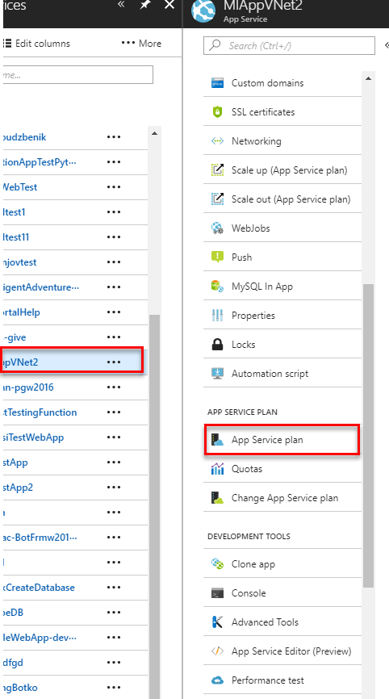
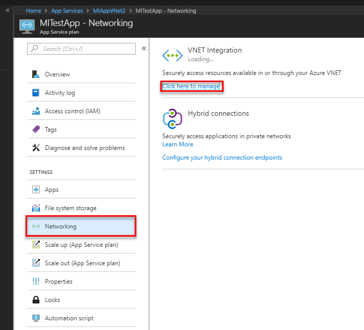
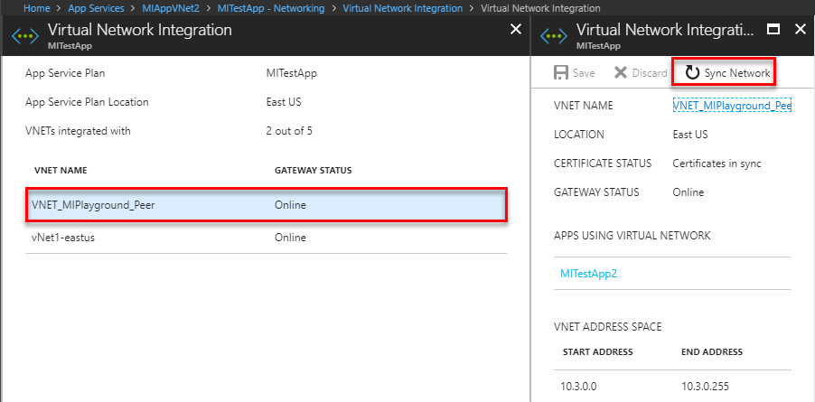

# Sync networking configuration for Azure App Service hosting plan with Azure SQL Managed Instance
[!INCLUDE[appliesto-sqlmi](../includes/appliesto-sqlmi.md)]

It might happen that although you [integrated your app with an Azure Virtual Network](../../app-service/web-sites-integrate-with-vnet.md), you can't establish a connection to SQL Managed Instance. Refreshing, or synchronizing, the networking configuration for your service plan can resolve this issue. 

## Sync network configuration 

To do that, follow these steps:  

1. Go to your web apps App Service plan.

   

2. Select **Networking** and then select **Click here to Manage**.

   

3. Select your **VNet** and click **Sync Network**.

   

4. Wait until the sync is done.
  
   

You are now ready to try to re-establish your connection to your SQL Managed Instance.

## Next steps

- For information about configuring your VNet for SQL Managed Instance, see [SQL Managed Instance VNet architecture](connectivity-architecture-overview.md) and [How to configure existing VNet](vnet-existing-add-subnet.md).
