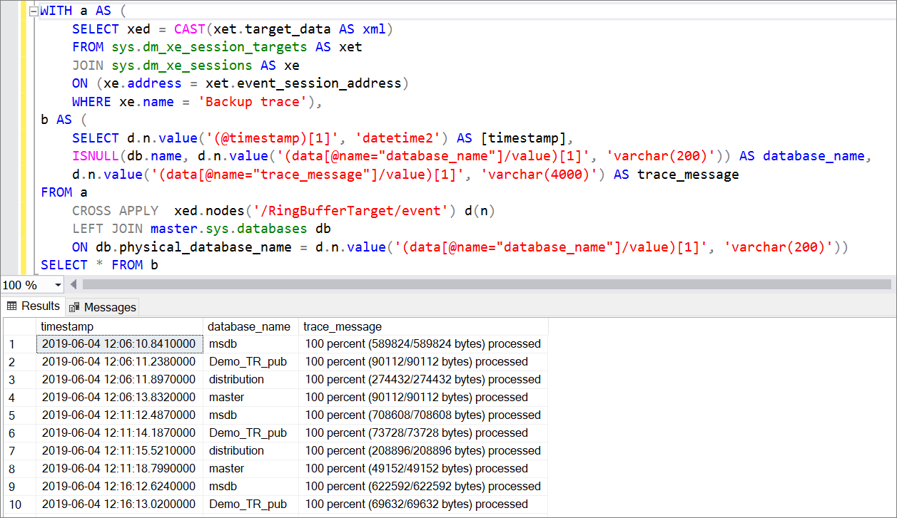

# Monitor backup activity for Azure SQL Managed Instance 
[!INCLUDE[appliesto-sqlmi](../includes/appliesto-sqlmi.md)]

This article teaches you to configure extended event (XEvent) sessions to monitor backup activity for [Azure SQL Managed Instance](sql-managed-instance-paas-overview.md). 

## Overview

Azure SQL Managed Instance emits events (also known as [Extended Events or XEvents](../database/xevent-db-diff-from-svr.md)) during backup activity for the purpose of reporting. Configure an XEvent session to track information such as backup status, backup type, size, time, and location within the msdb database. This information can be integrated with backup monitoring software and also used for the purpose of Enterprise Audit. 

Enterprise Audits may require proof of successful backups, time of backup, and duration of the backup.

## Configure XEvent session

Use the extended event `backup_restore_progress_trace` to record the progress of your SQL Managed Instance back up. Modify the XEvent sessions as needed to track the information you're interested in for your business. These T-SQL snippets store the XEvent sessions in the ring buffer, but it's also possible to write to [Azure Blob Storage](../database/xevent-code-event-file.md). XEvent sessions storing data in the ring buffer have a limit of about 1000 messages so should only be used to track recent activity. Additionally, ring buffer data is lost upon failover. As such, for a historical record of backups, write to an event file instead. 

### Simple tracking

Configure a simple XEvent session to capture simple events about complete full backups. This script collects the name of the database, the total number of bytes processed, and the time the backup completed.

Use Transact-SQL (T-SQL) to configure the simple XEvent session: 


```sql
CREATE EVENT SESSION [Simple backup trace] ON SERVER
ADD EVENT sqlserver.backup_restore_progress_trace(
WHERE operation_type = 0
AND trace_message LIKE '%100 percent%')
ADD TARGET package0.ring_buffer
WITH(STARTUP_STATE=ON)
GO
ALTER EVENT SESSION [Simple backup trace] ON SERVER
STATE = start;
```


### Verbose tracking

Configure a verbose XEvent session to track greater details about your backup activity. This script captures start and finish of both full, differential and log backups. Since this script is more verbose, it fills up the ring buffer faster, so entries may recycle faster than with the simple script. 

Use Transact-SQL (T-SQL) to configure the verbose XEvent session: 

```sql
CREATE EVENT SESSION [Verbose backup trace] ON SERVER 
ADD EVENT sqlserver.backup_restore_progress_trace(
    WHERE (
              [operation_type]=(0) AND (
              [trace_message] like '%100 percent%' OR 
              [trace_message] like '%BACKUP DATABASE%' OR [trace_message] like '%BACKUP LOG%'))
       )
ADD TARGET package0.ring_buffer
WITH (MAX_MEMORY=4096 KB,EVENT_RETENTION_MODE=ALLOW_SINGLE_EVENT_LOSS,
       MAX_DISPATCH_LATENCY=30 SECONDS,MAX_EVENT_SIZE=0 KB,MEMORY_PARTITION_MODE=NONE,
       TRACK_CAUSALITY=OFF,STARTUP_STATE=ON)

ALTER EVENT SESSION [Verbose backup trace] ON SERVER
STATE = start;

```

## Monitor backup progress 

After the XEvent session is created, you can use Transact-SQL (T-SQL) to query ring buffer results and monitor the progress of the backup. Once the XEvent starts, it collects all backup events so entries are added to the session roughly every 5-10 minutes.  

### Simple tracking

The following Transact-SQL (T-SQL) code queries the simple XEvent session and returns the name of the database, the total number of bytes processed, and the time the backup completed: 

```sql 
WITH
a AS (SELECT xed = CAST(xet.target_data AS xml)
FROM sys.dm_xe_session_targets AS xet
JOIN sys.dm_xe_sessions AS xe
ON (xe.address = xet.event_session_address)
WHERE xe.name = 'Backup trace'),
b AS(SELECT
d.n.value('(@timestamp)[1]', 'datetime2') AS [timestamp],
ISNULL(db.name, d.n.value('(data[@name="database_name"]/value)[1]', 'varchar(200)')) AS database_name,
d.n.value('(data[@name="trace_message"]/value)[1]', 'varchar(4000)') AS trace_message
FROM a
CROSS APPLY  xed.nodes('/RingBufferTarget/event') d(n)
LEFT JOIN master.sys.databases db
ON db.physical_database_name = d.n.value('(data[@name="database_name"]/value)[1]', 'varchar(200)'))
SELECT * FROM b
```

The following screenshot shows an example of the output of the above query: 



In this example, five databases were automatically backed up over the course of 2 hours and 30 minutes, and there are 130 entries in the XEvent session. 

### Verbose tracking 

The following Transact-SQL (T-SQL) code queries the verbose XEvent session and returns the name of the database, as well as the start and finish of both full, differential and log backups. 


```sql
WITH
a AS (SELECT xed = CAST(xet.target_data AS xml)
FROM sys.dm_xe_session_targets AS xet
JOIN sys.dm_xe_sessions AS xe
ON (xe.address = xet.event_session_address)
WHERE xe.name = 'Verbose backup trace'),
b AS(SELECT
d.n.value('(@timestamp)[1]', 'datetime2') AS [timestamp],
ISNULL(db.name, d.n.value('(data[@name="database_name"]/value)[1]', 'varchar(200)')) AS database_name,
d.n.value('(data[@name="trace_message"]/value)[1]', 'varchar(4000)') AS trace_message
FROM a
CROSS APPLY  xed.nodes('/RingBufferTarget/event') d(n)
LEFT JOIN master.sys.databases db
ON db.physical_database_name = d.n.value('(data[@name="database_name"]/value)[1]', 'varchar(200)'))
SELECT * FROM b
```

The following screenshot shows an example of a full backup in the XEvent session:

:::image type="content" source="media/backup-activity-monitor/output-with-full.png" alt-text="XEvent output showing full backups":::

The following screenshot shows an example of an output of a differential backup in the XEvent session:

:::image type="content" source="media/backup-activity-monitor/output-with-differential.png" alt-text="XEvent output showing differential backups":::


## Next steps

Once your backup has completed, you can then [restore to a point in time](point-in-time-restore.md) or [configure a long-term retention policy](long-term-backup-retention-configure.md). 

To learn more, see [automated backups](../database/automated-backups-overview.md). 
