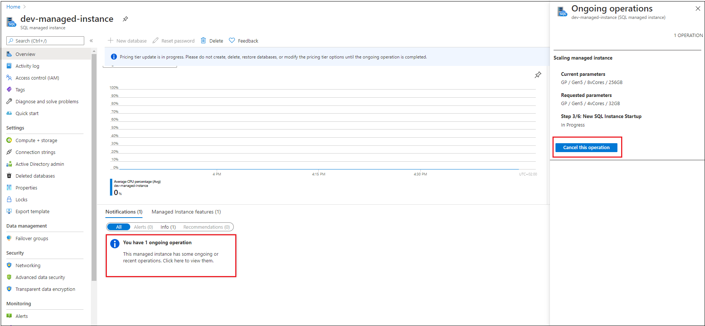

# Canceling Azure SQL Managed Instance management operations
[!INCLUDE[appliesto-sqlmi](../includes/appliesto-sqlmi.md)]

## Cancel management operation
Azure SQL Managed Instance provides [management operations](management-operations-overview.md) that you can use to automatically deploy new managed instances, update instance properties, and delete instances when no longer needed. All management operations can be categorized as follows:

- Instance deployment (new instance creation).
- Instance update (changing instance properties, such as vCores or reserved storage).
- Instance deletion.

You can [monitor progress and status of management operations](monitoring-management-operations.md) and if there is need some of them can be canceled. The following table summarizes the ability to cancel specific management operations and typical overall durations:

Category  |Operation  |Cancelable  |Estimated cancel duration  |
|---------|---------|---------|---------|
|Deployment |Instance creation |Yes |90% of operations finish in 5 minutes. |
|Update |Instance storage scaling up/down (General Purpose) |No |  |
|Update |Instance storage scaling up/down (Business Critical) |Yes |90% of operations finish in 5 minutes. |
|Update |Instance compute (vCores) scaling up and down (General Purpose) |Yes |90% of operations finish in 5 minutes. |
|Update |Instance compute (vCores) scaling up and down (Business Critical) |Yes |90% of operations finish in 5 minutes. |
|Update |Instance service tier change (General Purpose to Business Critical and vice versa) |Yes |90% of operations finish in 5 minutes. |
|Delete |Instance deletion |No |  |
|Delete |Virtual cluster deletion (as user-initiated operation) |No |  |

# [Portal](#tab/azure-portal)

In order to cancel the management operation, go to the overview blade and click on notification box of the ongoing operation. From the right side, a screen with the ongoing operation will appear and there will be button for canceling operation. After the first click, you will be asked to click again and confirm that you want to cancel the operation.

[](./media/canceling-management-operations/canceling-operation.png#lightbox)

After a cancel request has been submitted and processed, you will get a notification if the cancel submission has been successful or not.

If submitted cancel request is successful, the management operation will be canceled in a couple of minutes, resulting with a failure.


If the cancel request fails or the cancel button is not active, it means that the management operation has entered non-cancelable state and that it will finish in couple of minutes. The management operation will continue its execution until it is completed.

# [PowerShell](#tab/azure-powershell)

If you don't already have Azure PowerShell installed, see [Install the Azure PowerShell module](https://docs.microsoft.com/powershell/azure/install-az-ps).

To cancel management operation, you need to specify management operation name. Therefore, first use get command for retrieving operation list, and then cancel specific operation.

```powershell-interactive
$managedInstance = "yourInstanceName"
$resourceGroup = "yourResourceGroupName"

$managementOperations = Get-AzSqlInstanceOperation -ManagedInstanceName $managedInstance  -ResourceGroupName $resourceGroup

foreach ($mo in $managementOperations ) {
	if($mo.State -eq "InProgress" -and $mo.IsCancellable){
		$cancelRequest = Stop-AzSqlInstanceOperation -ResourceGroupName $resourceGroup -ManagedInstanceName $managedInstance -Name $mo.Name
		Get-AzSqlInstanceOperation -ManagedInstanceName $managedInstance  -ResourceGroupName $resourceGroup -Name $mo.Name
	}
}
```

For detailed commands explanation, see [Get-AzSqlInstanceOperation](https://docs.microsoft.com/powershell/module/az.sql/get-azsqlinstanceoperation) and [Stop-AzSqlInstanceOperation](https://docs.microsoft.com/powershell/module/az.sql/stop-azsqlinstanceoperation).

# [Azure CLI](#tab/azure-cli)

If you don't already have the Azure CLI installed, see [Install the Azure CLI](/cli/azure/install-azure-cli).

To cancel management operation, you need to specify management operation name. Therefore, first use get command for retrieving operation list, and then cancel specific operation.

```azurecli-interactive
az sql mi op list -g yourResourceGroupName --mi yourInstanceName --query "[?state=='InProgress' && isCancellable].{Name: name}" -o tsv |
while read -r operationName; do
	az sql mi op cancel -g yourResourceGroupName --mi yourInstanceName -n $operationName
done
```

For detailed commands explanation, see [az sql mi op](https://docs.microsoft.com/cli/azure/sql/mi/op).

---

### Canceled deployment request

With new 2020-02-02 API version, as soon as instance creation request is accepted instance starts to exist as a resource, no matter deployment process is still in progress (managed instance status is **Provisioning**). In case that you cancel instance deployment request (new instance creation), managed instance will go from **Provisioning** state to **FailedToCreate**. Instances that have failed to create are still present as a resource. Instances that have failed to create:
- Are not charged
- Are not accounted for resource limits (subnet or vCore quota)
- Keep instance name reserved - in order to deploy instance with the same name, just delete instance that is failed to create and name will be released 

## Next steps
- To learn how to create your first managed instance, see [Quickstart guide](instance-create-quickstart.md).
- For a features and comparison list, see [SQL common features](../database/features-comparison.md).
- For more information about VNet configuration, see [SQL Managed Instance VNet configuration](connectivity-architecture-overview.md).
- For a quickstart that creates a managed instance and restores a database from a backup file, see [Create a managed instance](instance-create-quickstart.md).
- For a tutorial about using Azure Database Migration Service for migration, see [SQL Managed Instance migration using Database Migration Service](../../dms/tutorial-sql-server-to-managed-instance.md).
