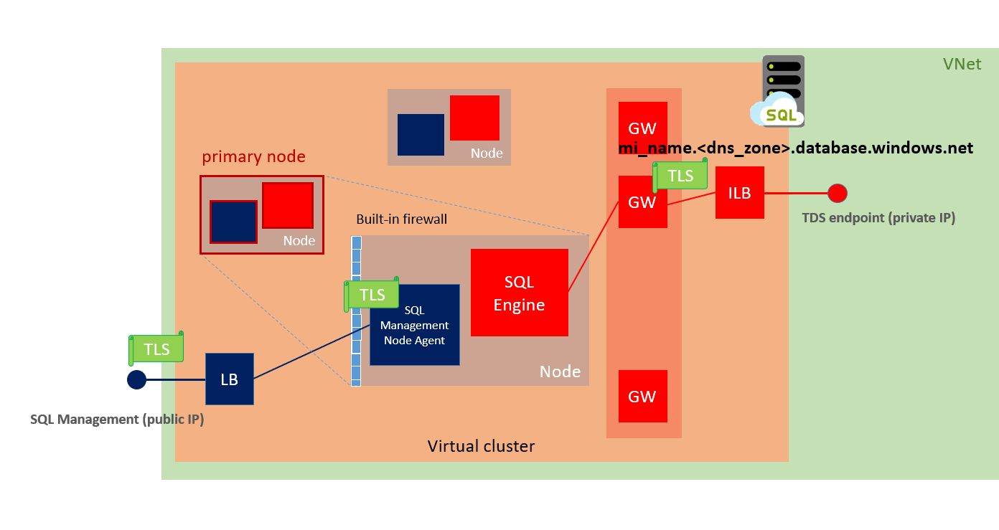

# Connectivity architecture for Azure SQL Managed Instance
[!INCLUDE[appliesto-sqlmi](../includes/appliesto-sqlmi.md)]

This article explains communication in Azure SQL Managed Instance. It also describes connectivity architecture and how the components direct traffic to a managed instance.  

SQL Managed Instance is placed inside the Azure virtual network and the subnet that's dedicated to managed instances. This deployment provides:

- A secure private IP address.
- The ability to connect an on-premises network to SQL Managed Instance.
- The ability to connect SQL Managed Instance to a linked server or another on-premises data store.
- The ability to connect SQL Managed Instance to Azure resources.

## Communication overview

The following diagram shows entities that connect to SQL Managed Instance. It also shows the resources that need to communicate with a managed instance. The communication process at the bottom of the diagram represents customer applications and tools that connect to SQL Managed Instance as data sources.  

SQL Managed Instance is a platform as a service (PaaS) offering. Azure uses automated agents (management, deployment, and maintenance) to manage this service based on telemetry data streams. Because Azure is responsible for management, customers can't access the SQL Managed Instance virtual cluster machines through Remote Desktop Protocol (RDP).

Some operations started by end users or applications might require SQL Managed Instance to interact with the platform. One case is the creation of a SQL Managed Instance database. This resource is exposed through the Azure portal, PowerShell, Azure CLI, and the REST API.

SQL Managed Instance depends on Azure services such as Azure Storage for backups, Azure Event Hubs for telemetry, Azure Active Directory (Azure AD) for authentication, Azure Key Vault for Transparent Data Encryption (TDE), and a couple of Azure platform services that provide security and supportability features. SQL Managed Instance makes connections to these services.

All communications are encrypted and signed using certificates. To check the trustworthiness of communicating parties, SQL Managed Instance constantly verifies these certificates through certificate revocation lists. If the certificates are revoked, SQL Managed Instance closes the connections to protect the data.

## High-level connectivity architecture

At a high level, SQL Managed Instance is a set of service components. These components are hosted on a dedicated set of isolated virtual machines that run inside the customer's virtual network subnet. These machines form a virtual cluster.

A virtual cluster can host multiple managed instances. If needed, the cluster automatically expands or contracts when the customer changes the number of provisioned instances in the subnet.

Customer applications can connect to SQL Managed Instance and can query and update databases inside the virtual network, peered virtual network, or network connected by VPN or Azure ExpressRoute. This network must use an endpoint and a private IP address.  

Azure management and deployment services run outside the virtual network. SQL Managed Instance and Azure services connect over the endpoints that have public IP addresses. When SQL Managed Instance creates an outbound connection, on the receiving end Network Address Translation (NAT) makes the connection look like it's coming from this public IP address.

Management traffic flows through the customer's virtual network. That means that elements of the virtual network's infrastructure can harm management traffic by making the instance fail and become unavailable.

> [!IMPORTANT]
> To improve customer experience and service availability, Azure applies a network intent policy on Azure virtual network infrastructure elements. The policy can affect how SQL Managed Instance works. This platform mechanism transparently communicates networking requirements to users. The policy's main goal is to prevent network misconfiguration and to ensure normal SQL Managed Instance operations. When you delete a managed instance, the network intent policy is also removed.

## Virtual cluster connectivity architecture

Let's take a deeper dive into connectivity architecture for SQL Managed Instance. The following diagram shows the conceptual layout of the virtual cluster.

Clients connect to SQL Managed Instance by using a host name that has the form `<mi_name>.<dns_zone>.database.windows.net`. This host name resolves to a private IP address, although it's registered in a public Domain Name System (DNS) zone and is publicly resolvable. The `zone-id` is automatically generated when you create the cluster. If a newly created cluster hosts a secondary managed instance, it shares its zone ID with the primary cluster. For more information, see [Use auto failover groups to enable transparent and coordinated failover of multiple databases](../database/auto-failover-group-overview.md#enabling-geo-replication-between-managed-instances-and-their-vnets).

This private IP address belongs to the internal load balancer for SQL Managed Instance. The load balancer directs traffic to the SQL Managed Instance gateway. Because multiple managed instances can run inside the same cluster, the gateway uses the SQL Managed Instance host name to redirect traffic to the correct SQL engine service.

Management and deployment services connect to SQL Managed Instance by using a [management endpoint](#management-endpoint) that maps to an external load balancer. Traffic is routed to the nodes only if it's received on a predefined set of ports that only the management components of SQL Managed Instance use. A built-in firewall on the nodes is set up to allow traffic only from Microsoft IP ranges. Certificates mutually authenticate all communication between management components and the management plane.

## Management endpoint

Azure manages SQL Managed Instance by using a management endpoint. This endpoint is inside an instance's virtual cluster. The management endpoint is protected by a built-in firewall on the network level. On the application level, it's protected by mutual certificate verification. To find the endpoint's IP address, see [Determine the management endpoint's IP address](management-endpoint-find-ip-address.md).

When connections start inside SQL Managed Instance (as with backups and audit logs), traffic appears to start from the management endpoint's public IP address. You can limit access to public services from SQL Managed Instance by setting firewall rules to allow only the IP address for SQL Managed Instance. For more information, see [Verify the SQL Managed Instance built-in firewall](management-endpoint-verify-built-in-firewall.md).

> [!NOTE]
> Traffic that goes to Azure services that are inside the SQL Managed Instance region is optimized and for that reason not NATed to the public IP address for the management endpoint. For that reason if you need to use IP-based firewall rules, most commonly for storage, the service needs to be in a different region from SQL Managed Instance.

## Service-aided subnet configuration

To address customer security and manageability requirements, SQL Managed Instance is transitioning from manual to service-aided subnet configuration.

With service-aided subnet configuration, the user is in full control of data (TDS) traffic, while SQL Managed Instance takes responsibility to ensure uninterrupted flow of management traffic in order to fulfill an SLA.

Service-aided subnet configuration builds on top of the virtual network [subnet delegation](../../virtual-network/subnet-delegation-overview.md) feature to provide automatic network configuration management and enable service endpoints. Service endpoints could be used to configure virtual network firewall rules on storage accounts that keep backups and audit logs.

### Network requirements

Deploy SQL Managed Instance in a dedicated subnet inside the virtual network. The subnet must have these characteristics:

- **Dedicated subnet:** The SQL Managed Instance subnet can't contain any other cloud service that's associated with it, and it can't be a gateway subnet. The subnet can't contain any resource but SQL Managed Instance, and you can't later add other types of resources in the subnet.
- **Subnet delegation:** The SQL Managed Instance subnet needs to be delegated to the `Microsoft.Sql/managedInstances` resource provider.
- **Network security group (NSG):** An NSG needs to be associated with the SQL Managed Instance subnet. You can use an NSG to control access to the SQL Managed Instance data endpoint by filtering traffic on port 1433 and ports 11000-11999 when SQL Managed Instance is configured for redirect connections. The service will automatically provision and keep current [rules](#mandatory-inbound-security-rules-with-service-aided-subnet-configuration) required to allow uninterrupted flow of management traffic.
- **User defined route (UDR) table:** A UDR table needs to be associated with the SQL Managed Instance subnet. You can add entries to the route table to route traffic that has on-premises private IP ranges as a destination through the virtual network gateway or virtual network appliance (NVA). Service will automatically provision and keep current [entries](#user-defined-routes-with-service-aided-subnet-configuration) required to allow uninterrupted flow of management traffic.
- **Sufficient IP addresses:** The SQL Managed Instance subnet must have at least 16 IP addresses. The recommended minimum is 32 IP addresses. For more information, see [Determine the size of the subnet for SQL Managed Instance](vnet-subnet-determine-size.md). You can deploy managed instances in [the existing network](vnet-existing-add-subnet.md) after you configure it to satisfy [the networking requirements for SQL Managed Instance](#network-requirements). Otherwise, create a [new network and subnet](virtual-network-subnet-create-arm-template.md).

> [!IMPORTANT]
> When you create a managed instance, a network intent policy is applied on the subnet to prevent noncompliant changes to networking setup. After the last instance is removed from the subnet, the network intent policy is also removed.

### Mandatory inbound security rules with service-aided subnet configuration

| Name       |Port                        |Protocol|Source           |Destination|Action|
|------------|----------------------------|--------|-----------------|-----------|------|
|management  |9000, 9003, 1438, 1440, 1452|TCP     |SqlManagement    |MI SUBNET  |Allow |
|            |9000, 9003                  |TCP     |CorpnetSaw       |MI SUBNET  |Allow |
|            |9000, 9003                  |TCP     |CorpnetPublic    |MI SUBNET  |Allow |
|mi_subnet   |Any                         |Any     |MI SUBNET        |MI SUBNET  |Allow |
|health_probe|Any                         |Any     |AzureLoadBalancer|MI SUBNET  |Allow |

### Mandatory outbound security rules with service-aided subnet configuration

| Name       |Port          |Protocol|Source           |Destination|Action|
|------------|--------------|--------|-----------------|-----------|------|
|management  |443, 12000    |TCP     |MI SUBNET        |AzureCloud |Allow |
|mi_subnet   |Any           |Any     |MI SUBNET        |MI SUBNET  |Allow |

### User defined routes with service-aided subnet configuration

|Name|Address prefix|Next hop|
|----|--------------|-------|
|subnet-to-vnetlocal|MI SUBNET|Virtual network|
|mi-13-64-11-nexthop-internet|13.64.0.0/11|Internet|
|mi-13-104-14-nexthop-internet|13.104.0.0/14|Internet|
|mi-20-33-16-nexthop-internet|20.33.0.0/16|Internet|
|mi-20-34-15-nexthop-internet|20.34.0.0/15|Internet|
|mi-20-36-14-nexthop-internet|20.36.0.0/14|Internet|
|mi-20-40-13-nexthop-internet|20.40.0.0/13|Internet|
|mi-20-48-12-nexthop-internet|20.48.0.0/12|Internet|
|mi-20-64-10-nexthop-internet|20.64.0.0/10|Internet|
|mi-20-128-16-nexthop-internet|20.128.0.0/16|Internet|
|mi-20-135-16-nexthop-internet|20.135.0.0/16|Internet|
|mi-20-136-16-nexthop-internet|20.136.0.0/16|Internet|
|mi-20-140-15-nexthop-internet|20.140.0.0/15|Internet|
|mi-20-143-16-nexthop-internet|20.143.0.0/16|Internet|
|mi-20-144-14-nexthop-internet|20.144.0.0/14|Internet|
|mi-20-150-15-nexthop-internet|20.150.0.0/15|Internet|
|mi-20-160-12-nexthop-internet|20.160.0.0/12|Internet|
|mi-20-176-14-nexthop-internet|20.176.0.0/14|Internet|
|mi-20-180-14-nexthop-internet|20.180.0.0/14|Internet|
|mi-20-184-13-nexthop-internet|20.184.0.0/13|Internet|
|mi-20-192-10-nexthop-internet|20.192.0.0/10|Internet|
|mi-40-64-10-nexthop-internet|40.64.0.0/10|Internet|
|mi-51-4-15-nexthop-internet|51.4.0.0/15|Internet|
|mi-51-8-16-nexthop-internet|51.8.0.0/16|Internet|
|mi-51-10-15-nexthop-internet|51.10.0.0/15|Internet|
|mi-51-18-16-nexthop-internet|51.18.0.0/16|Internet|
|mi-51-51-16-nexthop-internet|51.51.0.0/16|Internet|
|mi-51-53-16-nexthop-internet|51.53.0.0/16|Internet|
|mi-51-103-16-nexthop-internet|51.103.0.0/16|Internet|
|mi-51-104-15-nexthop-internet|51.104.0.0/15|Internet|
|mi-51-132-16-nexthop-internet|51.132.0.0/16|Internet|
|mi-51-136-15-nexthop-internet|51.136.0.0/15|Internet|
|mi-51-138-16-nexthop-internet|51.138.0.0/16|Internet|
|mi-51-140-14-nexthop-internet|51.140.0.0/14|Internet|
|mi-51-144-15-nexthop-internet|51.144.0.0/15|Internet|
|mi-52-96-12-nexthop-internet|52.96.0.0/12|Internet|
|mi-52-112-14-nexthop-internet|52.112.0.0/14|Internet|
|mi-52-125-16-nexthop-internet|52.125.0.0/16|Internet|
|mi-52-126-15-nexthop-internet|52.126.0.0/15|Internet|
|mi-52-130-15-nexthop-internet|52.130.0.0/15|Internet|
|mi-52-132-14-nexthop-internet|52.132.0.0/14|Internet|
|mi-52-136-13-nexthop-internet|52.136.0.0/13|Internet|
|mi-52-145-16-nexthop-internet|52.145.0.0/16|Internet|
|mi-52-146-15-nexthop-internet|52.146.0.0/15|Internet|
|mi-52-148-14-nexthop-internet|52.148.0.0/14|Internet|
|mi-52-152-13-nexthop-internet|52.152.0.0/13|Internet|
|mi-52-160-11-nexthop-internet|52.160.0.0/11|Internet|
|mi-52-224-11-nexthop-internet|52.224.0.0/11|Internet|
|mi-64-4-18-nexthop-internet|64.4.0.0/18|Internet|
|mi-65-52-14-nexthop-internet|65.52.0.0/14|Internet|
|mi-66-119-144-20-nexthop-internet|66.119.144.0/20|Internet|
|mi-70-37-17-nexthop-internet|70.37.0.0/17|Internet|
|mi-70-37-128-18-nexthop-internet|70.37.128.0/18|Internet|
|mi-91-190-216-21-nexthop-internet|91.190.216.0/21|Internet|
|mi-94-245-64-18-nexthop-internet|94.245.64.0/18|Internet|
|mi-103-9-8-22-nexthop-internet|103.9.8.0/22|Internet|
|mi-103-25-156-24-nexthop-internet|103.25.156.0/24|Internet|
|mi-103-25-157-24-nexthop-internet|103.25.157.0/24|Internet|
|mi-103-25-158-23-nexthop-internet|103.25.158.0/23|Internet|
|mi-103-36-96-22-nexthop-internet|103.36.96.0/22|Internet|
|mi-103-255-140-22-nexthop-internet|103.255.140.0/22|Internet|
|mi-104-40-13-nexthop-internet|104.40.0.0/13|Internet|
|mi-104-146-15-nexthop-internet|104.146.0.0/15|Internet|
|mi-104-208-13-nexthop-internet|104.208.0.0/13|Internet|
|mi-111-221-16-20-nexthop-internet|111.221.16.0/20|Internet|
|mi-111-221-64-18-nexthop-internet|111.221.64.0/18|Internet|
|mi-129-75-16-nexthop-internet|129.75.0.0/16|Internet|
|mi-131-107-16-nexthop-internet|131.107.0.0/16|Internet|
|mi-131-253-1-24-nexthop-internet|131.253.1.0/24|Internet|
|mi-131-253-3-24-nexthop-internet|131.253.3.0/24|Internet|
|mi-131-253-5-24-nexthop-internet|131.253.5.0/24|Internet|
|mi-131-253-6-24-nexthop-internet|131.253.6.0/24|Internet|
|mi-131-253-8-24-nexthop-internet|131.253.8.0/24|Internet|
|mi-131-253-12-22-nexthop-internet|131.253.12.0/22|Internet|
|mi-131-253-16-23-nexthop-internet|131.253.16.0/23|Internet|
|mi-131-253-18-24-nexthop-internet|131.253.18.0/24|Internet|
|mi-131-253-21-24-nexthop-internet|131.253.21.0/24|Internet|
|mi-131-253-22-23-nexthop-internet|131.253.22.0/23|Internet|
|mi-131-253-24-21-nexthop-internet|131.253.24.0/21|Internet|
|mi-131-253-32-20-nexthop-internet|131.253.32.0/20|Internet|
|mi-131-253-61-24-nexthop-internet|131.253.61.0/24|Internet|
|mi-131-253-62-23-nexthop-internet|131.253.62.0/23|Internet|
|mi-131-253-64-18-nexthop-internet|131.253.64.0/18|Internet|
|mi-131-253-128-17-nexthop-internet|131.253.128.0/17|Internet|
|mi-132-245-16-nexthop-internet|132.245.0.0/16|Internet|
|mi-134-170-16-nexthop-internet|134.170.0.0/16|Internet|
|mi-134-177-16-nexthop-internet|134.177.0.0/16|Internet|
|mi-137-116-15-nexthop-internet|137.116.0.0/15|Internet|
|mi-137-135-16-nexthop-internet|137.135.0.0/16|Internet|
|mi-138-91-16-nexthop-internet|138.91.0.0/16|Internet|
|mi-138-196-16-nexthop-internet|138.196.0.0/16|Internet|
|mi-139-217-16-nexthop-internet|139.217.0.0/16|Internet|
|mi-139-219-16-nexthop-internet|139.219.0.0/16|Internet|
|mi-141-251-16-nexthop-internet|141.251.0.0/16|Internet|
|mi-146-147-16-nexthop-internet|146.147.0.0/16|Internet|
|mi-147-243-16-nexthop-internet|147.243.0.0/16|Internet|
|mi-150-171-16-nexthop-internet|150.171.0.0/16|Internet|
|mi-150-242-48-22-nexthop-internet|150.242.48.0/22|Internet|
|mi-157-54-15-nexthop-internet|157.54.0.0/15|Internet|
|mi-157-56-14-nexthop-internet|157.56.0.0/14|Internet|
|mi-157-60-16-nexthop-internet|157.60.0.0/16|Internet|
|mi-167-105-16-nexthop-internet|167.105.0.0/16|Internet|
|mi-167-220-16-nexthop-internet|167.220.0.0/16|Internet|
|mi-168-61-16-nexthop-internet|168.61.0.0/16|Internet|
|mi-168-62-15-nexthop-internet|168.62.0.0/15|Internet|
|mi-191-232-13-nexthop-internet|191.232.0.0/13|Internet|
|mi-192-32-16-nexthop-internet|192.32.0.0/16|Internet|
|mi-192-48-225-24-nexthop-internet|192.48.225.0/24|Internet|
|mi-192-84-159-24-nexthop-internet|192.84.159.0/24|Internet|
|mi-192-84-160-23-nexthop-internet|192.84.160.0/23|Internet|
|mi-192-197-157-24-nexthop-internet|192.197.157.0/24|Internet|
|mi-193-149-64-19-nexthop-internet|193.149.64.0/19|Internet|
|mi-193-221-113-24-nexthop-internet|193.221.113.0/24|Internet|
|mi-194-69-96-19-nexthop-internet|194.69.96.0/19|Internet|
|mi-194-110-197-24-nexthop-internet|194.110.197.0/24|Internet|
|mi-198-105-232-22-nexthop-internet|198.105.232.0/22|Internet|
|mi-198-200-130-24-nexthop-internet|198.200.130.0/24|Internet|
|mi-198-206-164-24-nexthop-internet|198.206.164.0/24|Internet|
|mi-199-60-28-24-nexthop-internet|199.60.28.0/24|Internet|
|mi-199-74-210-24-nexthop-internet|199.74.210.0/24|Internet|
|mi-199-103-90-23-nexthop-internet|199.103.90.0/23|Internet|
|mi-199-103-122-24-nexthop-internet|199.103.122.0/24|Internet|
|mi-199-242-32-20-nexthop-internet|199.242.32.0/20|Internet|
|mi-199-242-48-21-nexthop-internet|199.242.48.0/21|Internet|
|mi-202-89-224-20-nexthop-internet|202.89.224.0/20|Internet|
|mi-204-13-120-21-nexthop-internet|204.13.120.0/21|Internet|
|mi-204-14-180-22-nexthop-internet|204.14.180.0/22|Internet|
|mi-204-79-135-24-nexthop-internet|204.79.135.0/24|Internet|
|mi-204-79-179-24-nexthop-internet|204.79.179.0/24|Internet|
|mi-204-79-181-24-nexthop-internet|204.79.181.0/24|Internet|
|mi-204-79-188-24-nexthop-internet|204.79.188.0/24|Internet|
|mi-204-79-195-24-nexthop-internet|204.79.195.0/24|Internet|
|mi-204-79-196-23-nexthop-internet|204.79.196.0/23|Internet|
|mi-204-79-252-24-nexthop-internet|204.79.252.0/24|Internet|
|mi-204-152-18-23-nexthop-internet|204.152.18.0/23|Internet|
|mi-204-152-140-23-nexthop-internet|204.152.140.0/23|Internet|
|mi-204-231-192-24-nexthop-internet|204.231.192.0/24|Internet|
|mi-204-231-194-23-nexthop-internet|204.231.194.0/23|Internet|
|mi-204-231-197-24-nexthop-internet|204.231.197.0/24|Internet|
|mi-204-231-198-23-nexthop-internet|204.231.198.0/23|Internet|
|mi-204-231-200-21-nexthop-internet|204.231.200.0/21|Internet|
|mi-204-231-208-20-nexthop-internet|204.231.208.0/20|Internet|
|mi-204-231-236-24-nexthop-internet|204.231.236.0/24|Internet|
|mi-205-174-224-20-nexthop-internet|205.174.224.0/20|Internet|
|mi-206-138-168-21-nexthop-internet|206.138.168.0/21|Internet|
|mi-206-191-224-19-nexthop-internet|206.191.224.0/19|Internet|
|mi-207-46-16-nexthop-internet|207.46.0.0/16|Internet|
|mi-207-68-128-18-nexthop-internet|207.68.128.0/18|Internet|
|mi-208-68-136-21-nexthop-internet|208.68.136.0/21|Internet|
|mi-208-76-44-22-nexthop-internet|208.76.44.0/22|Internet|
|mi-208-84-21-nexthop-internet|208.84.0.0/21|Internet|
|mi-209-240-192-19-nexthop-internet|209.240.192.0/19|Internet|
|mi-213-199-128-18-nexthop-internet|213.199.128.0/18|Internet|
|mi-216-32-180-22-nexthop-internet|216.32.180.0/22|Internet|
|mi-216-220-208-20-nexthop-internet|216.220.208.0/20|Internet|
|mi-23-96-13-nexthop-internet|23.96.0.0/13|Internet|
|mi-42-159-16-nexthop-internet|42.159.0.0/16|Internet|
|mi-51-13-17-nexthop-internet|51.13.0.0/17|Internet|
|mi-51-107-16-nexthop-internet|51.107.0.0/16|Internet|
|mi-51-116-16-nexthop-internet|51.116.0.0/16|Internet|
|mi-51-120-16-nexthop-internet|51.120.0.0/16|Internet|
|mi-51-120-128-17-nexthop-internet|51.120.128.0/17|Internet|
|mi-51-124-16-nexthop-internet|51.124.0.0/16|Internet|
|mi-102-37-18-nexthop-internet|102.37.0.0/18|Internet|
|mi-102-133-16-nexthop-internet|102.133.0.0/16|Internet|
|mi-199-30-16-20-nexthop-internet|199.30.16.0/20|Internet|
|mi-204-79-180-24-nexthop-internet|204.79.180.0/24|Internet|
||||

\* MI SUBNET refers to the IP address range for the subnet in the form x.x.x.x/y. You can find this information in the Azure portal, in subnet properties.

In addition, you can add entries to the route table to route traffic that has on-premises private IP ranges as a destination through the virtual network gateway or virtual network appliance (NVA).

If the virtual network includes a custom DNS, the custom DNS server must be able to resolve public DNS records. Using additional features like Azure AD Authentication might require resolving additional FQDNs. For more information, see [Set up a custom DNS](custom-dns-configure.md).

### Networking constraints

**TLS 1.2 is enforced on outbound connections**: In January 2020 Microsoft enforced TLS 1.2 for intra-service traffic in all Azure services. For Azure SQL Managed Instance, this resulted in TLS 1.2 being enforced on outbound connections used for replication and linked server connections to SQL Server. If you are using versions of SQL Server older than 2016 with SQL Managed Instance, please ensure that [TLS 1.2 specific updates](https://support.microsoft.com/help/3135244/tls-1-2-support-for-microsoft-sql-server) have been applied.

The following virtual network features are currently not supported with SQL Managed Instance:

- **Microsoft peering**: Enabling [Microsoft peering](../../expressroute/expressroute-faqs.md#microsoft-peering) on ExpressRoute circuits peered directly or transitively with a virtual network where SQL Managed Instance resides affects traffic flow between SQL Managed Instance components inside the virtual network and services it depends on, causing availability issues. SQL Managed Instance deployments to virtual network with Microsoft peering already enabled are expected to fail.
- **Global virtual network peering**: [Virtual network peering](../../virtual-network/virtual-network-peering-overview.md) connectivity across Azure regions doesn't work for SQL Managed Instance due to [documented load balancer constraints](../../virtual-network/virtual-networks-faq.md#what-are-the-constraints-related-to-global-vnet-peering-and-load-balancers).
- **AzurePlatformDNS**: Using the AzurePlatformDNS [service tag](../../virtual-network/service-tags-overview.md) to block platform DNS resolution would render SQL Managed Instance unavailable. Although SQL Managed Instance supports customer-defined DNS for DNS resolution inside the engine, there is a dependency on platform DNS for platform operations.
- **NAT gateway**: Using [Azure Virtual Network NAT](../../virtual-network/nat-overview.md) to control outbound connectivity with a specific public IP address would render SQL Managed Instance unavailable. The SQL Managed Instance service is currently limited to use of basic load balancer that doesn't provide coexistence of inbound and outbound flows with Virtual Network NAT.

### [Deprecated] Network requirements without service-aided subnet configuration

Deploy SQL Managed Instance in a dedicated subnet inside the virtual network. The subnet must have these characteristics:

- **Dedicated subnet:** The SQL Managed Instance subnet can't contain any other cloud service that's associated with it, and it can't be a gateway subnet. The subnet can't contain any resource but SQL Managed Instance, and you can't later add other types of resources in the subnet.
- **Network security group (NSG):** An NSG that's associated with the virtual network must  define [inbound security rules](#mandatory-inbound-security-rules) and [outbound security rules](#mandatory-outbound-security-rules) before any other rules. You can use an NSG to control access to the SQL Managed Instance data endpoint by filtering traffic on port 1433 and ports 11000-11999 when SQL Managed Instance is configured for redirect connections.
- **User defined route (UDR) table:** A UDR table that's associated with the virtual network must include specific [entries](#user-defined-routes).
- **No service endpoints:** No service endpoint should be associated with the SQL Managed Instance subnet. Make sure that the service endpoints option is disabled when you create the virtual network.
- **Sufficient IP addresses:** The SQL Managed Instance subnet must have at least 16 IP addresses. The recommended minimum is 32 IP addresses. For more information, see [Determine the size of the subnet for SQL Managed Instance](vnet-subnet-determine-size.md). You can deploy managed instances in [the existing network](vnet-existing-add-subnet.md) after you configure it to satisfy [the networking requirements for SQL Managed Instance](#network-requirements). Otherwise, create a [new network and subnet](virtual-network-subnet-create-arm-template.md).

> [!IMPORTANT]
> You can't deploy a new managed instance if the destination subnet lacks these characteristics. When you create a managed instance, a network intent policy is applied on the subnet to prevent noncompliant changes to networking setup. After the last instance is removed from the subnet, the network intent policy is also removed.

### Mandatory inbound security rules

| Name       |Port                        |Protocol|Source           |Destination|Action|
|------------|----------------------------|--------|-----------------|-----------|------|
|management  |9000, 9003, 1438, 1440, 1452|TCP     |Any              |MI SUBNET  |Allow |
|mi_subnet   |Any                         |Any     |MI SUBNET        |MI SUBNET  |Allow |
|health_probe|Any                         |Any     |AzureLoadBalancer|MI SUBNET  |Allow |

### Mandatory outbound security rules

| Name       |Port          |Protocol|Source           |Destination|Action|
|------------|--------------|--------|-----------------|-----------|------|
|management  |443, 12000    |TCP     |MI SUBNET        |AzureCloud |Allow |
|mi_subnet   |Any           |Any     |MI SUBNET        |MI SUBNET  |Allow |

> [!IMPORTANT]
> Ensure there is only one inbound rule for ports 9000, 9003, 1438, 1440, and 1452, and one outbound rule for ports 443 and 12000. SQL Managed Instance provisioning through Azure Resource Manager deployments will fail if inbound and outbound rules are configured separately for each port. If these ports are in separate rules, the deployment will fail with the error code `VnetSubnetConflictWithIntendedPolicy`.

\* MI SUBNET refers to the IP address range for the subnet in the form x.x.x.x/y. You can find this information in the Azure portal, in subnet properties.

> [!IMPORTANT]
> Although required inbound security rules allow traffic from _any_ source on ports 9000, 9003, 1438, 1440, and 1452, these ports are protected by a built-in firewall. For more information, see [Determine the management endpoint address](management-endpoint-find-ip-address.md).

> [!NOTE]
> If you use transactional replication in SQL Managed Instance, and if you use any instance database as a publisher or a distributor, open port 445 (TCP outbound) in the subnet's security rules. This port will allow access to the Azure file share.

### User defined routes

|Name|Address prefix|Next hop|
|----|--------------|-------|
|subnet_to_vnetlocal|MI SUBNET|Virtual network|
|mi-13-64-11-nexthop-internet|13.64.0.0/11|Internet|
|mi-13-104-14-nexthop-internet|13.104.0.0/14|Internet|
|mi-20-33-16-nexthop-internet|20.33.0.0/16|Internet|
|mi-20-34-15-nexthop-internet|20.34.0.0/15|Internet|
|mi-20-36-14-nexthop-internet|20.36.0.0/14|Internet|
|mi-20-40-13-nexthop-internet|20.40.0.0/13|Internet|
|mi-20-48-12-nexthop-internet|20.48.0.0/12|Internet|
|mi-20-64-10-nexthop-internet|20.64.0.0/10|Internet|
|mi-20-128-16-nexthop-internet|20.128.0.0/16|Internet|
|mi-20-135-16-nexthop-internet|20.135.0.0/16|Internet|
|mi-20-136-16-nexthop-internet|20.136.0.0/16|Internet|
|mi-20-140-15-nexthop-internet|20.140.0.0/15|Internet|
|mi-20-143-16-nexthop-internet|20.143.0.0/16|Internet|
|mi-20-144-14-nexthop-internet|20.144.0.0/14|Internet|
|mi-20-150-15-nexthop-internet|20.150.0.0/15|Internet|
|mi-20-160-12-nexthop-internet|20.160.0.0/12|Internet|
|mi-20-176-14-nexthop-internet|20.176.0.0/14|Internet|
|mi-20-180-14-nexthop-internet|20.180.0.0/14|Internet|
|mi-20-184-13-nexthop-internet|20.184.0.0/13|Internet|
|mi-20-192-10-nexthop-internet|20.192.0.0/10|Internet|
|mi-40-64-10-nexthop-internet|40.64.0.0/10|Internet|
|mi-51-4-15-nexthop-internet|51.4.0.0/15|Internet|
|mi-51-8-16-nexthop-internet|51.8.0.0/16|Internet|
|mi-51-10-15-nexthop-internet|51.10.0.0/15|Internet|
|mi-51-18-16-nexthop-internet|51.18.0.0/16|Internet|
|mi-51-51-16-nexthop-internet|51.51.0.0/16|Internet|
|mi-51-53-16-nexthop-internet|51.53.0.0/16|Internet|
|mi-51-103-16-nexthop-internet|51.103.0.0/16|Internet|
|mi-51-104-15-nexthop-internet|51.104.0.0/15|Internet|
|mi-51-132-16-nexthop-internet|51.132.0.0/16|Internet|
|mi-51-136-15-nexthop-internet|51.136.0.0/15|Internet|
|mi-51-138-16-nexthop-internet|51.138.0.0/16|Internet|
|mi-51-140-14-nexthop-internet|51.140.0.0/14|Internet|
|mi-51-144-15-nexthop-internet|51.144.0.0/15|Internet|
|mi-52-96-12-nexthop-internet|52.96.0.0/12|Internet|
|mi-52-112-14-nexthop-internet|52.112.0.0/14|Internet|
|mi-52-125-16-nexthop-internet|52.125.0.0/16|Internet|
|mi-52-126-15-nexthop-internet|52.126.0.0/15|Internet|
|mi-52-130-15-nexthop-internet|52.130.0.0/15|Internet|
|mi-52-132-14-nexthop-internet|52.132.0.0/14|Internet|
|mi-52-136-13-nexthop-internet|52.136.0.0/13|Internet|
|mi-52-145-16-nexthop-internet|52.145.0.0/16|Internet|
|mi-52-146-15-nexthop-internet|52.146.0.0/15|Internet|
|mi-52-148-14-nexthop-internet|52.148.0.0/14|Internet|
|mi-52-152-13-nexthop-internet|52.152.0.0/13|Internet|
|mi-52-160-11-nexthop-internet|52.160.0.0/11|Internet|
|mi-52-224-11-nexthop-internet|52.224.0.0/11|Internet|
|mi-64-4-18-nexthop-internet|64.4.0.0/18|Internet|
|mi-65-52-14-nexthop-internet|65.52.0.0/14|Internet|
|mi-66-119-144-20-nexthop-internet|66.119.144.0/20|Internet|
|mi-70-37-17-nexthop-internet|70.37.0.0/17|Internet|
|mi-70-37-128-18-nexthop-internet|70.37.128.0/18|Internet|
|mi-91-190-216-21-nexthop-internet|91.190.216.0/21|Internet|
|mi-94-245-64-18-nexthop-internet|94.245.64.0/18|Internet|
|mi-103-9-8-22-nexthop-internet|103.9.8.0/22|Internet|
|mi-103-25-156-24-nexthop-internet|103.25.156.0/24|Internet|
|mi-103-25-157-24-nexthop-internet|103.25.157.0/24|Internet|
|mi-103-25-158-23-nexthop-internet|103.25.158.0/23|Internet|
|mi-103-36-96-22-nexthop-internet|103.36.96.0/22|Internet|
|mi-103-255-140-22-nexthop-internet|103.255.140.0/22|Internet|
|mi-104-40-13-nexthop-internet|104.40.0.0/13|Internet|
|mi-104-146-15-nexthop-internet|104.146.0.0/15|Internet|
|mi-104-208-13-nexthop-internet|104.208.0.0/13|Internet|
|mi-111-221-16-20-nexthop-internet|111.221.16.0/20|Internet|
|mi-111-221-64-18-nexthop-internet|111.221.64.0/18|Internet|
|mi-129-75-16-nexthop-internet|129.75.0.0/16|Internet|
|mi-131-107-16-nexthop-internet|131.107.0.0/16|Internet|
|mi-131-253-1-24-nexthop-internet|131.253.1.0/24|Internet|
|mi-131-253-3-24-nexthop-internet|131.253.3.0/24|Internet|
|mi-131-253-5-24-nexthop-internet|131.253.5.0/24|Internet|
|mi-131-253-6-24-nexthop-internet|131.253.6.0/24|Internet|
|mi-131-253-8-24-nexthop-internet|131.253.8.0/24|Internet|
|mi-131-253-12-22-nexthop-internet|131.253.12.0/22|Internet|
|mi-131-253-16-23-nexthop-internet|131.253.16.0/23|Internet|
|mi-131-253-18-24-nexthop-internet|131.253.18.0/24|Internet|
|mi-131-253-21-24-nexthop-internet|131.253.21.0/24|Internet|
|mi-131-253-22-23-nexthop-internet|131.253.22.0/23|Internet|
|mi-131-253-24-21-nexthop-internet|131.253.24.0/21|Internet|
|mi-131-253-32-20-nexthop-internet|131.253.32.0/20|Internet|
|mi-131-253-61-24-nexthop-internet|131.253.61.0/24|Internet|
|mi-131-253-62-23-nexthop-internet|131.253.62.0/23|Internet|
|mi-131-253-64-18-nexthop-internet|131.253.64.0/18|Internet|
|mi-131-253-128-17-nexthop-internet|131.253.128.0/17|Internet|
|mi-132-245-16-nexthop-internet|132.245.0.0/16|Internet|
|mi-134-170-16-nexthop-internet|134.170.0.0/16|Internet|
|mi-134-177-16-nexthop-internet|134.177.0.0/16|Internet|
|mi-137-116-15-nexthop-internet|137.116.0.0/15|Internet|
|mi-137-135-16-nexthop-internet|137.135.0.0/16|Internet|
|mi-138-91-16-nexthop-internet|138.91.0.0/16|Internet|
|mi-138-196-16-nexthop-internet|138.196.0.0/16|Internet|
|mi-139-217-16-nexthop-internet|139.217.0.0/16|Internet|
|mi-139-219-16-nexthop-internet|139.219.0.0/16|Internet|
|mi-141-251-16-nexthop-internet|141.251.0.0/16|Internet|
|mi-146-147-16-nexthop-internet|146.147.0.0/16|Internet|
|mi-147-243-16-nexthop-internet|147.243.0.0/16|Internet|
|mi-150-171-16-nexthop-internet|150.171.0.0/16|Internet|
|mi-150-242-48-22-nexthop-internet|150.242.48.0/22|Internet|
|mi-157-54-15-nexthop-internet|157.54.0.0/15|Internet|
|mi-157-56-14-nexthop-internet|157.56.0.0/14|Internet|
|mi-157-60-16-nexthop-internet|157.60.0.0/16|Internet|
|mi-167-105-16-nexthop-internet|167.105.0.0/16|Internet|
|mi-167-220-16-nexthop-internet|167.220.0.0/16|Internet|
|mi-168-61-16-nexthop-internet|168.61.0.0/16|Internet|
|mi-168-62-15-nexthop-internet|168.62.0.0/15|Internet|
|mi-191-232-13-nexthop-internet|191.232.0.0/13|Internet|
|mi-192-32-16-nexthop-internet|192.32.0.0/16|Internet|
|mi-192-48-225-24-nexthop-internet|192.48.225.0/24|Internet|
|mi-192-84-159-24-nexthop-internet|192.84.159.0/24|Internet|
|mi-192-84-160-23-nexthop-internet|192.84.160.0/23|Internet|
|mi-192-197-157-24-nexthop-internet|192.197.157.0/24|Internet|
|mi-193-149-64-19-nexthop-internet|193.149.64.0/19|Internet|
|mi-193-221-113-24-nexthop-internet|193.221.113.0/24|Internet|
|mi-194-69-96-19-nexthop-internet|194.69.96.0/19|Internet|
|mi-194-110-197-24-nexthop-internet|194.110.197.0/24|Internet|
|mi-198-105-232-22-nexthop-internet|198.105.232.0/22|Internet|
|mi-198-200-130-24-nexthop-internet|198.200.130.0/24|Internet|
|mi-198-206-164-24-nexthop-internet|198.206.164.0/24|Internet|
|mi-199-60-28-24-nexthop-internet|199.60.28.0/24|Internet|
|mi-199-74-210-24-nexthop-internet|199.74.210.0/24|Internet|
|mi-199-103-90-23-nexthop-internet|199.103.90.0/23|Internet|
|mi-199-103-122-24-nexthop-internet|199.103.122.0/24|Internet|
|mi-199-242-32-20-nexthop-internet|199.242.32.0/20|Internet|
|mi-199-242-48-21-nexthop-internet|199.242.48.0/21|Internet|
|mi-202-89-224-20-nexthop-internet|202.89.224.0/20|Internet|
|mi-204-13-120-21-nexthop-internet|204.13.120.0/21|Internet|
|mi-204-14-180-22-nexthop-internet|204.14.180.0/22|Internet|
|mi-204-79-135-24-nexthop-internet|204.79.135.0/24|Internet|
|mi-204-79-179-24-nexthop-internet|204.79.179.0/24|Internet|
|mi-204-79-181-24-nexthop-internet|204.79.181.0/24|Internet|
|mi-204-79-188-24-nexthop-internet|204.79.188.0/24|Internet|
|mi-204-79-195-24-nexthop-internet|204.79.195.0/24|Internet|
|mi-204-79-196-23-nexthop-internet|204.79.196.0/23|Internet|
|mi-204-79-252-24-nexthop-internet|204.79.252.0/24|Internet|
|mi-204-152-18-23-nexthop-internet|204.152.18.0/23|Internet|
|mi-204-152-140-23-nexthop-internet|204.152.140.0/23|Internet|
|mi-204-231-192-24-nexthop-internet|204.231.192.0/24|Internet|
|mi-204-231-194-23-nexthop-internet|204.231.194.0/23|Internet|
|mi-204-231-197-24-nexthop-internet|204.231.197.0/24|Internet|
|mi-204-231-198-23-nexthop-internet|204.231.198.0/23|Internet|
|mi-204-231-200-21-nexthop-internet|204.231.200.0/21|Internet|
|mi-204-231-208-20-nexthop-internet|204.231.208.0/20|Internet|
|mi-204-231-236-24-nexthop-internet|204.231.236.0/24|Internet|
|mi-205-174-224-20-nexthop-internet|205.174.224.0/20|Internet|
|mi-206-138-168-21-nexthop-internet|206.138.168.0/21|Internet|
|mi-206-191-224-19-nexthop-internet|206.191.224.0/19|Internet|
|mi-207-46-16-nexthop-internet|207.46.0.0/16|Internet|
|mi-207-68-128-18-nexthop-internet|207.68.128.0/18|Internet|
|mi-208-68-136-21-nexthop-internet|208.68.136.0/21|Internet|
|mi-208-76-44-22-nexthop-internet|208.76.44.0/22|Internet|
|mi-208-84-21-nexthop-internet|208.84.0.0/21|Internet|
|mi-209-240-192-19-nexthop-internet|209.240.192.0/19|Internet|
|mi-213-199-128-18-nexthop-internet|213.199.128.0/18|Internet|
|mi-216-32-180-22-nexthop-internet|216.32.180.0/22|Internet|
|mi-216-220-208-20-nexthop-internet|216.220.208.0/20|Internet|
|mi-23-96-13-nexthop-internet|23.96.0.0/13|Internet|
|mi-42-159-16-nexthop-internet|42.159.0.0/16|Internet|
|mi-51-13-17-nexthop-internet|51.13.0.0/17|Internet|
|mi-51-107-16-nexthop-internet|51.107.0.0/16|Internet|
|mi-51-116-16-nexthop-internet|51.116.0.0/16|Internet|
|mi-51-120-16-nexthop-internet|51.120.0.0/16|Internet|
|mi-51-120-128-17-nexthop-internet|51.120.128.0/17|Internet|
|mi-51-124-16-nexthop-internet|51.124.0.0/16|Internet|
|mi-102-37-18-nexthop-internet|102.37.0.0/18|Internet|
|mi-102-133-16-nexthop-internet|102.133.0.0/16|Internet|
|mi-199-30-16-20-nexthop-internet|199.30.16.0/20|Internet|
|mi-204-79-180-24-nexthop-internet|204.79.180.0/24|Internet|
||||

## Next steps

- For an overview, see [What is Azure SQL Managed Instance?](sql-managed-instance-paas-overview.md).
- Learn how to [set up a new Azure virtual network](virtual-network-subnet-create-arm-template.md) or an [existing Azure virtual network](vnet-existing-add-subnet.md) where you can deploy SQL Managed Instance.
- [Calculate the size of the subnet](vnet-subnet-determine-size.md) where you want to deploy SQL Managed Instance.
- Learn how to create a managed instance:
  - From the [Azure portal](instance-create-quickstart.md).
  - By using [PowerShell](scripts/create-configure-managed-instance-powershell.md).
  - By using [an Azure Resource Manager template](https://azure.microsoft.com/resources/templates/101-sqlmi-new-vnet/).
  - By using [an Azure Resource Manager template (using JumpBox, with SSMS included)](https://azure.microsoft.com/resources/templates/201-sqlmi-new-vnet-w-jumpbox/).
