# Tutorial: Add SQL Managed Instance to a failover group
[!INCLUDE[appliesto-sqlmi](../includes/appliesto-sqlmi.md)]

Add managed instances of Azure SQL Managed Instance to a failover group. In this article, you will learn how to:

> [!div class="checklist"]
> - Create a primary managed instance.
> - Create a secondary managed instance as part of a [failover group](../database/auto-failover-group-overview.md). 
> - Test failover.

  > [!NOTE]
  > - When going through this tutorial, ensure you are configuring your resources with the [prerequisites for setting up failover groups for SQL Managed Instance](../database/auto-failover-group-overview.md#enabling-geo-replication-between-managed-instances-and-their-vnets). 
  > - Creating a managed instance can take a significant amount of time. As a result, this tutorial could take several hours to complete. For more information on provisioning times, see [SQL Managed Instance management operations](sql-managed-instance-paas-overview.md#management-operations). 
  > - Managed instances participating in a failover group require either [Azure ExpressRoute](../../expressroute/expressroute-howto-circuit-portal-resource-manager.md) or two connected VPN gateways. This tutorial provides steps for creating and connecting the VPN gateways. Skip these steps if you already have ExpressRoute configured. 


## Prerequisites

# [Portal](#tab/azure-portal)
To complete this tutorial, make sure you have: 

- An Azure subscription. [Create a free account](https://azure.microsoft.com/free/) if you don't already have one.


# [PowerShell](#tab/azure-powershell)
To complete the tutorial, make sure you have the following items:

- An Azure subscription. [Create a free account](https://azure.microsoft.com/free/) if you don't already have one.
- [Azure PowerShell](/powershell/azureps-cmdlets-docs)

---


## 1 - Create a resource group and primary managed instance

In this step, you will create the resource group and the primary managed instance for your failover group using the Azure portal or PowerShell. 


# [Portal](#tab/azure-portal) 

Create the resource group and your primary managed instance using the Azure portal. 

1. Select **Azure SQL** in the left-hand menu of the Azure portal. If **Azure SQL** is not in the list, select **All services**, and then type `Azure SQL` in the search box. (Optional) Select the star next to **Azure SQL** to favorite it and add it as an item in the left-hand navigation. 
1. Select **+ Add** to open the **Select SQL deployment option** page. You can view additional information about the different databases by selecting **Show details** on the **Databases** tile.
1. Select **Create** on the **SQL Managed Instances** tile. 

    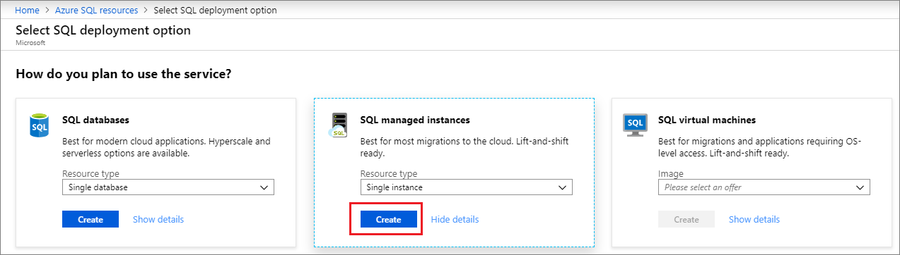

1. On the **Create Azure SQL Managed Instance** page, on the **Basics** tab:
    1. Under **Project Details**, select your **Subscription** from the drop-down and then choose to **Create New** resource group. Type in a name for your resource group, such as `myResourceGroup`. 
    1. Under **SQL Managed Instance Details**, provide the name of your managed instance, and the region where you would like to deploy your managed instance. Leave **Compute + storage** at default values. 
    1. Under **Administrator Account**, provide an admin login, such as `azureuser`, and a complex admin password. 

    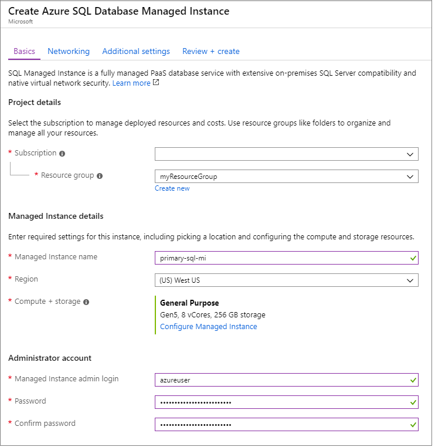

1. Leave the rest of the settings at default values, and select **Review + create** to review your SQL Managed Instance settings. 
1. Select **Create** to create your primary managed instance. 

# [PowerShell](#tab/azure-powershell)

Create your resource group and the primary managed instance using PowerShell. 

   ```powershell-interactive
   # Connect-AzAccount
   # The SubscriptionId in which to create these objects
   $SubscriptionId = '<Subscription-ID>'
   # Create a random identifier to use as subscript for the different resource names
   $randomIdentifier = $(Get-Random)
   # Set the resource group name and location for SQL Managed Instance
   $resourceGroupName = "myResourceGroup-$randomIdentifier"
   $location = "eastus"
   $drLocation = "eastus2"
   
   # Set the networking values for your primary managed instance
   $primaryVNet = "primaryVNet-$randomIdentifier"
   $primaryAddressPrefix = "10.0.0.0/16"
   $primaryDefaultSubnet = "primaryDefaultSubnet-$randomIdentifier"
   $primaryDefaultSubnetAddress = "10.0.0.0/24"
   $primaryMiSubnetName = "primaryMISubnet-$randomIdentifier"
   $primaryMiSubnetAddress = "10.0.0.0/24"
   $primaryMiGwSubnetAddress = "10.0.255.0/27"
   $primaryGWName = "primaryGateway-$randomIdentifier"
   $primaryGWPublicIPAddress = $primaryGWName + "-ip"
   $primaryGWIPConfig = $primaryGWName + "-ipc"
   $primaryGWAsn = 61000
   $primaryGWConnection = $primaryGWName + "-connection"
   
   
   # Set the networking values for your secondary managed instance
   $secondaryVNet = "secondaryVNet-$randomIdentifier"
   $secondaryAddressPrefix = "10.128.0.0/16"
   $secondaryDefaultSubnet = "secondaryDefaultSubnet-$randomIdentifier"
   $secondaryDefaultSubnetAddress = "10.128.0.0/24"
   $secondaryMiSubnetName = "secondaryMISubnet-$randomIdentifier"
   $secondaryMiSubnetAddress = "10.128.0.0/24"
   $secondaryMiGwSubnetAddress = "10.128.255.0/27"
   $secondaryGWName = "secondaryGateway-$randomIdentifier"
   $secondaryGWPublicIPAddress = $secondaryGWName + "-IP"
   $secondaryGWIPConfig = $secondaryGWName + "-ipc"
   $secondaryGWAsn = 62000
   $secondaryGWConnection = $secondaryGWName + "-connection"
   
   
   
   # Set the SQL Managed Instance name for the new managed instances
   $primaryInstance = "primary-mi-$randomIdentifier"
   $secondaryInstance = "secondary-mi-$randomIdentifier"
   
   # Set the admin login and password for SQL Managed Instance
   $secpasswd = "PWD27!"+(New-Guid).Guid | ConvertTo-SecureString -AsPlainText -Force
   $mycreds = New-Object System.Management.Automation.PSCredential ("azureuser", $secpasswd)
   
   
   # Set the SQL Managed Instance service tier, compute level, and license mode
   $edition = "General Purpose"
   $vCores = 8
   $maxStorage = 256
   $computeGeneration = "Gen5"
   $license = "LicenseIncluded" #"BasePrice" or LicenseIncluded if you have don't have SQL Server license that can be used for AHB discount
   
   # Set failover group details
   $vpnSharedKey = "mi1mi2psk"
   $failoverGroupName = "failovergroup-$randomIdentifier"
   
   # Show randomized variables
   Write-host "Resource group name is" $resourceGroupName
   Write-host "Password is" $secpasswd
   Write-host "Primary Virtual Network name is" $primaryVNet
   Write-host "Primary default subnet name is" $primaryDefaultSubnet
   Write-host "Primary SQL Managed Instance subnet name is" $primaryMiSubnetName
   Write-host "Secondary Virtual Network name is" $secondaryVNet
   Write-host "Secondary default subnet name is" $secondaryDefaultSubnet
   Write-host "Secondary SQL Managed Instance subnet name is" $secondaryMiSubnetName
   Write-host "Primary SQL Managed Instance name is" $primaryInstance
   Write-host "Secondary SQL Managed Instance name is" $secondaryInstance
   Write-host "Failover group name is" $failoverGroupName
   
   # Suppress networking breaking changes warning (https://aka.ms/azps-changewarnings
   Set-Item Env:\SuppressAzurePowerShellBreakingChangeWarnings "true"
   
   # Set the subscription context
   Set-AzContext -SubscriptionId $subscriptionId 
   
   # Create the resource group
   Write-host "Creating resource group..."
   $resourceGroup = New-AzResourceGroup -Name $resourceGroupName -Location $location -Tag @{Owner="SQLDB-Samples"}
   $resourceGroup
   
   # Configure the primary virtual network
   Write-host "Creating primary virtual network..."
   $primaryVirtualNetwork = New-AzVirtualNetwork `
                         -ResourceGroupName $resourceGroupName `
                         -Location $location `
                         -Name $primaryVNet `
                         -AddressPrefix $primaryAddressPrefix
   
                     Add-AzVirtualNetworkSubnetConfig `
                         -Name $primaryMiSubnetName `
                         -VirtualNetwork $primaryVirtualNetwork `
                         -AddressPrefix $PrimaryMiSubnetAddress `
                     | Set-AzVirtualNetwork
   $primaryVirtualNetwork
   
   
   # Configure the primary managed instance subnet
   Write-host "Configuring primary MI subnet..."
   $primaryVirtualNetwork = Get-AzVirtualNetwork -Name $primaryVNet -ResourceGroupName $resourceGroupName
   
   
   $primaryMiSubnetConfig = Get-AzVirtualNetworkSubnetConfig `
                           -Name $primaryMiSubnetName `
                           -VirtualNetwork $primaryVirtualNetwork
   $primaryMiSubnetConfig
   
   # Configure the network security group management service
   Write-host "Configuring primary MI subnet..."
   
   $primaryMiSubnetConfigId = $primaryMiSubnetConfig.Id
   
   $primaryNSGMiManagementService = New-AzNetworkSecurityGroup `
                         -Name 'primaryNSGMiManagementService' `
                         -ResourceGroupName $resourceGroupName `
                         -location $location
   $primaryNSGMiManagementService
   
   # Configure the route table management service
   Write-host "Configuring primary MI route table management service..."
   
   $primaryRouteTableMiManagementService = New-AzRouteTable `
                         -Name 'primaryRouteTableMiManagementService' `
                         -ResourceGroupName $resourceGroupName `
                         -location $location
   $primaryRouteTableMiManagementService
   
   # Configure the primary network security group
   Write-host "Configuring primary network security group..."
   Set-AzVirtualNetworkSubnetConfig `
                         -VirtualNetwork $primaryVirtualNetwork `
                         -Name $primaryMiSubnetName `
                         -AddressPrefix $PrimaryMiSubnetAddress `
                         -NetworkSecurityGroup $primaryNSGMiManagementService `
                         -RouteTable $primaryRouteTableMiManagementService | `
                       Set-AzVirtualNetwork
   
   Get-AzNetworkSecurityGroup `
                         -ResourceGroupName $resourceGroupName `
                         -Name "primaryNSGMiManagementService" `
                       | Add-AzNetworkSecurityRuleConfig `
                         -Priority 100 `
                         -Name "allow_management_inbound" `
                         -Access Allow `
                         -Protocol Tcp `
                         -Direction Inbound `
                         -SourcePortRange * `
                         -SourceAddressPrefix * `
                         -DestinationPortRange 9000,9003,1438,1440,1452 `
                         -DestinationAddressPrefix * `
                       | Add-AzNetworkSecurityRuleConfig `
                         -Priority 200 `
                         -Name "allow_misubnet_inbound" `
                         -Access Allow `
                         -Protocol * `
                         -Direction Inbound `
                         -SourcePortRange * `
                         -SourceAddressPrefix $PrimaryMiSubnetAddress `
                         -DestinationPortRange * `
                         -DestinationAddressPrefix * `
                       | Add-AzNetworkSecurityRuleConfig `
                         -Priority 300 `
                         -Name "allow_health_probe_inbound" `
                         -Access Allow `
                         -Protocol * `
                         -Direction Inbound `
                         -SourcePortRange * `
                         -SourceAddressPrefix AzureLoadBalancer `
                         -DestinationPortRange * `
                         -DestinationAddressPrefix * `
                       | Add-AzNetworkSecurityRuleConfig `
                         -Priority 1000 `
                         -Name "allow_tds_inbound" `
                         -Access Allow `
                         -Protocol Tcp `
                         -Direction Inbound `
                         -SourcePortRange * `
                         -SourceAddressPrefix VirtualNetwork `
                         -DestinationPortRange 1433 `
                         -DestinationAddressPrefix * `
                       | Add-AzNetworkSecurityRuleConfig `
                         -Priority 1100 `
                         -Name "allow_redirect_inbound" `
                         -Access Allow `
                         -Protocol Tcp `
                         -Direction Inbound `
                         -SourcePortRange * `
                         -SourceAddressPrefix VirtualNetwork `
                         -DestinationPortRange 11000-11999 `
                         -DestinationAddressPrefix * `
                       | Add-AzNetworkSecurityRuleConfig `
                         -Priority 1200 `
                         -Name "allow_geodr_inbound" `
                         -Access Allow `
                         -Protocol Tcp `
                         -Direction Inbound `
                         -SourcePortRange * `
                         -SourceAddressPrefix VirtualNetwork `
                         -DestinationPortRange 5022 `
                         -DestinationAddressPrefix * `
                       | Add-AzNetworkSecurityRuleConfig `
                         -Priority 4096 `
                         -Name "deny_all_inbound" `
                         -Access Deny `
                         -Protocol * `
                         -Direction Inbound `
                         -SourcePortRange * `
                         -SourceAddressPrefix * `
                         -DestinationPortRange * `
                         -DestinationAddressPrefix * `
                       | Add-AzNetworkSecurityRuleConfig `
                         -Priority 100 `
                         -Name "allow_management_outbound" `
                         -Access Allow `
                         -Protocol Tcp `
                         -Direction Outbound `
                         -SourcePortRange * `
                         -SourceAddressPrefix * `
                         -DestinationPortRange 80,443,12000 `
                         -DestinationAddressPrefix * `
                       | Add-AzNetworkSecurityRuleConfig `
                         -Priority 200 `
                         -Name "allow_misubnet_outbound" `
                         -Access Allow `
                         -Protocol * `
                         -Direction Outbound `
                         -SourcePortRange * `
                         -SourceAddressPrefix * `
                         -DestinationPortRange * `
                         -DestinationAddressPrefix $PrimaryMiSubnetAddress `
                       | Add-AzNetworkSecurityRuleConfig `
                         -Priority 1100 `
                         -Name "allow_redirect_outbound" `
                         -Access Allow `
                         -Protocol Tcp `
                         -Direction Outbound `
                         -SourcePortRange * `
                         -SourceAddressPrefix VirtualNetwork `
                         -DestinationPortRange 11000-11999 `
                         -DestinationAddressPrefix * `
                       | Add-AzNetworkSecurityRuleConfig `
                         -Priority 1200 `
                         -Name "allow_geodr_outbound" `
                         -Access Allow `
                         -Protocol Tcp `
                         -Direction Outbound `
                         -SourcePortRange * `
                         -SourceAddressPrefix VirtualNetwork `
                         -DestinationPortRange 5022 `
                         -DestinationAddressPrefix * `
                       | Add-AzNetworkSecurityRuleConfig `
                         -Priority 4096 `
                         -Name "deny_all_outbound" `
                         -Access Deny `
                         -Protocol * `
                         -Direction Outbound `
                         -SourcePortRange * `
                         -SourceAddressPrefix * `
                         -DestinationPortRange * `
                         -DestinationAddressPrefix * `
                       | Set-AzNetworkSecurityGroup
   Write-host "Primary network security group configured successfully."
   
   
   Get-AzRouteTable `
                         -ResourceGroupName $resourceGroupName `
                         -Name "primaryRouteTableMiManagementService" `
                       | Add-AzRouteConfig `
                         -Name "primaryToMIManagementService" `
                         -AddressPrefix 0.0.0.0/0 `
                         -NextHopType Internet `
                       | Add-AzRouteConfig `
                         -Name "ToLocalClusterNode" `
                         -AddressPrefix $PrimaryMiSubnetAddress `
                         -NextHopType VnetLocal `
                       | Set-AzRouteTable
   Write-host "Primary network route table configured successfully."
   
   
   # Create the primary managed instance
   
   Write-host "Creating primary SQL Managed Instance..."
   Write-host "This will take some time, see https://docs.microsoft.com/azure/sql-database/sql-database-managed-instance#managed-instance-management-operations or more information."
   New-AzSqlInstance -Name $primaryInstance `
                         -ResourceGroupName $resourceGroupName `
                         -Location $location `
                         -SubnetId $primaryMiSubnetConfigId `
                         -AdministratorCredential $mycreds `
                         -StorageSizeInGB $maxStorage `
                         -VCore $vCores `
                         -Edition $edition `
                         -ComputeGeneration $computeGeneration `
                         -LicenseType $license
   Write-host "Primary SQL Managed Instance created successfully."
   ```

This portion of the tutorial uses the following PowerShell cmdlets:

| Command | Notes |
|---|---|
| [New-AzResourceGroup](/powershell/module/az.resources/new-azresourcegroup) | Creates an Azure resource group.  |
| [New-AzVirtualNetwork](/powershell/module/az.network/new-azvirtualnetwork) | Creates a virtual network.  |
| [Add-AzVirtualNetworkSubnetConfig](/powershell/module/az.network/add-azvirtualnetworksubnetconfig) | Adds a subnet configuration to a virtual network. | 
| [Get-AzVirtualNetwork](/powershell/module/az.network/get-azvirtualnetwork) | Gets a virtual network in a resource group. | 
| [Get-AzVirtualNetworkSubnetConfig](/powershell/module/az.network/get-azvirtualnetworksubnetconfig) | Gets a subnet in a virtual network. | 
| [New-AzNetworkSecurityGroup](/powershell/module/az.network/new-aznetworksecuritygroup) | Creates a network security group. | 
| [New-AzRouteTable](/powershell/module/az.network/new-azroutetable) | Creates a route table. |
| [Set-AzVirtualNetworkSubnetConfig](/powershell/module/az.network/set-azvirtualnetworksubnetconfig) | Updates a subnet configuration for a virtual network.  |
| [Set-AzVirtualNetwork](/powershell/module/az.network/set-azvirtualnetwork) | Updates a virtual network.  |
| [Get-AzNetworkSecurityGroup](/powershell/module/az.network/get-aznetworksecuritygroup) | Gets a network security group. |
| [Add-AzNetworkSecurityRuleConfig](/powershell/module/az.network/add-aznetworksecurityruleconfig)| Adds a network security rule configuration to a network security group. |
| [Set-AzNetworkSecurityGroup](/powershell/module/az.network/set-aznetworksecuritygroup) | Updates a network security group.  | 
| [Add-AzRouteConfig](/powershell/module/az.network/add-azrouteconfig) | Adds a route to a route table. |
| [Set-AzRouteTable](/powershell/module/az.network/set-azroutetable) | Updates a route table.  |
| [New-AzSqlInstance](/powershell/module/az.sql/new-azsqlinstance) | Creates a managed instance.  |

---

## 2 - Create secondary virtual network

If you're using the Azure portal to create your managed instance, you will need to create the virtual network separately because there is a requirement that the subnet of the primary and secondary managed instance do not have overlapping ranges. If you're using PowerShell to configure your managed instance, skip ahead to step 3. 

# [Portal](#tab/azure-portal) 

To verify the subnet range of your primary virtual network, follow these steps:

1. In the [Azure portal](https://portal.azure.com), navigate to your resource group and select the virtual network for your primary instance.  
2. Select **Subnets** under **Settings** and note the **Address range**. The subnet address range of the virtual network for the secondary managed instance cannot overlap this. 


   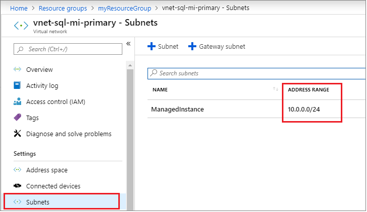

To create a virtual network, follow these steps:

1. In the [Azure portal](https://portal.azure.com), select **Create a resource** and search for *virtual network*. 
1. Select the **Virtual Network** option published by Microsoft and then select **Create** on the next page. 
1. Fill out the required fields to configure the virtual network for your secondary managed instance, and then select **Create**. 

   The following table shows the values necessary for the secondary virtual network:

    | **Field** | Value |
    | --- | --- |
    | **Name** |  The name for the virtual network to be used by the secondary managed instance, such as `vnet-sql-mi-secondary`. |
    | **Address space** | The address space for your virtual network, such as `10.128.0.0/16`. | 
    | **Subscription** | The subscription where your primary managed instance and resource group reside. |
    | **Region** | The location where you will deploy your secondary managed instance. |
    | **Subnet** | The name for your subnet. `default` is provided for you by default. |
    | **Address range**| The address range for your subnet. This must be different than the subnet address range used by the virtual network of your primary managed instance, such as `10.128.0.0/24`.  |
    | &nbsp; | &nbsp; |

    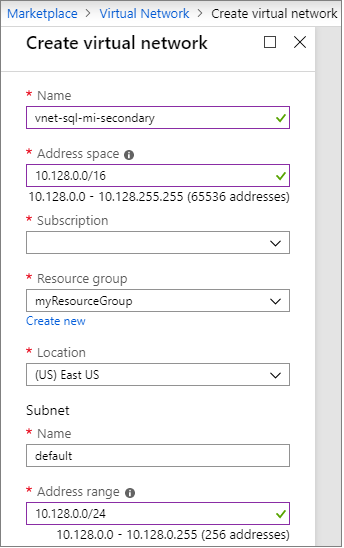

# [PowerShell](#tab/azure-powershell)

This step is only necessary if you're using the Azure portal to deploy SQL Managed Instance. Skip ahead to step 3 if you're using PowerShell. 

---

## 3 - Create a secondary managed instance
In this step, you will create a secondary managed instance in the Azure portal, which will also configure the networking between the two managed instances. 

Your second managed instance must:
- Be empty. 
- Have a different subnet and IP range than the primary managed instance. 

# [Portal](#tab/azure-portal) 

Create the secondary managed instance using the Azure portal. 

1. Select **Azure SQL** in the left-hand menu of the Azure portal. If **Azure SQL** is not in the list, select **All services**, and then type `Azure SQL` in the search box. (Optional) Select the star next to **Azure SQL** to favorite it and add it as an item in the left-hand navigation. 
1. Select **+ Add** to open the **Select SQL deployment option** page. You can view additional information about the different databases by selecting **Show details** on the **Databases** tile.
1. Select **Create** on the **SQL managed instances** tile. 

    

1. On the **Basics** tab of the **Create Azure SQL Managed Instance** page, fill out the required fields to configure your secondary managed instance. 

   The following table shows the values necessary for the secondary managed instance:
 
    | **Field** | Value |
    | --- | --- |
    | **Subscription** |  The subscription where your primary managed instance is. |
    | **Resource group**| The resource group where your primary managed instance is. |
    | **SQL Managed Instance name** | The name of your new secondary managed instance, such as `sql-mi-secondary`.  | 
    | **Region**| The location for your secondary managed instance.  |
    | **SQL Managed Instance admin login** | The login you want to use for your new secondary managed instance, such as `azureuser`. |
    | **Password** | A complex password that will be used by the admin login for the new secondary managed instance.  |
    | &nbsp; | &nbsp; |

1. Under the **Networking** tab, for the **Virtual Network**, select the virtual network you created for the secondary managed instance from the drop-down.

   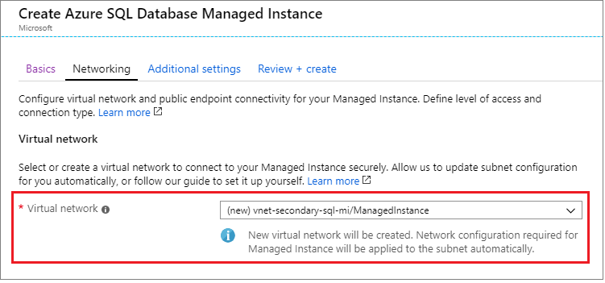

1. Under the **Additional settings** tab, for **Geo-Replication**, choose **Yes** to _Use as failover secondary_. Select the primary managed instance from the drop-down. 
    
   Be sure that the collation and time zone match that of the primary managed instance. The primary managed instance created in this tutorial used the default of `SQL_Latin1_General_CP1_CI_AS` collation and the `(UTC) Coordinated Universal Time` time zone. 

   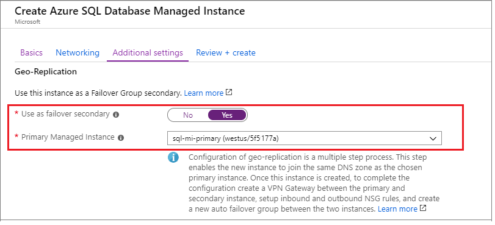

1. Select **Review + create** to review the settings for your secondary managed instance. 
1. Select **Create** to create your secondary managed instance. 

# [PowerShell](#tab/azure-powershell)

Create the secondary managed instance using PowerShell. 

   ```powershell-interactive
   # Configure the secondary virtual network
   Write-host "Configuring secondary virtual network..."
   
   $SecondaryVirtualNetwork = New-AzVirtualNetwork `
                         -ResourceGroupName $resourceGroupName `
                         -Location $drlocation `
                         -Name $secondaryVNet `
                         -AddressPrefix $secondaryAddressPrefix
   
   Add-AzVirtualNetworkSubnetConfig `
                         -Name $secondaryMiSubnetName `
                         -VirtualNetwork $SecondaryVirtualNetwork `
                         -AddressPrefix $secondaryMiSubnetAddress `
                       | Set-AzVirtualNetwork
   $SecondaryVirtualNetwork
   
   # Configure the secondary managed instance subnet
   Write-host "Configuring secondary MI subnet..."
   
   $SecondaryVirtualNetwork = Get-AzVirtualNetwork -Name $secondaryVNet `
                                   -ResourceGroupName $resourceGroupName
   
   $secondaryMiSubnetConfig = Get-AzVirtualNetworkSubnetConfig `
                           -Name $secondaryMiSubnetName `
                           -VirtualNetwork $SecondaryVirtualNetwork
   $secondaryMiSubnetConfig
   
   # Configure the secondary network security group management service
   Write-host "Configuring secondary network security group management service..."
   
   $secondaryMiSubnetConfigId = $secondaryMiSubnetConfig.Id
   
   $secondaryNSGMiManagementService = New-AzNetworkSecurityGroup `
                         -Name 'secondaryToMIManagementService' `
                         -ResourceGroupName $resourceGroupName `
                         -location $drlocation
   $secondaryNSGMiManagementService
   
   # Configure the secondary route table MI management service
   Write-host "Configuring secondary route table MI management service..."
   
   $secondaryRouteTableMiManagementService = New-AzRouteTable `
                         -Name 'secondaryRouteTableMiManagementService' `
                         -ResourceGroupName $resourceGroupName `
                         -location $drlocation
   $secondaryRouteTableMiManagementService
   
   # Configure the secondary network security group
   Write-host "Configuring secondary network security group..."
   
   Set-AzVirtualNetworkSubnetConfig `
                         -VirtualNetwork $SecondaryVirtualNetwork `
                         -Name $secondaryMiSubnetName `
                         -AddressPrefix $secondaryMiSubnetAddress `
                         -NetworkSecurityGroup $secondaryNSGMiManagementService `
                         -RouteTable $secondaryRouteTableMiManagementService `
                       | Set-AzVirtualNetwork
   
   Get-AzNetworkSecurityGroup `
                         -ResourceGroupName $resourceGroupName `
                         -Name "secondaryToMIManagementService" `
                       | Add-AzNetworkSecurityRuleConfig `
                         -Priority 100 `
                         -Name "allow_management_inbound" `
                         -Access Allow `
                         -Protocol Tcp `
                         -Direction Inbound `
                         -SourcePortRange * `
                         -SourceAddressPrefix * `
                         -DestinationPortRange 9000,9003,1438,1440,1452 `
                         -DestinationAddressPrefix * `
                       | Add-AzNetworkSecurityRuleConfig `
                         -Priority 200 `
                         -Name "allow_misubnet_inbound" `
                         -Access Allow `
                         -Protocol * `
                         -Direction Inbound `
                         -SourcePortRange * `
                         -SourceAddressPrefix $secondaryMiSubnetAddress `
                         -DestinationPortRange * `
                         -DestinationAddressPrefix * `
                       | Add-AzNetworkSecurityRuleConfig `
                         -Priority 300 `
                         -Name "allow_health_probe_inbound" `
                         -Access Allow `
                         -Protocol * `
                         -Direction Inbound `
                         -SourcePortRange * `
                         -SourceAddressPrefix AzureLoadBalancer `
                         -DestinationPortRange * `
                         -DestinationAddressPrefix * `
                       | Add-AzNetworkSecurityRuleConfig `
                         -Priority 1000 `
                         -Name "allow_tds_inbound" `
                         -Access Allow `
                         -Protocol Tcp `
                         -Direction Inbound `
                         -SourcePortRange * `
                         -SourceAddressPrefix VirtualNetwork `
                         -DestinationPortRange 1433 `
                         -DestinationAddressPrefix * `
                       | Add-AzNetworkSecurityRuleConfig `
                         -Priority 1100 `
                         -Name "allow_redirect_inbound" `
                         -Access Allow `
                         -Protocol Tcp `
                         -Direction Inbound `
                         -SourcePortRange * `
                         -SourceAddressPrefix VirtualNetwork `
                         -DestinationPortRange 11000-11999 `
                         -DestinationAddressPrefix * `
                       | Add-AzNetworkSecurityRuleConfig `
                         -Priority 1200 `
                         -Name "allow_geodr_inbound" `
                         -Access Allow `
                         -Protocol Tcp `
                         -Direction Inbound `
                         -SourcePortRange * `
                         -SourceAddressPrefix VirtualNetwork `
                         -DestinationPortRange 5022 `
                         -DestinationAddressPrefix * `
                       | Add-AzNetworkSecurityRuleConfig `
                         -Priority 4096 `
                         -Name "deny_all_inbound" `
                         -Access Deny `
                         -Protocol * `
                         -Direction Inbound `
                         -SourcePortRange * `
                         -SourceAddressPrefix * `
                         -DestinationPortRange * `
                         -DestinationAddressPrefix * `
                       | Add-AzNetworkSecurityRuleConfig `
                         -Priority 100 `
                         -Name "allow_management_outbound" `
                         -Access Allow `
                         -Protocol Tcp `
                         -Direction Outbound `
                         -SourcePortRange * `
                         -SourceAddressPrefix * `
                         -DestinationPortRange 80,443,12000 `
                         -DestinationAddressPrefix * `
                       | Add-AzNetworkSecurityRuleConfig `
                         -Priority 200 `
                         -Name "allow_misubnet_outbound" `
                         -Access Allow `
                         -Protocol * `
                         -Direction Outbound `
                         -SourcePortRange * `
                         -SourceAddressPrefix * `
                         -DestinationPortRange * `
                         -DestinationAddressPrefix $secondaryMiSubnetAddress `
                       | Add-AzNetworkSecurityRuleConfig `
                         -Priority 1100 `
                         -Name "allow_redirect_outbound" `
                         -Access Allow `
                         -Protocol Tcp `
                         -Direction Outbound `
                         -SourcePortRange * `
                         -SourceAddressPrefix VirtualNetwork `
                         -DestinationPortRange 11000-11999 `
                         -DestinationAddressPrefix * `
                       | Add-AzNetworkSecurityRuleConfig `
                         -Priority 1200 `
                         -Name "allow_geodr_outbound" `
                         -Access Allow `
                         -Protocol Tcp `
                         -Direction Outbound `
                         -SourcePortRange * `
                         -SourceAddressPrefix VirtualNetwork `
                         -DestinationPortRange 5022 `
                         -DestinationAddressPrefix * `
                       | Add-AzNetworkSecurityRuleConfig `
                         -Priority 4096 `
                         -Name "deny_all_outbound" `
                         -Access Deny `
                         -Protocol * `
                         -Direction Outbound `
                         -SourcePortRange * `
                         -SourceAddressPrefix * `
                         -DestinationPortRange * `
                         -DestinationAddressPrefix * `
                       | Set-AzNetworkSecurityGroup
   
   
   Get-AzRouteTable `
                         -ResourceGroupName $resourceGroupName `
                         -Name "secondaryRouteTableMiManagementService" `
                       | Add-AzRouteConfig `
                         -Name "secondaryToMIManagementService" `
                         -AddressPrefix 0.0.0.0/0 `
                         -NextHopType Internet `
                       | Add-AzRouteConfig `
                         -Name "ToLocalClusterNode" `
                         -AddressPrefix $secondaryMiSubnetAddress `
                         -NextHopType VnetLocal `
                       | Set-AzRouteTable
   Write-host "Secondary network security group configured successfully."
   
   # Create the secondary managed instance
   
   $primaryManagedInstanceId = Get-AzSqlInstance -Name $primaryInstance -ResourceGroupName $resourceGroupName | Select-Object Id
   
   
   Write-host "Creating secondary SQL Managed Instance..."
   Write-host "This will take some time, see https://docs.microsoft.com/azure/sql-database/sql-database-managed-instance#managed-instance-management-operations or more information."
   New-AzSqlInstance -Name $secondaryInstance `
                     -ResourceGroupName $resourceGroupName `
                     -Location $drLocation `
                     -SubnetId $secondaryMiSubnetConfigId `
                     -AdministratorCredential $mycreds `
                     -StorageSizeInGB $maxStorage `
                     -VCore $vCores `
                     -Edition $edition `
                     -ComputeGeneration $computeGeneration `
                     -LicenseType $license `
                     -DnsZonePartner $primaryManagedInstanceId.Id
   Write-host "Secondary SQL Managed Instance created successfully."
   ```

This portion of the tutorial uses the following PowerShell cmdlets:

| Command | Notes |
|---|---|
| [New-AzResourceGroup](/powershell/module/az.resources/new-azresourcegroup) | Creates an Azure resource group.  |
| [New-AzVirtualNetwork](/powershell/module/az.network/new-azvirtualnetwork) | Creates a virtual network.  |
| [Add-AzVirtualNetworkSubnetConfig](/powershell/module/az.network/add-azvirtualnetworksubnetconfig) | Adds a subnet configuration to a virtual network. | 
| [Get-AzVirtualNetwork](/powershell/module/az.network/get-azvirtualnetwork) | Gets a virtual network in a resource group. | 
| [Get-AzVirtualNetworkSubnetConfig](/powershell/module/az.network/get-azvirtualnetworksubnetconfig) | Gets a subnet in a virtual network. | 
| [New-AzNetworkSecurityGroup](/powershell/module/az.network/new-aznetworksecuritygroup) | Creates a network security group. | 
| [New-AzRouteTable](/powershell/module/az.network/new-azroutetable) | Creates a route table. |
| [Set-AzVirtualNetworkSubnetConfig](/powershell/module/az.network/set-azvirtualnetworksubnetconfig) | Updates a subnet configuration for a virtual network.  |
| [Set-AzVirtualNetwork](/powershell/module/az.network/set-azvirtualnetwork) | Updates a virtual network.  |
| [Get-AzNetworkSecurityGroup](/powershell/module/az.network/get-aznetworksecuritygroup) | Gets a network security group. |
| [Add-AzNetworkSecurityRuleConfig](/powershell/module/az.network/add-aznetworksecurityruleconfig)| Adds a network security rule configuration to a network security group. |
| [Set-AzNetworkSecurityGroup](/powershell/module/az.network/set-aznetworksecuritygroup) | Updates a network security group.  | 
| [Add-AzRouteConfig](/powershell/module/az.network/add-azrouteconfig) | Adds a route to a route table. |
| [Set-AzRouteTable](/powershell/module/az.network/set-azroutetable) | Updates a route table.  |
| [New-AzSqlInstance](/powershell/module/az.sql/new-azsqlinstance) | Creates a managed instance.  |

---

## 4 - Create a primary gateway 

For two managed instances to participate in a failover group, there must be either ExpressRoute or a gateway configured between the virtual networks of the two managed instances to allow network communication. If you choose to configure [ExpressRoute](../../expressroute/expressroute-howto-circuit-portal-resource-manager.md) instead of connecting two VPN gateways, skip ahead to [Step 7](#7---create-a-failover-group).  

This article provides steps to create the two VPN gateways and connect them, but you can skip ahead to creating the failover group if you have configured ExpressRoute instead. 


# [Portal](#tab/azure-portal)

Create the gateway for the virtual network of your primary managed instance using the Azure portal. 


1. In the [Azure portal](https://portal.azure.com), go to your resource group and select the **Virtual network** resource for your primary managed instance. 
1. Select **Subnets** under **Settings** and then select to add a new **Gateway subnet**. Leave the default values. 

   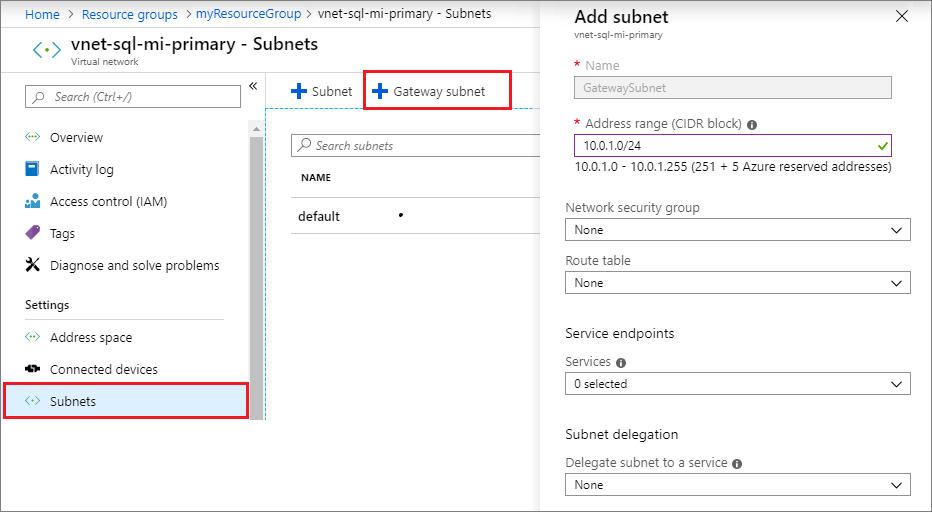

1. Once the subnet gateway is created, select **Create a resource** from the left navigation pane and then type `Virtual network gateway` in the search box. Select the **Virtual network gateway** resource published by **Microsoft**. 

   

1. Fill out the required fields to configure the gateway for your primary managed instance. 

   The following table shows the values necessary for the gateway for the primary managed instance:
 
    | **Field** | Value |
    | --- | --- |
    | **Subscription** |  The subscription where your primary managed instance is. |
    | **Name** | The name for your virtual network gateway, such as `primary-mi-gateway`. | 
    | **Region** | The region where your primary managed instance is. |
    | **Gateway type** | Select **VPN**. |
    | **VPN Type** | Select **Route-based**. |
    | **SKU**| Leave default of `VpnGw1`. |
    | **Location**| The location where your primary managed instance and primary virtual network are.   |
    | **Virtual network**| Select the virtual network that was created in section 2, such as `vnet-sql-mi-primary`. |
    | **Public IP address**| Select **Create new**. |
    | **Public IP address name**| Enter a name for your IP address, such as `primary-gateway-IP`. |
    | &nbsp; | &nbsp; |

1. Leave the other values as default, and then select **Review + create** to review the settings for your virtual network gateway.

   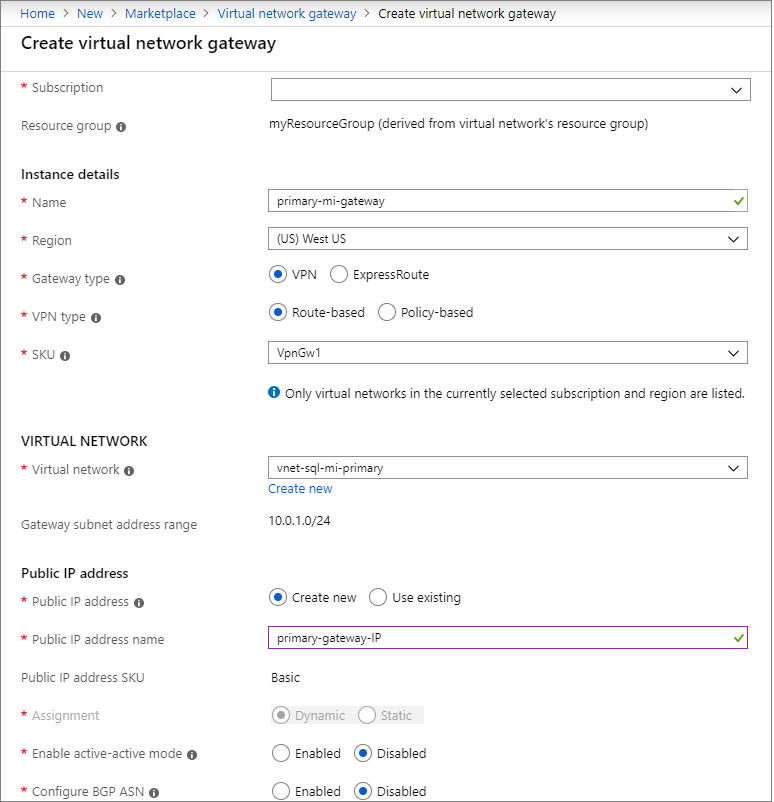

1. Select **Create** to create your new virtual network gateway. 


# [PowerShell](#tab/azure-powershell)

Create the gateway for the virtual network of your primary managed instance using PowerShell. 

   ```powershell-interactive
   # Create the primary gateway
   Write-host "Adding GatewaySubnet to primary VNet..."
   Get-AzVirtualNetwork `
                     -Name $primaryVNet `
                     -ResourceGroupName $resourceGroupName `
                   | Add-AzVirtualNetworkSubnetConfig `
                     -Name "GatewaySubnet" `
                     -AddressPrefix $primaryMiGwSubnetAddress `
                   | Set-AzVirtualNetwork
   
   $primaryVirtualNetwork  = Get-AzVirtualNetwork `
                     -Name $primaryVNet `
                     -ResourceGroupName $resourceGroupName
   $primaryGatewaySubnet = Get-AzVirtualNetworkSubnetConfig `
                     -Name "GatewaySubnet" `
                     -VirtualNetwork $primaryVirtualNetwork
   
   Write-host "Creating primary gateway..."
   Write-host "This will take some time."
   $primaryGWPublicIP = New-AzPublicIpAddress -Name $primaryGWPublicIPAddress -ResourceGroupName $resourceGroupName `
            -Location $location -AllocationMethod Dynamic
   $primaryGatewayIPConfig = New-AzVirtualNetworkGatewayIpConfig -Name $primaryGWIPConfig `
            -Subnet $primaryGatewaySubnet -PublicIpAddress $primaryGWPublicIP
   
   $primaryGateway = New-AzVirtualNetworkGateway -Name $primaryGWName -ResourceGroupName $resourceGroupName `
       -Location $location -IpConfigurations $primaryGatewayIPConfig -GatewayType Vpn `
       -VpnType RouteBased -GatewaySku VpnGw1 -EnableBgp $true -Asn $primaryGWAsn
   $primaryGateway
   ```

This portion of the tutorial uses the following PowerShell cmdlets:

| Command | Notes |
|---|---|
| [Get-AzVirtualNetwork](/powershell/module/az.network/get-azvirtualnetwork) | Gets a virtual network in a resource group. |
| [Add-AzVirtualNetworkSubnetConfig](/powershell/module/az.network/add-azvirtualnetworksubnetconfig) | Adds a subnet configuration to a virtual network. | 
| [Set-AzVirtualNetwork](/powershell/module/az.network/set-azvirtualnetwork) | Updates a virtual network.  |
| [Get-AzVirtualNetworkSubnetConfig](/powershell/module/az.network/get-azvirtualnetworksubnetconfig) | Gets a subnet in a virtual network. |
| [New-AzPublicIpAddress](/powershell/module/az.network/new-azpublicipaddress) | Creates a public IP address.  | 
| [New-AzVirtualNetworkGatewayIpConfig](/powershell/module/az.network/new-azvirtualnetworkgatewayipconfig) | Creates an IP configuration for a virtual network gateway. |
| [New-AzVirtualNetworkGateway](/powershell/module/az.network/new-azvirtualnetworkgateway) | Creates a virtual network gateway. |


---


## 5 - Create secondary gateway 
In this step, create the gateway for the virtual network of your secondary managed instance using the Azure portal. 


# [Portal](#tab/azure-portal)

Using the Azure portal, repeat the steps in the previous section to create the virtual network subnet and gateway for the secondary managed instance. Fill out the required fields to configure the gateway for your secondary managed instance. 

   The following table shows the values necessary for the gateway for the secondary managed instance:

   | **Field** | Value |
   | --- | --- |
   | **Subscription** |  The subscription where your secondary managed instance is. |
   | **Name** | The name for your virtual network gateway, such as `secondary-mi-gateway`. | 
   | **Region** | The region where your secondary managed instance is. |
   | **Gateway type** | Select **VPN**. |
   | **VPN Type** | Select **Route-based**. |
   | **SKU**| Leave default of `VpnGw1`. |
   | **Location**| The location where your secondary managed instance and secondary virtual network are.   |
   | **Virtual network**| Select the virtual network that was created in section 2, such as `vnet-sql-mi-secondary`. |
   | **Public IP address**| Select **Create new**. |
   | **Public IP address name**| Enter a name for your IP address, such as `secondary-gateway-IP`. |
   | &nbsp; | &nbsp; |

   


# [PowerShell](#tab/azure-powershell)

Create the gateway for the virtual network of the secondary managed instance using PowerShell. 

   ```powershell-interactive
   # Create the secondary gateway
   Write-host "Creating secondary gateway..."
   
   Write-host "Adding GatewaySubnet to secondary VNet..."
   Get-AzVirtualNetwork `
                     -Name $secondaryVNet `
                     -ResourceGroupName $resourceGroupName `
                   | Add-AzVirtualNetworkSubnetConfig `
                     -Name "GatewaySubnet" `
                     -AddressPrefix $secondaryMiGwSubnetAddress `
                   | Set-AzVirtualNetwork
   
   $secondaryVirtualNetwork  = Get-AzVirtualNetwork `
                     -Name $secondaryVNet `
                     -ResourceGroupName $resourceGroupName
   $secondaryGatewaySubnet = Get-AzVirtualNetworkSubnetConfig `
                     -Name "GatewaySubnet" `
                     -VirtualNetwork $secondaryVirtualNetwork
   $drLocation = $secondaryVirtualNetwork.Location
   
   Write-host "Creating primary gateway..."
   Write-host "This will take some time."
   $secondaryGWPublicIP = New-AzPublicIpAddress -Name $secondaryGWPublicIPAddress -ResourceGroupName $resourceGroupName `
            -Location $drLocation -AllocationMethod Dynamic
   $secondaryGatewayIPConfig = New-AzVirtualNetworkGatewayIpConfig -Name $secondaryGWIPConfig `
            -Subnet $secondaryGatewaySubnet -PublicIpAddress $secondaryGWPublicIP
   
   $secondaryGateway = New-AzVirtualNetworkGateway -Name $secondaryGWName -ResourceGroupName $resourceGroupName `
       -Location $drLocation -IpConfigurations $secondaryGatewayIPConfig -GatewayType Vpn `
       -VpnType RouteBased -GatewaySku VpnGw1 -EnableBgp $true -Asn $secondaryGWAsn
   $secondaryGateway
   ```

This portion of the tutorial uses the following PowerShell cmdlets:

| Command | Notes |
|---|---|
| [Get-AzVirtualNetwork](/powershell/module/az.network/get-azvirtualnetwork) | Gets a virtual network in a resource group. |
| [Add-AzVirtualNetworkSubnetConfig](/powershell/module/az.network/add-azvirtualnetworksubnetconfig) | Adds a subnet configuration to a virtual network. | 
| [Set-AzVirtualNetwork](/powershell/module/az.network/set-azvirtualnetwork) | Updates a virtual network.  |
| [Get-AzVirtualNetworkSubnetConfig](/powershell/module/az.network/get-azvirtualnetworksubnetconfig) | Gets a subnet in a virtual network. |
| [New-AzPublicIpAddress](/powershell/module/az.network/new-azpublicipaddress) | Creates a public IP address.  | 
| [New-AzVirtualNetworkGatewayIpConfig](/powershell/module/az.network/new-azvirtualnetworkgatewayipconfig) | Creates an IP configuration for a virtual network gateway. |
| [New-AzVirtualNetworkGateway](/powershell/module/az.network/new-azvirtualnetworkgateway) | Creates a virtual network gateway. |

---


## 6 - Connect the gateways
In this step, create a bidirectional connection between the two gateways of the two virtual networks. 


# [Portal](#tab/azure-portal)

Connect the two gateways using the Azure portal. 


1. Select **Create a resource** from the [Azure portal](https://portal.azure.com).
1. Type `connection` in the search box and then press enter to search, which takes you to the **Connection** resource, published by Microsoft.
1. Select **Create** to create your connection. 
1. On the **Basics** tab, select the following values and then select **OK**. 
    1. Select `VNet-to-VNet` for the **Connection type**. 
    1. Select your subscription from the drop-down. 
    1. Select the resource group for SQL Managed Instance in the drop-down. 
    1. Select the location of your primary managed instance from the drop-down. 
1. On the **Settings** tab, select or enter the following values and then select **OK**:
    1. Choose the primary network gateway for the **First virtual network gateway**, such as `Primary-Gateway`.  
    1. Choose the secondary network gateway for the **Second virtual network gateway**, such as `Secondary-Gateway`. 
    1. Select the checkbox next to **Establish bidirectional connectivity**. 
    1. Either leave the default primary connection name, or rename it to a value of your choice. 
    1. Provide a **Shared key (PSK)** for the connection, such as `mi1m2psk`. 

   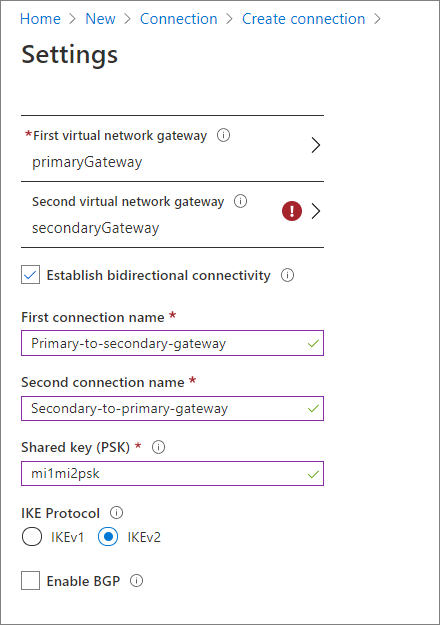

1. On the **Summary** tab, review the settings for your bidirectional connection and then select **OK** to create your connection. 


# [PowerShell](#tab/azure-powershell)

Connect the two gateways using PowerShell. 

   ```powershell-interactive
   # Connect the primary to secondary gateway
   Write-host "Connecting the primary gateway to secondary gateway..."
   New-AzVirtualNetworkGatewayConnection -Name $primaryGWConnection -ResourceGroupName $resourceGroupName `
       -VirtualNetworkGateway1 $primaryGateway -VirtualNetworkGateway2 $secondaryGateway -Location $location `
       -ConnectionType Vnet2Vnet -SharedKey $vpnSharedKey -EnableBgp $true
   $primaryGWConnection
   
   # Connect the secondary to primary gateway
   Write-host "Connecting the secondary gateway to primary gateway..."
   
   New-AzVirtualNetworkGatewayConnection -Name $secondaryGWConnection -ResourceGroupName $resourceGroupName `
       -VirtualNetworkGateway1 $secondaryGateway -VirtualNetworkGateway2 $primaryGateway -Location $drLocation `
       -ConnectionType Vnet2Vnet -SharedKey $vpnSharedKey -EnableBgp $true
   $secondaryGWConnection
   ```

This portion of the tutorial uses the following PowerShell cmdlet:

| Command | Notes |
|---|---|
| [New-AzVirtualNetworkGatewayConnection](/powershell/module/az.network/new-azvirtualnetworkgatewayconnection) | Creates a connection between the two virtual network gateways.   |

---


## 7 - Create a failover group
In this step, you will create the failover group and add both managed instances to it. 


# [Portal](#tab/azure-portal)
Create the failover group using the Azure portal. 


1. Select **Azure SQL** in the left-hand menu of the [Azure portal](https://portal.azure.com). If **Azure SQL** is not in the list, select **All services**, and then type `Azure SQL` in the search box. (Optional) Select the star next to **Azure SQL** to favorite it and add it as an item in the left-hand navigation. 
1. Select the primary managed instance you created in the first section, such as `sql-mi-primary`. 
1. Under **Settings**, navigate to **Instance Failover Groups** and then choose **Add group** to open the **Instance Failover Group** page. 

   

1. On the **Instance Failover Group** page, type the name of  your failover group, such as `failovergrouptutorial`. Then choose the secondary managed instance, such as `sql-mi-secondary`, from the drop-down. Select **Create** to create your failover group. 

   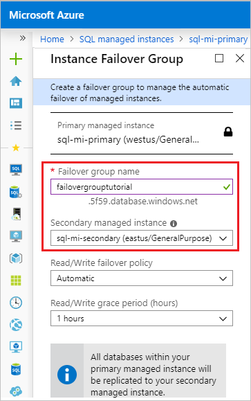

1. Once failover group deployment is complete, you will be taken back to the **Failover group** page. 


# [PowerShell](#tab/azure-powershell)
Create the failover group using PowerShell. 

   ```powershell-interactive
   Write-host "Creating the failover group..."
   $failoverGroup = New-AzSqlDatabaseInstanceFailoverGroup -Name $failoverGroupName `
        -Location $location -ResourceGroupName $resourceGroupName -PrimaryManagedInstanceName $primaryInstance `
        -PartnerRegion $drLocation -PartnerManagedInstanceName $secondaryInstance `
        -FailoverPolicy Automatic -GracePeriodWithDataLossHours 1
   $failoverGroup
   ```

This portion of the tutorial uses the following PowerShell cmdlet:

| Command | Notes |
|---|---|
| [New-AzSqlDatabaseInstanceFailoverGroup](/powershell/module/az.sql/new-azsqldatabaseinstancefailovergroup)| Creates a new Azure SQL Managed Instance failover group.  |


---


## 8 - Test failover
In this step, you will fail your failover group over to the secondary server, and then fail back using the Azure portal. 


# [Portal](#tab/azure-portal)
Test failover using the Azure portal. 


1. Navigate to your _secondary_ managed instance within the [Azure portal](https://portal.azure.com) and select **Instance Failover Groups** under settings. 
1. Review which managed instance is the primary, and which managed instance is the secondary. 
1. Select **Failover** and then select **Yes** on the warning about TDS sessions being disconnected. 

   

1. Review which managed instance is the primary and which managed instance is the secondary. If failover succeeded, the two instances should have switched roles. 

   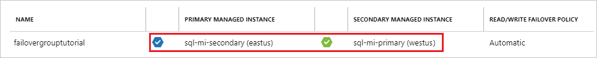

1. Go to the new _secondary_ managed instance and select **Failover** once again to fail the primary instance back to the primary role. 


# [PowerShell](#tab/azure-powershell)
Test failover using PowerShell. 

   ```powershell-interactive
    
   # Verify the current primary role
   Get-AzSqlDatabaseInstanceFailoverGroup -ResourceGroupName $resourceGroupName `
       -Location $location -Name $failoverGroupName
   
   # Fail over the primary managed instance to the secondary role
   Write-host "Failing primary over to the secondary location"
   Get-AzSqlDatabaseInstanceFailoverGroup -ResourceGroupName $resourceGroupName `
       -Location $drLocation -Name $failoverGroupName | Switch-AzSqlDatabaseInstanceFailoverGroup
   Write-host "Successfully failed failover group to secondary location"
   ```


Revert the failover group back to the primary server:

   ```powershell-interactive
   # Verify the current primary role
   Get-AzSqlDatabaseInstanceFailoverGroup -ResourceGroupName $resourceGroupName `
       -Location $drLocation -Name $failoverGroupName
   
   # Fail the primary managed instance back to the primary role
   Write-host "Failing primary back to primary role"
   Get-AzSqlDatabaseInstanceFailoverGroup -ResourceGroupName $resourceGroupName `
       -Location $location -Name $failoverGroupName | Switch-AzSqlDatabaseInstanceFailoverGroup
   Write-host "Successfully failed failover group to primary location"
   
   # Verify the current primary role
   Get-AzSqlDatabaseInstanceFailoverGroup -ResourceGroupName $resourceGroupName `
       -Location $location -Name $failoverGroupName
   ```

This portion of the tutorial uses the following PowerShell cmdlets:

| Command | Notes |
|---|---|
| [Get-AzSqlDatabaseInstanceFailoverGroup](/powershell/module/az.sql/get-azsqldatabaseinstancefailovergroup) | Gets or lists SQL Managed Instance failover groups.| 
| [Switch-AzSqlDatabaseInstanceFailoverGroup](/powershell/module/az.sql/switch-azsqldatabaseinstancefailovergroup) | Executes a failover of a SQL Managed Instance failover group. | 

---


## Clean up resources
Clean up resources by first deleting the managed instances, then the virtual cluster, then any remaining resources, and finally the resource group. 

# [Portal](#tab/azure-portal)
1. Navigate to your resource group in the [Azure portal](https://portal.azure.com). 
1. Select the managed instance(s) and then select **Delete**. Type `yes` in the text box to confirm you want to delete the resource and then select **Delete**. This process may take some time to complete in the background, and until it's done, you will not be able to delete the *virtual cluster* or any other dependent resources. Monitor the deletion in the **Activity** tab to confirm your managed instance has been deleted. 
1. Once the managed instance is deleted, delete the *virtual cluster* by selecting it in your resource group, and then choosing **Delete**. Type `yes` in the text box to confirm you want to delete the resource and then select **Delete**. 
1. Delete any remaining resources. Type `yes` in the text box to confirm you want to delete the resource and then select **Delete**. 
1. Delete the resource group by selecting **Delete resource group**, typing in the name of the resource group, `myResourceGroup`, and then selecting **Delete**. 

# [PowerShell](#tab/azure-powershell)

You will need to remove the resource group twice. Removing the resource group the first time will remove the managed instances and virtual clusters but will then fail with the error message `Remove-AzResourceGroup : Long running operation failed with status 'Conflict'`. Run the Remove-AzResourceGroup command a second time to remove any residual resources as well as the resource group.

```powershell-interactive
Remove-AzResourceGroup -ResourceGroupName $resourceGroupName
Write-host "Removing SQL Managed Instance and virtual cluster..."
Remove-AzResourceGroup -ResourceGroupName $resourceGroupName
Write-host "Removing residual resources and resource group..."
```

This portion of the tutorial uses the following PowerShell cmdlet:

| Command | Notes |
|---|---|
| [Remove-AzResourceGroup](/powershell/module/az.resources/remove-azresourcegroup) | Removes a resource group. |

---

## Full script

# [PowerShell](#tab/azure-powershell)
[!code-powershell-interactive[main](../../../powershell_scripts/sql-database/failover-groups/add-managed-instance-to-failover-group-az-ps.ps1 "Add SQL Managed Instance to a failover group")]

This script uses the following commands. Each command in the table links to command-specific documentation.

| Command | Notes |
|---|---|
| [New-AzResourceGroup](/powershell/module/az.resources/new-azresourcegroup) | Creates an Azure resource group.  |
| [New-AzVirtualNetwork](/powershell/module/az.network/new-azvirtualnetwork) | Creates a virtual network.  |
| [Add-AzVirtualNetworkSubnetConfig](/powershell/module/az.network/add-azvirtualnetworksubnetconfig) | Adds a subnet configuration to a virtual network. | 
| [Get-AzVirtualNetwork](/powershell/module/az.network/get-azvirtualnetwork) | Gets a virtual network in a resource group. | 
| [Get-AzVirtualNetworkSubnetConfig](/powershell/module/az.network/get-azvirtualnetworksubnetconfig) | Gets a subnet in a virtual network. | 
| [New-AzNetworkSecurityGroup](/powershell/module/az.network/new-aznetworksecuritygroup) | Creates a network security group. | 
| [New-AzRouteTable](/powershell/module/az.network/new-azroutetable) | Creates a route table. |
| [Set-AzVirtualNetworkSubnetConfig](/powershell/module/az.network/set-azvirtualnetworksubnetconfig) | Updates a subnet configuration for a virtual network.  |
| [Set-AzVirtualNetwork](/powershell/module/az.network/set-azvirtualnetwork) | Updates a virtual network.  |
| [Get-AzNetworkSecurityGroup](/powershell/module/az.network/get-aznetworksecuritygroup) | Gets a network security group. |
| [Add-AzNetworkSecurityRuleConfig](/powershell/module/az.network/add-aznetworksecurityruleconfig)| Adds a network security rule configuration to a network security group. |
| [Set-AzNetworkSecurityGroup](/powershell/module/az.network/set-aznetworksecuritygroup) | Updates a network security group.  | 
| [Add-AzRouteConfig](/powershell/module/az.network/add-azrouteconfig) | Adds a route to a route table. |
| [Set-AzRouteTable](/powershell/module/az.network/set-azroutetable) | Updates a route table.  |
| [New-AzSqlInstance](/powershell/module/az.sql/new-azsqlinstance) | Creates a managed instance.  |
| [Get-AzSqlInstance](/powershell/module/az.sql/get-azsqlinstance)| Returns information about Azure SQL Managed Instance. |
| [New-AzPublicIpAddress](/powershell/module/az.network/new-azpublicipaddress) | Creates a public IP address.  | 
| [New-AzVirtualNetworkGatewayIpConfig](/powershell/module/az.network/new-azvirtualnetworkgatewayipconfig) | Creates an IP configuration for a virtual network gateway. |
| [New-AzVirtualNetworkGateway](/powershell/module/az.network/new-azvirtualnetworkgateway) | Creates a virtual network gateway. |
| [New-AzVirtualNetworkGatewayConnection](/powershell/module/az.network/new-azvirtualnetworkgatewayconnection) | Creates a connection between the two virtual network gateways.   |
| [New-AzSqlDatabaseInstanceFailoverGroup](/powershell/module/az.sql/new-azsqldatabaseinstancefailovergroup)| Creates a new SQL Managed Instance failover group.  |
| [Get-AzSqlDatabaseInstanceFailoverGroup](/powershell/module/az.sql/get-azsqldatabaseinstancefailovergroup) | Gets or lists SQL Managed Instance failover groups.| 
| [Switch-AzSqlDatabaseInstanceFailoverGroup](/powershell/module/az.sql/switch-azsqldatabaseinstancefailovergroup) | Executes a failover of a SQL Managed Instance failover group. | 
| [Remove-AzResourceGroup](/powershell/module/az.resources/remove-azresourcegroup) | Removes a resource group. | 

# [Portal](#tab/azure-portal) 

There are no scripts available for the Azure portal.

---

## Next steps

In this tutorial, you configured a failover group between two managed instances. You learned how to:

> [!div class="checklist"]
> - Create a primary managed instance.
> - Create a secondary managed instance as part of a [failover group](../database/auto-failover-group-overview.md). 
> - Test failover.

Advance to the next quickstart on how to connect to SQL Managed Instance, and how to restore a database to SQL Managed Instance: 

> [!div class="nextstepaction"]
> [Connect to SQL Managed Instance](connect-vm-instance-configure.md)
> [Restore a database to SQL Managed Instance](restore-sample-database-quickstart.md)


