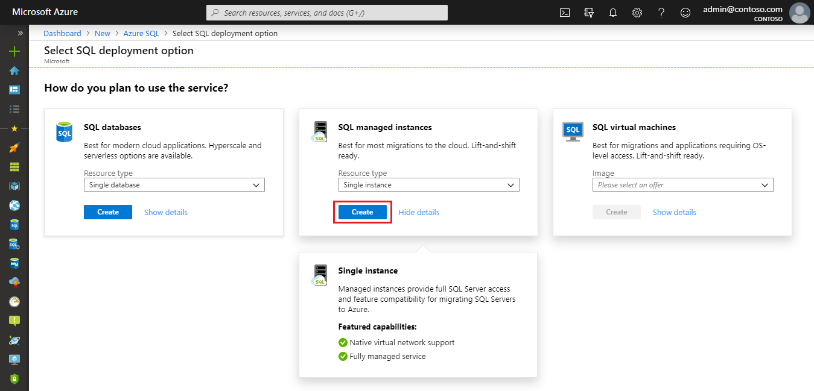
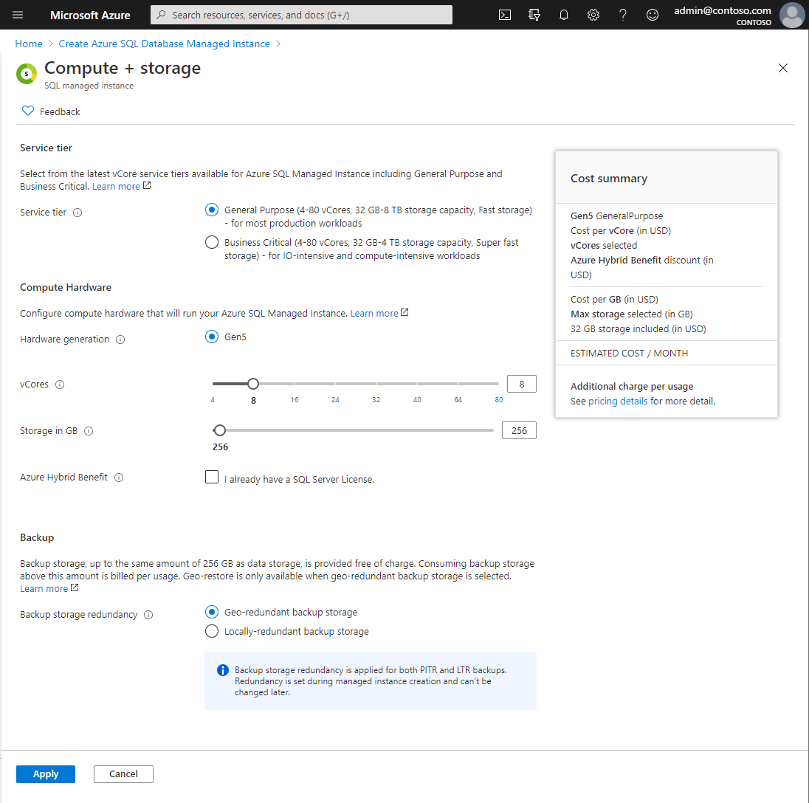
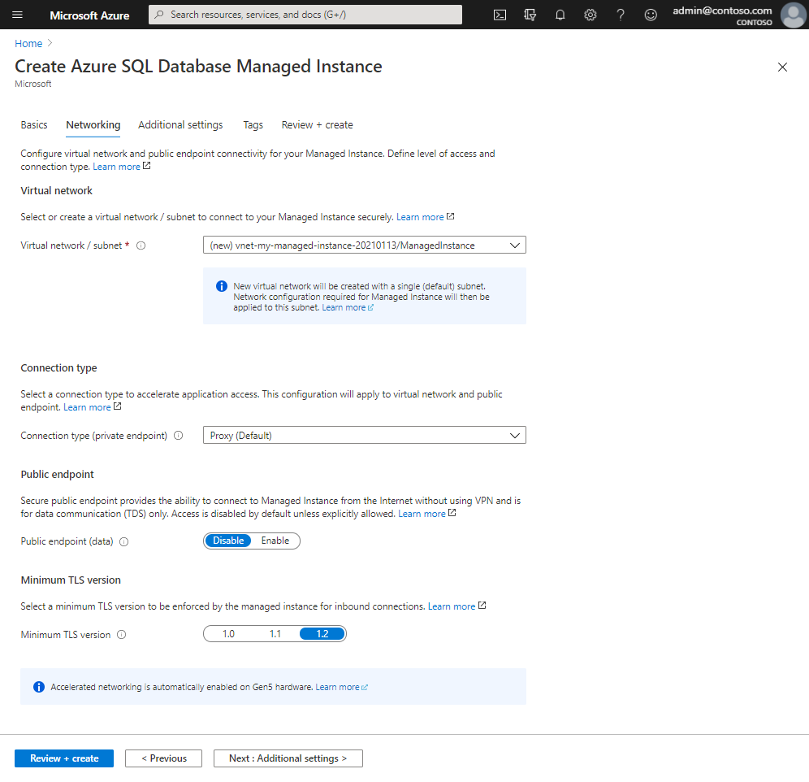
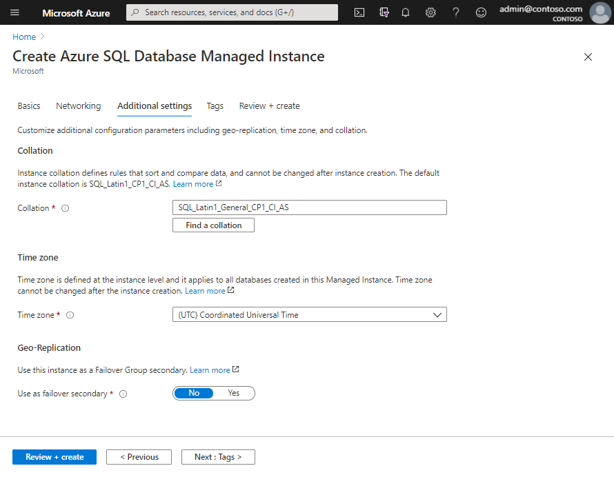
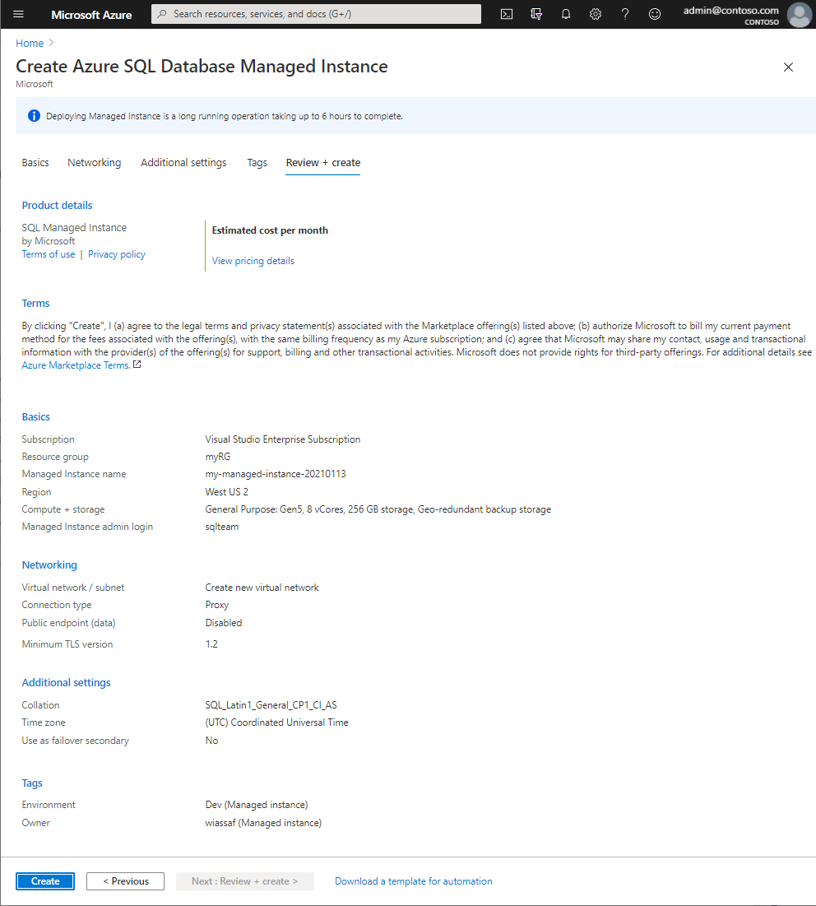
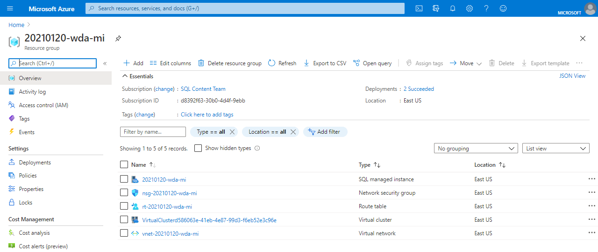
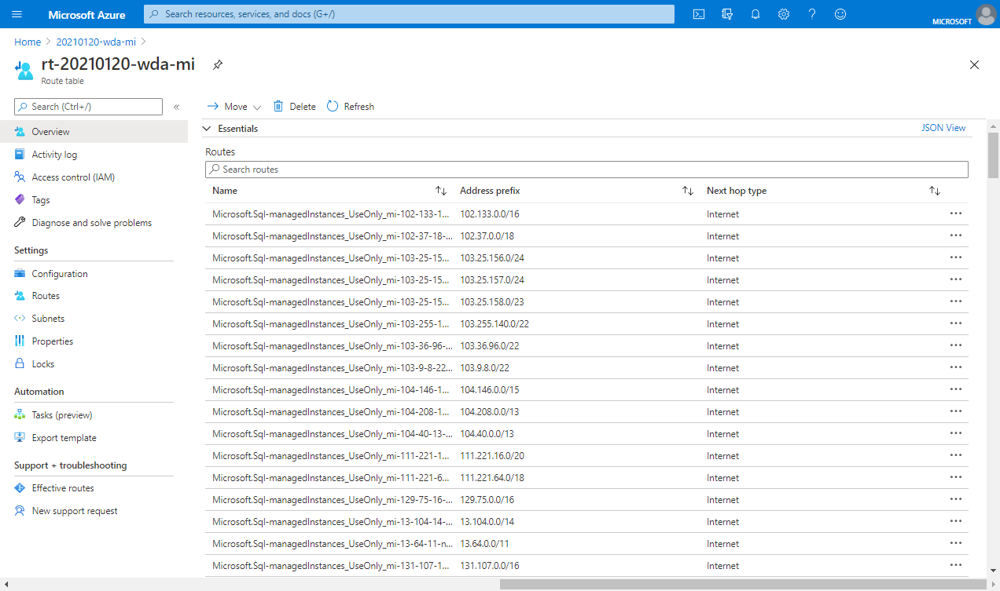
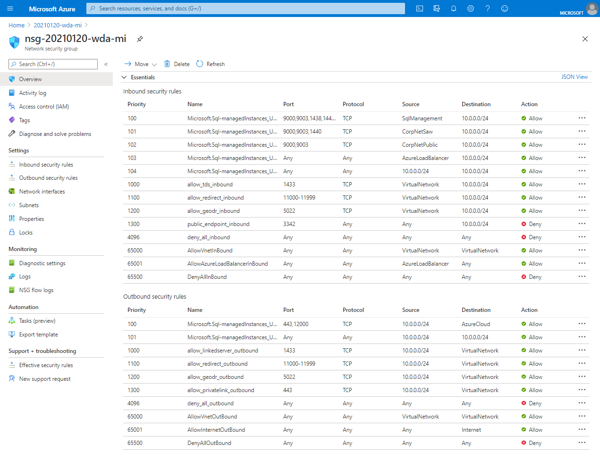
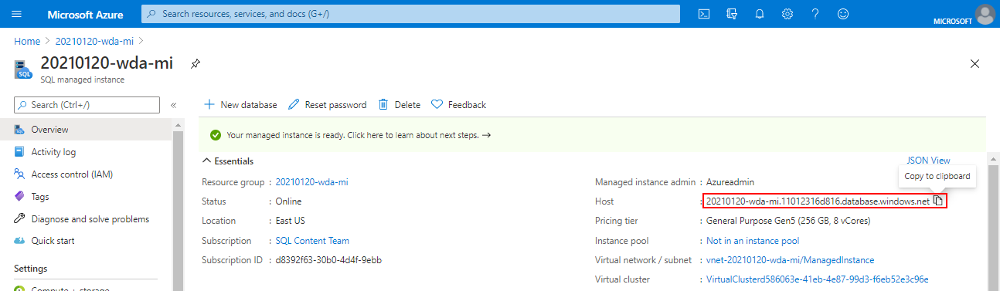

# Quickstart: Create an Azure SQL Managed Instance
[!INCLUDE[appliesto-sqlmi](../includes/appliesto-sqlmi.md)]

This quickstart teaches you to create an [Azure SQL Managed Instance](sql-managed-instance-paas-overview.md) in the Azure portal.

> [!IMPORTANT]
> For limitations, see [Supported regions](resource-limits.md#supported-regions) and [Supported subscription types](resource-limits.md#supported-subscription-types).

## Create an Azure SQL Managed Instance

To create a SQL Managed Instance, follow these steps: 

### Sign in to the Azure portal

If you don't have an Azure subscription, [create a free account](https://azure.microsoft.com/free/).

1. Sign in to the [Azure portal](https://portal.azure.com/).
1. Select **Azure SQL** on the left menu of the Azure portal. If **Azure SQL** is not in the list, select **All services**, and then enter **Azure SQL** in the search box.
1. Select **+Add** to open the **Select SQL deployment option** page. You can view additional information about Azure SQL Managed Instance by selecting **Show details** on the **SQL managed instances** tile.
1. Select **Create**.

   

4. Use the tabs on the **Create Azure SQL Managed Instance** provisioning form to add required and optional information. The following sections describe these tabs.

### Basics tab

- Fill out mandatory information required on the **Basics** tab. This is a minimum set of information required to provision a SQL Managed Instance.

   

   Use the table below as a reference for information required at this tab.

   | Setting| Suggested value | Description |
   | ------ | --------------- | ----------- |
   | **Subscription** | Your subscription. | A subscription that gives you permission to create new resources. |
   | **Resource group** | A new or existing resource group.|For valid resource group names, see [Naming rules and restrictions](/azure/architecture/best-practices/resource-naming).|
   | **Managed instance name** | Any valid name.|For valid names, see [Naming rules and restrictions](/azure/architecture/best-practices/resource-naming).|
   | **Region** |The region in which you want to create the managed instance.|For information about regions, see [Azure regions](https://azure.microsoft.com/regions/).|
   | **Managed instance admin login** | Any valid username. | For valid names, see [Naming rules and restrictions](/azure/architecture/best-practices/resource-naming). Don't use "serveradmin" because that's a reserved server-level role.|
   | **Password** | Any valid password.| The password must be at least 16 characters long and meet the [defined complexity requirements](../../virtual-machines/windows/faq.md#what-are-the-password-requirements-when-creating-a-vm).|

- Select **Configure Managed Instance** to size compute and storage resources and to review the pricing tiers. Use the sliders or text boxes to specify the amount of storage and the number of virtual cores. When you're finished, select **Apply** to save your selection. 

   

| Setting| Suggested value | Description |
| ------ | --------------- | ----------- |
| **Service Tier** | Select one of the options. | Based on your scenario, select one of the following options:   <ul><li>**General Purpose**: for most production workloads, and the default option.</li><li>**Business Critical**: designed for low-latency workloads with high resiliency to failures and fast failovers.</li></ul> For more information, see [Azure SQL Database and Azure SQL Managed Instance service tiers](../../azure-sql/database/service-tiers-general-purpose-business-critical.md) and review [Overview of Azure SQL Managed Instance resource limits](../../azure-sql/managed-instance/resource-limits.md).|
| **Hardware Generation** | Select one of the options. | The hardware generation generally defines the compute and memory limits and other characteristics that impact the performance of the workload. **Gen5** is the default.|
| **vCore compute model** | Select an option. | vCores represent exact amount of compute resources that are always provisioned for your workload. **Eight vCores** is the default.|
| **Storage in GB** | Select an option. | Storage size in GB, select based on expected data size. If migrating existing data from on-premises or on various cloud platforms, see [Migration overview: SQL Server to SQL Managed Instance](../../azure-sql/migration-guides/managed-instance/sql-server-to-managed-instance-overview.md).|
| **Azure Hybrid Benefit** | Check option if applicable. | For leveraging an existing license for Azure. For more information, see [Azure Hybrid Benefit - Azure SQL Database & SQL Managed Instance](../../azure-sql/azure-hybrid-benefit.md). |
| **Backup storage redundancy** | Select **Geo-redundant backup storage**. | Storage redundancy inside Azure for backup storage. Note that this value cannot be changed later. Geo-redundant backup storage is default and recommended, though Zone and Local redundancy allow for more cost flexibility and single region data residency. For more information, see [Backup Storage redundancy](../database/automated-backups-overview.md?tabs=managed-instance#backup-storage-redundancy).|

- To review your choices before you create a SQL Managed Instance, you can select **Review + create**. Or, configure networking options by selecting **Next: Networking**.

### Networking tab

- Fill out optional information on the **Networking** tab. If you omit this information, the portal will apply default settings.

   

   Use the table below as a reference for information required at this tab.

   | Setting| Suggested value | Description |
   | ------ | --------------- | ----------- |
   | **Virtual network** | Select either **Create new virtual network** or a valid virtual network and subnet.| If a network or subnet is unavailable, it must be [modified to satisfy the network requirements](vnet-existing-add-subnet.md) before you select it as a target for the new managed instance. For information about the requirements for configuring the network environment for SQL Managed Instance, see [Configure a virtual network for SQL Managed Instance](connectivity-architecture-overview.md). |
   | **Connection type** | Choose between a proxy and a redirect connection type.|For more information about connection types, see [Azure SQL Managed Instance connection type](../database/connectivity-architecture.md#connection-policy).|
   | **Public endpoint**  | Select **Disable**. | For a managed instance to be accessible through the public data endpoint, you need to enable this option. | 
   | **Allow access from** (if **Public endpoint** is enabled) | Select **No Access**  |The portal experience enables configuring a security group with a public endpoint.     Based on your scenario, select one of the following options:   <ul> <li>**Azure services**: We recommend this option when you're connecting from Power BI or another multitenant service. </li> <li> **Internet**: Use for test purposes when you want to quickly spin up a managed instance. We don't recommend it for production environments. </li> <li> **No access**: This option creates a **Deny** security rule. Modify this rule to make a managed instance accessible through a public endpoint. </li> </ul>   For more information on public endpoint security, see [Using Azure SQL Managed Instance securely with a public endpoint](public-endpoint-overview.md).|

- Select **Review + create** to review your choices before you create a managed instance. Or, configure more custom settings by selecting **Next: Additional settings**.

### Additional settings

- Fill out optional information on the **Additional settings** tab. If you omit this information, the portal will apply default settings.

   

   Use the table below as a reference for information required at this tab.

   | Setting| Suggested value | Description |
   | ------ | --------------- | ----------- |
   | **Collation** | Choose the collation that you want to use for your managed instance. If you migrate databases from SQL Server, check the source collation by using `SELECT SERVERPROPERTY(N'Collation')` and use that value.| For information about collations, see [Set or change the server collation](/sql/relational-databases/collations/set-or-change-the-server-collation).|   
   | **Time zone** | Select the time zone that managed instance will observe.|For more information, see [Time zones](timezones-overview.md).|
   | **Use as failover secondary** | Select **Yes**. | Enable this option to use the managed instance as a failover group secondary.|
   | **Primary SQL Managed Instance** (if **Use as failover secondary** is set to **Yes**) | Choose an existing primary managed instance that will be joined in the same DNS zone with the managed instance you're creating. | This step will enable post-creation configuration of the failover group. For more information, see [Tutorial: Add a managed instance to a failover group](failover-group-add-instance-tutorial.md).|

- Select **Review + create** to review your choices before you create a managed instance. Or, configure Azure Tags by selecting **Next: Tags** (recommended).

### Tags

- Add tags to resources in your Azure Resource Manager template (ARM template). [Tags](../../azure-resource-manager/management/tag-resources.md) help you logically organize your resources. The tag values show up in cost reports and allow for other management activities by tag. 

- Consider at least tagging your new SQL Managed Instance with the Owner tag to identify who created, and the Environment tag to identify whether this system is Production, Development, etc. For more information, see [Develop your naming and tagging strategy for Azure resources](/azure/cloud-adoption-framework/ready/azure-best-practices/naming-and-tagging).
 
- Select **Review + create** to proceed.

## Review + create

1. Select **Review + create** tab to review your choices before you create a managed instance.

   

1. Select **Create** to start provisioning the managed instance.

> [!IMPORTANT]
> Deploying a managed instance is a long-running operation. Deployment of the first instance in the subnet typically takes much longer than deploying into a subnet with existing managed instances. For average provisioning times, see [Overview of Azure SQL Managed Instance management operations](management-operations-overview.md#duration).

## Monitor deployment progress

1. Select the **Notifications** icon to view the status of the deployment.

   

1. Select **Deployment in progress** in the notification to open the SQL Managed Instance window and further monitor the deployment progress. 

> [!TIP]
> - If you closed your web browser or moved away from the deployment progress screen, you can monitor the provisioning operation via the managed instance's **Overview** page, or via PowerShell or the Azure CLI. For more information, see [Monitor operations](management-operations-monitor.md#monitor-operations). 
> - You can cancel the provisioning process through Azure portal, or via PowerShell or the Azure CLI or other tooling using the REST API. See [Canceling Azure SQL Managed Instance management operations](management-operations-cancel.md).

> [!IMPORTANT]
> - Start of SQL Managed Instance creation could be delayed in cases when there exist other impacting operations, such are long-running restore or scaling operations on other Managed Instances in the same subnet. To learn more, see [Management operations cross-impact](management-operations-overview.md#management-operations-cross-impact).
> - In order to be able to get the status of managed instance creation, you need to have **read permissions** over the resource group. If you don't have this permission or revoke it while the managed instance is in creation process, this can cause SQL Managed Instance not to be visible in the list of resource group deployments.
>

## View resources created

Upon successful deployment of a managed instance, to view resources created:

1. Open the resource group for your managed instance. 

   

## View and fine-tune network settings

To optionally fine-tune networking settings, inspect the following:

1. In the list of resources, select the route table to review the user-defined Route table (UDR) object that was created.

2. In the route table, review the entries to route traffic from and within the SQL Managed Instance virtual network. If you create or configure your route table manually, create these entries in the SQL Managed Instance route table.

   

    To change or add routes, open the **Routes** in the Route table settings.

3. Return to the resource group, and select the network security group (NSG) object that was created.

4. Review the inbound and outbound security rules. 

   

    To change or add rules, open the **Inbound Security Rules** and **Outbound security rules** in the Network security group settings.

> [!IMPORTANT]
> If you have configured a public endpoint for SQL Managed Instance, you need to open ports to allow network traffic allowing connections to SQL Managed Instance from the public internet. For more information, see [Configure a public endpoint for SQL Managed Instance](public-endpoint-configure.md#allow-public-endpoint-traffic-on-the-network-security-group).
>

## Retrieve connection details to SQL Managed Instance

To connect to SQL Managed Instance, follow these steps to retrieve the host name and fully qualified domain name (FQDN):

1. Return to the resource group and select the SQL managed instance object that was created.

2. On the **Overview** tab, locate the **Host** property. Copy the host name to your clipboard for the managed instance for use in the next quickstart by clicking the **Copy to clipboard** button.

   

   The value copied represents a fully qualified domain name (FQDN) that can be used to connect to SQL Managed Instance. It is similar to the following address example: *your_host_name.a1b2c3d4e5f6.database.windows.net*.

## Next steps

To learn about how to connect to SQL Managed Instance:
- For an overview of the connection options for applications, see [Connect your applications to SQL Managed Instance](connect-application-instance.md).
- For a quickstart that shows how to connect to SQL Managed Instance from an Azure virtual machine, see [Configure an Azure virtual machine connection](connect-vm-instance-configure.md).
- For a quickstart that shows how to connect to SQL Managed Instance from an on-premises client computer by using a point-to-site connection, see [Configure a point-to-site connection](point-to-site-p2s-configure.md).

To restore an existing SQL Server database from on-premises to SQL Managed Instance: 
- Use the [Azure Database Migration Service for migration](../../dms/tutorial-sql-server-to-managed-instance.md) to restore from a database backup file. 
- Use the [T-SQL RESTORE command](restore-sample-database-quickstart.md) to restore from a database backup file.

For advanced monitoring of SQL Managed Instance database performance with built-in troubleshooting intelligence, see [Monitor Azure SQL Managed Instance by using Azure SQL Analytics](../../azure-monitor/insights/azure-sql.md).