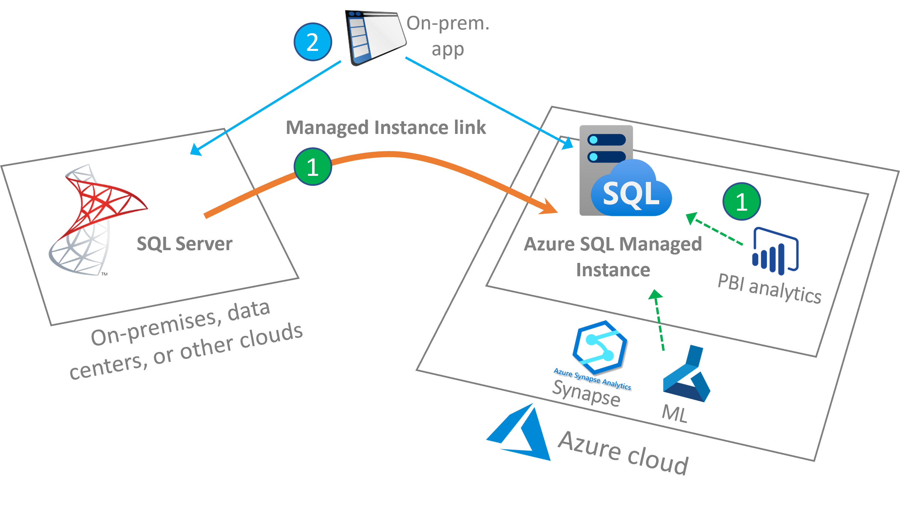

# Link feature for Azure SQL Managed Instance (limited preview)
[!INCLUDE[appliesto-sqlmi](../includes/appliesto-sqlmi.md)]

The new link feature in Azure SQL Managed Instance connects your SQL Servers hosted anywhere to SQL Managed Instance, providing hybrid flexibility and database mobility. With an approach that uses near real-time data replication to the cloud, you can offload workloads to a read-only secondary in Azure to take advantage of Azure-only features, performance, and scale. 

After a disastrous event, you can continue running your read-only workloads on SQL Managed Instance in Azure. You can also choose to migrate one or more applications from SQL Server to SQL Managed Instance at the same time, at your own pace, and with the best possible minimum downtime compared to other solutions in Azure today.

## Sign-up for link

To use the link feature, you will need:

- SQL Server 2019 Enterprise Edition with [CU13 (or above)](https://support.microsoft.com/topic/kb5005679-cumulative-update-13-for-sql-server-2019-5c1be850-460a-4be4-a569-fe11f0adc535) installed on-premises, or on an Azure VM.
- Network connectivity between your SQL Server and managed instance is required. If your SQL Server is running on-premises, use a VPN link or Express route. If your SQL Server is running on an Azure VM, either deploy your VM to the same subnet as your managed instance, or use global VNet peering to connect two separate subnets. 
- Azure SQL Managed Instance provisioned on any service tier.

Use the following link to sign-up for the limited preview of the link feature. 

> [!div class="nextstepaction"]
> [Sign up for link feature preview](https://aka.ms/mi-link-signup)

## Overview

The underlying technology of near real-time data replication between SQL Server and SQL Managed Instance is based on distributed availability groups, part of the well-known and proven Always On availability group technology stack. Extend your SQL Server on-premises availability group to SQL Managed Instance in Azure in a safe and secure manner. 

There is no need to have an existing availability group or multiple nodes. The link supports single node SQL Server instances without existing availability groups, and also multiple-node SQL Server instances with existing availability groups. Through the link, you can leverage the modern benefits of Azure without migrating your entire SQL Server data estate to the cloud.

You can keep running the link for as long as you need it, for months and even years at a time. And for your modernization journey, if/when you are ready to migrate to Azure, the link enables a considerably-improved migration experience with the minimum possible downtime compared to all other options available today, providing a true online migration to SQL Managed Instance.

## Supported scenarios

Data replicated through the link feature from SQL Server to Azure SQL Managed Instance can be used with a number of scenarios, such as: 

- **Use Azure services without migrating to the cloud** 
- **Offload read-only workloads to Azure** 
- **Migrate to Azure**

### Use Azure services 

Use the link feature to leverage Azure services using SQL Server data without migrating to the cloud. Examples include reporting, analytics, backups, machine learning, and other jobs that send data to Azure. 

### Offload workloads to Azure 

You can also use the link feature to offload workloads to Azure. For example, an application could use SQL Server for read / write workloads, while offloading read-only workloads to SQL Managed Instance in any of Azure's 60+ regions worldwide. Once the link is established, the primary database on SQL Server is read/write accessible, while replicated data to SQL Managed Instance in Azure is read-only accessible. This allows for various scenarios where replicated databases on SQL Managed Instance can be used for read scale-out and offloading read-only workloads to Azure. SQL Managed Instance, in parallel, can also host independent read/write databases. This allows for copying the replicated database to another read/write database on the same managed instance for further data processing.

The link is database scoped (one link per one database), allowing for consolidation and deconsolidation of workloads in Azure. For example, you can replicate databases from multiple SQL Servers to a single SQL Managed Instance in Azure (consolidation), or replicate databases from a single SQL Server to multiple managed instances via a 1 to 1 relationship between a database and a managed instance -  to any of Azure's regions worldwide (deconsolidation). The latter provides you with an efficient way to quickly bring your workloads closer to your customers in any region worldwide, which you can use as read-only replicas.

### Migrate to Azure 

The link feature also facilitates migrating from SQL Server to SQL Managed Instance, enabling: 

- The most performant minimum downtime migration compared to all other solutions available today
- True online migration to SQL Managed Instance in any service tier 

Since the link feature enables minimum downtime migration, you can migrate to your managed instance while maintaining your primary workload online. While online migration was possible to achieve previously with other solutions when migrating to the general purpose service tier, the link feature now also allows for true online migrations to the business critical service tier as well. 

## How it works

The underlying technology behind the link feature for SQL Managed Instance is distributed availability groups. The solution supports single-node systems without existing availability groups, or multiple node systems with existing availability groups.  

Secure connectivity, such as VPN or Express Route is used between an on-premises network and Azure. If SQL Server is hosted on an Azure VM, the internal Azure backbone can be used between the VM and managed instance – such as, for example, global VNet peering. The trust between the two systems is established using certificate-based authentication, in which SQL Server and SQL Managed Instance exchange their public keys.

There could exist up to 100 links from the same, or various SQL Server sources to a single SQL Managed Instance. This limit is governed by the number of databases that could be hosted on a managed instance at this time. Likewise, a single SQL Server can establish multiple parallel database replication links with several managed instances in different Azure regions in a 1 to 1 relationship between a database and a managed instance . The feature requires CU13 or higher to be installed on SQL Server 2019.

> [!NOTE]
> The link feature is released in limited public preview with support for currently only SQL Server 2019 Enterprise Edition CU13 (or above). [Sign-up now](https://aka.ms/mi-link-signup) to participate in the limited public preview. 

## Next steps

For more information on the link feature, see the following:

- [Managed Instance link – connecting SQL Server to Azure reimagined](https://aka.ms/mi-link-techblog).

For other replication scenarios, consider: 

- [Transactional replication with Azure SQL Managed Instance (Preview)](replication-transactional-overview.md)
