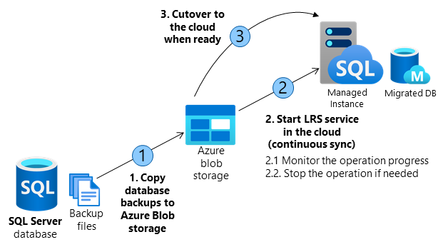

# Migrate databases from SQL Server to SQL Managed Instance using Log Replay Service
[!INCLUDE[appliesto-sqlmi](../includes/appliesto-sqlmi.md)]

This article explains how to manually configure database migration from SQL Server to SQL Managed Instance using Log Replay Service (LRS). This is a cloud service enabled for managed instance based on the SQL Server log shipping technology enabled in no recovery mode. LRS should be used in cases when Data Migration Service (DMS) cannot be used, when more control is needed or when there exists very little tolerance for downtime.

## When to use Log Replay Service

In cases that DMS tool cannot be used for migration, LRS cloud service can be used directly with API, PowerShell or CLI cmdlets to manually build and orchestrate database migrations to the cloud. 

You might want to consider using LRS cloud service in some of the following cases:
-	More control is needed for your database migration project
-	There exists a very little tolerance for downtime for migration cutover
-	DMS tool cannot be installed in your environment
-	DMS tool does not have file access to database backups
-	No access to host OS is available, or no administrator privileges

> [!NOTE]
> Recommended automated way to migrate databases from SQL Server to SQL Managed Instance is using DMS tool. This tool is using the same LRS cloud service at the back end with log shipping enabled in no-recovery mode. You should consider manually using LRS only in cases when DMS tool does not fully support your migration scenario.

# How does it work

Building a custom solution using LRS to migrate a database to the cloud requires several orchestration steps shown in the diagram and outlined in the table below. The migration 

  

| Operation | Details |
| :----------------------------- | :------------------------- |
| **1. Copy database backups from SQL Server to Azure Blob storage**. | - Azure blob storage is used as an intermediary storage between SQL Server and SQL Managed Instance. <br />- Copy full, differential and log backups from SQL Server to Azure Blob storage using [Azcopy](https://docs.microsoft.com/azure/storage/common/storage-use-azcopy-v10) or PowerShell. <br />- In case of migrating several databases, a separate folder is required for each database. |
| **2. Start the LRS service in the cloud**. | - Service can be started with a choice of API call, or cmdlets: <br /> PowerShell [start-azsqlinstancedatabaselogreplay](https://docs.microsoft.com/powershell/module/az.sql/start-azsqlinstancedatabaselogreplay) <br /> CLI [az_sql_midb_log_replay_start cmdlets](https://docs.microsoft.com/cli/azure/sql/midb/log-replay#az_sql_midb_log_replay_start). <br /><br />- Once started, the service will take backups from the Azure Blob storage and start restoring them on SQL Managed Instance. <br /> - Once all initially uploaded backups are restored, the service will watch for any new files uploaded to the folder and will continuously apply logs based on the LSN chain, until the service is stopped. |
| **2.1. Monitor the operation progress**. | - Progress of the restore operation can be monitored with a choice of API call, or cmdlets: <br /> PowerShell [get-azsqlinstancedatabaselogreplay](https://docs.microsoft.com/powershell/module/az.sql/get-azsqlinstancedatabaselogreplay) <br /> CLI [az_sql_midb_log_replay_show cmdlets](https://docs.microsoft.com/cli/azure/sql/midb/log-replay#az_sql_midb_log_replay_show). |
| **2.2. Stop\abort the operation if needed**. | - In case that migration process needs to be aborted, the operation can be stopped with a choice of API call, or cmdlets: <br /> PowerShell [stop-azsqlinstancedatabaselogreplay](https://docs.microsoft.com/powershell/module/az.sql/stop-azsqlinstancedatabaselogreplay) <br /> CLI [az_sql_midb_log_replay_stop](https://docs.microsoft.com/cli/azure/sql/midb/log-replay#az_sql_midb_log_replay_stop) cmdlets. <br /><br />- This will result in deletion of the being database restored on SQL Managed Instance. <br />- Once stopped, LRS cannot be continued for a database. Migration process needs to be restarted from scratch. |
| **3. Cutover to the cloud when ready**. | - Once all backups have been restored to SQL Managed Instance, complete the cutover by initiating LRS complete operation with a choice of API call, or cmdlets: <br />PowerShell [complete-azsqlinstancedatabaselogreplay](https://docs.microsoft.com/powershell/module/az.sql/complete-azsqlinstancedatabaselogreplay) <br /> CLI [az_sql_midb_log_replay_complete](https://docs.microsoft.com/cli/azure/sql/midb/log-replay#az_sql_midb_log_replay_complete) cmdlets. <br /><br />- This will cause LRS service to be stopped and database on Managed Instance will be recovered. <br />-	Repoint the application connection string from SQL Server to SQL Managed Instance. <br />- On operation completion database is available for R/W operations in the cloud. |

# Requirements for getting started

## The following is required at the SQL Server side:
- Full backup of databases (one or multiple files)
- Differential backup (one or multiple files)
- Log backup (not split for transaction log file)
- **Checkum must be enabled** as mandatory

## The following is required at the Azure side:
-	PowerShell Az.SQL module version 2.16.0, or above ([install](https://www.powershellgallery.com/packages/Az.Sql/), or use Azure [Cloud Shell](https://docs.microsoft.com/azure/cloud-shell/))
-	CLI version 2.19.0, or above ([install](https://docs.microsoft.com/cli/azure/install-azure-cli))
-	Azure Blob Storage provisioned
-	SAS security token with read only and list permissions generated for the blob storage

## Best practices

The following are highly recommended as best practices:
- Run [Data Migration Assistant](https://docs.microsoft.com/sql/dma/dma-overview) to validate your databases will have no issues being migrated to SQL Managed Instance. 
- Split full and differential backups into multiple files, instead of a single file
- Enable backup compression
- Use Cloud Shell to execute scripts as it will always be updated to the latest cmdlets released

> [!IMPORTANT]
> - Database being restored using LRS cannot be used until the migration process has been completed. This is because underlying technology for LRS is log shipping in no recovery mode.
> - Standby mode for log shipping is not supported by LRS due to the version differences between SQL Managed Instance and in-market SQL Server version.

# Steps to execute

## Copy backups from SQL Server to Azure Blob storage

The following two approaches can be utilized to copy the backups to the blob storage in migrating databases to Managed Instance using LRS:
-	Using SQL Server native BACKUP TO URL feature 
-	Copying the backups to Blob Container. 

## Generate SAS authentication token

> [!IMPORTANT]
> Permissions for the SAS token for Azure Blob storage need to be read only and list. In case of any other permissions, LRS cloud service will fail to start. These security requirements are by design.

## Start the migration

PS, CLI

You should first switch your subscription to target subscription using command 

```powershell
Login-AzAccount
Select-AzSubscription <subscription ID> 
```

```powershell
Select-AzSubscription -SubscriptionId <subscription ID>
```

```powershell
Start-AzSqlInstanceDatabaseLogReplay -ResourceGroupName $resourceGroupName -InstanceName $managedInstanceName `
-Name $managedDatabaseName `
-StorageContainerUri $testStorageContainerUri `
-StorageContainerSasToken $testStorageContainerSasToken `
```

> [!IMPORTANT]
> Once LRS has been started, any system managed software patches will be halted for the next 47 hours. Upon passing of this window, the next automated software patch will automatically stop the ongoing LRS. In such case, migration needs to be resterted from scratch as resume is not supported.

## Monitor the migration progress

PS, CLI

Get kad god hoces da proveris status


## Stop the migration

PS, CLI

Stop je da ga ubijes - delete db


## Complete the migration

PS, CLI

Complete je da podignes (recovery) bazu

# Using API

For development of cutom migration applications based on LRS, the following APIs can be used


## Next steps
-	Learn more about [Migrate SQL Server to SQL Managed instance](../migration-guides/managed-instance/sql-server-to-managed-instance-guide.md).
-	Learn more about [Differences between SQL Server and Azure SQL Managed Instance](transact-sql-tsql-differences-sql-server.md).
-	Learn more about [Best practices to cost and size workloads migrated to Azure](https://docs.microsoft.com/azure/cloud-adoption-framework/migrate/azure-best-practices/migrate-best-practices-costs).

