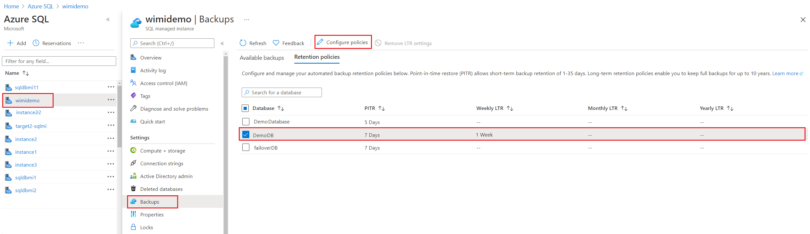
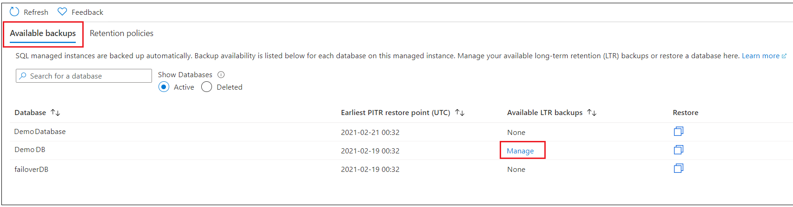
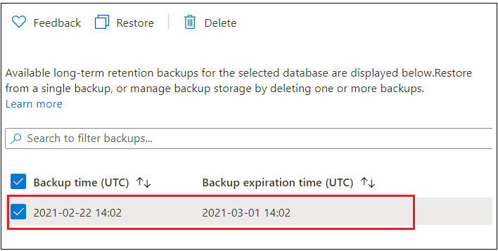
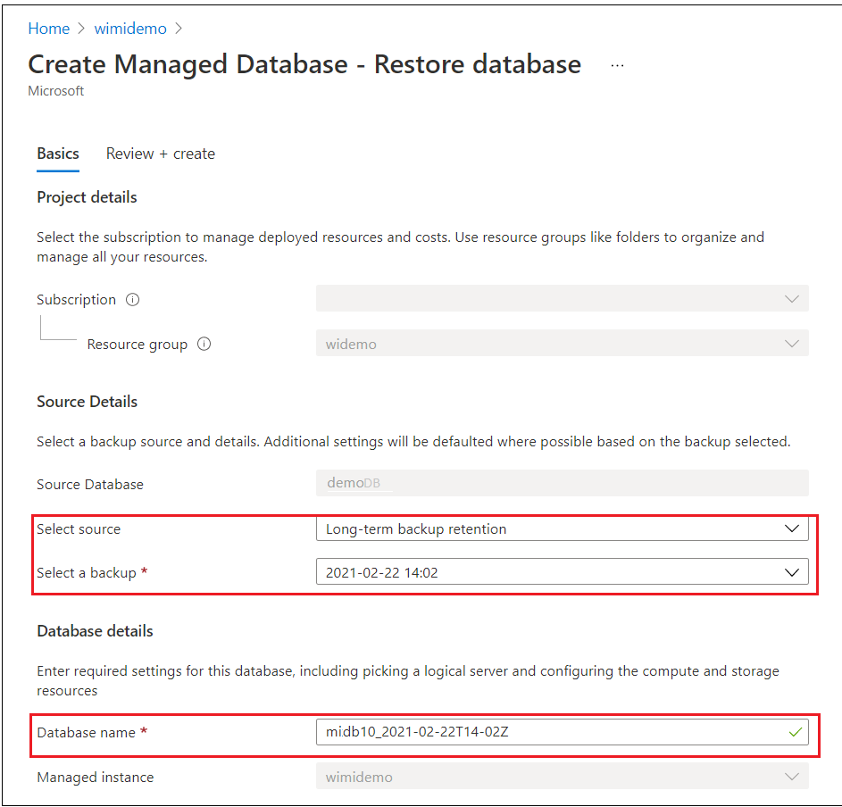
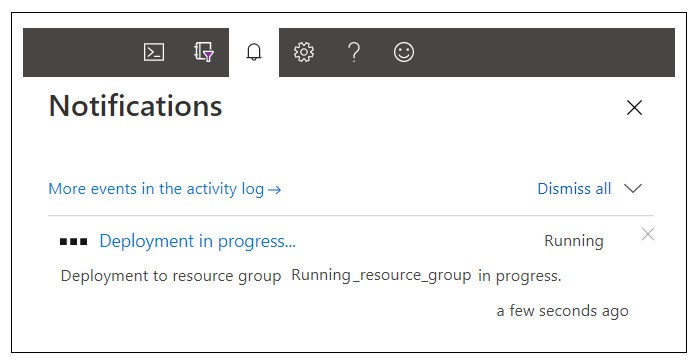

# Manage Azure SQL Managed Instance long-term backup retention
[!INCLUDE[appliesto-sqlmi](../includes/appliesto-sqlmi.md)]

In Azure SQL Managed Instance, you can configure a [long-term backup retention](../database/long-term-retention-overview.md) policy (LTR) as a public preview feature. This allows you to automatically retain database backups in separate Azure Blob storage containers for up to 10 years. You can then recover a database using these backups with the Azure portal and PowerShell.

   > [!IMPORTANT]
   > LTR for managed instances is currently available in public preview in Azure Public regions. 

The following sections show you how to use the Azure portal and PowerShell to configure the long-term backup retention, view backups in Azure SQL storage, and restore from a backup in Azure SQL storage.


## Using the Azure portal

The following sections show you how to use the Azure portal to set long-term retention policies, manage available long-term retention backups, and restore from an available backup.

### Configure long-term retention policies

You can configure SQL Managed Instance to [retain automated backups](../database/long-term-retention-overview.md) for a period longer than the retention period for your service tier.

1. In the Azure portal, select your managed instance and then click **Backups**. On the **Retention policies** tab, select the database(s) on which you want to set or modify long-term backup retention policies. Changes will not apply to any databases left unselected. 

   

2. In the **Configure policies** pane, specify your desired retention period for weekly, monthly, or yearly backups. Choose a retention period of '0' to indicate that no long-term backup retention should be set.

   

3. When complete, click **Apply**.

> [!IMPORTANT]
> When you enable a long-term backup retention policy, it may take up to 7 days for the first backup to become visible and available to restore. For details of the LTR backup cadance, see [long-term backup retention](../database/long-term-retention-overview.md).

### View backups and restore from a backup

View the backups that are retained for a specific database with an LTR policy, and restore from those backups.

1. In the Azure portal, select your managed instance and then click **Backups**. On the **Available backups** tab, select the database for which you want to see available backups. Click **Manage**.

   

1. In the **Manage backups** pane, review the available backups.

   

1. Select the backup from which you want to restore, click **Restore**, then on the restore page specify the new database name. The backup and source will be pre-populated on this page. 

   
   
   

1. Click **Review + Create** to review your Restore details. Then click **Create** to restore your database from the chosen backup.

1. On the toolbar, click the notification icon to view the status of the restore job.

   

1. When the restore job is completed, open the **Managed Instance Overview** page to view the newly restored database.

> [!NOTE]
> From here, you can connect to the restored database using SQL Server Management Studio to perform needed tasks, such as to [extract a bit of data from the restored database to copy into the existing database or to delete the existing database and rename the restored database to the existing database name](../database/recovery-using-backups.md#point-in-time-restore).


## Using PowerShell
[!INCLUDE [updated-for-az](../../../includes/updated-for-az.md)]

> [!IMPORTANT]
> The PowerShell Azure Resource Manager module is still supported by Azure SQL Database, however, future development will be done in the Az.Sql module. For these cmdlets, see [AzureRM.Sql](/powershell/module/AzureRM.Sql/). The arguments for the commands in the Az module and in the AzureRm modules are substantially identical.

The following sections show you how to use PowerShell to configure the long-term backup retention, view backups in Azure storage, and restore from a backup in Azure storage.

### Azure RBAC roles to manage long-term retention

For **Get-AzSqlInstanceDatabaseLongTermRetentionBackup** and **Restore-AzSqlInstanceDatabase**, you will need to have one of the following roles:

- Subscription Owner role or
- Managed Instance Contributor role or
- Custom role with the following permissions:
  - `Microsoft.Sql/locations/longTermRetentionManagedInstanceBackups/read`
  - `Microsoft.Sql/locations/longTermRetentionManagedInstances/longTermRetentionManagedInstanceBackups/read`
  - `Microsoft.Sql/locations/longTermRetentionManagedInstances/longTermRetentionDatabases/longTermRetentionManagedInstanceBackups/read`

For **Remove-AzSqlInstanceDatabaseLongTermRetentionBackup**, you will need to have one of the following roles:

- Subscription Owner role or
- Custom role with the following permission:
  - `Microsoft.Sql/locations/longTermRetentionManagedInstances/longTermRetentionDatabases/longTermRetentionManagedInstanceBackups/delete`

> [!NOTE]
> The Managed Instance Contributor role does not have permission to delete LTR backups.

Azure RBAC permissions could be granted in either *subscription* or *resource group* scope. However, to access LTR backups that belong to a dropped instance, the permission must be granted in the *subscription* scope of that instance.

- `Microsoft.Sql/locations/longTermRetentionManagedInstances/longTermRetentionDatabases/longTermRetentionManagedInstanceBackups/delete`

### Create an LTR policy

```powershell
# get the Managed Instance
$subId = "<subscriptionId>"
$instanceName = "<instanceName>"
$resourceGroup = "<resourceGroupName>"
$dbName = "<databaseName>"

Connect-AzAccount

Select-AzSubscription -SubscriptionId $subId

$instance = Get-AzSqlInstance -Name $instanceName -ResourceGroupName $resourceGroup

# create LTR policy with WeeklyRetention = 12 weeks. MonthlyRetention and YearlyRetention = 0 by default.
$LTRPolicy = @{
    InstanceName = $instanceName 
    DatabaseName = $dbName 
    ResourceGroupName = $resourceGroup 
    WeeklyRetention = 'P12W'
}
Set-AzSqlInstanceDatabaseBackupLongTermRetentionPolicy @LTRPolicy

# create LTR policy with WeeklyRetention = 12 weeks, YearlyRetention = 5 years and WeekOfYear = 16 (week of April 15). MonthlyRetention = 0 by default.
$LTRPolicy = @{
    InstanceName = $instanceName 
    DatabaseName = $dbName 
    ResourceGroupName = $resourceGroup 
    WeeklyRetention = 'P12W' 
    YearlyRetention = 'P5Y' 
    WeekOfYear = '16'
}
Set-AzSqlInstanceDatabaseBackupLongTermRetentionPolicy @LTRPolicy
```

### View LTR policies

This example shows how to list the LTR policies within an instance for a single database

```powershell
# gets the current version of LTR policy for a database
$LTRPolicies = @{
    InstanceName = $instanceName 
    DatabaseName = $dbName 
    ResourceGroupName = $resourceGroup
}
Get-AzSqlInstanceDatabaseBackupLongTermRetentionPolicy @LTRPolicy 
```

This example shows how to list the LTR policies for all of the databases on an instance

```powershell
# gets the current version of LTR policy for all of the databases on an instance

$Databases = Get-AzSqlInstanceDatabase -ResourceGroupName $resourceGroup -InstanceName $instanceName

$LTRParams = @{
    InstanceName = $instanceName
    ResourceGroupName = $resourceGroup
}

foreach($database in $Databases.Name){
    Get-AzSqlInstanceDatabaseBackupLongTermRetentionPolicy @LTRParams  -DatabaseName $database
 }
```

### Clear an LTR policy

This example shows how to clear an LTR policy from a database

```powershell
# remove the LTR policy from a database
$LTRPolicy = @{
    InstanceName = $instanceName 
    DatabaseName = $dbName 
    ResourceGroupName = $resourceGroup 
    RemovePolicy = $true
}
Set-AzSqlInstanceDatabaseBackupLongTermRetentionPolicy @LTRPolicy
```

### View LTR backups

This example shows how to list the LTR backups within an instance.

```powershell

$instance = Get-AzSqlInstance -Name $instanceName -ResourceGroupName $resourceGroup

# get the list of all LTR backups in a specific Azure region
# backups are grouped by the logical database id, within each group they are ordered by the timestamp, the earliest backup first
Get-AzSqlInstanceDatabaseLongTermRetentionBackup -Location $instance.Location

# get the list of LTR backups from the Azure region under the given managed instance
$LTRBackupParam = @{
    Location = $instance.Location 
    InstanceName = $instanceName
}
Get-AzSqlInstanceDatabaseLongTermRetentionBackup @LTRBackupParam

# get the LTR backups for a specific database from the Azure region under the given managed instance
$LTRBackupParam = @{
    Location = $instance.Location 
    InstanceName = $instanceName
    DatabaseName = $dbName
}
Get-AzSqlInstanceDatabaseLongTermRetentionBackup @LTRBackupParam

# list LTR backups only from live databases (you have option to choose All/Live/Deleted)
$LTRBackupParam = @{
    Location = $instance.Location 
    DatabaseState = 'Live'
}
Get-AzSqlInstanceDatabaseLongTermRetentionBackup @LTRBackupParam

# only list the latest LTR backup for each database
$LTRBackupParam = @{
    Location = $instance.Location 
    InstanceName = $instanceName
    OnlyLatestPerDatabase = $true
}
Get-AzSqlInstanceDatabaseLongTermRetentionBackup @LTRBackupParam 
```

### Delete LTR backups

This example shows how to delete an LTR backup from the list of backups.

```powershell
# remove the earliest backup
# get the LTR backups for a specific database from the Azure region under the given managed instance
$LTRBackupParam = @{
    Location = $instance.Location 
    InstanceName = $instanceName
    DatabaseName = $dbName
}
$ltrBackups = Get-AzSqlInstanceDatabaseLongTermRetentionBackup @LTRBackupParam
$ltrBackup = $ltrBackups[0]
Remove-AzSqlInstanceDatabaseLongTermRetentionBackup -ResourceId $ltrBackup.ResourceId
```

> [!IMPORTANT]
> Deleting LTR backup is non-reversible. To delete an LTR backup after the instance has been deleted you must have Subscription scope permission. You can set up notifications about each delete in Azure Monitor by filtering for operation 'Deletes a long term retention backup'. The activity log contains information on who and when made the request. See [Create activity log alerts](../../azure-monitor/alerts/alerts-activity-log.md) for detailed instructions.

### Restore from LTR backups

This example shows how to restore from an LTR backup. Note, this interface did not change but the resource ID parameter now requires the LTR backup resource ID.

```powershell
# restore a specific LTR backup as an P1 database on the instance $instanceName of the resource group $resourceGroup
$LTRBackupParam = @{
    Location = $instance.Location 
    InstanceName = $instanceName
    DatabaseName = $dbname
    OnlyLatestPerDatabase = $true
}
$ltrBackup = Get-AzSqlInstanceDatabaseLongTermRetentionBackup @LTRBackupParam 

$RestoreLTRParam = @{
    TargetInstanceName          = $instanceName 
    TargetResourceGroupName     = $resourceGroup 
    TargetInstanceDatabaseName  = $dbName
    FromLongTermRetentionBackup = $true
    ResourceId                  = $ltrBackup.ResourceId 
}
Restore-AzSqlInstanceDatabase @RestoreLTRParam
```

> [!IMPORTANT]
> To restore from an LTR backup after the instance has been deleted, you must have permissions scoped to the subscription of the instance and that subscription must be active. You must also omit the optional -ResourceGroupName parameter.

> [!NOTE]
> From here, you can connect to the restored database using SQL Server Management Studio to perform needed tasks, such as to extract a bit of data from the restored database to copy into the existing database or to delete the existing database and rename the restored database to the existing database name. See [point in time restore](../database/recovery-using-backups.md#point-in-time-restore).

## Next steps

- To learn about service-generated automatic backups, see [automatic backups](../database/automated-backups-overview.md)
- To learn about long-term backup retention, see [long-term backup retention](../database/long-term-retention-overview.md)
