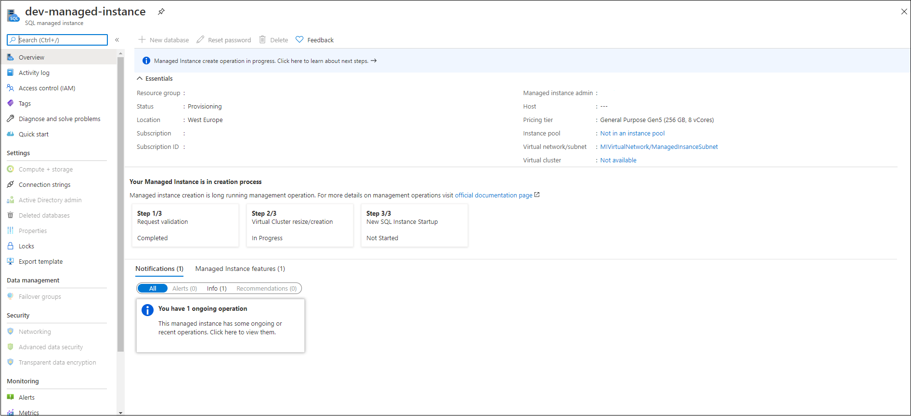
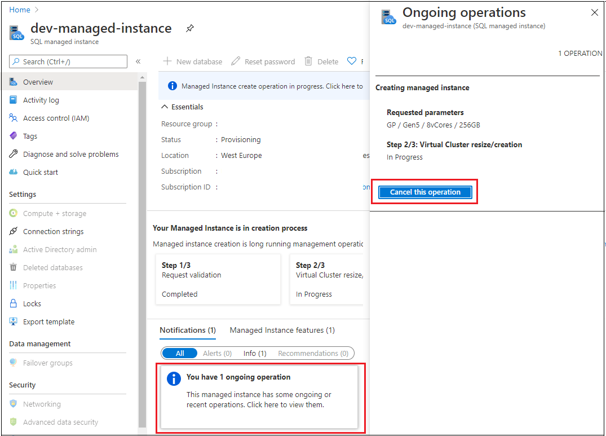

# Monitoring Azure SQL Managed Instance management operations
[!INCLUDE[appliesto-sqlmi](../includes/appliesto-sqlmi.md)]

Azure SQL Managed Instance provides monitoring of [management operations](management-operations-overview.md) that you use to deploy new managed instances, update instance properties, or delete instances when no longer needed. 

## Overview

All management operations can be categorized as follows:

- Instance deployment (new instance creation).
- Instance update (changing instance properties, such as vCores or reserved storage).
- Instance deletion.

Most management operations are [long running operations](management-operations-overview.md#duration). Therefore there is a need to monitor the status or follow the progress of operation steps. 

There are several ways to monitor managed instance management operations:

- [Resource group deployments](../../azure-resource-manager/templates/deployment-history.md)
- [Activity log](../../azure-monitor/platform/activity-log.md)
- [Managed instance operations API](#managed-instance-operations-api)


The following table compares management operation monitoring options: 

| Option | Retention | Supports cancel | Create | Update | Delete | Cancel | Steps |
| --- | --- | --- | --- | --- | --- | --- | --- |
| Resource group deployments | Infinite<sup>1</sup> | No<sup>2</sup> | Visible | Visible | Not visible | Visible | Not visible |
| Activity log | 90 days | No | Visible | Visible | Visible | Visible |  Not visible |
| Managed instance operations API | 24 hours | [Yes](management-operations-cancel.md) | Visible | Visible | Visible | Visible | Visible |
|  |  |  |  |  |  |  | |

<sup>1</sup> The deployment history for a resource group is limited to 800 deployments.

<sup>2</sup> Resource group deployments support cancel operation. However, due to cancel logic, only an operation scheduled for deployment after the cancel action is performed will be canceled. Ongoing deployment is not canceled when the resource group deployment is canceled. Since managed instance deployment consists of one long running step (from the Azure Resource Manger perspective), canceling resource group deployment will not cancel managed instance deployment and the operation will complete. 

## Managed instance operations API

Management operations APIs are specially designed to monitor operations. Monitoring managed instance operations can provide insights on operation parameters and operation steps, as well as [cancel specific operations](management-operations-cancel.md). Besides operation details and cancel command, this API can be used in automation scripts with multi-resource deployments - based on the progress step, you can kick off some dependent resource deployment.

These are the APIs: 

| Command | Description |
| --- | --- |
|[Managed Instance Operations - Get](https://docs.microsoft.com/rest/api/sql/managedinstanceoperations/get)|Gets a management operation on a managed instance.|
|[Managed Instance Operations - Cancel](https://docs.microsoft.com/rest/api/sql/managedinstanceoperations/cancel)|Cancels the asynchronous operation on the managed instance.|
|[Managed Instance Operations - List By Managed Instance](https://docs.microsoft.com/rest/api/sql/managedinstanceoperations/listbymanagedinstance)|Gets a list of operations performed on the managed instance.|

> [!NOTE]
> Use API version 2020-02-02 to see the managed instance create operation in the list of operations. This is the default version used in the Azure portal and the latest PowerShell and Azure CLI packages.

## Monitor operations

# [Portal](#tab/azure-portal)

In the Azure portal, use the managed instance **Overview** page to monitor managed instance operations. 

For example, the **Create operation** is visible at the start of the creation process on the **Overview** page: 



Select **Ongoing operation** to open the **Ongoing operation** page and view **Create** or **Update** operations. You can also [Cancel](management-operations-cancel.md) operations from this page as well.  



> [!NOTE]
> Create operations submitted through Azure portal, PowerShell, Azure CLI or other tooling using REST API version 2020-02-02 [can be canceled](management-operations-cancel.md). REST API versions older than 2020-02-02 used to submit a create operation will start the instance deployment, but the deployment won't be listed in the Operations API and can't be cancelled.

# [PowerShell](#tab/azure-powershell)

The Get-AzSqlInstanceOperation cmdlet gets information about the operations on a managed instance. You can view all operations on a managed instance or view a specific operation by providing the operation name.

```powershell-interactive
$managedInstance = "yourInstanceName"
$resourceGroup = "yourResourceGroupName"

$managementOperations = Get-AzSqlInstanceOperation `
    -ManagedInstanceName $managedInstance  -ResourceGroupName $resourceGroup
```

For detailed commands explanation, see [Get-AzSqlInstanceOperation](https://docs.microsoft.com/powershell/module/az.sql/get-azsqlinstanceoperation).

# [Azure CLI](#tab/azure-cli)

The az sql mi op list gets a list of operations performed on the managed instance. If you don't already have the Azure CLI installed, see [Install the Azure CLI](/cli/azure/install-azure-cli).

```azurecli-interactive
az sql mi op list -g yourResourceGroupName --mi yourInstanceName 
```

For detailed commands explanation, see [az sql mi op](https://docs.microsoft.com/cli/azure/sql/mi/op).

---

## Next steps

- To learn how to create your first managed instance, see [Quickstart guide](instance-create-quickstart.md).
- For a features and comparison list, see [common SQL features](../database/features-comparison.md).
- For more information about VNet configuration, see [SQL Managed Instance VNet configuration](connectivity-architecture-overview.md).
- For a quickstart that creates a managed instance and restores a database from a backup file, see [Create a managed instance](instance-create-quickstart.md).
- For a tutorial about using Azure Database Migration Service for migration, see [SQL Managed Instance migration using Database Migration Service](../../dms/tutorial-sql-server-to-managed-instance.md).
