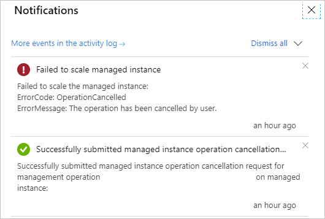

# Overview of Azure SQL Managed Instance management operations
[!INCLUDE[appliesto-sqlmi](../includes/appliesto-sqlmi.md)]

## What are management operations?
Azure SQL Managed Instance provides management operations that you can use to automatically deploy new managed instances, update instance properties, and delete instances when no longer needed.

To support [deployments within Azure virtual networks](../../virtual-network/virtual-network-for-azure-services.md) and provide isolation and security for customers, SQL Managed Instance relies on [virtual clusters](connectivity-architecture-overview.md#high-level-connectivity-architecture). Virtual cluster represents a dedicated set of isolated virtual machines deployed inside the customer's virtual network subnet. Essentially, every managed instance deployment in an empty subnet results in a new virtual cluster buildout.

Subsequent operations on deployed managed instances might also have effects on the underlying virtual cluster. These operations affect the duration of management operations, as deploying additional virtual machines comes with an overhead that needs to be considered when you plan new deployments or updates to existing managed instances.

All management operations can be categorized as follows:

- Instance deployment (new instance creation).
- Instance update (changing instance properties, such as vCores or reserved storage).
- Instance deletion.

## Management operations duration
Typically, operations on virtual clusters take the longest. Duration of the operations on virtual clusters varies – below are the values that you can typically expect, based on existing service telemetry data:

- **Virtual cluster creation**:  Creation is a synchronous step in instance management operations. **90% of operations finish in 4 hours**.
- **Virtual cluster resizing (expansion or shrinking)**: Expansion is a synchronous step, while shrinking is performed asynchronously (without impact on the duration of instance management operations). **90% of cluster expansions finish in less than 2.5 hours**.
- **Virtual cluster deletion**: Deletion is an asynchronous step, but it can also be [initiated manually](virtual-cluster-delete.md) on an empty virtual cluster, in which case it executes synchronously. **90% of virtual cluster deletions finish in 1.5 hours**.

Additionally, management of instances may also include one of the operations on hosted databases, which result in longer durations:

- **Attaching database files from Azure Storage**:  A synchronous step, such as compute (vCores), or storage scaling up or down in the General Purpose service tier. **90% of these operations finish in 5 minutes**.
- **Always On availability group seeding**: A synchronous step, such as compute (vCores), or storage scaling in the Business Critical service tier as well as in changing the service tier from General Purpose to Business Critical (or vice versa). Duration of this operation is proportional to the total database size as well as current database activity (number of active transactions). Database activity when updating an instance can introduce significant variance to the total duration. **90% of these operations execute at 220 GB/hour or higher**.

The following table summarizes operations and typical overall durations:

|Category  |Operation  |Long-running segment  |Estimated duration  |
|---------|---------|---------|---------|
|**Deployment** |First instance in an empty subnet|Virtual cluster creation|90% of operations finish in 4 hours.|
|Deployment |First instance of another hardware generation in a non-empty subnet (for example, first Gen 5 instance in a subnet with Gen 4 instances)|Virtual cluster creation*|90% of operations finish in 4 hours.|
|Deployment |First instance creation of 4 vCores in an empty, or non-empty subnet|Virtual cluster creation**|90% of operations finish in 4 hours.|
|Deployment |Subsequent instance creation within the non-empty subnet (2nd, 3rd, etc. instance)|Virtual cluster resizing|90% of operations finish in 2.5 hours.|
|**Update** |Instance property change (admin password, Azure AD login, Azure Hybrid Benefit flag)|N/A|Up to 1 minute.|
|Update |Instance storage scaling up/down (General Purpose service tier)|Attaching database files|90% of operations finish in 5 minutes.|
|Update |Instance storage scaling up/down (Business Critical service tier)|- Virtual cluster resizing<br>- Always On availability group seeding|90% of operations finish in 2.5 hours + time to seed all databases (220 GB/hour).|
|Update |Instance compute (vCores) scaling up and down (General Purpose)|- Virtual cluster resizing<br>- Attaching database files|90% of operations finish in 2.5 hours.|
|Update |Instance compute (vCores) scaling up and down (Business Critical)|- Virtual cluster resizing<br>- Always On availability group seeding|90% of operations finish in 2.5 hours + time to seed all databases (220 GB/hour).|
|Update |Instance service tier change (General Purpose to Business Critical and vice versa)|- Virtual cluster resizing<br>- Always On availability group seeding|90% of operations finish in 2.5 hours + time to seed all databases (220 GB/hour).|
|**Deletion**|Instance deletion|Log tail backup for all databases|90% operations finish in up to 1 minute.<br>Note: if the last instance in the subnet is deleted, this operation will schedule virtual cluster deletion after 12 hours.**|
|Deletion|Virtual cluster deletion (as user-initiated operation)|Virtual cluster deletion|90% of operations finish in up to 1.5 hours.|

\* Virtual cluster is built per hardware generation.

\*\* 12 hours is the current configuration but that might change in the future, so don't take a hard dependency on it. If you need to delete a virtual cluster earlier (to release the subnet, for example), see [Delete a subnet after deleting a managed instance](virtual-cluster-delete.md).

## Instance availability during management operations

SQL Managed Instance **is available during update operations**, except a short downtime caused by the failover that happens at the end of update. It typically lasts up to 10 seconds even in case of interrupted long-running transactions, thanks to the [accelerated database recovery](../accelerated-database-recovery.md).

> [!IMPORTANT]
> It's not recommended to scale compute or storage of Azure SQL Managed Instance or to change the service tier at the same time with the long-running transactions (data import, data processing jobs, index rebuild, etc.). Database failover that will be performed at the end of the operation will cancel all ongoing transactions.

SQL Managed Instance is not available to client applications during deployment and deletion operations.

## Management operations cross-impact

Management operations on a managed instance can affect other management operations of the instances placed inside the same virtual cluster:

- **Long-running restore operations** in a virtual cluster will put on hold other instance creation or scaling operations in the same subnet.<br/>**Example:** If there is a long-running restore operation and there is a create or scale request in the same subnet, this request will take longer to complete as it will wait for the restore operation to complete before it continues.
	
- **A subsequent instance creation or scaling** operation is put on hold by a previously initiated instance creation or instance scale that initiated the virtual cluster resize.<br/>**Example:** If there are multiple create and/or scale requests in the same subnet under the same virtual cluster, and one of them initiates a virtual cluster resize, all requests that were submitted 5+ minutes after the one that required the virtual cluster resize will last longer than expected, as these requests will have to wait for the resize to complete before resuming.

- **Create/scale operations submitted in a 5-minute window** will be batched and executed in parallel.<br/>**Example:** Only one virtual cluster resize will be performed for all operations submitted in a 5-minute window (measuring from the moment of executing the first operation request). If another request is submitted more than 5 minutes after the first one is submitted, it will wait for the virtual cluster resize to complete before execution starts.

> [!IMPORTANT]
> Management operations that are put on hold because of another operation that is in progress will be automatically resumed once conditions to proceed are met. There is no user action needed to resume temporarily paused management operations.

## Canceling management operations

The following table summarizes the ability to cancel specific management operations and typical overall durations:

Category  |Operation  |Cancelable  |Estimated cancel duration  |
|---------|---------|---------|---------|
|Deployment |Instance creation |No |  |
|Update |Instance storage scaling up/down (General Purpose) |No |  |
|Update |Instance storage scaling up/down (Business Critical) |Yes |90% of operations finish in 5 minutes. |
|Update |Instance compute (vCores) scaling up and down (General Purpose) |Yes |90% of operations finish in 5 minutes. |
|Update |Instance compute (vCores) scaling up and down (Business Critical) |Yes |90% of operations finish in 5 minutes. |
|Update |Instance service tier change (General Purpose to Business Critical and vice versa) |Yes |90% of operations finish in 5 minutes. |
|Delete |Instance deletion |No |  |
|Delete |Virtual cluster deletion (as user-initiated operation) |No |  |

# [Portal](#tab/azure-portal)

In order to cancel the management operation, go to the overview blade and click on notification box of the ongoing operation. From the right side, a screen with the ongoing operation will appear and there will be button for canceling operation. After the first click, you will be asked to click again and confirm that you want to cancel the operation.

[](./media/management-operations-overview/canceling-operation.png#lightbox)

After a cancel request has been submitted and processed, you will get a notification if the cancel submission has been successful or not.

If submitted cancel request is successful, the management operation will be canceled in a couple of minutes, resulting with a failure.



If the cancel request fails or the cancel button is not active, it means that the management operation has entered non-cancelable state and that it will finish in couple of minutes. The management operation will continue its execution until it is completed.

# [PowerShell](#tab/azure-powershell)

If you don't already have Azure PowerShell installed, see [Install the Azure PowerShell module](https://docs.microsoft.com/powershell/azure/install-az-ps).

To cancel management operation, you need to specify management operation name. Therefore, first use get command for retrieving operation list, and then cancel specific operation.

```powershell-interactive
$managedInstance = "yourInstanceName"
$resourceGroup = "yourResourceGroupName"

$managementOperations = Get-AzSqlInstanceOperation -ManagedInstanceName $managedInstance  -ResourceGroupName $resourceGroup

foreach ($mo in $managementOperations ) {
	if($mo.State -eq "InProgress" -and $mo.IsCancellable){
		$cancelRequest = Stop-AzSqlInstanceOperation -ResourceGroupName $resourceGroup -ManagedInstanceName $managedInstance -Name $mo.Name
		Get-AzSqlInstanceOperation -ManagedInstanceName $managedInstance  -ResourceGroupName $resourceGroup -Name $mo.Name
	}
}
```

For detailed commands explanation, see [Get-AzSqlInstanceOperation](https://docs.microsoft.com/powershell/module/az.sql/get-azsqlinstanceoperation) and [Stop-AzSqlInstanceOperation](https://docs.microsoft.com/powershell/module/az.sql/stop-azsqlinstanceoperation).

# [Azure CLI](#tab/azure-cli)

If you don't already have the Azure CLI installed, see [Install the Azure CLI](/cli/azure/install-azure-cli?view=azure-cli-latest).

To cancel management operation, you need to specify management operation name. Therefore, first use get command for retrieving operation list, and then cancel specific operation.

```azurecli-interactive
az sql mi op list -g yourResourceGroupName --mi yourInstanceName --query "[?state=='InProgress' && isCancellable].{Name: name}" -o tsv |
while read -r operationName; do
	az sql mi op cancel -g yourResourceGroupName --mi yourInstanceName -n $operationName
done
```

For detailed commands explanation, see [az sql mi op](https://docs.microsoft.com/cli/azure/sql/mi/op?view=azure-cli-latest).

---

## Next steps
- To learn how to create your first managed instance, see [Quickstart guide](instance-create-quickstart.md).
- For a features and comparison list, see [SQL common features](../database/features-comparison.md).
- For more information about VNet configuration, see [SQL Managed Instance VNet configuration](connectivity-architecture-overview.md).
- For a quickstart that creates a managed instance and restores a database from a backup file, see [Create a managed instance](instance-create-quickstart.md).
- For a tutorial about using Azure Database Migration Service for migration, see [SQL Managed Instance migration using Database Migration Service](../../dms/tutorial-sql-server-to-managed-instance.md).
