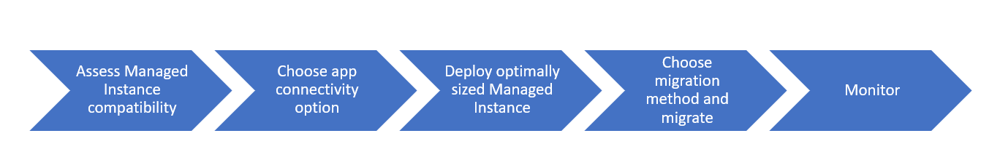

# SQL Server instance migration to Azure SQL Managed Instance
[!INCLUDE[appliesto-sqlmi](../includes/appliesto-sqlmi.md)]

In this article, you learn about the methods for migrating a SQL Server 2005 or later version instance to [Azure SQL Managed Instance](sql-managed-instance-paas-overview.md). For information on migrating to a single database or elastic pool, see [Migrate to a single or pooled database](../database/migrate-to-database-from-sql-server.md). For migration information about migrating from other platforms, see [Azure Database Migration Guide](https://datamigration.microsoft.com/).

> [!NOTE]
> If you want to quickly start and try Azure SQL Managed Instance, you might want to go to the [quickstart guide](quickstart-content-reference-guide.md) instead of this page.

At a high level, the database migration process looks like:

- [Assess SQL Managed Instance compatibility](#assess-sql-managed-instance-compatibility) where you should ensure that there are no blocking issues that can prevent your migrations.
  
  This step also includes creation of a [performance baseline](#create-a-performance-baseline) to determine resource usage on your source SQL Server instance. This step is needed if you want to deploy a properly sized managed instance and verify that performance after migration is not affected.
- [Choose app connectivity options](connect-application-instance.md).
- [Deploy to an optimally sized managed instance](#deploy-to-an-optimally-sized-managed-instance) where you will choose technical characteristics (number of vCores, amount of memory) and performance tier (Business Critical, General Purpose) of your managed instance.
- [Select migration method and migrate](#select-a-migration-method-and-migrate) where you migrate your databases using offline migration (native backup/restore, database import/export) or online migration (Azure Data Migration Service, transactional replication).
- [Monitor applications](#monitor-applications) to ensure that you have expected performance.

> [!NOTE]
> To migrate an individual database into either a single database or an elastic pool, see [Migrate a SQL Server database to Azure SQL Database](../database/migrate-to-database-from-sql-server.md).

## Assess SQL Managed Instance compatibility

First, determine whether SQL Managed Instance is compatible with the database requirements of your application. SQL Managed Instance is designed to provide easy lift and shift migration for the majority of existing applications that use SQL Server. However, you may sometimes require features or capabilities that are not yet supported and the cost of implementing a workaround is too high.

Use [Data Migration Assistant](https://docs.microsoft.com/sql/dma/dma-overview) to detect potential compatibility issues impacting database functionality on Azure SQL Database. If there are some reported blocking issues, you might need to consider an alternative option, such as [SQL Server on Azure VM](https://azure.microsoft.com/services/virtual-machines/sql-server/). Here are some examples:

- If you require direct access to the operating system or file system, for instance to install third-party or custom agents on the same virtual machine with SQL Server.
- If you have strict dependency on features that are still not supported, such as FileStream/FileTable, PolyBase, and cross-instance transactions.
- If you absolutely need to stay at a specific version of SQL Server (2012, for instance).
- If your compute requirements are much lower than managed instance offers (one vCore, for instance), and database consolidation is not an acceptable option.

If you have resolved all identified migration blockers and are continuing the migration to SQL Managed Instance, note that some of the changes might affect performance of your workload:

- Mandatory full recovery model and regular automated backup schedule might impact performance of your workload or maintenance/ETL actions if you have periodically used simple/bulk-logged model or stopped backups on demand.
- Different server or database level configurations such as trace flags or compatibility levels.
- New features that you are using such as Transparent Database Encryption (TDE) or auto-failover groups might impact CPU and IO usage.

SQL Managed Instance guarantees 99.99% availability even in critical scenarios, so overhead caused by these features cannot be disabled. For more information, see [the root causes that might cause different performance on SQL Server and Azure SQL Managed Instance](https://azure.microsoft.com/blog/key-causes-of-performance-differences-between-sql-managed-instance-and-sql-server/).

### Create a performance baseline

If you need to compare the performance of your workload on a managed instance with your original workload running on SQL Server, you would need to create a performance baseline that will be used for comparison.

Performance baseline is a set of parameters such as average/max CPU usage, average/max disk IO latency, throughput, IOPS, average/max page life expectancy, and average max size of tempdb. You would like to have similar or even better parameters after migration, so it is important to measure and record the baseline values for these parameters. In addition to system parameters, you would need to select a set of the representative queries or the most important queries in your workload and measure min/average/max duration and CPU usage for the selected queries. These values would enable you to compare performance of workload running on the managed instance to the original values on your source SQL Server instance.

Some of the parameters that you would need to measure on your SQL Server instance are:

- [Monitor CPU usage on your SQL Server instance](https://techcommunity.microsoft.com/t5/Azure-SQL-Database/Monitor-CPU-usage-on-SQL-Server/ba-p/680777#M131) and record the average and peak CPU usage.
- [Monitor memory usage on your SQL Server instance](https://docs.microsoft.com/sql/relational-databases/performance-monitor/monitor-memory-usage) and determine the amount of memory used by different components such as buffer pool, plan cache, column-store pool, [In-Memory OLTP](https://docs.microsoft.com/sql/relational-databases/in-memory-oltp/monitor-and-troubleshoot-memory-usage?view=sql-server-2017), etc. In addition, you should find average and peak values of the Page Life Expectancy memory performance counter.
- Monitor disk IO usage on the source SQL Server instance using [sys.dm_io_virtual_file_stats](https://docs.microsoft.com/sql/relational-databases/system-dynamic-management-views/sys-dm-io-virtual-file-stats-transact-sql) view or [performance counters](https://docs.microsoft.com/sql/relational-databases/performance-monitor/monitor-disk-usage).
- Monitor workload and query performance or your SQL Server instance by examining Dynamic Management Views or Query Store if you are migrating from a SQL Server 2016+ version. Identify average duration and CPU usage of the most important queries in your workload to compare them with the queries that are running on the managed instance.

> [!Note]
> If you notice any issue with your workload on SQL Server such as high CPU usage, constant memory pressure, or tempdb or parameterization issues, you should try to resolve them on your source SQL Server instance before taking the baseline and migration. Migrating known issues to any new system might cause unexpected results and invalidate any performance comparison.

As an outcome of this activity, you should have documented average and peak values for CPU, memory, and IO usage on your source system, as well as average and max duration and CPU usage of the dominant and the most critical queries in your workload. You should use these values later to compare performance of your workload on a managed instance with the baseline performance of the workload on the source SQL Server instance.

## Deploy to an optimally sized managed instance

SQL Managed Instance is tailored for on-premises workloads that are planning to move to the cloud. It introduces a [new purchasing model](../database/service-tiers-vcore.md) that provides greater flexibility in selecting the right level of resources for your workloads. In the on-premises world, you are probably accustomed to sizing these workloads by using physical cores and IO bandwidth. The purchasing model for managed instance is based upon virtual cores, or “vCores,” with additional storage and IO available separately. The vCore model is a simpler way to understand your compute requirements in the cloud versus what you use on-premises today. This new model enables you to right-size your destination environment in the cloud. Some general guidelines that might help you to choose the right service tier and characteristics are described here:

- Based on the baseline CPU usage, you can provision a managed instance that matches the number of cores that you are using on SQL Server, having in mind that CPU characteristics might need to be scaled to match [VM characteristics where the managed instance is installed](resource-limits.md#hardware-generation-characteristics).
- Based on the baseline memory usage, choose [the service tier that has matching memory](resource-limits.md#hardware-generation-characteristics). The amount of memory cannot be directly chosen, so you would need to select the managed instance with the amount of vCores that has matching memory (for example, 5.1 GB/vCore in Gen5).
- Based on the baseline IO latency of the file subsystem, choose between the General Purpose (latency greater than 5 ms) and Business Critical (latency less than 3 ms) service tiers.
- Based on baseline throughput, pre-allocate the size of data or log files to get expected IO performance.

You can choose compute and storage resources at deployment time and then change it afterward without introducing downtime for your application using the [Azure portal](../database/scale-resources.md):

To learn how to create the VNet infrastructure and a managed instance, see [Create a managed instance](instance-create-quickstart.md).

> [!IMPORTANT]
> It is important to keep your destination VNet and subnet in accordance with [managed instance VNet requirements](connectivity-architecture-overview.md#network-requirements). Any incompatibility can prevent you from creating new instances or using those that you already created. Learn more about [creating new](virtual-network-subnet-create-arm-template.md) and [configuring existing](vnet-existing-add-subnet.md) networks.

## Select a migration method and migrate

SQL Managed Instance targets user scenarios requiring mass database migration from on-premises or Azure VM database implementations. They are the optimal choice when you need to lift and shift the back end of the applications that regularly use instance level and/or cross-database functionalities. If this is your scenario, you can move an entire instance to a corresponding environment in Azure without the need to re-architect your applications.

To move SQL instances, you need to plan carefully:

- The migration of all databases that need to be collocated (ones running on the same instance).
- The migration of instance-level objects that your application depends on, including logins, credentials, SQL Agent jobs and operators, and server-level triggers.

SQL Managed Instance is a managed service that allows you to delegate some of the regular DBA activities to the platform as they are built in. Therefore, some instance-level data does not need to be migrated, such as maintenance jobs for regular backups or Always On configuration, as [high availability](../database/high-availability-sla.md) is built in.

SQL Managed Instance supports the following database migration options (currently these are the only supported migration methods):

- Azure Database Migration Service - migration with near-zero downtime.
- Native `RESTORE DATABASE FROM URL` - uses native backups from SQL Server and requires some downtime.

### Azure Database Migration Service

[Azure Database Migration Service](../../dms/dms-overview.md) is a fully managed service designed to enable seamless migrations from multiple database sources to Azure data platforms with minimal downtime. This service streamlines the tasks required to move existing third-party and SQL Server databases to Azure. Deployment options at public preview include databases in Azure SQL Database and SQL Server databases in an Azure virtual machine. Database Migration Service is the recommended method of migration for your enterprise workloads.

If you use SQL Server Integration Services (SSIS) on SQL Server on premises, Database Migration Service does not yet support migrating the SSIS catalog (SSISDB) that stores SSIS packages, but you can provision Azure-SSIS Integration Runtime (IR) in Azure Data Factory, which will create a new SSISDB in a managed instance so you can redeploy your packages to it. See [Create Azure-SSIS IR in Azure Data Factory](https://docs.microsoft.com/azure/data-factory/create-azure-ssis-integration-runtime).

To learn more about this scenario and configuration steps for Database Migration Service, see [Migrate your on-premises database to managed instance using Database Migration Service](../../dms/tutorial-sql-server-to-managed-instance.md).  

### Native RESTORE from URL

RESTORE of native backups (.bak files) taken from a SQL Server instance, available on [Azure Storage](https://azure.microsoft.com/services/storage/), is one of the key capabilities of SQL Managed Instance that enables quick and easy offline database migration.

The following diagram provides a high-level overview of the process:

The following table provides more information regarding the methods you can use depending on source SQL Server version you are running:

|Step|SQL Engine and version|Backup/restore method|
|---|---|---|
|Put backup to Azure Storage|Prior to 2012 SP1 CU2|Upload .bak file directly to Azure Storage|
||2012 SP1 CU2 - 2016|Direct backup using deprecated [WITH CREDENTIAL](https://docs.microsoft.com/sql/t-sql/statements/restore-statements-transact-sql) syntax|
||2016 and above|Direct backup using [WITH SAS CREDENTIAL](https://docs.microsoft.com/sql/relational-databases/backup-restore/sql-server-backup-to-url)|
|Restore from Azure Storage to a managed instance|[RESTORE FROM URL with SAS CREDENTIAL](restore-sample-database-quickstart.md)|

> [!IMPORTANT]
>
> - When you're migrating a database protected by [Transparent Data Encryption](../database/transparent-data-encryption-tde-overview.md) to a managed instance using native restore option, the corresponding certificate from the on-premises or Azure VM SQL Server needs to be migrated before database restore. For detailed steps, see [Migrate a TDE cert to a managed instance](tde-certificate-migrate.md).
> - Restore of system databases is not supported. To migrate instance-level objects (stored in master or msdb databases), we recommend to script them out and run T-SQL scripts on the destination instance.

For a quickstart showing how to restore a database backup to a managed instance using a SAS credential, see [Restore from backup to a managed instance](restore-sample-database-quickstart.md).

> [!VIDEO https://www.youtube.com/embed/RxWYojo_Y3Q]

## Monitor applications

Once you have completed the migration to a managed instance, you should track the application behavior and performance of your workload. This process includes the following activities:

- [Compare performance of the workload running on the managed instance](#compare-performance-with-the-baseline) with the [performance baseline that you created on the source SQL Server instance](#create-a-performance-baseline).
- Continuously [monitor performance of your workload](#monitor-performance) to identify potential issues and improvement.

### Compare performance with the baseline

The first activity that you would need to take immediately after successful migration is to compare the performance of the workload with the baseline workload performance. The goal of this activity is to confirm that the workload performance on your managed instance meets your needs.

Database migration to a managed instance keeps database settings and its original compatibility level in majority of cases. The original settings are preserved where possible in order to reduce the risk of some performance degradations compared to your source SQL Server instance. If the compatibility level of a user database was 100 or higher before the migration, it remains the same after migration. If the compatibility level of a user database was 90 before migration, in the upgraded database, the compatibility level is set to 100, which is the lowest supported compatibility level in a managed instance. Compatibility level of system databases is 140. Since migration to a managed instance is actually migrating to the latest version of the SQL Server database engine, you should be aware that you need to re-test performance of your workload to avoid some surprising performance issues.

As a prerequisite, make sure that you have completed the following activities:

- Align your settings on the managed instance with the settings from the source SQL Server instance by investigating various instance, database, tempdb settings, and configurations. Make sure that you have not changed settings like compatibility levels or encryption before you run the first performance comparison, or accept the risk that some of the new features that you enabled might affect some queries. To reduce migration risks, change the database compatibility level only after performance monitoring.
- Implement [storage best practice guidelines for General Purpose](https://techcommunity.microsoft.com/t5/DataCAT/Storage-performance-best-practices-and-considerations-for-Azure/ba-p/305525), such as pre-allocating the size of the files to get better performance.
- Learn about the [key environment differences that might cause the performance differences between a managed instance and SQL Server](https://azure.microsoft.com/blog/key-causes-of-performance-differences-between-sql-managed-instance-and-sql-server/), and identify the risks that might affect the performance.
- Make sure that you keep enabled Query Store and automatic tuning on your managed instance. These features enable you to measure workload performance and automatically fix the potential performance issues. Learn how to use Query Store as an optimal tool for getting information about workload performance before and after database compatibility level change, as explained in [Keep performance stability during the upgrade to a newer SQL Server version](https://docs.microsoft.com/sql/relational-databases/performance/query-store-usage-scenarios#CEUpgrade).
Once you have prepared the environment that is comparable as much as possible with your on-premises environment, you can start running your workload and measure performance. Measurement process should include the same parameters that you measured [while you created baseline performance of your workload measures on the source SQL Server instance](#create-a-performance-baseline).
As a result, you should compare performance parameters with the baseline and identify critical differences.

> [!NOTE]
> In many cases, you would not be able to get exactly matching performance on the managed instance and SQL Server. Azure SQL Managed Instance is a SQL Server database engine, but infrastructure and high-availability configuration on a managed instance may introduce some differences. You might expect that some queries would be faster while some others might be slower. The goal of comparison is to verify that workload performance in the managed instance matches the performance on SQL Server (on average), and identify any critical queries with the performance that don’t match your original performance.

The outcome of the performance comparison might be:

- Workload performance on the managed instance is aligned or better than the workload performance on SQL Server. In this case, you have successfully confirmed that migration is successful.
- The majority of the performance parameters and the queries in the workload work fine, with some exceptions with degraded performance. In this case, you would need to identify the differences and their importance. If there are some important queries with degraded performance, you should investigate whether the underlying SQL plans changed or the queries are hitting some resource limits. Mitigation in this case could be to apply some hints on the critical queries (for example, changed compatibility level, legacy cardinality estimator) either directly or using plan guides, rebuild or create statistics and indexes that might affect the plans.
- Most of the queries are slower on a managed instance compared to your source SQL Server instance. In this case, try to identify the root causes of the difference such as [reaching some resource limit](resource-limits.md#service-tier-characteristics) like IO limits, memory limit, instance log rate limit, etc. If there are no resource limits that can cause the difference, try to change the compatibility level of the database or change database settings like legacy cardinality estimation and re-start the test. Review the recommendations provided by the managed instance or Query Store views to identify the queries that regressed performance.

> [!IMPORTANT]
> Azure SQL Managed Instance has a built-in automatic plan correction feature that is enabled by default. This feature ensures that queries that worked fine in the paste would not degrade in the future. Make sure that this feature is enabled and that you have executed the workload long enough with the old settings before you change new settings in order to enable the managed instance to learn about the baseline performance and plans.

Make the change of the parameters or upgrade service tiers to converge to the optimal configuration until you get the workload performance that fits your needs.

### Monitor performance

SQL Managed Instance provides a lot of advanced tools for monitoring and troubleshooting, and you should use them to monitor performance on your instance. Some of the parameters that you would need to monitor are:

- CPU usage on the instance to determine if the number of vCores that you provisioned is the right match for your workload.
- Page-life expectancy on your managed instance to determine [if you need additional memory](https://techcommunity.microsoft.com/t5/Azure-SQL-Database/Do-you-need-more-memory-on-Azure-SQL-Managed-Instance/ba-p/563444).
- Statistics like `INSTANCE_LOG_GOVERNOR` or `PAGEIOLATCH` that will tell if you have storage IO issues, especially on the General Purpose tier, where you might need to pre-allocate files to get better IO performance.

## Leverage advanced PaaS features

Once you are on a fully managed platform and you have verified that workload performances are matching your SQL Server workload performance, use advantages that are provided automatically as part of the service.

Even if you don't make some changes in managed instance during the migration, there are high chances that you would turn on some of the new features while you are operating your instance to take advantage of the latest database engine improvements. Some changes are only enabled once the [database compatibility level has been changed](https://docs.microsoft.com/sql/relational-databases/databases/view-or-change-the-compatibility-level-of-a-database).

For instance, you don’t have to create backups on managed instance - the service performs backups for you automatically. You no longer must worry about scheduling, taking, and managing backups. SQL Managed Instance provides you the ability to restore to any point in time within this retention period using [Point in Time Recovery (PITR)](../database/recovery-using-backups.md#point-in-time-restore). Additionally, you do not need to worry about setting up high availability, as [high availability](../database/high-availability-sla.md) is built in.

To strengthen security, consider using [Azure Active Directory Authentication](../database/security-overview.md), [auditing](auditing-configure.md), [threat detection](../database/advanced-data-security.md), [row-level security](https://docs.microsoft.com/sql/relational-databases/security/row-level-security), and [dynamic data masking](https://docs.microsoft.com/sql/relational-databases/security/dynamic-data-masking).

In addition to advanced management and security features, a managed instance provides a set of advanced tools that can help you to [monitor and tune your workload](../database/monitor-tune-overview.md). [Azure SQL Analytics](https://docs.microsoft.com/azure/azure-monitor/insights/azure-sql) enables you to monitor a large set of managed instances and centralize monitoring of a large number of instances and databases. [Automatic tuning](https://docs.microsoft.com/sql/relational-databases/automatic-tuning/automatic-tuning#automatic-plan-correction) in managed instances continuously monitors performance of your SQL plan execution statistics and automatically fixes the identified performance issues.

## Next steps

- For information about Azure SQL Managed Instance, see [What is Azure SQL Managed Instance?](sql-managed-instance-paas-overview.md).
- For a tutorial that includes a restore from backup, see [Create a managed instance](instance-create-quickstart.md).
- For tutorial showing migration using Database Migration Service, see [Migrate your on-premises database to Azure SQL Managed Instance using Database Migration Service](../../dms/tutorial-sql-server-to-managed-instance.md).  
