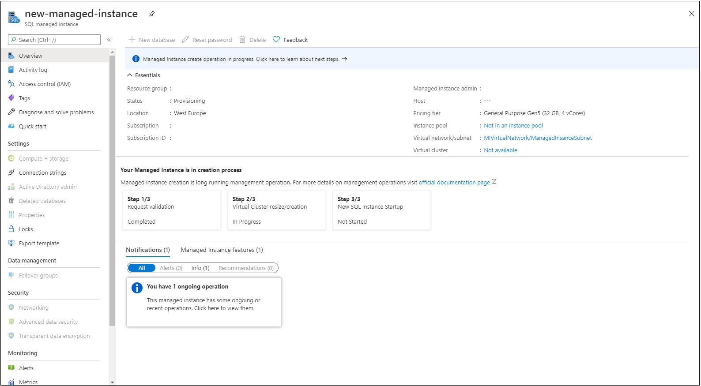
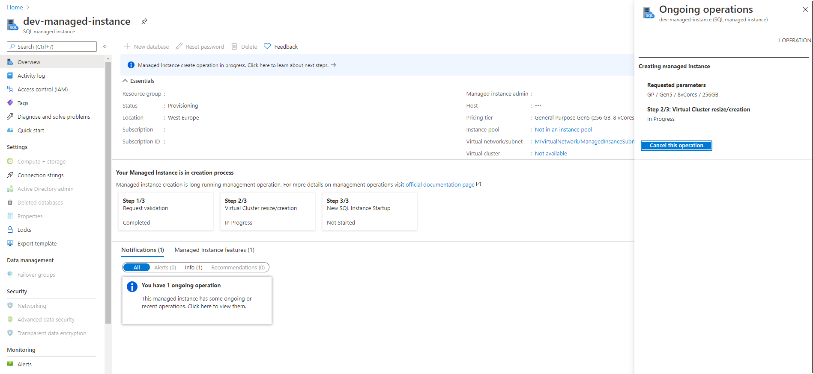

# Monitoring Azure SQL Managed Instance management operations
[!INCLUDE[appliesto-sqlmi](../includes/appliesto-sqlmi.md)]

## Monitoring overview
Azure SQL Managed Instance provides [management operations](management-operations-overview.md) that you can use to automatically deploy new managed instances, update instance properties, and delete instances when no longer needed. All management operations can be categorized as follows:

- Instance deployment (new instance creation).
- Instance update (changing instance properties, such as vCores or reserved storage).
- Instance deletion.

Most of the management operations are [long running operations](management-operations-overview.md#management-operations-duration). Therefore there is a need for monitoring operation status or following the progress of operation steps. There are couple of ways how to monitor managed instance managemet operations:

- [Resource group deployments](../../azure-resource-manager/templates/deployment-history.md)
- [Activity log](../../azure-monitor/platform/activity-log.md)
- [Managed instance operations API](#managed-instance-operations-api)

Comparison of monitoring options is represented in the following table

| Option | Duration | Supports cancel | Create | Update | Delete | Cancel | Steps |
| --- | --- | --- | --- | --- | --- | --- | --- |
| Resource group deployments | Infinite | No* | Visible | Visible | Not visible | Visible | Not visible |
| Activity log | 90 days | No | Visible | Visible | Visible | Visible |  Not visible |
| Managed intance operations API | 24 hours | Yes | Visible | Visible | Visible | Visible | Visible |

/* Resource group deployments are supporting cancel operation. However, cancel logic is implemented in a way that only operation scheduled for deployment after the cancel action is performed will be canceled. Ongoing deployment is not canceled. As managed instance deployment consists of one long running step (from ARM perspective), using resource group deployment cancel functionality will not cancel managed instance deployment and operation will be completed.

## Managed instance operations API
Operations API represents API specialy designed for managed instance management operations monitoring that provides insights on operation parameters and operation steps, additionaly providing capability for canceling specific operation. Besides operation details and cancel command, this API can be used in automation scripts with multi-resource deployments - based on progress step, you can kick-off some dependet resource deployment.

| Command | Description |
| --- | --- |
|[Managed Instance Operations - Get](https://docs.microsoft.com/rest/api/sql/managedinstanceoperations/get)|Gets a management operation on a managed instance.|
|[Managed Instance Operations - Cancel](https://docs.microsoft.com/rest/api/sql/managedinstanceoperations/cancel)|Cancels the asynchronous operation on the managed instance.|
|[Managed Instance Operations - List By Managed Instance](https://docs.microsoft.com/rest/api/sql/managedinstanceoperations/listbymanagedinstance)|Gets a list of operations performed on the managed instance.|

> [!NOTE]
> For managed instance create operation being visible in management operations API, you need to use 2020-02-02 API version for submitting create operation. This version is by default used in Azure portal and latest PowerShell and Azure CLI packages.

## Overview of managed instance operations

# [Portal](#tab/azure-portal)

In Azure portal operations API is leveraged on the managed instance overview blade. Two scenarios are covered:

1) Create operation - instance is visible from the very start of the creation and can be accessed in portal. Overview blade is displaying operation steps



2) Create or update operation - notification box for ongoing operation is displayed. By clicking on it, additional operations blade is opened with operation details and button for [canceling operation](management-operations-overview.md#canceling-management-operations).



> [!NOTE]
> Update operations and create operations submitted through Azure portal, PowerShell, Azure CLI or other tooling and API with version 2020-02-02 [can be canceled](management-operations-overview.md#canceling-management-operations).

# [PowerShell](#tab/azure-powershell)

The Get-AzSqlInstanceOperation cmdlet gets information about the operations on a managed instance. You can view all operations on a managed instance or view a specific operation by providing the operation name.

```powershell-interactive
$managedInstance = "yourInstanceName"
$resourceGroup = "yourResourceGroupName"

$managementOperations = Get-AzSqlInstanceOperation -ManagedInstanceName $managedInstance  -ResourceGroupName $resourceGroup
```

For detailed commands explanation, see [Get-AzSqlInstanceOperation](https://docs.microsoft.com/powershell/module/az.sql/get-azsqlinstanceoperation).

# [Azure CLI](#tab/azure-cli)

The az sql mi op list gets a list of operations performed on the managed instance. If you don't already have the Azure CLI installed, see [Install the Azure CLI](/cli/azure/install-azure-cli?view=azure-cli-latest).

```azurecli-interactive
az sql mi op list -g yourResourceGroupName --mi yourInstanceName 
```

For detailed commands explanation, see [az sql mi op](https://docs.microsoft.com/cli/azure/sql/mi/op).

---
