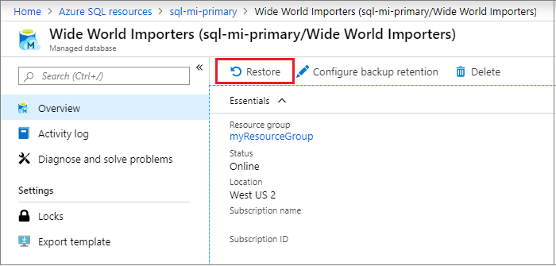
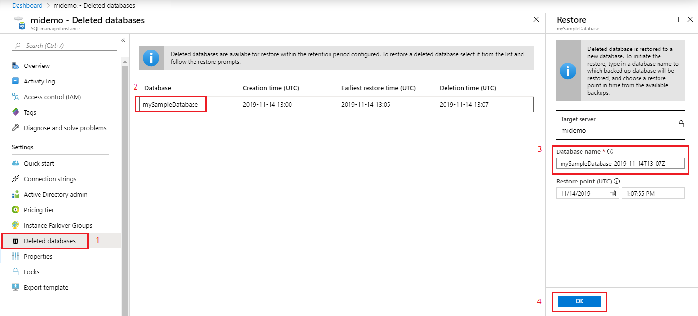

# Restore a database in Azure SQL Managed Instance to a previous point in time
[!INCLUDE[appliesto-sqlmi](../includes/appliesto-sqlmi.md)]

Use point-in-time restore (PITR) to create a database as a copy of another database from some time in the past. This article describes how to do a point-in-time restore of a database in Azure SQL Managed Instance.

Point-in-time restore is useful in recovery scenarios, such as incidents caused by errors, incorrectly loaded data, or deletion of crucial data. You can also use it simply for testing or auditing. Backup files are kept for 7 to 35 days, depending on your database settings.

Point-in-time restore can restore a database:

- from an existing database.
- from a deleted database.
- to the same SQL Managed Instance, or to another SQL Managed Instance. 

## Limitations

Point-in-time restore to SQL Managed Instance has the following limitations:

- When you're restoring from one instance of SQL Managed Instance to another, both instances must be in the same subscription and region. Cross-region and cross-subscription restore aren't currently supported.
- Point-in-time restore of a whole SQL Managed Instance is not possible. This article explains only what's possible: point-in-time restore of a database that's hosted on SQL Managed Instance.

> [!WARNING]
> Be aware of the storage size of your SQL Managed Instance. Depending on size of the data to be restored, you might run out of instance storage. If there isn't enough space for the restored data, use a different approach.

The following table shows point-in-time restore scenarios for SQL Managed Instance:

|           |Restore existing DB to the same instance of SQL Managed Instance| Restore existing DB to another SQL Managed Instance|Restore dropped DB to same SQL Managed Instance|Restore dropped DB to another SQL Managed Instance|
|:----------|:----------|:----------|:----------|:----------|
|**Azure portal**| Yes|No |Yes|No|
|**Azure CLI**|Yes |Yes |No|No|
|**PowerShell**| Yes|Yes |Yes|Yes|

## Restore an existing database

Restore an existing database to the same SQL Managed Instance using the Azure portal, PowerShell, or the Azure CLI. To restore a database to another SQL Managed Instance, use PowerShell or the Azure CLI so you can specify the properties for the target SQL Managed Instance and resource group. If you don't specify these parameters, the database will be restored to the existing SQL Managed Instance by default. The Azure portal doesn't currently support restoring to another SQL Managed Instance.

# [Portal](#tab/azure-portal)

1. Sign in to the [Azure portal](https://portal.azure.com). 
2. Go to your SQL Managed Instance and select the database that you want to restore.
3. Select **Restore** on the database page:

    

4. On the **Restore** page, select the point for the date and time that you want to restore the database to.
5. Select **Confirm** to restore your database. This action starts the restore process, which creates a new database and populates it with data from the original database at the specified point in time. For more information about the recovery process, see [Recovery time](../database/recovery-using-backups.md#recovery-time).

# [PowerShell](#tab/azure-powershell)

If you don't already have Azure PowerShell installed, see [Install the Azure PowerShell module](https://docs.microsoft.com/powershell/azure/install-az-ps).

To restore the database by using PowerShell, specify your values for the parameters in the following command. Then, run the command:

```powershell-interactive
$subscriptionId = "<Subscription ID>"
$resourceGroupName = "<Resource group name>"
$managedInstanceName = "<SQL Managed Instance name>"
$databaseName = "<Source-database>"
$pointInTime = "2018-06-27T08:51:39.3882806Z"
$targetDatabase = "<Name of new database to be created>"

Get-AzSubscription -SubscriptionId $subscriptionId
Select-AzSubscription -SubscriptionId $subscriptionId

Restore-AzSqlInstanceDatabase -FromPointInTimeBackup `
                              -ResourceGroupName $resourceGroupName `
                              -InstanceName $managedInstanceName `
                              -Name $databaseName `
                              -PointInTime $pointInTime `
                              -TargetInstanceDatabaseName $targetDatabase `
```

To restore the database to another SQL Managed Instance, also specify the names of the target resource group and target SQL Managed Instance:  

```powershell-interactive
$targetResourceGroupName = "<Resource group of target SQL Managed Instance>"
$targetInstanceName = "<Target SQL Managed Instance name>"

Restore-AzSqlInstanceDatabase -FromPointInTimeBackup `
                              -ResourceGroupName $resourceGroupName `
                              -InstanceName $managedInstanceName `
                              -Name $databaseName `
                              -PointInTime $pointInTime `
                              -TargetInstanceDatabaseName $targetDatabase `
                              -TargetResourceGroupName $targetResourceGroupName `
                              -TargetInstanceName $targetInstanceName 
```

For details, see [Restore-AzSqlInstanceDatabase](https://docs.microsoft.com/powershell/module/az.sql/restore-azsqlinstancedatabase).

# [Azure CLI](#tab/azure-cli)

If you don't already have the Azure CLI installed, see [Install the Azure CLI](/cli/azure/install-azure-cli?view=azure-cli-latest).

To restore the database by using the Azure CLI, specify your values for the parameters in the following command. Then, run the command:

```azurecli-interactive
az sql midb restore -g mygroupname --mi myinstancename |
-n mymanageddbname --dest-name targetmidbname --time "2018-05-20T05:34:22"
```

To restore the database to another SQL Managed Instance, also specify the names of the target resource group and SQL Managed Instance:  

```azurecli-interactive
az sql midb restore -g mygroupname --mi myinstancename -n mymanageddbname |
       --dest-name targetmidbname --time "2018-05-20T05:34:22" |
       --dest-resource-group mytargetinstancegroupname |
       --dest-mi mytargetinstancename
```

For a detailed explanation of the available parameters, see the [CLI documentation for restoring a database in a SQL Managed Instance](https://docs.microsoft.com/cli/azure/sql/midb?view=azure-cli-latest#az-sql-midb-restore).

---

## Restore a deleted database

Restoring a deleted database can be done by using PowerShell or Azure portal. To restore a deleted database to the same instance, use either the Azure portal or PowerShell. To restore a deleted database to another instance, use PowerShell. 

### Portal 


To recover a managed database using the Azure portal, open the SQL Managed Instance overview page, and select **Deleted databases**. Choose a deleted database that you want to restore, and type the name for the new database that will be created with data restored from the backup.

  

../../sql-database

### PowerShell

To restore a database to the same instance, update the parameter values and then run the following PowerShell command: 

```powershell-interactive
$subscriptionId = "<Subscription ID>"
Get-AzSubscription -SubscriptionId $subscriptionId
Select-AzSubscription -SubscriptionId $subscriptionId

$resourceGroupName = "<Resource group name>"
$managedInstanceName = "<SQL Managed Instance name>"
$deletedDatabaseName = "<Source database name>"
$targetDatabaseName = "<target database name>"

$deletedDatabase = Get-AzSqlDeletedInstanceDatabaseBackup -ResourceGroupName $resourceGroupName `
-InstanceName $managedInstanceName -DatabaseName $deletedDatabaseName

Restore-AzSqlinstanceDatabase -Name $deletedDatabase.Name `
   -InstanceName $deletedDatabase.ManagedInstanceName `
   -ResourceGroupName $deletedDatabase.ResourceGroupName `
   -DeletionDate $deletedDatabase.DeletionDate `
   -PointInTime UTCDateTime `
   -TargetInstanceDatabaseName $targetDatabaseName
```

To restore the database to another SQL Managed Instance, also specify the names of the target resource group and target SQL Managed Instance:

```powershell-interactive
$targetResourceGroupName = "<Resource group of target SQL Managed Instance>"
$targetInstanceName = "<Target SQL Managed Instance name>"

Restore-AzSqlinstanceDatabase -Name $deletedDatabase.Name `
   -InstanceName $deletedDatabase.ManagedInstanceName `
   -ResourceGroupName $deletedDatabase.ResourceGroupName `
   -DeletionDate $deletedDatabase.DeletionDate `
   -PointInTime UTCDateTime `
   -TargetInstanceDatabaseName $targetDatabaseName `
   -TargetResourceGroupName $targetResourceGroupName `
   -TargetInstanceName $targetInstanceName 
```

## Overwrite an existing database

To overwrite an existing database, you must:

1. Drop the existing database that you want to overwrite.
2. Rename the point-in-time-restored database to the name of the database that you dropped.

### Drop the original database

You can drop the database by using the Azure portal, PowerShell, or the Azure CLI.

You can also drop the database by connecting to the SQL Managed Instance directly, starting SQL Server Management Studio (SSMS), and then running the following Transact-SQL (T-SQL) command:

```sql
DROP DATABASE WorldWideImporters;
```

Use one of the following methods to connect to your database in the SQL Managed Instance:

- [SSMS/Azure Data Studio via an Azure virtual machine](https://docs.microsoft.com/azure/sql-database/sql-database-managed-instance-configure-vm)
- [Point-to-site](https://docs.microsoft.com/azure/sql-database/sql-database-managed-instance-configure-p2s)
- [Public endpoint](https://docs.microsoft.com/azure/sql-database/sql-database-managed-instance-public-endpoint-configure)

# [Portal](#tab/azure-portal)

In the Azure portal, select the database from the SQL Managed Instance, and then select **Delete**.

   

# [PowerShell](#tab/azure-powershell)

Use the following PowerShell command to drop an existing database from a SQL Managed Instance:

```powershell
$resourceGroupName = "<Resource group name>"
$managedInstanceName = "<SQL Managed Instance name>"
$databaseName = "<Source database>"

Remove-AzSqlInstanceDatabase -Name $databaseName -InstanceName $managedInstanceName -ResourceGroupName $resourceGroupName
```

# [Azure CLI](#tab/azure-cli)

Use the following Azure CLI command to drop an existing database from a SQL Managed Instance:

```azurecli-interactive
az sql midb delete -g mygroupname --mi myinstancename -n mymanageddbname
```

---

### Alter the new database name to match the original database name

Connect directly to the SQL Managed Instance and start SQL Server Management Studio. Then, run the following Transact-SQL (T-SQL) query. The query will change the name of the restored database to that of the dropped database that you intend to overwrite.

```sql
ALTER DATABASE WorldWideImportersPITR MODIFY NAME = WorldWideImporters;
```

Use one of the following methods to connect to your database in SQL Managed Instance:

- [Azure virtual machine](https://docs.microsoft.com/azure/sql-database/sql-database-managed-instance-configure-vm)
- [Point-to-site](https://docs.microsoft.com/azure/sql-database/sql-database-managed-instance-configure-p2s)
- [Public endpoint](https://docs.microsoft.com/azure/sql-database/sql-database-managed-instance-public-endpoint-configure)

## Next steps

Learn about [automated backups](../database/automated-backups-overview.md).
