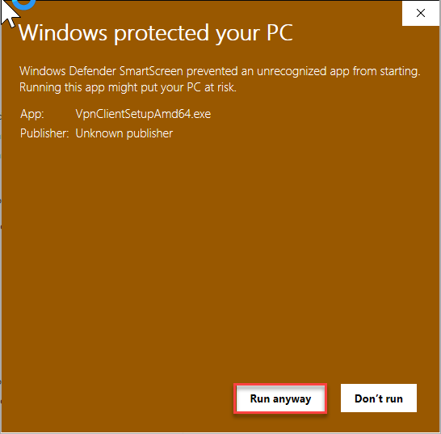
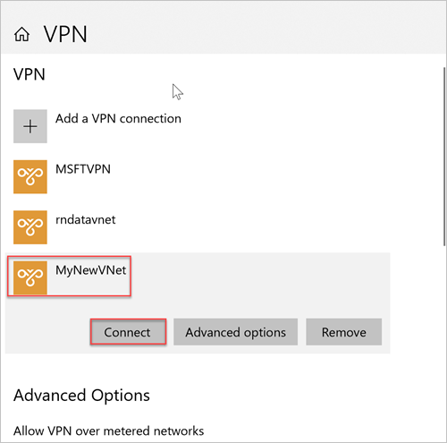
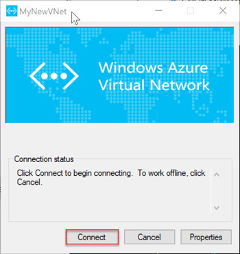

# Quickstart: Configure a point-to-site connection to Azure SQL Managed Instance from on-premises
[!INCLUDE[appliesto-sqlmi](../includes/appliesto-sqlmi.md)]

This quickstart demonstrates how to connect to Azure SQL Managed Instance using [SQL Server Management Studio](https://docs.microsoft.com/sql/ssms/sql-server-management-studio-ssms) (SSMS) from an on-premises client computer over a point-to-site connection. For information about point-to-site connections, see [About Point-to-Site VPN](../../vpn-gateway/point-to-site-about.md).

## Prerequisites

This quickstart:

- Uses the resources created in  [Create a managed instance](instance-create-quickstart.md) as its starting point.
- Requires PowerShell 5.1 and Azure PowerShell 1.4.0 or later on your on-premises client computer. If necessary, see the instructions for [installing the Azure PowerShell module](https://docs.microsoft.com/powershell/azure/install-az-ps#install-the-azure-powershell-module).
- Requires the newest version of [SQL Server Management Studio](https://docs.microsoft.com/sql/ssms/sql-server-management-studio-ssms) on your on-premises client computer.

## Attach a VPN gateway to a virtual network

1. Open PowerShell on your on-premises client computer.

2. Copy this PowerShell script. This script attaches a VPN gateway to the SQL Managed Instance virtual network that you created in the [Create a managed instance](instance-create-quickstart.md) quickstart. This script uses the Azure PowerShell Az Module and does the following for either Windows or Linux-based hosts:

   - Creates and installs certificates on a client machine
   - Calculates the future VPN gateway subnet IP range
   - Creates the gateway subnet
   - Deploys the Azure Resource Manager template that attaches the VPN gateway to the VPN subnet

     ```powershell
     $scriptUrlBase = 'https://raw.githubusercontent.com/Microsoft/sql-server-samples/master/samples/manage/azure-sql-db-managed-instance/attach-vpn-gateway'

     $parameters = @{
       subscriptionId = '<subscriptionId>'
       resourceGroupName = '<resourceGroupName>'
       virtualNetworkName = '<virtualNetworkName>'
       certificateNamePrefix  = '<certificateNamePrefix>'
       }

     Invoke-Command -ScriptBlock ([Scriptblock]::Create((iwr ($scriptUrlBase+'/attachVPNGateway.ps1?t='+ [DateTime]::Now.Ticks)).Content)) -ArgumentList $parameters, $scriptUrlBase
     ```

3. Paste the script in your PowerShell window and provide the required parameters. The values for `<subscriptionId>`, `<resourceGroup>`, and `<virtualNetworkName>` should match the ones that you used for the [Create a managed instance](instance-create-quickstart.md) quickstart. The value for `<certificateNamePrefix>` can be a string of your choice.

4. Execute the PowerShell script.

> [!IMPORTANT]
> Do not continue until the PowerShell script completes.

## Create a VPN connection

1. Sign in to the [Azure portal](https://portal.azure.com/).
2. Open the resource group in which you created the virtual network gateway, and then open the virtual network gateway resource.
3. Select **Point-to-site configuration** and then select **Download VPN client**.

      
4. On your on-premises client computer, extract the files from the zip file and then open the folder with the extracted files.
5. Open the **WindowsAmd64** folder and open the **VpnClientSetupAmd64.exe** file.
6. If you receive a **Windows protected your PC** message, click **More info** and then click **Run anyway**.

    
7. In the User Account Control dialog box, click **Yes** to continue.
8. In the dialog box referencing your virtual network, select **Yes** to install the VPN client for your virtual network.

## Connect to the VPN connection

1. Go to **VPN** in **Network & Internet** on your on-premises client computer and select your SQL Managed Instance virtual network to establish a connection to this VNet. In the following image, the VNet is named **MyNewVNet**.

      
2. Select **Connect**.
3. In the dialog box, select **Connect**.

      
4. When you're prompted that Connection Manager needs elevated privileges to update your route table, choose **Continue**.
5. Select **Yes** in the User Account Control dialog box to continue.

   You've established a VPN connection to your SQL Managed Instance VNet.

      

## Connect with SSMS

1. On the on-premises client computer, open SQL Server Management Studio.
2. In the **Connect to Server** dialog box, enter the fully qualified **host name** for your managed instance in the **Server name** box.
3. Select **SQL Server Authentication**, provide your username and password, and then select **Connect**.

      

After you connect, you can view your system and user databases in the Databases node. You can also view various objects in the Security, Server Objects, Replication, Management, SQL Server Agent, and XEvent Profiler nodes.

## Next steps

- For a quickstart showing how to connect from an Azure virtual machine, see [Configure a point-to-site connection](point-to-site-p2s-configure.md).
- For an overview of the connection options for applications, see [Connect your applications to SQL Managed Instance](connect-application-instance.md).
- To restore an existing SQL Server database from on-premises to a managed instance, you can use [Azure Database Migration Service for migration](../../dms/tutorial-sql-server-to-managed-instance.md) or the [T-SQL RESTORE command](restore-sample-database-quickstart.md) to restore from a database backup file.
