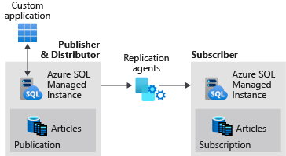

# Tutorial: Configure replication between two managed instances

[!INCLUDE[appliesto-sqlmi](../includes/appliesto-sqlmi.md)]

Transactional replication allows you to replicate data from one database to another hosted on either SQL Server or [Azure SQL Managed Instance](sql-managed-instance-paas-overview.md) (public preview). SQL Managed Instance can be a publisher, distributor or subscriber in the replication topology. See [transactional replication configurations](replication-transactional-overview.md#common-configurations) for available configurations.

> [!NOTE]
> This article describes the use of [transactional replication](https://docs.microsoft.com/sql/relational-databases/replication/transactional/transactional-replication) in Azure SQL Managed Instance. It is unrelated to [failover groups](https://docs.microsoft.com/azure/sql-database/sql-database-auto-failover-group), an Azure SQL Managed Instance feature that allows you to create complete readable replicas of individual instances.

This tutorial teaches you to configure one managed instance as the publisher and distributor, and then a second managed instance as the subscriber.  



  > [!NOTE]
  > - This article is intended to guide an advanced user in configuring replication with SQL Managed Instance from end to end, starting with creating the resource group. If you already have managed instances deployed, skip ahead to [Step 4](#4---create-a-publisher-database) to create your publisher database, or [Step 6](#6---configure-distribution) if you already have a publisher and subscriber database, and are ready to start configuring replication.  
  > - This article configures your publisher and distributor on the same managed instance. To place the distributor on a separate managed instance, see the tutorial [Configure transactional replication between Azure SQL Managed Instance and SQL Server](replication-two-instances-and-sql-server-configure-tutorial.md). 

## Requirements

Configuring SQL Managed Instance to function as a publisher and/or a distributor requires:

- That the publisher managed instance is on the same virtual network as the distributor and the subscriber, or [virtual network peering](../../virtual-network/tutorial-connect-virtual-networks-powershell.md) has been configured between the virtual networks of all three entities. 
- Connectivity uses SQL Authentication between replication participants.
- An Azure storage account share for the replication working directory.
- Port 445 (TCP outbound) is open in the security rules of NSG for the managed instances to access the Azure file share.  If you encounter the error `failed to connect to azure storage \<storage account name> with os error 53`, you will need to add an outbound rule to the NSG of the appropriate SQL Managed Instance subnet.

## 1 - Create a resource group

Use the [Azure portal](https://portal.azure.com) to create a resource group with the name `SQLMI-Repl`.  

## 2 - Create managed instances

Use the [Azure portal](https://portal.azure.com) to create two [SQL Managed Instances](instance-create-quickstart.md) on the same virtual network and subnet. For example, name the two managed instances:

- `sql-mi-pub` (along with some characters for randomization)
- `sql-mi-sub` (along with some characters for randomization)

You will also need to [configure an Azure VM to connect](connect-vm-instance-configure.md) to your managed instances. 

## 3 - Create an Azure storage account

[Create an Azure storage account](/azure/storage/common/storage-create-storage-account#create-a-storage-account) for the working directory, and then create a [file share](../../storage/files/storage-how-to-create-file-share.md) within the storage account. 

Copy the file share path in the format of:
`\\storage-account-name.file.core.windows.net\file-share-name`

Example: `\\replstorage.file.core.windows.net\replshare`

Copy the storage access keys in the format of:
`DefaultEndpointsProtocol=https;AccountName=<Storage-Account-Name>;AccountKey=****;EndpointSuffix=core.windows.net`

Example:
`DefaultEndpointsProtocol=https;AccountName=replstorage;AccountKey=dYT5hHZVu9aTgIteGfpYE64cfis0mpKTmmc8+EP53GxuRg6TCwe5eTYWrQM4AmQSG5lb3OBskhg==;EndpointSuffix=core.windows.net`

For more information, see [Manage storage account access keys](../../storage/common/storage-account-keys-manage.md). 

## 4 - Create a publisher database

Connect to your `sql-mi-pub` managed instance using SQL Server Management Studio and run the following Transact-SQL (T-SQL) code to create your publisher database:

```sql
USE [master]
GO

CREATE DATABASE [ReplTran_PUB]
GO

USE [ReplTran_PUB]
GO
CREATE TABLE ReplTest (
  ID INT NOT NULL PRIMARY KEY,
  c1 VARCHAR(100) NOT NULL,
  dt1 DATETIME NOT NULL DEFAULT getdate()
)
GO


USE [ReplTran_PUB]
GO

INSERT INTO ReplTest (ID, c1) VALUES (6, 'pub')
INSERT INTO ReplTest (ID, c1) VALUES (2, 'pub')
INSERT INTO ReplTest (ID, c1) VALUES (3, 'pub')
INSERT INTO ReplTest (ID, c1) VALUES (4, 'pub')
INSERT INTO ReplTest (ID, c1) VALUES (5, 'pub')
GO
SELECT * FROM ReplTest
GO
```

## 5 - Create a subscriber database

Connect to your `sql-mi-sub` managed instance using SQL Server Management Studio and run the following T-SQL code to create your empty subscriber database:

```sql
USE [master]
GO

CREATE DATABASE [ReplTran_SUB]
GO

USE [ReplTran_SUB]
GO
CREATE TABLE ReplTest (
  ID INT NOT NULL PRIMARY KEY,
  c1 VARCHAR(100) NOT NULL,
  dt1 DATETIME NOT NULL DEFAULT getdate()
)
GO
```

## 6 - Configure distribution

Connect to your `sql-mi-pub` managed instance using SQL Server Management Studio and run the following T-SQL code to configure your distribution database.

```sql
USE [master]
GO

EXEC sp_adddistributor @distributor = @@ServerName;
EXEC sp_adddistributiondb @database = N'distribution';
GO
```

## 7 - Configure publisher to use distributor

On your publisher SQL Managed Instance `sql-mi-pub`, change the query execution to [SQLCMD](/sql/ssms/scripting/edit-sqlcmd-scripts-with-query-editor) mode and run the following code to register the new distributor with your publisher.

```sql
:setvar username loginUsedToAccessSourceManagedInstance
:setvar password passwordUsedToAccessSourceManagedInstance
:setvar file_storage "\\storage-account-name.file.core.windows.net\file-share-name"
-- example: file_storage "\\replstorage.file.core.windows.net\replshare"
:setvar file_storage_key "DefaultEndpointsProtocol=https;AccountName=<Storage-Account-Name>;AccountKey=****;EndpointSuffix=core.windows.net"
-- example: file_storage_key "DefaultEndpointsProtocol=https;AccountName=replstorage;AccountKey=dYT5hHZVu9aTgIteGfpYE64cfis0mpKTmmc8+EP53GxuRg6TCwe5eTYWrQM4AmQSG5lb3OBskhg==;EndpointSuffix=core.windows.net"

USE [master]
EXEC sp_adddistpublisher
  @publisher = @@ServerName,
  @distribution_db = N'distribution',
  @security_mode = 0,
  @login = N'$(username)',
  @password = N'$(password)',
  @working_directory = N'$(file_storage)',
  @storage_connection_string = N'$(file_storage_key)'; -- Remove this parameter for on-premises publishers
```

   > [!NOTE]
   > Be sure to use only backslashes (`\`) for the file_storage parameter. Using a forward slash (`/`) can cause an error when connecting to the file share.

This script configures a local publisher on the managed instance, adds a linked server, and creates a set of jobs for the SQL Server agent.

## 8 - Create publication and subscriber

Using [SQLCMD](/sql/ssms/scripting/edit-sqlcmd-scripts-with-query-editor) mode, run the following T-SQL script to enable replication for your database, and configure replication between your publisher, distributor, and subscriber.

```sql
-- Set variables
:setvar username sourceLogin
:setvar password sourcePassword
:setvar source_db ReplTran_PUB
:setvar publication_name PublishData
:setvar object ReplTest
:setvar schema dbo
:setvar target_server "sql-mi-sub.wdec33262scj9dr27.database.windows.net"
:setvar target_username targetLogin
:setvar target_password targetPassword
:setvar target_db ReplTran_SUB

-- Enable replication for your source database
USE [$(source_db)]
EXEC sp_replicationdboption
  @dbname = N'$(source_db)',
  @optname = N'publish',
  @value = N'true';

-- Create your publication
EXEC sp_addpublication
  @publication = N'$(publication_name)',
  @status = N'active';


-- Configure your log reader agent
EXEC sp_changelogreader_agent
  @publisher_security_mode = 0,
  @publisher_login = N'$(username)',
  @publisher_password = N'$(password)',
  @job_login = N'$(username)',
  @job_password = N'$(password)';

-- Add the publication snapshot
EXEC sp_addpublication_snapshot
  @publication = N'$(publication_name)',
  @frequency_type = 1,
  @publisher_security_mode = 0,
  @publisher_login = N'$(username)',
  @publisher_password = N'$(password)',
  @job_login = N'$(username)',
  @job_password = N'$(password)';

-- Add the ReplTest table to the publication
EXEC sp_addarticle
  @publication = N'$(publication_name)',
  @type = N'logbased',
  @article = N'$(object)',
  @source_object = N'$(object)',
  @source_owner = N'$(schema)';

-- Add the subscriber
EXEC sp_addsubscription
  @publication = N'$(publication_name)',
  @subscriber = N'$(target_server)',
  @destination_db = N'$(target_db)',
  @subscription_type = N'Push';

-- Create the push subscription agent
EXEC sp_addpushsubscription_agent
  @publication = N'$(publication_name)',
  @subscriber = N'$(target_server)',
  @subscriber_db = N'$(target_db)',
  @subscriber_security_mode = 0,
  @subscriber_login = N'$(target_username)',
  @subscriber_password = N'$(target_password)',
  @job_login = N'$(username)',
  @job_password = N'$(password)';

-- Initialize the snapshot
EXEC sp_startpublication_snapshot
  @publication = N'$(publication_name)';
```

## 9 - Modify agent parameters

Azure SQL Managed Instance is currently experiencing some backend issues with connectivity with the replication agents. While this issue is being addressed, the workaround is to increase the login timeout value for the replication agents.

Run the following T-SQL command on the publisher to increase the login timeout:

```sql
-- Increase login timeout to 150s
update msdb..sysjobsteps set command = command + N' -LoginTimeout 150'
where subsystem in ('Distribution','LogReader','Snapshot') and command not like '%-LoginTimeout %'
```

Run the following T-SQL command again to set the login timeout back to the default value, should you need to do so:

```sql
-- Increase login timeout to 30
update msdb..sysjobsteps set command = command + N' -LoginTimeout 30'
where subsystem in ('Distribution','LogReader','Snapshot') and command not like '%-LoginTimeout %'
```

Restart all three agents to apply these changes.

## 10 - Test replication

Once replication has been configured, you can test it by inserting new items on the publisher and watching the changes propagate to the subscriber.

Run the following T-SQL snippet to view the rows on the subscriber:

```sql
select * from dbo.ReplTest
```

Run the following T-SQL snippet to insert additional rows on the publisher, and then check the rows again on the subscriber.

```sql
INSERT INTO ReplTest (ID, c1) VALUES (15, 'pub')
```

## Clean up resources

To drop the publication, run the following T-SQL command:

```sql
-- Drops the publication
USE [ReplTran_PUB]
EXEC sp_droppublication @publication = N'PublishData'
GO
```

To remove the replication option from the database, run the following T-SQL command:

```sql
-- Disables publishing of the database
USE [ReplTran_PUB]
EXEC sp_removedbreplication
GO
```

To disable publishing and distribution, run the following T-SQL command:

```sql
-- Drops the distributor
USE [master]
EXEC sp_dropdistributor @no_checks = 1
GO
```

You can clean up your Azure resources by [deleting the SQL Managed Instance resources from the resource group](../../azure-resource-manager/management/manage-resources-portal.md#delete-resources) and then deleting the resource group `SQLMI-Repl`. 

## Next steps

You can also learn more information about [transactional replication with Azure SQL Managed Instance](replication-transactional-overview.md) or learn to 
configure replication between a [SQL Managed Instance publisher/distributor and a SQL on Azure VM subscriber](replication-two-instances-and-sql-server-configure-tutorial.md). 
