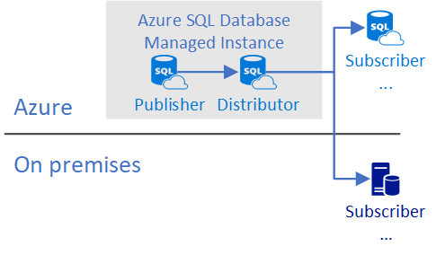
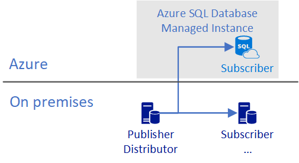

# Transactional replication with Azure SQL Managed Instance
[!INCLUDE[appliesto-sqlmi](../includes/appliesto-sqlmi.md)]

Transactional replication is a feature of Azure SQL Managed Instance and SQL Server that enables you to replicate data from a table in Azure SQL Managed Instance or a SQL Server instance to tables placed on remote databases. This feature allows you to synchronize multiple tables in different databases.

## Overview

You can use transactional replication to push changes made in an Azure SQL Managed Instance to:

- A SQL Server database - on-premises or on  Azure VM
- A single or pooled database in Azure SQL Database
- A single or pooled database in Azure SQL Managed Instance

  > [!NOTE]
  > To use all the features of Azure SQL Managed Instance, you must be using the latest versions of [SQL Server Management Studio (SSMS)](https://docs.microsoft.com/sql/ssms/download-sql-server-management-studio-ssms) and [SQL Server Data Tools (SSDT)](https://docs.microsoft.com/sql/ssdt/download-sql-server-data-tools-ssdt).

### Components

The key components in transactional replication are the **Publisher**, **Distributor**, and **Subscriber**, as shown in the following picture:  


| Role | Azure SQL Database | Azure SQL Managed Instance |
| :----| :------------- | :--------------- |
| **Publisher** | No | Yes |
| **Distributor** | No | Yes|
| **Pull subscriber** | No | Yes|
| **Push Subscriber**| Yes | Yes|
| &nbsp; | &nbsp; | &nbsp; |

The **Publisher** publishes changes made on some tables (articles) by sending the updates to the Distributor. The publisher can be an Azure SQL Managed Instance or a SQL Server instance.

The **Distributor** collects changes in the articles from a Publisher and distributes them to the Subscribers. The Distributor can be either a Azure SQL Managed Instance or a SQL Server instance (any version as long it is equal to or higher than the Publisher version).

The **Subscriber** receives changes made on the Publisher. A SQL Server instance and Azure SQL Managed Instance can both be push and pull subscribers, though a pull subscription is not supported when the distributor is an Azure SQL Managed Instance and the subscriber is not. A database in Azure SQL Database can only be a push subscriber.

Azure SQL Managed Instance can support being a Subscriber from the following versions of SQL Server:

- SQL Server 2016 and later
- SQL Server 2014 [RTM CU10 (12.0.4427.24)](https://support.microsoft.com/help/3094220/cumulative-update-10-for-sql-server-2014) or [SP1 CU3 (12.0.2556.4)](https://support.microsoft.com/help/3094221/cumulative-update-3-for-sql-server-2014-service-pack-1)
- SQL Server 2012 [SP2 CU8 (11.0.5634.1)](https://support.microsoft.com/help/3082561/cumulative-update-8-for-sql-server-2012-sp2) or [SP3 (11.0.6020.0)](https://www.microsoft.com/download/details.aspx?id=49996)

   > [!NOTE]
   >
   > - For other versions of SQL Server that do not support publishing to objects in Azure, it is possible to utilize the [republishing data](https://docs.microsoft.com/sql/relational-databases/replication/republish-data) method to move data to newer versions of SQL Server.
   > - Attempting to configure replication using an older version can result in error number MSSQL_REPL20084 (The process could not connect to Subscriber.) and MSSQ_REPL40532 (Cannot open server \<name> requested by the login. The login failed.)

### Types of replication

There are different [types of replication](https://docs.microsoft.com/sql/relational-databases/replication/types-of-replication):

| Replication | Azure SQL Database | Azure SQL Managed Instance |
| :----| :------------- | :--------------- |
| [**Standard Transactional**](https://docs.microsoft.com/sql/relational-databases/replication/transactional/transactional-replication) | Yes (only as subscriber) | Yes |
| [**Snapshot**](https://docs.microsoft.com/sql/relational-databases/replication/snapshot-replication) | Yes (only as subscriber) | Yes|
| [**Merge replication**](https://docs.microsoft.com/sql/relational-databases/replication/merge/merge-replication) | No | No|
| [**Peer-to-peer**](https://docs.microsoft.com/sql/relational-databases/replication/transactional/peer-to-peer-transactional-replication) | No | No|
| [**Bidirectional**](https://docs.microsoft.com/sql/relational-databases/replication/transactional/bidirectional-transactional-replication) | No | Yes|
| [**Updatable subscriptions**](https://docs.microsoft.com/sql/relational-databases/replication/transactional/updatable-subscriptions-for-transactional-replication) | No | No|
| &nbsp; | &nbsp; | &nbsp; |

### Supportability Matrix

  The transactional replication supportability matrix for Azure SQL Managed Instance is the same as the one for SQL Server.
  
| **Publisher**   | **Distributor** | **Subscriber** |
| :------------   | :-------------- | :------------- |
| SQL Server 2019 | SQL Server 2019 | SQL Server 2019 <br/> SQL Server 2017 <br/> SQL Server 2016 <br/>  |
| SQL Server 2017 | SQL Server 2019 <br/>SQL Server 2017 | SQL Server 2019 <br/> SQL Server 2017 <br/> SQL Server 2016 <br/> SQL Server 2014 |
| SQL Server 2016 | SQL Server 2019 <br/>SQL Server 2017 <br/> SQL Server 2016 | SQL Server 2019 <br/> SQL Server 2017 <br/>SQL Server 2016 <br/> SQL Server 2014 <br/> SQL Server 2012 |
| SQL Server 2014 | SQL Server 2019 <br/> SQL Server 2017 <br/> SQL Server 2016 <br/> SQL Server 2014 <br/>| SQL Server 2017 <br/> SQL Server 2016 <br/> SQL Server 2014 <br/> SQL Server 2012 <br/> SQL Server 2008 R2 <br/> SQL Server 2008 |
| SQL Server 2012 | SQL Server 2019 <br/> SQL Server 2017 <br/> SQL Server 2016 <br/> SQL Server 2014 <br/>SQL Server 2012 <br/> | SQL Server 2016 <br/> SQL Server 2014 <br/> SQL Server 2012 <br/> SQL Server 2008 R2 <br/> SQL Server 2008 |
| SQL Server 2008 R2 <br/> SQL Server 2008 | SQL Server 2019 <br/> SQL Server 2017 <br/> SQL Server 2016 <br/> SQL Server 2014 <br/>SQL Server 2012 <br/> SQL Server 2008 R2 <br/> SQL Server 2008 |  SQL Server 2014 <br/> SQL Server 2012 <br/> SQL Server 2008 R2 <br/> SQL Server 2008 <br/>  |
| &nbsp; | &nbsp; | &nbsp; |

## When to use

Transactional replication is useful in the following scenarios:

- Publish changes made in one or more tables in a database and distribute them to one or many databases in a SQL Server instance or Azure SQL Database that subscribed for the changes.
- Keep several distributed databases in synchronized state.
- Migrate databases from one SQL Server instance or Azure SQL Managed Instance to another database by continuously publishing the changes.

### Compare Data Sync with Transactional Replication

| | Data Sync | Transactional Replication |
|---|---|---|
| Advantages | - Active-active support<br/>- Bi-directional between on-premises and Azure SQL Database | - Lower latency<br/>- Transactional consistency<br/>- Reuse existing topology after migration |
| Disadvantages | - 5 min or more latency<br/>- No transactional consistency<br/>- Higher performance impact | - Can’t publish from Azure SQL Database <br/>- High maintenance cost |
| | | |

## Common configurations

In general, the publisher and the distributor must be either in the cloud or on-premises. The following configurations are supported:

### Publisher with local Distributor on SQL Managed Instance



Publisher and distributor are configured within a single SQL Managed Instance and distributing changes to another SQL Managed Instance, SQL Database, or SQL Server instance.

### Publisher with remote distributor on SQL Managed Instance

In this configuration, one managed instance publishes changes to a distributor placed on another SQL Managed Instance that can serve many source SQL Managed Instances and distribute changes to one or many targets on Azure SQL Database, Azure SQL Managed Instance, or SQL Server.


Publisher and distributor are configured on two managed instances. There are some constraints with this configuration:

- Both managed instances are on the same vNet.
- Both managed instances are in the same location.

### On-premises Publisher/Distributor with remote subscriber



In this configuration, a database in Azure SQL Database or Azure SQL Managed Instance is a subscriber. This configuration supports migration from on-premises to Azure. If a subscriber is a database in Azure SQL Database, it must be in push mode.  

## Requirements

- Use SQL Authentication for connectivity between replication participants.
- Use an Azure Storage Account share for the working directory used by replication.
- Open TCP outbound port 445 in the subnet security rules to access the Azure file share.
- Open TCP outbound port 1433 when the SQL Managed Instance is the Publisher/Distributor, and the Subscriber is not. You may also need to change the SQL Managed Instance NSG outbound security rule for `allow_linkedserver_outbound` for the port 1433 **Destination Service tag** from `virtualnetwork` to `internet`.
- Place both the publisher and distributor in the cloud, or both on-premises.
- Configure VPN peering between the virtual networks of replication participants if the virtual networks are different.

> [!NOTE]
> You may encounter error 53 when connecting to an Azure Storage File if the outbound network security group (NSG) port 445 is blocked when the distributor is an Azure SQL Managed Instance database and the subscriber is on-premises. [Update the vNet NSG](/azure/storage/files/storage-troubleshoot-windows-file-connection-problems) to resolve this issue.

## With failover groups

[Active geo-replication](../database/active-geo-replication-overview.md) is not supported with a SQL Managed Instance using transactional replication. Instead of active geo-replication, use [Auto-failover groups](../database/auto-failover-group-overview.md), but note that the publication has to be [manually deleted](transact-sql-tsql-differences-sql-server.md#replication) from the primary managed instance and re-created on the secondary SQL Managed Instance after failover.

If geo-replication is enabled on a **publisher** or **distributor** SQL Managed Instance in a [failover group](../database/auto-failover-group-overview.md), the SQL Managed Instance administrator must clean up all publications on the old primary and reconfigure them on the new primary after a failover occurs. The following activities are needed in this scenario:

1. Stop all replication jobs running on the database, if there are any.
1. Drop subscription metadata from publisher by running the following script on publisher database:

   ```sql
   EXEC sp_dropsubscription @publication='<name of publication>', @article='all',@subscriber='<name of subscriber>'
   ```

1. Drop subscription metadata from the subscriber. Run the following script on the subscription database on subscriber SQL Managed Instance:

   ```sql
   EXEC sp_subscription_cleanup
      @publisher = N'<full DNS of publisher, e.g. example.ac2d23028af5.database.windows.net>',
      @publisher_db = N'<publisher database>',
      @publication = N'<name of publication>';
   ```

1. Forcefully drop all replication objects from publisher by running the following script in the published database:

   ```sql
   EXEC sp_removedbreplication
   ```

1. Forcefully drop old distributor from original primary SQL Managed Instance (if failing back over to an old primary that used to have a distributor). Run the following script on the master database in old distributor SQL Managed Instance:

   ```sql
   EXEC sp_dropdistributor 1,1
   ```

If geo-replication is enabled on a **subscriber** instance in a failover group, the publication should be configured to connect to the failover group listener endpoint for the subscriber managed instance. In the event of a failover, subsequent action by the managed instance administrator depends on the type of failover that occurred:

- For a failover with no data loss, replication will continue working after failover.
- For a failover with data loss, replication will work as well. It will replicate the lost changes again.
- For a failover with data loss, but the data loss is outside of the distribution database retention period, the SQL Managed Instance administrator will need to reinitialize the subscription database.

## Next steps

For more information about configuring transactional replication, see the following tutorials:

- [Configure replication between a SQL Managed Instance publisher and subscriber](../managed-instance/replication-between-two-instances-configure-tutorial.md)
- [Configure replication between a SQL Managed Instance publisher, SQL Managed Instance distributor, and SQL Server subscriber](../managed-instance/replication-two-instances-and-sql-server-configure-tutorial.md)
- [Create a publication](https://docs.microsoft.com/sql/relational-databases/replication/publish/create-a-publication).
- [Create a push subscription](https://docs.microsoft.com/sql/relational-databases/replication/create-a-push-subscription) by using the server name as the subscriber (for example `N'azuresqldbdns.database.windows.net` and the database in Azure SQL Database name as the destination database (for example, **Adventureworks**. )

## See also  

- [Replication with a SQL Managed Instance and a failover group](transact-sql-tsql-differences-sql-server.md#replication)
- [Replication to SQL Database](../database/replication-to-sql-database.md)
- [Replication to managed instance](../managed-instance/replication-between-two-instances-configure-tutorial.md)
- [Create a Publication](https://docs.microsoft.com/sql/relational-databases/replication/publish/create-a-publication)
- [Create a Push Subscription](https://docs.microsoft.com/sql/relational-databases/replication/create-a-push-subscription/)
- [Types of Replication](https://docs.microsoft.com/sql/relational-databases/replication/types-of-replication)
- [Monitoring (Replication)](https://docs.microsoft.com/sql/relational-databases/replication/monitor/monitoring-replication)
- [Initialize a Subscription](https://docs.microsoft.com/sql/relational-databases/replication/initialize-a-subscription)  
