# Quickstart: Restore a database to Azure SQL Managed Instance with SSMS
[!INCLUDE[appliesto-sqlmi](../includes/appliesto-sqlmi.md)]

In this quickstart, you'll use SQL Server Management Studio (SSMS) to restore a database (the Wide World Importers - Standard backup file) from Azure Blob storage to [Azure SQL Managed Instance](sql-managed-instance-paas-overview.md).

> [!VIDEO https://www.youtube.com/embed/RxWYojo_Y3Q]

> [!NOTE]
> For more information on migration using Azure Database Migration Service, see [SQL Managed Instance migration using Database Migration Service](../../dms/tutorial-sql-server-to-managed-instance.md).
> For more information on various migration methods, see [SQL Server migration to Azure SQL Managed Instance](migrate-to-instance-from-sql-server.md).

## Prerequisites

This quickstart:

- Uses resources from the [Create a managed instance](instance-create-quickstart.md) quickstart.
- Requires the latest version of [SSMS](/sql/ssms/sql-server-management-studio-ssms) installed.
- Requires using SSMS to connect to SQL Managed Instance. See these quickstarts on how to connect:
  - [Enable a public endpoint](public-endpoint-configure.md) on SQL Managed Instance - this is the recommended approach for this tutorial.
  - [Connect to SQL Managed Instance from an Azure VM](connect-vm-instance-configure.md).
  - [Configure a point-to-site connection to SQL Managed Instance from on-premises](point-to-site-p2s-configure.md).

> [!NOTE]
> For more information on backing up and restoring a SQL Server database using Azure Blob storage and a [Shared Access Signature (SAS) key](../../storage/common/storage-sas-overview.md), see [SQL Server Backup to URL](/sql/relational-databases/backup-restore/sql-server-backup-to-url).

## Restore from a backup file using restore wizard

In SQL Server Management Studio, follow these steps to restore the Wide World Importers database to SQL Managed Instance using the restore wizard. The database backup file is stored in a pre-configured Azure Blob storage account.

1. Open SSMS and connect to your managed instance.
2. In **Object Explorer**, right-click on the databases of your managed instance and select **Restore Database...** to open the restore wizard window.

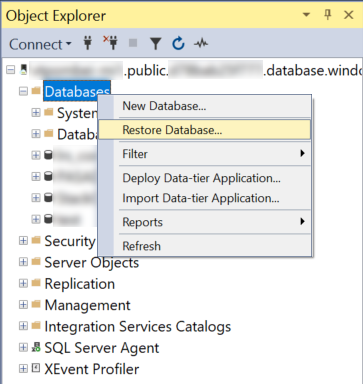

3. On the new restore wizard window press the "..." button to specify the source of the backup file to be used.

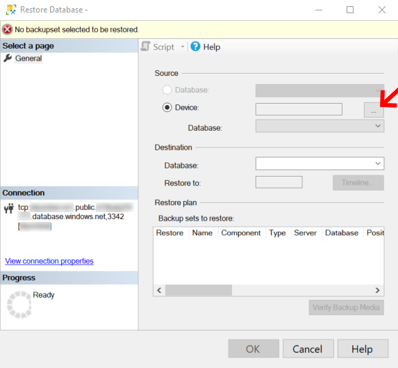

4. On the "Select backup devices" click on the button "Add". The Backup media type only allow "URL" since this is the only source type supported.


5. At the "Select a Backup Location" there are 3 options to provide the information about the location where to find the backup files.
  - Select a pre-registered storage container from the drop down
  - Enter a new storage container and a shared access signature (A new SQL Credential will be registered for you) 
  - Click the Add button to browse more storage containers from your Azure subscription

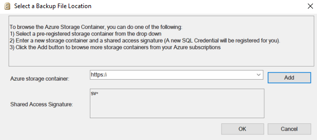

6. The next steps are regarding clicking on the "Add" button on the "Select a Backup File Location", if the method to provide the location is one of the others please jump to step 14.
7. On the "Connect to a Microsoft Subscription" the first action is to sign in to the Azure subscription by clicking on the "Sign in..." button.


9. Initiate the session on Azure


10. After the sign in to Azure select the subscription where the Storage account with the backup file(s) are located.

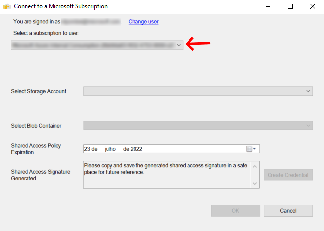

11. Select the Azure Storage account where the backup file(s) are located.

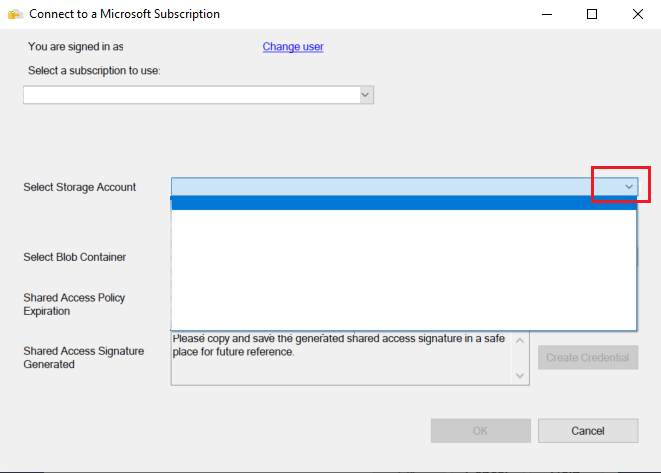

12. Select the Blob container where the backup file(s) are located.

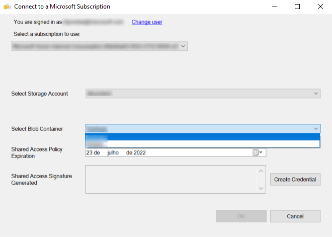

13. Specify the expiration date of the Shared Access Policy and click on the "Create Credential" button. This will create a Shared Access Signature with the right permissions.

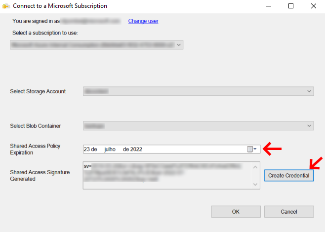

14. Now that the storage container and the Shared Access Signature are filled, click on the "OK" button.

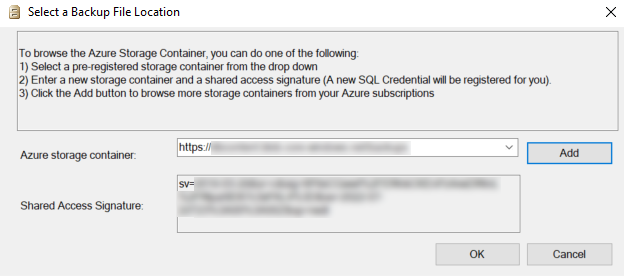

15. Expande the folder struture on the left until the folder where the backup file(S) are located and then select all the backup files related to the backup set to be restored.

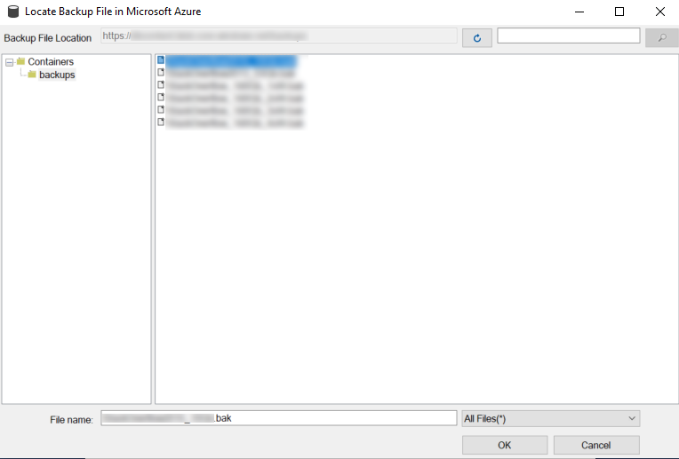

16. Everything is set just click on the "OK" button.

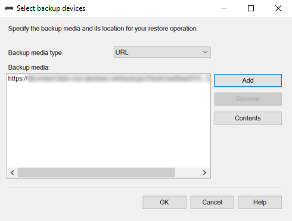

17. SSMS will validate the backupset, this will take a few seconds depending on the size of the backupset.

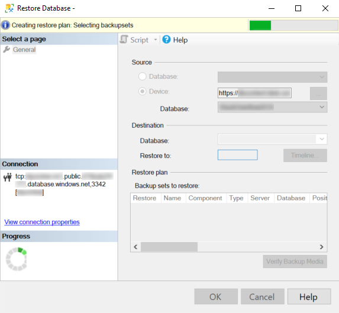

18. If the backupset is valid just specify the destination database name or leave it with the database name of the backupset and press the "OK" button.

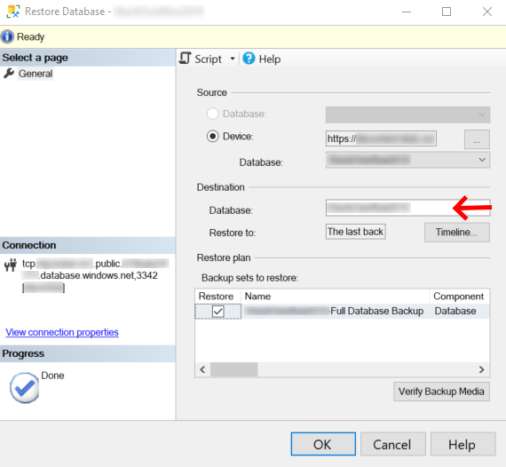

19. The restore will start and the duration will depend on the size of the backupset.

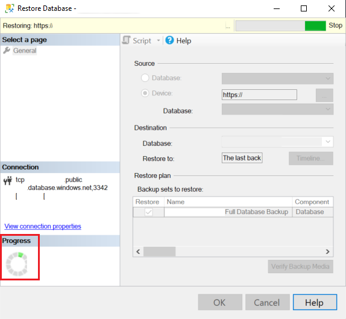

20. When the restore finish there will be a window showing it was successful.

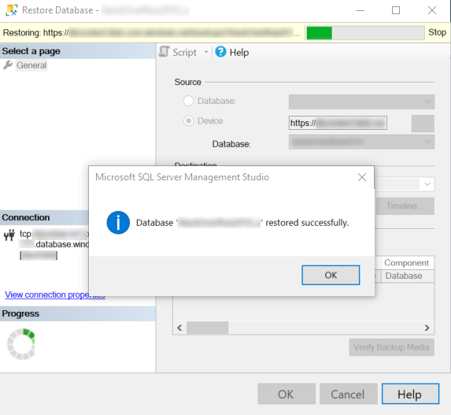

21. The restored database will be visible on the Object Explorer.

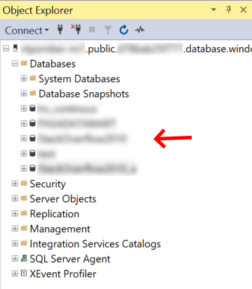


## Restore from a backup file using T-SQL

In SQL Server Management Studio, follow these steps to restore the Wide World Importers database to SQL Managed Instance. The database backup file is stored in a pre-configured Azure Blob storage account.

1. Open SSMS and connect to your managed instance.
2. In **Object Explorer**, right-click your managed instance and select **New Query** to open a new query window.
3. Run the following SQL script, which uses a pre-configured storage account and SAS key to [create a credential](/sql/t-sql/statements/create-credential-transact-sql) in your managed instance.
 
   > [!IMPORTANT]
   > `CREDENTIAL` must match the container path, begin with `https`, and can't contain a trailing forward slash. `IDENTITY` must be `SHARED ACCESS SIGNATURE`. `SECRET` must be the Shared Access Signature token and can't contain a leading `?`.

   ```sql
   CREATE CREDENTIAL [https://mitutorials.blob.core.windows.net/databases]
   WITH IDENTITY = 'SHARED ACCESS SIGNATURE'
   , SECRET = 'sv=2017-11-09&ss=bfqt&srt=sco&sp=rwdlacup&se=2028-09-06T02:52:55Z&st=2018-09-04T18:52:55Z&spr=https&sig=WOTiM%2FS4GVF%2FEEs9DGQR9Im0W%2BwndxW2CQ7%2B5fHd7Is%3D'
   ```

    

4. To check your credential, run the following script, which uses a [container](https://azure.microsoft.com/services/container-instances/) URL to get a backup file list.

   ```sql
   RESTORE FILELISTONLY FROM URL =
      'https://mitutorials.blob.core.windows.net/databases/WideWorldImporters-Standard.bak'
   ```

    

5. Run the following script to restore the Wide World Importers database.

   ```sql
   RESTORE DATABASE [Wide World Importers] FROM URL =
     'https://mitutorials.blob.core.windows.net/databases/WideWorldImporters-Standard.bak'
   ```

    

6. Run the following script to track the status of your restore.

   ```sql
   SELECT session_id as SPID, command, a.text AS Query, start_time, percent_complete
      , dateadd(second,estimated_completion_time/1000, getdate()) as estimated_completion_time
   FROM sys.dm_exec_requests r
   CROSS APPLY sys.dm_exec_sql_text(r.sql_handle) a
   WHERE r.command in ('BACKUP DATABASE','RESTORE DATABASE')
   ```

7. When the restore completes, view the database in Object Explorer. You can verify that database restore is completed using the [sys.dm_operation_status](/sql/relational-databases/system-dynamic-management-views/sys-dm-operation-status-azure-sql-database) view.

> [!NOTE]
> A database restore operation is asynchronous and retryable. You might get an error in SQL Server Management Studio if the connection breaks or a time-out expires. Azure SQL Database will keep trying to restore database in the background, and you can track the progress of the restore using the [sys.dm_exec_requests](/sql/relational-databases/system-dynamic-management-views/sys-dm-exec-requests-transact-sql) and [sys.dm_operation_status](/sql/relational-databases/system-dynamic-management-views/sys-dm-operation-status-azure-sql-database) views.
> In some phases of the restore process, you will see a unique identifier instead of the actual database name in the system views. Learn about `RESTORE` statement behavior differences [here](./transact-sql-tsql-differences-sql-server.md#restore-statement).

## Next steps

- If, at step 5, a database restore is terminated with the message ID 22003, create a new backup file containing backup checksums and perform the restore again. See [Enable or disable backup checksums during backup or restore](/sql/relational-databases/backup-restore/enable-or-disable-backup-checksums-during-backup-or-restore-sql-server).
- For troubleshooting a backup to a URL, see [SQL Server Backup to URL best practices and troubleshooting](/sql/relational-databases/backup-restore/sql-server-backup-to-url-best-practices-and-troubleshooting).
- For an overview of app connection options, see [Connect your applications to SQL Managed Instance](connect-application-instance.md).
- To query using your favorite tools or languages, see [Quickstarts: Azure SQL Database connect and query](../database/connect-query-content-reference-guide.md).
