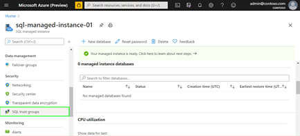

# Introduction

Server Trust Group is a concept used for managing trust between Azure SQL Managed Instances. By creating a group and adding instances to it, certificate-based trust is established between all members, and this can be used for different cross-instance scenarios. Removing servers from the group or deleting the group results in removing the trust between the servers. 
Note: Server Trust Group is introduced in public preview of Distributed transactions between Azure SQL Managed Instances and currently has some limitations that will be described later in this article. Server Trust Group is an ARM object that corresponds to Azure portal entity named SQL trust group. < TODO(sasapopo): insert link to Server Trust Group ARM object.>

# Server Trust Group setup

TODO(sasapopo): move the content from Word to this .md file.

   

