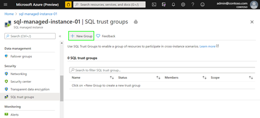
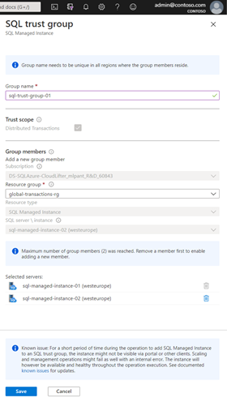
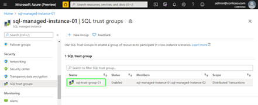
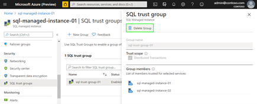
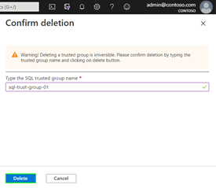

# Use Server Trust Groups to setup and manage trust between SQL Managed Instances
[!INCLUDE[appliesto-sqlmi](../includes/appliesto-sqlmi.md)]

Server Trust Group is a concept used for managing trust between Azure SQL Managed Instances. By creating a group and adding instances to it certificate-based trust is established between all members and this can be used for different cross-instance scenarios. Removing servers from the group or deleting the group results in removing the trust between the servers. 
[Server Trust Group](https://aka.ms/mi-server-trust-group-arm) is an ARM object that corresponds to Azure portal entity named SQL trust group.

> [!NOTE]
> Server Trust Group is introduced in public preview of Distributed transactions between Azure SQL Managed Instances and currently has some limitations that will be described later in this article.

## Server Trust Group setup

The following section describes setup of Server Trust Group.

1. Go to the [Azure portal](https://portal.azure.com/).

2. Navigate to Azure SQL Managed Instance that you plan to add to a newly created SQL trust group.

3. On the *Security* settings, select the *SQL trust group* tab.

   

4. In the Server Trust Group configuration page select the *New Group* icon.

   

5. On the SQL trust group creation blade set the **Group name**. It needs to be unique in all regions where the group members reside. **Trust scope** defines type of cross-instance scenario that is enabled with the SQL trust group and in preview the only applicable trust scope is **Distributed transactions**, so it is preselected and cannot be changed. All **Group members** must belong to the same **subscription** but can be under different resource groups. Select the **Resource group** and **SQL Server / instance** to choose the Azure SQL Managed Instance that will be member of the group.
   

6. After all required fields are populated, click Save.

## Server Trust Group maintenance and deletion

There is no way to edit SQL trust group . To remove a SQL Managed Instance from a group you need to delete the group and create a new one.

Following section describes SQL trust group deletion process. 
1. Go to the Azure portal.
2. Navigate to an Azure SQL Managed Instance  that belongs to the trust group.
3. On the Security s	ettings, select the SQL trust groups tab.
4. Select the trust group you want to delete.
   
5. Click Delete Group.
   
6. Type in the trust group name to confirm deletion and click Delete.
   

## Limitations

During public  preview the following limitations apply to Server Trust Groups.
 * Name of the Server Trust Group must be unique in all regions where its members reside.
 * Group can contain only Azure SQL Managed Instances and they must be under the same Azure Subscription.
 * Group can have exactly two instances.
 * Distributed transactions are the only applicable scope for the Server Trust Groups.
 * Server Trust Group can only be managed from Azure portal. PowerShell and CLI support will come later.
 * Server Trust Group cannot be edited on the Azure portal. It can only be created or dropped.
 * Additional limitations of distributed transactions may be related to your scenario. Most notable one is that SQL Managed Instances that participate in Server Trust Group must be reachable via private endpoints, or in other connectivity must work on the virtual network level. Please make sure that you are aware of the current [distributed transactions limitations for Azure SQL Managed Instance](https://docs.microsoft.com/en-us/azure/azure-sql/database/elastic-transactions-overview#limitations).

