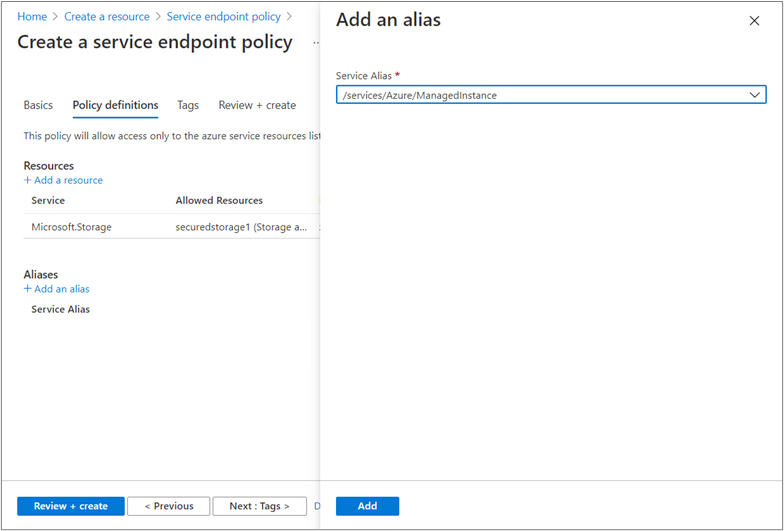
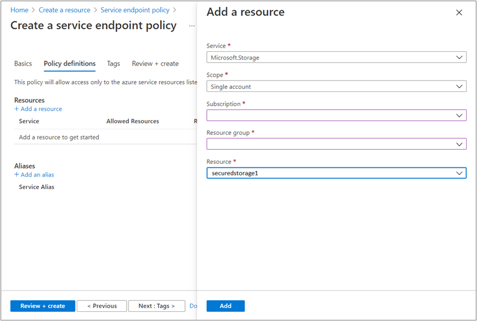
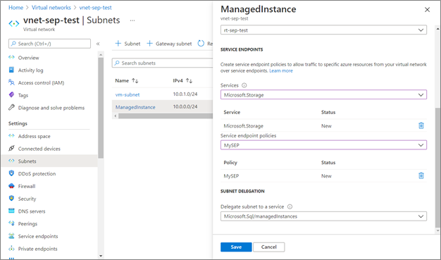

# Configure Azure Storage service endpoint policies for Azure SQL Managed Instance
[!INCLUDE[appliesto-sqlmi](../includes/appliesto-sqlmi.md)]

Virtual Network (VNet) Azure Storage [service endpoint policies](../../virtual-network/virtual-network-service-endpoint-policies-overview.md) allow you to filter egress virtual network traffic to Azure Storage, restricting data transfers to specific storage accounts.

## Key benefits

Configuring Virtual network Azure storage service endpoint policies for your Azure SQL Managed Instance provides the following benefits:

- __Improved security for your Azure SQL Managed Instance traffic to Azure Storage__: Endpoint policies establish a security control that prevents erroneous or malicious exfiltration of business-critical data. Traffic can be limited to only those storage accounts that are compliant with your data governance requirements.

- __Granular control over which storage accounts can be accessed__: Service endpoint policies can permit traffic to storage accounts at a subscription, resource group, and individual storage account level. Administrators can use service endpoint policies to enforce adherence to the organization's data security architecture in Azure.

- __System traffic remains unaffected__: Service endpoint policies never obstruct access to storage that is required Azure SQL Managed Instance to function. This includes the storage of backups, data files and transaction log files, and similar.

> [!IMPORTANT]
> Service endpoint policies only control traffic that originates from the SQL Managed Instance subnet and terminates in Azure storage. The policies do not affect, for example, exporting the database to an on-prem BACPAC file, Azure Data Factory integration, the collection of diagnostic information via Azure Diagnostic Settings, or other mechanisms of data extraction that do not directly target Azure Storage.

## Limitations

Enabling service endpoint policies for your SQL Managed Instance has the following limitations: 

- The feature is available only to virtual networks deployed through the Azure Resource Manager deployment model.
- The feature is available only in subnets that have [service endpoints](../../../virtual-network/virtual-network-service-endpoints-overview.md) for Azure Storage enabled.
- Enabling service endpoints for Azure Storage also extends to include paired regions where you deploy the virtual network to support Read-Access Geo-Redundant storage (RA-GRS) and Geo-Redundant storage (GRS) traffic.
- Assigning a service endpoint policy to a service endpoint upgrades the endpoint from regional to global scope. In other words, all traffic to Azure Storage will go through the service endpoint regardless of the region in which the storage account resides.

## Prepare storage inventory

Before you begin configuring service endpoint policies on a subnet, compose a list of storage accounts that should be accessible by the managed instances in that subnet. 

The following is a list of workflows that may contact Azure Storage: 

- [Auditing](auditing-configure.md) to Azure Storage.
- Performing a [copy-only backup](/sql/relational-databases/backup-restore/copy-only-backups-sql-server) to Azure Storage.
- [Restoring](restore-sample-database-quickstart.md) a database from Azure Storage.
- Importing data with [BULK INSERT or OPENROWSET(BULK ...)](/sql/relational-databases/import-export/import-bulk-data-by-using-bulk-insert-or-openrowset-bulk-sql-server).
- Logging [extended events](../database/xevent-db-diff-from-svr.md) to an Event File target on Azure Storage.
- [Azure DMS offline migration](../../dms/tutorial-sql-server-to-managed-instance.md) to Azure SQL Managed Instance.
- [Log Replay Service migration](log-replay-service-migrate.md) to Azure SQL Managed Instance.
- Synchronizing tables using [transactional replication](replication-transactional-overview.md).

Note the account name, resource group, and subscription for any storage account that participates in these, or any other workflows that access storage. 

## Configure policies

You'll first need to create your service endpoint policy, and then associate the policy with the SQL Managed Instance subnet. Modify the workflow in this section to suit your business needs. 

> [!NOTE]
> - SQL Managed Instance subnets require policies to contain the /Services/Azure/ManagedInstance service alias (See step 4). 
> - Managed instances deployed to a subnet that already contains service endpoitn policies will be automatically upgraded the /Services/Azure/ManagedInstance service alias.

### Create a service endpoint policy

To create a service endpoint policy, follow these steps: 

1. Sign into the [Azure portal](https://portal.azure.com). 
1. Select **+ Create a resource**. 
1. In the search pane, enter _service endpoint policy_, select **Service endpoint policy**, and then select **Create**.

   

1. Fill in the following values on the **Basics** page:

   - Subscription: Select the subscription for your policy from the drop-down.
   - Resource group: Select the resource group where your managed instance is located, or select **Create new** and fill in the name for a new resource group.
   - Name: Provide a name for your policy, such as **mySEP**.
   - Location: Select the region of the virtual network hosting the managed instance. 

   

1. In **Policy definitions**, select **Add an alias** and enter the following information on the **Add an alias** pane:
   - Service Alias: Select /Services/Azure/ManagedInstance.
   - Select **Add** to finish adding the service alias.

   

1. In Policy definitions, select **+ Add** under **Resources** and enter or select the following information in the **Add a resource** pane:
   - Service: Select **Microsoft.Storage**.
   - Scope: Select **All accounts in subscription**.
   - Subscription: Select a subscription containing the storage account(s) to permit. Refer to your [inventory of Azure storage accounts](#prepare-storage-inventory) created earlier.
   - Select **Add** to finish adding the resource.
   - Repeat this step to add any additional subscriptions. 

   

1. Optional: you may configure tags on the service endpoint policy under **Tags**.
1.	Select **Review + Create**. Validate the information and select **Create**. To make further edits, select **Previous**.

   > [!TIP]
   > First, configure policies to allow access to the storage accounts. Validate the configuration by ensuring that all workflows operate normally. Then you can reconfigure policies to allow individual storage accounts, or accounts in a resource group. To do so, select **Single account** or **All accounts in resource group** in the _Scope:_ field instead and fill in the other fields accordingly.

### Associate policy with subnet

After your service endpoint policy is created, associate the policy with your SQL Managed Instance subnet. 

To associate your policy, follow these steps: 

1. In the _All services_ box in the Azure portal, search for _virtual networks_. Select **Virtual networks**.
1. Locate and select the virtual network hosting your managed instance.
1. Select **Subnets** and choose the subnet dedicated to your managed instance. Enter the following information in the subnet pane:
    - Services: Select **Microsoft.Storage**. If this field is empty, you need to configure the service endpoint for Azure Storage on this subnet.
    - Service endpoint policies: Select any service endpoint policies you want to apply to the SQL Managed Instance subnet.

   

1. Select **Save** to finish configuring the virtual network.

> [!WARNING]
> If the policies on this subnet do not have the `/Services/Azure/ManagedInstance` alias, you may see the following error: 
> ` Failed to save subnet 'subnet'. Error: 'Found conflicts with NetworkIntentPolicy.`
> `Details: Service endpoint policies on subnet are missing definitions`
> To resolve this, update all the policies on the subnet to include the `/Services/Azure/ManagedInstance` alias.

## Next steps

- 

