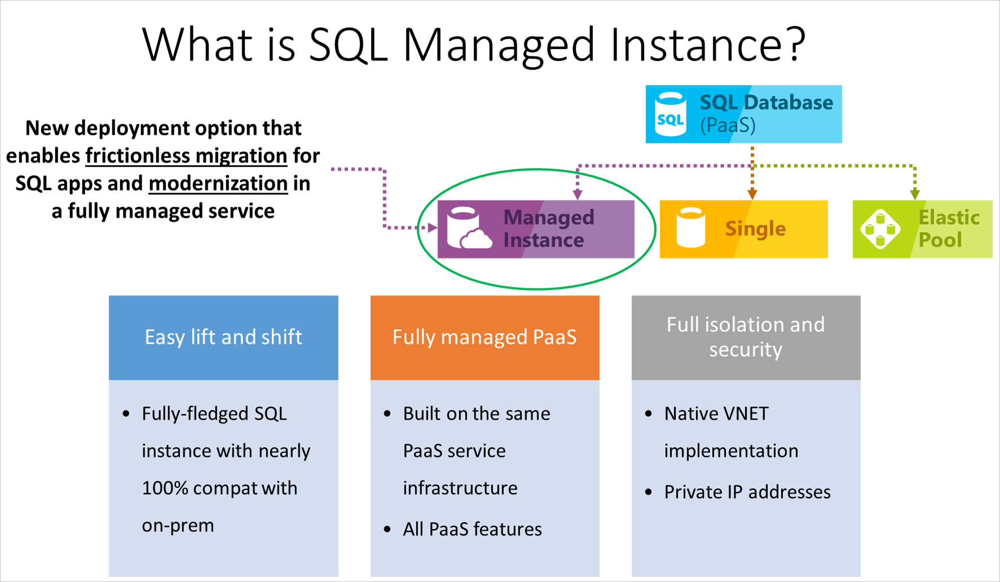
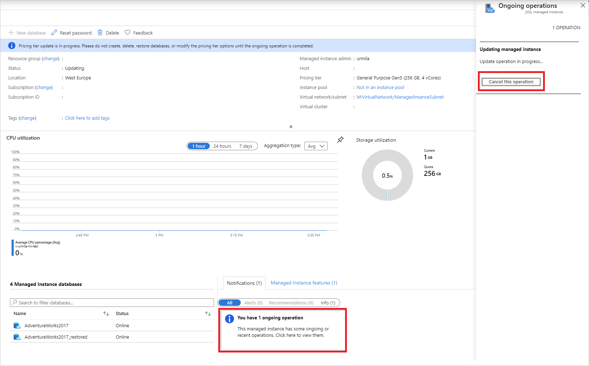
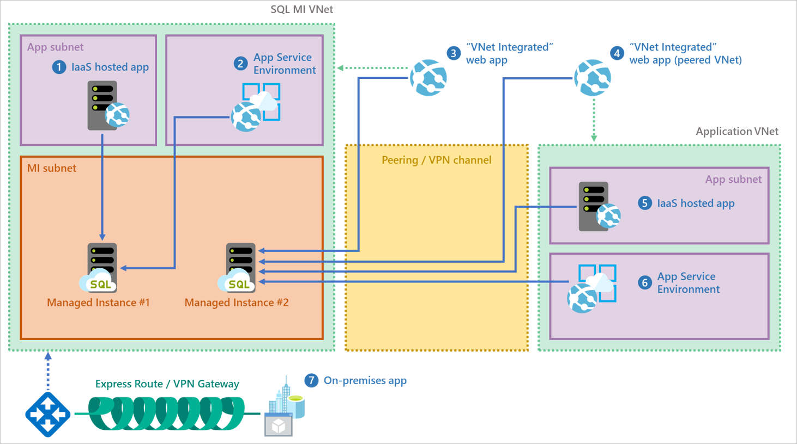
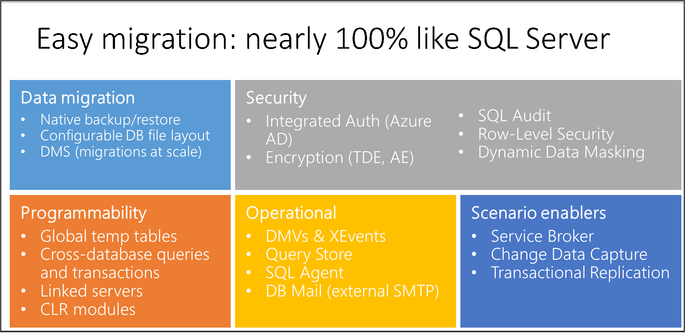

# What is Azure SQL Managed Instance?
[!INCLUDE[appliesto-sqlmi](../includes/appliesto-sqlmi.md)]

Part of the Azure SQL product family, Azure SQL Managed Instance is the intelligent, scalable cloud database service that combines the broadest SQL Server database engine compatibility with all the benefits of a fully managed and evergreen platform as a service. SQL Managed Instance has near 100% compatibility with the latest SQL Server (Enterprise Edition) database engine, providing a native [virtual network (VNet)](../../virtual-network/virtual-networks-overview.md) implementation that addresses common security concerns, and a [business model](https://azure.microsoft.com/pricing/details/sql-database/) favorable for existing SQL Server customers. SQL Managed Instance allows existing SQL Server customers to lift and shift their on-premises applications to the cloud with minimal application and database changes. At the same time, SQL Managed Instance preserves all PaaS capabilities (automatic patching and version updates, [automated backups](../database/automated-backups-overview.md), [high availability](../database/high-availability-sla.md)) that drastically reduce management overhead and TCO.

> [!IMPORTANT]
> For a list of regions where SQL Managed Instance is currently available, see [Supported regions](resource-limits.md#supported-regions).

The following diagram outlines key features of SQL Managed Instance:

Azure SQL Managed Instance is designed for customers looking to migrate a large number of apps from an on-premises or IaaS, self-built, or ISV provided environment to a fully managed PaaS cloud environment, with as low a migration effort as possible. Using the fully automated [Azure Data Migration Service](../../dms/tutorial-sql-server-to-managed-instance.md#create-an-azure-database-migration-service-instance), customers can lift and shift their existing SQL Server instance to SQL Managed Instance, which offers compatibility with SQL Server and complete isolation of customer instances with native VNet support.  With Software Assurance, you can exchange your existing licenses for discounted rates on SQL Managed Instance using the [Azure Hybrid Benefit for SQL Server](https://azure.microsoft.com/pricing/hybrid-benefit/). SQL Managed Instance is the best migration destination in the cloud for SQL Server instances that require high security and a rich programmability surface.

## Key features and capabilities

SQL Managed Instance combines the best features that are available both in Azure SQL Database and the SQL Server database engine.

> [!IMPORTANT]
> SQL Managed Instance runs with all of the features of the most recent version of SQL Server, including online operations, automatic plan corrections, and other enterprise performance enhancements. A comparison of the features available is explained in [Feature comparison: Azure SQL Managed Instance versus SQL Server](../database/features-comparison.md).

| **PaaS benefits** | **Business continuity** |
| --- | --- |
|No hardware purchasing and management  No management overhead for managing underlying infrastructure  Quick provisioning and service scaling  Automated patching and version upgrade  Integration with other PaaS data services |99.99% uptime SLA   Built-in [high availability](../database/high-availability-sla.md)  Data protected with [automated backups](../database/automated-backups-overview.md)  Customer configurable backup retention period  User-initiated [backups](https://docs.microsoft.com/sql/t-sql/statements/backup-transact-sql?view=azuresqldb-mi-current)  [Point-in-time database restore](../database/recovery-using-backups.md#point-in-time-restore) capability |
|**Security and compliance** | **Management**|
|Isolated environment ([VNet integration](connectivity-architecture-overview.md), single tenant service, dedicated compute and storage)  [Transparent data encryption (TDE)](https://docs.microsoft.com/sql/relational-databases/security/encryption/transparent-data-encryption-azure-sql) [Azure Active Directory (Azure AD) authentication](../database/authentication-aad-overview.md), single sign-on support   <a href="/sql/t-sql/statements/create-login-transact-sql?view=azuresqldb-mi-current">Azure AD server principals (logins)</a>   Adheres to compliance standards same as Azure SQL Database  [SQL auditing](auditing-configure.md)  [Advanced Threat Protection](threat-detection-configure.md) |Azure Resource Manager API for automating service provisioning and scaling  Azure portal functionality for manual service provisioning and scaling  Data Migration Service

> [!IMPORTANT]
> Azure SQL Managed Instance has been certified against a number of compliance standards. For more information, see the [Microsoft Azure Compliance Offerings](https://servicetrust.microsoft.com/ViewPage/MSComplianceGuideV3?command=Download&downloadType=Document&downloadId=44bbae63-bf4d-4e3b-9d3d-c96fb25ec363&tab=7027ead0-3d6b-11e9-b9e1-290b1eb4cdeb&docTab=7027ead0-3d6b-11e9-b9e1-290b1eb4cdeb_FAQ_and_White_Papers), where you can find the most current list of SQL Managed Instance compliance certifications, listed under **SQL Database**.

The key features of SQL Managed Instance are shown in the following table:

|Feature | Description|
|---|---|
| SQL Server version/build | SQL Server database engine (latest stable) |
| Managed automated backups | Yes |
| Built-in instance and database monitoring and metrics | Yes |
| Automatic software patching | Yes |
| The latest database engine features | Yes |
| Number of data files (ROWS) per the database | Multiple |
| Number of log files (LOG) per database | 1 |
| VNet - Azure Resource Manager deployment | Yes |
| VNet - Classic deployment model | No |
| Portal support | Yes|
| Built-in Integration Service (SSIS) | No - SSIS is a part of [Azure Data Factory PaaS](https://docs.microsoft.com/azure/data-factory/tutorial-deploy-ssis-packages-azure) |
| Built-in Analysis Service (SSAS) | No - SSAS is separate [PaaS](https://docs.microsoft.com/azure/analysis-services/analysis-services-overview) |
| Built-in Reporting Service (SSRS) | No - use [Power BI paginated reports](https://docs.microsoft.com/power-bi/paginated-reports/paginated-reports-report-builder-power-bi) instead or host SSRS on an Azure VM. While SQL Managed Instance cannot run SSRS as a service, it can host SSRS 2019 catalog databases for an external reporting server using SQL Server authentication. |
|||

## vCore-based purchasing model

The [vCore-based purchasing model](../database/service-tiers-vcore.md) for SQL Managed Instance gives you flexibility, control, transparency, and a straightforward way to translate on-premises workload requirements to the cloud. This model allows you to change compute, memory, and storage based upon your workload needs. The vCore model is also eligible for up to 55 percent savings with the [Azure Hybrid Benefit](https://azure.microsoft.com/pricing/hybrid-benefit/) for SQL Server.

In the vCore model, you can choose between generations of hardware.

- **Gen4** logical CPUs are based on Intel E5-2673 v3 (Haswell) 2.4-GHz processors, attached SSD, physical cores, 7-GB RAM per core, and compute sizes between 8 and 24 vCores.
- **Gen5** logical CPUs are based on Intel E5-2673 v4 (Broadwell) 2.3-GHz and Intel SP-8160 (Skylake) processors, fast NVMe SSD, hyper-threaded logical core, and compute sizes between 4 and 80 cores.

Find more information about the difference between hardware generations in [SQL Managed Instance resource limits](resource-limits.md#hardware-generation-characteristics).

## Service tiers

SQL Managed Instance is available in two service tiers:

- **General purpose**: Designed for applications with typical performance and I/O latency requirements.
- **Business critical**: Designed for applications with low I/O latency requirements and minimal impact of underlying maintenance operations on the workload.

Both service tiers guarantee 99.99% availability and enable you to independently select storage size and compute capacity. For more information on the high availability architecture of Azure SQL Managed Instance, see [High availability and Azure SQL Managed Instance](../database/high-availability-sla.md).

### General Purpose service tier

The following list describes key characteristics of the General Purpose service tier:

- Designed for the majority of business applications with typical performance requirements
- High-performance Azure Blob storage (8 TB)
- Built-in [high availability](../database/high-availability-sla.md#basic-standard-and-general-purpose-service-tier-availability) based on reliable Azure Blob storage and [Azure Service Fabric](../../service-fabric/service-fabric-overview.md)

For more information, see [Storage layer in the General Purpose tier](https://medium.com/azure-sqldb-managed-instance/file-layout-in-general-purpose-azure-sql-managed-instance-cf21fff9c76c) and [Storage performance best practices and considerations for SQL Managed Instance (General Purpose)](https://blogs.msdn.microsoft.com/sqlcat/2018/07/20/storage-performance-best-practices-and-considerations-for-azure-sql-db-managed-instance-general-purpose/).

Find more information about the difference between service tiers in [SQL Managed Instance resource limits](resource-limits.md#service-tier-characteristics).

### Business Critical service tier

The Business Critical service tier is built for applications with high I/O requirements. It offers the highest resilience to failures using several isolated replicas.

The following list outlines the key characteristics of the Business Critical service tier:

- Designed for business applications with highest performance and HA requirements
- Comes with super-fast local SSD storage (up to 1 TB on Gen4 and up to 4 TB on Gen5)
- Built-in [high availability](../database/high-availability-sla.md#premium-and-business-critical-service-tier-availability) based on [Always On availability groups](https://docs.microsoft.com/sql/database-engine/availability-groups/windows/always-on-availability-groups-sql-server) and [Azure Service Fabric](../../service-fabric/service-fabric-overview.md)
- Built-in additional [read-only database replica](../database/read-scale-out.md) that can be used for reporting and other read-only workloads
- [In-Memory OLTP](../in-memory-oltp-overview.md) that can be used for workload with high-performance requirements  

Find more information about the differences between service tiers in [SQL Managed Instance resource limits](resource-limits.md#service-tier-characteristics).

## Management operations

Azure SQL Managed Instance provides management operations that you can use to automatically deploy new managed instances, update instance properties, and delete instances when no longer needed. This section provides information about management operations and their typical durations.

To support [deployments within Azure virtual networks](../../virtual-network/virtual-network-for-azure-services.md) and provide isolation and security for customers, SQL Managed Instance relies on [virtual clusters](connectivity-architecture-overview.md#high-level-connectivity-architecture), which represent a dedicated set of isolated virtual machines deployed inside the customer's virtual network subnet. Essentially, every managed instance deployment in an empty subnet results in a new virtual cluster buildout.

Subsequent operations on deployed managed instances might also have effects on the underlying virtual cluster. This affects the duration of management operations, as deploying additional virtual machines comes with an overhead that needs to be considered when you plan new deployments or updates to existing managed instances.

All management operations can be categorized as follows:

- Instance deployment (new instance creation).
- Instance update (changing instance properties, such as vCores or reserved storage.
- Instance deletion.

Typically, operations on virtual clusters take the longest. Duration of the operations on virtual clusters varies – below are the values that you can typically expect, based on existing service telemetry data:

- **Virtual cluster creation**:  This is a synchronous step in instance management operations. **90% of operations finish in 4 hours**.
- **Virtual cluster resizing (expansion or shrinking)**: Expansion is a synchronous step, while shrinking is performed asynchronously (without impact on the duration of instance management operations). **90% of cluster expansions finish in less than 2.5 hours**.
- **Virtual cluster deletion**: Deletion is an asynchronous step, but it can also be [initiated manually](virtual-cluster-delete.md) on an empty virtual cluster, in which case it executes synchronously. **90% of virtual cluster deletions finish in 1.5 hours**.

Additionally, management of instances may also include one of the operations on hosted databases, which results in longer durations:

- **Attaching database files from Azure Storage**:  This is a synchronous step, such as compute (vCore), or storage scaling up or down in the General Purpose service tier. **90% of these operations finish in 5 minutes**.
- **Always On availability group seeding**: This is a synchronous step, such as compute (vCore), or storage scaling in the Business Critical service tier as well as in changing the service tier from General Purpose to Business Critical (or vice versa). Duration of this operation is proportional to the total database size as well as current database activity (number of active transactions). Database activity when updating an instance can introduce significant variance to the total duration. **90% of these operations execute at 220 GB/hour or higher**.

The following table summarizes operations and typical overall durations:

|Category  |Operation  |Long-running segment  |Estimated duration  |
|---------|---------|---------|---------|
|**Deployment** |First instance in an empty subnet|Virtual cluster creation|90% of operations finish in 4 hours.|
|Deployment |First instance of another hardware generation in a non-empty subnet (for example, first Gen 5 instance in a subnet with Gen 4 instances)|Virtual cluster creation*|90% of operations finish in 4 hours.|
|Deployment |First instance creation of 4 vCores, in an empty or non-empty subnet|Virtual cluster creation**|90% of operations finish in 4 hours.|
|Deployment |Subsequent instance creation within the non-empty subnet (2nd, 3rd, etc. instance)|Virtual cluster resizing|90% of operations finish in 2.5 hours.|
|**Update** |Instance property change (admin password, Azure AD login, Azure Hybrid Benefit flag)|N/A|Up to 1 minute.|
|Update |Instance storage scaling up/down (General Purpose service tier)|Attaching database files|90% of operations finish in 5 minutes.|
|Update |Instance storage scaling up/down (Business Critical service tier)|- Virtual cluster resizing - Always On availability group seeding|90% of operations finish in 2.5 hours + time to seed all databases (220 GB/hour).|
|Update |Instance compute (vCores) scaling up and down (General Purpose)|- Virtual cluster resizing - Attaching database files|90% of operations finish in 2.5 hours.|
|Update |Instance compute (vCores) scaling up and down (Business Critical)|- Virtual cluster resizing - Always On availability group seeding|90% of operations finish in 2.5 hours + time to seed all databases (220 GB/hour).|
|Update |Instance scale down to 4 vCores (General Purpose)|- Virtual cluster resizing (if done for the first time, it may require virtual cluster creation**) - Attaching database files|90% of operations finish in 4 h 5 min.**|
|Update |Instance scale down to 4 vCores (Business Critical)|- Virtual cluster resizing (if done for the first time, it may require virtual cluster creation**) - Always On availability group seeding|90% of operations finish in 4 hours + time to seed all databases (220 GB/hour).|
|Update |Instance service tier change (General Purpose to Business Critical and vice versa)|- Virtual cluster resizing - Always On availability group seeding|90% of operations finish in 2.5 hours + time to seed all databases (220 GB/hour).|
|**Deletion**|Instance deletion|Log tail backup for all databases|90% operations finish in up to 1 minute. Note: if the last instance in the subnet is deleted, this operation will schedule virtual cluster deletion after 12 hours.***|
|Deletion|Virtual cluster deletion (as user-initiated operation)|Virtual cluster deletion|90% of operations finish in up to 1.5 hours.|

\* Virtual cluster is built per hardware generation.

\*\* The 4-vCores option was released in June 2019 and requires a new virtual cluster version. If you had instances in the target subnet that were all created before June 12, a new virtual cluster will be deployed automatically to host 4 vCore instances.

\*\*\* 12 hours is the current configuration but that might change in the future, so don't take a hard dependency on it. If you need to delete a virtual cluster earlier (to release the subnet, for example), see [Delete a subnet after deleting a managed instance](virtual-cluster-delete.md).

### Instance availability during management operations

SQL Managed Instance is not available to client applications during deployment and deletion operations.

SQL Managed Instance is available during update operations, except a short downtime caused by the failover that happens at the end of update. It typically lasts up to 10 seconds even in case of interrupted long-running transactions, thanks to the [accelerated database recovery](../accelerated-database-recovery.md).

> [!IMPORTANT]
> It's not recommended to scale compute or storage of Azure SQL Managed Instance or to change the service tier at the same time with the long-running transactions (data import, data processing jobs, index rebuild, etc.). Database failover that will be performed at the end of the operation will cancel all ongoing transactions.

### Management operations cross-impact

Management operations on a managed instance can affect other management operations of the instances placed inside the same virtual cluster. This includes the following:

- **Long-running restore operations** in a virtual cluster will put on hold other instance creation or scaling operations in the same subnet. **Example:** If there is a long-running restore operation and there is a create or scale request in the same subnet, this request will take longer to complete as it will wait for the restore operation to complete before it continues.
	
- **A subsequent instance creation or scaling** operation is put on hold by a previously initiated instance creation or instance scale that initiated the virtual cluster resize. **Example:** If there are multiple create and/or scale requests in the same subnet under the same virtual cluster, and one of them initiates a virtual cluster resize, all requests that were submitted 5+ minutes after the one that required the virtual cluster resize will last longer than expected, as these requests will have to wait for the resize to complete before resuming.

- **Create/scale operations submitted in a 5-minute window** will be batched and executed in parallel. **Example:** Only one virtual cluster resize will be performed for all operations submitted in a 5-minute window (measuring from the moment of executing the first operation request). If another request is submitted more than 5 minutes after the first one is submitted, it will wait for the virtual cluster resize to complete before execution starts.

> [!IMPORTANT]
> Management operations that are put on hold because of another operation that is in progress will be automatically resumed once conditions to proceed are met. There is no user action needed to resume temporarily paused management operations.

### Canceling management operations

The following table summarizes the ability to cancel specific management operations and typical overall durations:

Category  |Operation  |Cancelable  |Estimated cancel duration  |
|---------|---------|---------|---------|
|Deployment |Instance creation |No |  |
|Update |Instance storage scaling up/down (General Purpose) |No |  |
|Update |Instance storage scaling up/down (Business Critical) |Yes |90% of operations finish in 5 minutes. |
|Update |Instance compute (vCores) scaling up and down (General Purpose) |Yes |90% of operations finish in 5 minutes. |
|Update |Instance compute (vCores) scaling up and down (Business Critical) |Yes |90% of operations finish in 5 minutes. |
|Update |Instance service tier change (General Purpose to Business Critical and vice versa) |Yes |90% of operations finish in 5 minutes. |
|Delete |Instance deletion |No |  |
|Delete |Virtual cluster deletion (as user-initiated operation) |No |  |

In order to cancel the management operation, go to the overview blade and click on notification box of the ongoing operation. From the right side, a screen with the ongoing operation will appear and there will be button for canceling operation. After the first click, you will be asked to click again and confirm that you want to cancel the operation.

After a cancel request has been submitted and processed, you will get a notification if the cancel submission has been successful or not.

In case of cancel success, the management operation will be canceled in a couple of minutes, resulting with a failure.

If the cancel request fails or the cancel button is not active, it means that the management operation has entered non-cancelable state and that it will finish in couple of minutes. The management operation will continue its execution until it is completed.

> [!IMPORTANT]
> Canceling operations is currently supported only in the portal.

## Advanced security and compliance

SQL Managed Instance comes with advanced security features provided by the Azure platform and the SQL Server database engine.

### Security isolation

SQL Managed Instance provides additional security isolation from other tenants on the Azure platform. Security isolation includes:

- [Native virtual network implementation](connectivity-architecture-overview.md) and connectivity to your on-premises environment using Azure ExpressRoute or VPN Gateway.
- In a default deployment, the SQL endpoint is exposed only through a private IP address, allowing safe connectivity from private Azure or hybrid networks.
- Single-tenant with dedicated underlying infrastructure (compute, storage).

The following diagram outlines various connectivity options for your applications:

  

To learn more details about VNet integration and networking policy enforcement at the subnet level, see [VNet architecture for managed instances](connectivity-architecture-overview.md) and [Connect your application to a managed instance](connect-application-instance.md).

> [!IMPORTANT]
> Place multiple managed instances in the same subnet, wherever that is allowed by your security requirements, as that will bring you additional benefits. Co-locating instances in the same subnet will significantly simplify networking infrastructure maintenance and reduce instance provisioning time, since a long provisioning duration is associated with the cost of deploying the first managed instance in a subnet.

### Security features

Azure SQL Managed Instance provides a set of advanced security features that can be used to protect your data.

- [SQL Managed Instance auditing](auditing-configure.md) tracks database events and writes them to an audit log file placed in your Azure storage account. Auditing can help you maintain regulatory compliance, understand database activity, and gain insight into discrepancies and anomalies that could indicate business concerns or suspected security violations.
- Data encryption in motion - SQL Managed Instance secures your data by providing encryption for data in motion using Transport Layer Security. In addition to Transport Layer Security, SQL Managed Instance offers protection of sensitive data in flight, at rest, and during query processing with [Always Encrypted](/sql/relational-databases/security/encryption/always-encrypted-database-engine). Always Encrypted offers data security against breaches involving the theft of critical data. For example, with Always Encrypted, credit card numbers are stored encrypted in the database always, even during query processing, allowing decryption at the point of use by authorized staff or applications that need to process that data.
- [Advanced Threat Protection](threat-detection-configure.md) complements [auditing](auditing-configure.md) by providing an additional layer of security intelligence built into the service that detects unusual and potentially harmful attempts to access or exploit databases. You are alerted about suspicious activities, potential vulnerabilities, and SQL injection attacks, as well as anomalous database access patterns. Advanced Threat Protection alerts can be viewed from [Azure Security Center](https://azure.microsoft.com/services/security-center/). They provide details of suspicious activity and recommend action on how to investigate and mitigate the threat.  
- [Dynamic data masking](/sql/relational-databases/security/dynamic-data-masking) limits sensitive data exposure by masking it to non-privileged users. Dynamic data masking helps prevent unauthorized access to sensitive data by enabling you to designate how much of the sensitive data to reveal with minimal impact on the application layer. It's a policy-based security feature that hides the sensitive data in the result set of a query over designated database fields, while the data in the database is not changed.
- [Row-level security](/sql/relational-databases/security/row-level-security) (RLS) enables you to control access to rows in a database table based on the characteristics of the user executing a query (such as by group membership or execution context). RLS simplifies the design and coding of security in your application. RLS enables you to implement restrictions on data row access. For example, ensuring that workers can access only the data rows that are pertinent to their department, or restricting a data access to only the relevant data.
- [Transparent data encryption (TDE)](/sql/relational-databases/security/encryption/transparent-data-encryption-azure-sql) encrypts SQL Managed Instance data files, known as encrypting data at rest. TDE performs real-time I/O encryption and decryption of the data and log files. The encryption uses a database encryption key (DEK), which is stored in the database boot record for availability during recovery. You can protect all your databases in a managed instance with transparent data encryption. TDE is proven encryption-at-rest technology in SQL Server that is required by many compliance standards to protect against theft of storage media.

Migration of an encrypted database to SQL Managed Instance is supported via Azure Database Migration Service or native restore. If you plan to migrate an encrypted database using native restore, migration of the existing TDE certificate from the SQL Server instance to SQL Managed Instance is a required step. For more information about migration options, see [SQL Server migration to SQL Managed Instance](migrate-to-instance-from-sql-server.md).

## Azure Active Directory integration

SQL Managed Instance supports traditional SQL Server database engine logins and logins integrated with Azure AD. Azure AD server principals (logins) (**public preview**) are an Azure cloud version of on-premises database logins that you are using in your on-premises environment. Azure AD server principals (logins) enable you to specify users and groups from your Azure AD tenant as true instance-scoped principals, capable of performing any instance-level operation, including cross-database queries within the same managed instance.

A new syntax is introduced to create Azure AD server principals (logins), **FROM EXTERNAL PROVIDER**. For more information on the syntax, see <a href="/sql/t-sql/statements/create-login-transact-sql?view=azuresqldb-mi-current">CREATE LOGIN</a>, and review the [Provision an Azure Active Directory administrator for SQL Managed Instance](../database/authentication-aad-configure.md#provision-azure-ad-admin-sql-managed-instance) article.

### Azure Active Directory integration and multi-factor authentication

SQL Managed Instance enables you to centrally manage identities of database users and other Microsoft services with [Azure Active Directory integration](../database/authentication-aad-overview.md). This capability simplifies permission management and enhances security. Azure Active Directory supports [multi-factor authentication](../database/authentication-mfa-ssms-configure.md) to increase data and application security while supporting a single sign-on process.

### Authentication

SQL Managed Instance authentication refers to how users prove their identity when connecting to the database. SQL Managed Instance supports two types of authentication:  

- **SQL Authentication**:

  This authentication method uses a username and password.
- **Azure Active Directory Authentication**:

  This authentication method uses identities managed by Azure Active Directory and is supported for managed and integrated domains. Use Active Directory authentication (integrated security) [whenever possible](https://docs.microsoft.com/sql/relational-databases/security/choose-an-authentication-mode).

### Authorization

Authorization refers to what a user can do within a database in Azure SQL Managed Instance, and is controlled by your user account's database role memberships and object-level permissions. SQL Managed Instance has the same authorization capabilities as SQL Server 2017.

## Database migration

SQL Managed Instance targets user scenarios with mass database migration from on-premises or IaaS database implementations. SQL Managed Instance supports several database migration options:

### Backup and restore  

The migration approach leverages SQL backups to Azure Blob storage. Backups stored in an Azure storage blob can be directly restored into a managed instance using the [T-SQL RESTORE command](https://docs.microsoft.com/sql/t-sql/statements/restore-statements-transact-sql?view=azuresqldb-mi-current).

- For a quickstart showing how to restore the Wide World Importers - Standard database backup file, see [Restore a backup file to a managed instance](restore-sample-database-quickstart.md). This quickstart shows that you have to upload a backup file to Azure Blob storage and secure it using a shared access signature (SAS) key.
- For information about restore from URL, see [Native RESTORE from URL](migrate-to-instance-from-sql-server.md#native-restore-from-url).

> [!IMPORTANT]
> Backups from a managed instance can only be restored to another managed instance. They cannot be restored to a SQL Server instance or to Azure SQL Database.

### Database Migration Service

Azure Database Migration Service is a fully managed service designed to enable seamless migrations from multiple database sources to Azure data platforms with minimal downtime. This service streamlines the tasks required to move existing third-party and SQL Server databases to Azure SQL Database, Azure SQL Managed Instance, and SQL Server on Azure VM. See [How to migrate your on-premises database to SQL Managed Instance using Database Migration Service](https://aka.ms/migratetoMIusingDMS).

## SQL features supported

SQL Managed Instance aims to deliver close to 100% surface area compatibility with the latest SQL Server version through a staged release plan. For a features and comparison list, see [SQL Managed Instance feature comparison](../database/features-comparison.md), and for a list of T-SQL differences in SQL Managed Instance versus SQL Server, see [SQL Managed Instance T-SQL differences from SQL Server](transact-sql-tsql-differences-sql-server.md).

SQL Managed Instance supports backward compatibility to SQL Server 2008 databases. Direct migration from SQL Server 2005 database servers is supported, and the compatibility level for migrated SQL Server 2005 databases is updated to SQL Server 2008.
  
The following diagram outlines surface area compatibility in SQL Managed Instance:  

### Key differences between SQL Server on-premises and SQL Managed Instance

SQL Managed Instance benefits from being always-up-to-date in the cloud, which means that some features in SQL Server may be obsolete, be retired, or have alternatives. There are specific cases when tools need to recognize that a particular feature works in a slightly different way or that the service is running in an environment you do not fully control.

Some key differences:

- High availability is built in and pre-configured using technology similar to [Always On availability groups](https://docs.microsoft.com/sql/database-engine/availability-groups/windows/always-on-availability-groups-sql-server).
- There are only automated backups and point-in-time restore. Customers can initiate `copy-only` backups that do not interfere with the automatic backup chain.
- Specifying full physical paths is unsupported, so all corresponding scenarios have to be supported differently: RESTORE DB does not support WITH MOVE, CREATE DB doesn't allow physical paths, BULK INSERT works with Azure blobs only, etc.
- SQL Managed Instance supports [Azure AD authentication](../database/authentication-aad-overview.md) as a cloud alternative to Windows authentication.
- SQL Managed Instance automatically manages XTP filegroups and files for databases containing In-Memory OLTP objects.
- SQL Managed Instance supports SQL Server Integration Services (SSIS) and can host an SSIS catalog (SSISDB) that stores SSIS packages, but they are executed on a managed Azure-SSIS Integration Runtime (IR) in Azure Data Factory. See [Create Azure-SSIS IR in Data Factory](https://docs.microsoft.com/azure/data-factory/create-azure-ssis-integration-runtime). To compare the SSIS features, see [Compare SQL Database to SQL Managed Instance](../../data-factory/create-azure-ssis-integration-runtime.md#comparison-of-sql-database-and-sql-managed-instance).

### Administration features

SQL Managed Instance enables system administrators to spend less time on administrative tasks because the service either performs them for you or greatly simplifies those tasks. For example, [OS/RDBMS installation and patching](../database/high-availability-sla.md), [dynamic instance resizing and configuration](../database/single-database-scale.md), [backups](../database/automated-backups-overview.md), [database replication](replication-between-two-instances-configure-tutorial.md) (including system databases), [high availability configuration](../database/high-availability-sla.md), and configuration of health and [performance monitoring](../../azure-monitor/insights/azure-sql.md) data streams.

For more information, see [a list of supported and unsupported SQL Managed Instance features](../database/features-comparison.md), and [T-SQL differences between SQL Managed Instance and SQL Server](transact-sql-tsql-differences-sql-server.md).

### Programmatically identify a managed instance

The following table shows several properties, accessible through Transact-SQL, that you can use to detect that your application is working with SQL Managed Instance and retrieve important properties.

|Property|Value|Comment|
|---|---|---|
|`@@VERSION`|Microsoft SQL Azure (RTM) - 12.0.2000.8 2018-03-07 Copyright (C) 2018 Microsoft Corporation.|This value is same as in SQL Database. This **does not** indicate SQL engine version 12 (SQL Server 2014). SQL Managed Instance always runs the latest stable SQL engine version, which is equal to or higher than latest available RTM version of SQL Server.  |
|`SERVERPROPERTY ('Edition')`|SQL Azure|This value is same as in SQL Database.|
|`SERVERPROPERTY('EngineEdition')`|8|This value uniquely identifies a managed instance.|
|`@@SERVERNAME`, `SERVERPROPERTY ('ServerName')`|Full instance DNS name in the following format:`<instanceName>`.`<dnsPrefix>`.database.windows.net, where `<instanceName>` is name provided by the customer, while `<dnsPrefix>` is autogenerated part of the name guaranteeing global DNS name uniqueness ("wcus17662feb9ce98", for example)|Example: my-managed-instance.wcus17662feb9ce98.database.windows.net|

## Next steps

- To learn how to create your first managed instance, see [Quickstart guide](instance-create-quickstart.md).
- For a features and comparison list, see [SQL common features](../database/features-comparison.md).
- For more information about VNet configuration, see [SQL Managed Instance VNet configuration](connectivity-architecture-overview.md).
- For a quickstart that creates a managed instance and restores a database from a backup file, see [Create a managed instance](instance-create-quickstart.md).
- For a tutorial about using Azure Database Migration Service for migration, see [SQL Managed Instance migration using Database Migration Service](../../dms/tutorial-sql-server-to-managed-instance.md).
- For advanced monitoring of SQL Managed Instance database performance with built-in troubleshooting intelligence, see [Monitor Azure SQL Managed Instance using Azure SQL Analytics](../../azure-monitor/insights/azure-sql.md).
- For pricing information, see [SQL Database pricing](https://azure.microsoft.com/pricing/details/sql-database/managed/).
