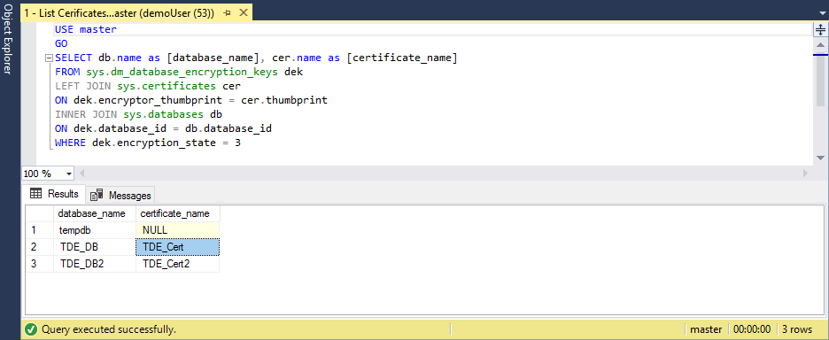

# Migrate a certificate of a TDE-protected database to Azure SQL Managed Instance
[!INCLUDE[appliesto-sqlmi](../includes/appliesto-sqlmi.md)]

When you're migrating a database protected by [Transparent Data Encryption (TDE)](https://docs.microsoft.com/sql/relational-databases/security/encryption/transparent-data-encryption) to Azure SQL Managed Instance using the native restore option, the corresponding certificate from the SQL Server instance needs to be migrated before database restore. This article walks you through the process of manual migration of the certificate to Azure SQL Managed Instance:

> [!div class="checklist"]
>
> * Export the certificate to a Personal Information Exchange (.pfx) file
> * Extract the certificate from a file to a base-64 string
> * Upload it using a PowerShell cmdlet

For an alternative option using a fully managed service for seamless migration of both a TDE-protected database and a corresponding certificate, see [How to migrate your on-premises database to Azure SQL Managed Instance using Azure Database Migration Service](../../dms/tutorial-sql-server-to-managed-instance.md).

> [!IMPORTANT]
> A migrated certificate is used for restore of the TDE-protected database only. Soon after restore is done, the migrated certificate gets replaced by a different protector, either a service-managed certificate or an asymmetric key from the key vault, depending on the type of the TDE you set on the instance.

## Prerequisites

To complete the steps in this article, you need the following prerequisites:

* [Pvk2Pfx](https://docs.microsoft.com/windows-hardware/drivers/devtest/pvk2pfx) command-line tool installed on the on-premises server or other computer with access to the certificate exported as a file. The Pvk2Pfx tool is part of the [Enterprise Windows Driver Kit](https://docs.microsoft.com/windows-hardware/drivers/download-the-wdk), a self-contained command-line environment.
* [Windows PowerShell](/powershell/scripting/install/installing-windows-powershell) version 5.0 or higher installed.

# [PowerShell](#tab/azure-powershell)

Make sure you have the following:

* Azure PowerShell module [installed and updated](https://docs.microsoft.com/powershell/azure/install-az-ps).
* [Az.Sql module](https://www.powershellgallery.com/packages/Az.Sql).

[!INCLUDE [updated-for-az](../../../includes/updated-for-az.md)]

> [!IMPORTANT]
> The PowerShell Azure Resource Manager module is still supported by Azure SQL Managed Instance, but all future development is for the Az.Sql module. For these cmdlets, see [AzureRM.Sql](https://docs.microsoft.com/powershell/module/AzureRM.Sql/). The arguments for the commands in the Az module and in the AzureRM modules are substantially identical.

Run the following commands in PowerShell to install/update the module:

```azurepowershell
Install-Module -Name Az.Sql
Update-Module -Name Az.Sql
```

# [Azure CLI](#tab/azure-cli)

If you need to install or upgrade, see [Install the Azure CLI](/cli/azure/install-azure-cli).

* * *

## Export the TDE certificate to a .pfx file

The certificate can be exported directly from the source SQL Server instance, or from the certificate store if it's being kept there.

### Export the certificate from the source SQL Server instance

Use the following steps to export the certificate with SQL Server Management Studio and convert it into .pfx format. The generic names *TDE_Cert* and *full_path* are being used for certificate and file names and paths through the steps. They should be replaced with the actual names.

1. In SSMS, open a new query window and connect to the source SQL Server instance.

1. Use the following script to list TDE-protected databases and get the name of the certificate protecting encryption of the database to be migrated:

   ```sql
   USE master
   GO
   SELECT db.name as [database_name], cer.name as [certificate_name]
   FROM sys.dm_database_encryption_keys dek
   LEFT JOIN sys.certificates cer
   ON dek.encryptor_thumbprint = cer.thumbprint
   INNER JOIN sys.databases db
   ON dek.database_id = db.database_id
   WHERE dek.encryption_state = 3
   ```

   

1. Execute the following script to export the certificate to a pair of files (.cer and .pvk), keeping the public and private key information:

   ```sql
   USE master
   GO
   BACKUP CERTIFICATE TDE_Cert
   TO FILE = 'c:\full_path\TDE_Cert.cer'
   WITH PRIVATE KEY (
     FILE = 'c:\full_path\TDE_Cert.pvk',
     ENCRYPTION BY PASSWORD = '<SomeStrongPassword>'
   )
   ```

   

1. Use the PowerShell console to copy certificate information from a pair of newly created files to a .pfx file, using the Pvk2Pfx tool:

   ```cmd
   .\pvk2pfx -pvk c:/full_path/TDE_Cert.pvk  -pi "<SomeStrongPassword>" -spc c:/full_path/TDE_Cert.cer -pfx c:/full_path/TDE_Cert.pfx
   ```

### Export the certificate from a certificate store

If the certificate is kept in the SQL Server local machine certificate store, it can be exported using the following steps:

1. Open the PowerShell console and execute the following command to open the Certificates snap-in of Microsoft Management Console:

   ```cmd
   certlm
   ```

2. In the Certificates MMC snap-in, expand the path Personal > Certificates to see the list of certificates.

3. Right-click the certificate and click **Export**.

4. Follow the wizard to export the certificate and private key to a .pfx format.

## Upload the certificate to Azure SQL Managed Instance using an Azure PowerShell cmdlet

# [PowerShell](#tab/azure-powershell)

1. Start with preparation steps in PowerShell:

   ```azurepowershell
   # import the module into the PowerShell session
   Import-Module Az
   # connect to Azure with an interactive dialog for sign-in
   Connect-AzAccount
   # list subscriptions available and copy id of the subscription target the managed instance belongs to
   Get-AzSubscription
   # set subscription for the session
   Select-AzSubscription <subscriptionId>
   ```

2. Once all preparation steps are done, run the following commands to upload base-64 encoded certificate to the target managed instance:

   ```azurepowershell
   $fileContentBytes = Get-Content 'C:/full_path/TDE_Cert.pfx' -Encoding Byte
   $base64EncodedCert = [System.Convert]::ToBase64String($fileContentBytes)
   $securePrivateBlob = $base64EncodedCert  | ConvertTo-SecureString -AsPlainText -Force
   $password = "<password>"
   $securePassword = $password | ConvertTo-SecureString -AsPlainText -Force
   Add-AzSqlManagedInstanceTransparentDataEncryptionCertificate -ResourceGroupName "<resourceGroupName>" `
       -ManagedInstanceName "<managedInstanceName>" -PrivateBlob $securePrivateBlob -Password $securePassword
   ```

# [Azure CLI](#tab/azure-cli)

You need to first [set up an Azure key vault](/azure/key-vault/key-vault-manage-with-cli2) with your *.pfx* file.

1. Start with preparation steps in PowerShell:

   ```azurecli
   # connect to Azure with an interactive dialog for sign-in
   az login

   # list subscriptions available and copy id of the subscription target the managed instance belongs to
   az account list

   # set subscription for the session
   az account set --subscription <subscriptionId>
   ```

1. Once all preparation steps are done, run the following commands to upload the base-64 encoded certificate to the target managed instance:

   ```azurecli
   az sql mi tde-key set --server-key-type AzureKeyVault --kid "<keyVaultId>" `
       --managed-instance "<managedInstanceName>" --resource-group "<resourceGroupName>"
   ```

* * *

The certificate is now available to the specified managed instance, and the backup of the corresponding TDE-protected database can be restored successfully.

## Next steps

In this article, you learned how to migrate a certificate protecting the encryption key of a database with Transparent Data Encryption, from the on-premises or IaaS SQL Server instance to Azure SQL Managed Instance.

See [Restore a database backup to a Azure SQL Managed Instance](restore-sample-database-quickstart.md) to learn how to restore a database backup to Azure SQL Managed Instance.
