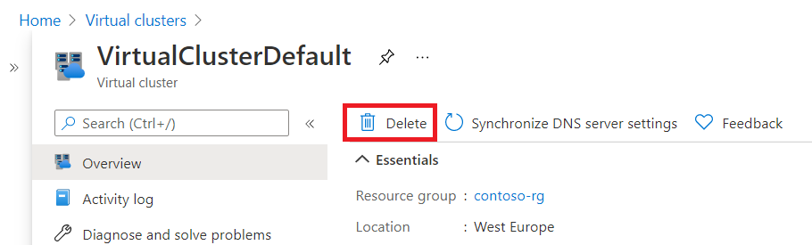

# Delete a subnet after deleting an Azure SQL Managed Instance
[!INCLUDE[appliesto-sqlmi](../includes/appliesto-sqlmi.md)]

This article provides guidelines on how to manually delete a subnet after deleting the last Azure SQL Managed Instance residing in it.

Managed instances are deployed into [virtual clusters](connectivity-architecture-overview.md#virtual-cluster-connectivity-architecture). Each virtual cluster is associated with a subnet. The virtual cluster persists by design for 12 hours after the last instance deletion to enable you to more quickly create managed instances in the same subnet. There's no charge for keeping an empty virtual cluster. During this period, the subnet associated with the virtual cluster can't be deleted.

If you don't want to wait 12 hours and prefer to delete the virtual cluster and its subnet sooner, you can do so manually. Delete the virtual cluster manually by using the Azure portal or the virtual clusters API.

> [!IMPORTANT]
> - The virtual cluster should contain no managed instances for the deletion to be successful. 
> - Deletion of a virtual cluster is a long running operation lasting for about 1.5 hours (see [SQL Managed Instance management operations](https://docs.microsoft.com/azure/sql-database/sql-database-managed-instance#managed-instance-management-operations) for up to date virtual cluster delete time) during which the virtual cluster will still be visible in the portal until this process is completed.

## Delete virtual cluster from the Azure portal

To delete a virtual cluster by using the Azure portal, search for the virtual cluster resources.

After you locate the virtual cluster you want to delete, select this resource, and select **Delete**. You're prompted to confirm the virtual cluster deletion.

Azure portal notifications will show you a confirmation that request to delete the virtual cluster has been successfully submitted. Deletion operation itself will last for about 1.5 hours during which the virtual cluster will still be visible in portal. Once the process is completed, the virtual cluster will no longer be visible and the subnet associated with it will be released for reuse.

> [!TIP]
> If there are no managed instances shown in the virtual cluster, and you are unable to delete the virtual cluster, ensure that you do not have an ongoing instance deployment in progress. This includes started and canceled deployments that are still in progress. This is because these operations will still use the virtual cluster locking it from deletion. Reviewing Deployments tab of the resource group the instance was deployed to will indicate any deployments in progress. In this case, wait for the deployment to complete, delete managed instance and then the virtual cluster.

## Delete virtual cluster by using the API

To delete a virtual cluster through the API, use the URI parameters specified in the [virtual clusters delete method](https://docs.microsoft.com/rest/api/sql/virtualclusters/delete).

## Next steps

- For an overview, see [What is a Managed Instance?](sql-managed-instance-paas-overview.md).
- Learn about [connectivity architecture in Managed Instance](connectivity-architecture-overview.md).
- Learn how to [modify an existing virtual network for Managed Instance](vnet-existing-add-subnet.md).
- For a tutorial that shows how to create a virtual network, create a Managed Instance, and restore a database from a database backup, see [Create an Azure SQL Managed Instance](instance-create-quickstart.md).
- For DNS issues, see [Configuring a custom DNS](custom-dns-configure.md).
