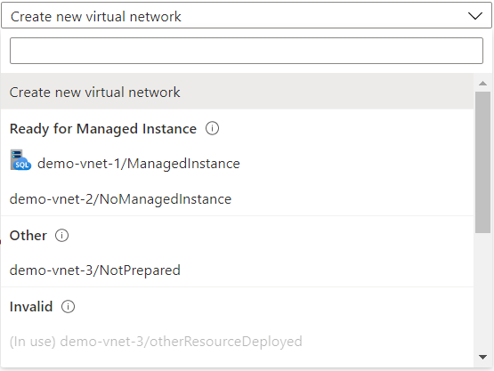
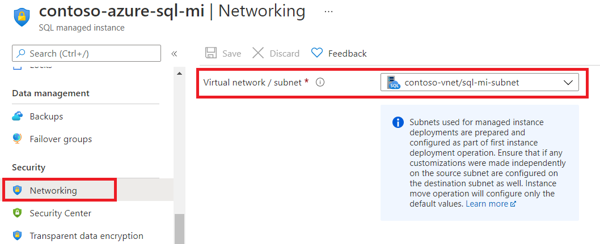
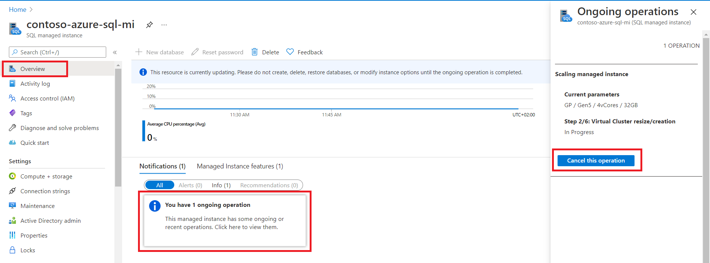

# Move Azure SQL Managed Instance across the subnets
[!INCLUDE[appliesto-sqlmi](../includes/appliesto-sqlmi.md)]

Azure SQL Managed Instance must be deployed within an Azure [virtual network](../../virtual-network/virtual-networks-overview.md) inside the subnet that's dedicated to managed instances. The number of managed instances that can be deployed in the subnet of a virtual network depends on the size of the subnet (subnet range).

Similar like scaling vCores or changing the instance service tier, it is possible to move the instance from one subnet to another in an online way. SQL Managed Instance is available during the move, except a short downtime caused by the failover that happens at the end of the update. It typically lasts up to 10 seconds even in case of interrupted long-running transactions. Moving the instance to another subnet will trigger a virtual cluster operation:
- In the destination subnet buildout or resize of the virtual cluster,
- In the source subnet removal or defragmentation of the virtual cluster.

Before deploying SQL Managed Instance, it is recommended to go over the key concepts:
- Check how to [determine required subnet size and range for Azure SQL Managed Instance](vnet-subnet-determine-size.md).
- Choose between deploying the instance in a [new subnet](virtual-network-subnet-create-arm-template.md) or [using the existing one](vnet-existing-add-subnet.md).
- Azure SQL Managed Instance provides [management operations](management-operations-overview.md) that you can use to automatically deploy new managed instances, update instance properties, and delete instances when no longer needed.
- Managed instance management operations are long running as SQL Managed Instance relies on [virtual clusters](connectivity-architecture-overview.md). These operations consist of multiple [steps that can be monitored using any tool](management-operations-monitor.md).

## Destination subnet requirements and limitations

In order for managed instance to be deployed, the subnet must have certain characteristics represented through [network requirements](connectivity-architecture-overview.md#service-aided-subnet-configuration). These characteristics are the same no matter if subnet will be used for new instance deployment or used as a destination for moving the existing instance.

### Limitations for choosing destination subnet

There are several limitations that apply to the destination subnet when existing instance is moved:
- Only subnets within the same virtual network are allowed as a destination.
- It is not possible to change the DNS zone of SQL Managed Instance. If destination subnet is not empty, instances located inside that subnet must have the same DNS zone as instances in the source subnet.
- Instances running on deprecated Gen4 hardware will have to upgrade to the newer hardware generation in order to move to another subnet.

### Subnet readiness for instance move

Depending on the configuration of the subnet and resources deployed inside it, subnets are divided into the three groups:
- Ready for Managed Instance - these subnets fullfil all network requirements. There are two subtypes of ready subnets:
  - With SQL Managed Instance inside - these subnets have SQL Managed Instance icon in front.
  - Empty subnet - without icon in front.
- Other - These subnets are empty and can be used, but as a part of instance deployment process they will be adjusted. This adjustment applies for both scenarios, new instance creation or moving the existing instance.
- Invalid - These subnets don't fullfil the requirements. Prefixes that explain which requirement is missing are added in front of the subnet name:
  - In use - subnet has some other resource deployed. Instances used for instance deployments cannot contain other resources.
  - DNS - subnet has different DNS zone (cross-subnet instance move limitation).

> [!div class="mx-imgBorder"]
> 

### Changes in subnet configuration during instance move operation

Depending on the subnet state and group mentioned above that subnet belongs to, different adjustments of destination subnet are made:
- Ready for Managed Instance with SQL Managed instance inside - nothing is done. These subnets already have managed instances inside and making any change on the subnet configuration could break the experience of the existing instances.
- Ready for managed instance but empty - instance move flow will check if all required rules are present in the network security group and route table. If necessary rules are not present they will be added. Depending on the instance configuration (public endpoint, connection type for private endpoint), extra rules will be deployed.
- Other - subnet will be prepared and all relevant rules will be created according to [network requirements](connectivity-architecture-overview.md#service-aided-subnet-configuration).

## Operation steps

|Step name  |Step description  |
|----|---------|
|Request validation |Submitted parameters are validated. In case of misconfiguration operation will fail with an error. |
|Virtual cluster resizing / creation |Depending on the state of the destination subnet, virtual cluster goes into creation or resizing. |
|New SQL instance startup |SQL process is started on deployed virtual cluster in the destination subnet. |
|Seeding database files / attaching database files |Depending on the service tier, either database seeding or attaching database files is performed. |
|Preparing failover and failover |After data has been seeded or database files reattached, system is being prepared for the failover. When everything is set, failover is performed **with a short downtime**. |
|Old SQL instance cleanup |Removing old SQL process from the source virtual cluster |
|Virtual cluster deletion |Depending if the instance being moved is last in the subnet, virtual cluster is synchronously deleted as last step. |

Detailed explanation of the operation steps can be found in the [overview of Azure SQL Managed Instance management operations](management-operations-overview.md#management-operations-steps)

## Move the instance to another subnet

For moving the instance to another subnet, existing API, PowerShell, and Azure CLI commands for instance update are enhanced with the property for subnet ID. In Azure portal networking blade is enhanced with the field for changing the subnet.

For the full reference of instance management API, PowerShell and Azure CLI commands visit [Management API reference for Azure SQL Managed Instance](api-references-create-manage-instance.md)

# [Portal](#tab/azure-portal)

Option for selecting the instance subnet is located on the "Networking" blade. By selecting the subnet and saving the changes, instance move operation will start.

> [!div class="mx-imgBorder"]
> 
> Important
> First part of the instance move operations is preparing destination subnet for deployment. This part will take couple of minutes to complete. After that part is completed, instance managamenet operation will start and become visible in Azure portal.
Instance move operation can be monitored from the "Overview" blade. By clicking on the notification, additional blade will be opened. This blade contains the information about current step and total steps, as well as the button for canceling the operation.

> [!div class="mx-imgBorder"]
> 
# [PowerShell](#tab/azure-powershell)

In PowerShell instance is moved to another subnet by using [Set-AzSqlInstance](/powershell/module/az.sql/set-azsqlinstance) command. Following example will prepare destination subnet for instance deployment and move the managed instance.

Before proceeding with this step, create new subnet in the virtual network where instance is deployed and use it as destination subnet name. In case you want to move the instance to existing subnet already containing managed instances, just use that subnet name.

```powershell-interactive
### PART 1 - DEFINE PARAMETERS
#Generating basic parameters
$currentSubscriptionID = 'subscription-id'
$sqlMIResourceGroupName = 'resource-group-name-of-sql-mi'
$sqlMIName = 'sql-mi-name'
$sqlMIResourceVnetName = 'vnet-name-of-sql-mi'
$destinationSubnetName = 'name-of-the-destination-subnet-for-sql-mi'
```

In case you are moving instance to the subnet where one or more instances are already deployed, skip the PART 2.

```powershell-interactive
### PART 2 - PREPARE DESTINATION SUBNET
#Loading the url of script used for preparing the subnet for SQL MI deployment
$scriptUrlBase = 'https://raw.githubusercontent.com/Microsoft/sql-server-samples/master/samples/manage/azure-sql-db-managed-instance/delegate-subnet'
#Generating destination subnet parameters
$parameters = @{
    subscriptionId = $currentSubscriptionID
    resourceGroupName = $sqlMIResourceGroupName
    virtualNetworkName = $sqlMIResourceVnetName
    subnetName = $destinationSubnetName
}
#Initiating subnet prepartion script
Invoke-Command -ScriptBlock ([Scriptblock]::Create((iwr ($scriptUrlBase+'/delegateSubnet.ps1?t='+ [DateTime]::Now.Ticks)).Content)) -ArgumentList $parameters
```

>NOTE
>Script used for preparing the subnet is explained in the [Configure an existing virtual network for Azure SQL Managed Instance](vnet-existing-add-subnet.md) article.
```powershell-interactive
### PART 3 - MOVE INSTANCE TO THE NEW SUBNET
Set-AzSqlInstance -Name $sqlMIName -ResourceGroupName $sqlMIResourceGroupName `
-SubnetId "/subscriptions/$currentSubscriptionID/resourceGroups/$sqlMIResourceGroupName/providers/Microsoft.Network/virtualNetworks/$sqlMIResourceVnetName/subnets/$destinationSubnetName"
```

```powershell-interactive
###PART 3 EXTENDED - MOVE INSTANCE AND MONITOR PROGRESS
# Extend the Set-AzSqlInstance command with -AsJob -Force parameters to be able to monitor the progress or proceed with script execution as moving the instance to another subnet is long running operation 
Set-AzSqlInstance -Name $sqlMIName -ResourceGroupName $sqlMIResourceGroupName `
-SubnetId "/subscriptions/$currentSubscriptionID/resourceGroups/$sqlMIResourceGroupName/providers/Microsoft.Network/virtualNetworks/$sqlMIResourceVnetName/subnets/$destinationSubnetName" -AsJob -Force
$operationProgress = Get-AzSqlInstanceOperation -ManagedInstanceName $sqlMIName -ResourceGroupName $sqlMIResourceGroupName
#checking the operation step status
Write-Host "Checking the ongoing step" -ForegroundColor Yellow
$operationProgress.OperationSteps.StepsList
```


# [Azure CLI](#tab/azure-cli)

In CLI instance is moved to another subnet by using [az sql mi update](/cli/azure/sql/mi#az_sql_mi_update) command. Following example will move the managed instance to another subnet. Destination subnet is provided either by specifying subnet ID for --subnet property or by specifying --vnet-name and --subnet properties.

Example for specifying subnet ID:

```azurecli-interactive
az sql mi update -g myResourceGroup -n mySqlManagedInstance --subnet /subscriptions/xxxxxxx-xxxx-xxxx-xxxx-xxxxxxxxxxxx/resourceGroups/myResourceGroup/providers/Microsoft.Network/virtualNetworks/myVirtualNetworkName/subnets/destinationSubnetName
```

Example for specifying virtual network name and subnet name:

```azurecli-interactive
az sql mi update -g myResourceGroup -n mySqlManagedInstance --vnet-name myVirtualNetworkName --subnet destinationSubnetName
```

Following command can be used for monitoring management operations progress:
```azurecli-interactive
az sql mi op list -g myResourceGroup --mi mySqlManagedInstance
```
---

## Next steps

- To learn how to create your first managed instance, see [Quickstart guide](instance-create-quickstart.md).
- For a features and comparison list, see [common SQL features](../database/features-comparison.md).
- For more information about VNet configuration, see [SQL Managed Instance VNet configuration](connectivity-architecture-overview.md).
- For a quickstart that creates a managed instance and restores a database from a backup file, see [Create a managed instance](instance-create-quickstart.md).
- For a tutorial about using Azure Database Migration Service for migration, see [SQL Managed Instance migration using Database Migration Service](../../dms/tutorial-sql-server-to-managed-instance.md).
