# Migration guide: Access to Azure SQL Database

In this guide, you learn how to migrate your Microsoft Access database to Azure SQL Database by using SQL Server Migration Assistant for Access (SSMA for Access).

For other migration guides, see [Azure Database Migration Guide](https://datamigration.microsoft.com/). 

## Prerequisites

Before you begin migrating your Access database to Azure SQL Database, do the following:

- Verify that your source environment is supported. 
- Download and install [SQL Server Migration Assistant for Access](https://www.microsoft.com/download/details.aspx?id=54255). 

## Pre-migration

After you've met the prerequisites, you're ready to discover the topology of your environment and assess the feasibility of your migration.

### Assess 

Create an assessment by using [SQL Server Migration Assistant for Access](https://www.microsoft.com/download/details.aspx?id=54255). 

To create an assessment, do the following: 

1. Open SSMA for Access. 
1. Select **File**, and then select **New Project**. 
1. In the **New Project** pane, enter a name for your migration project. 

   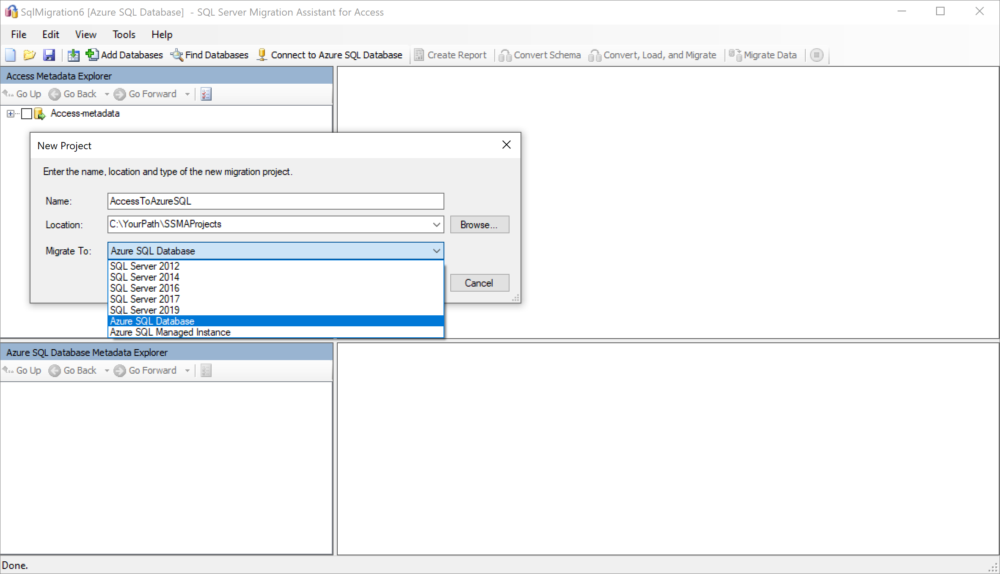

1. Select **Add Databases**, and then select the databases to be added to your new project. 

   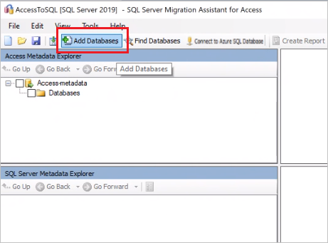

1. On the **Access Metadata Explorer** pane, right-click a database, and then select **Create Report**. 

   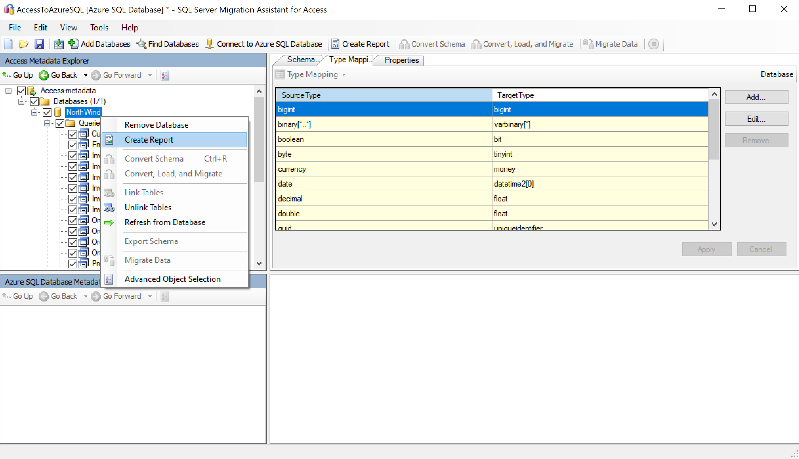

1. Review the sample assessment, as shown in the following example: 

   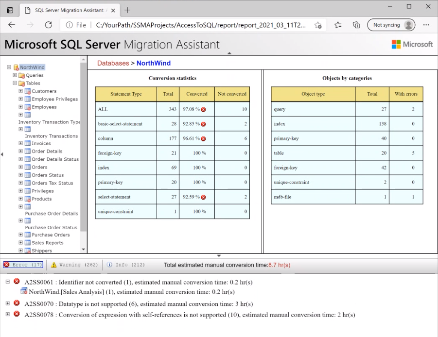

### Validate the data types

Validate the default data type mappings and change them based on your requirements, if necessary. To do so:

1. In SSMA for Access, select **Tools**, and then select **Project Settings**. 
1. Select the **Type Mapping** tab. 

   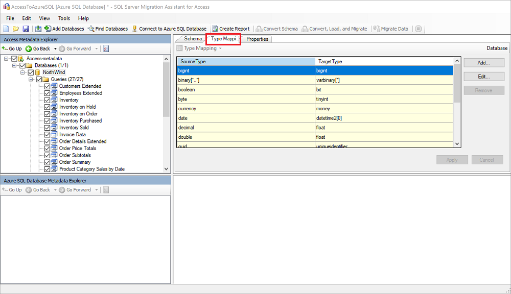

1. You can change the type mapping for each table by selecting the table name on the **Access Metadata Explorer** pane.

### Convert the schema

To convert database objects, do the following: 

1. Select the **Connect to Azure SQL Database** tab, and then provide connection details.

   

1. On the **Access Metadata Explorer** pane, right-click the database you're working with, and then select **Convert Schema**. Alternatively, you can select your database and then select the **Convert Schema** tab.

   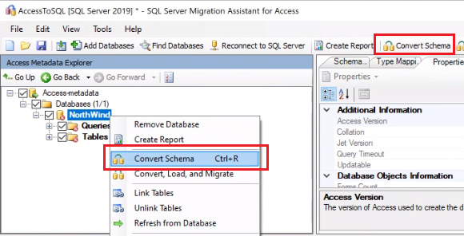

1. After the schema is converted, compare the original code with the converted code to identify potential problems.

   Compare the converted queries to the original queries, as shown here: 

   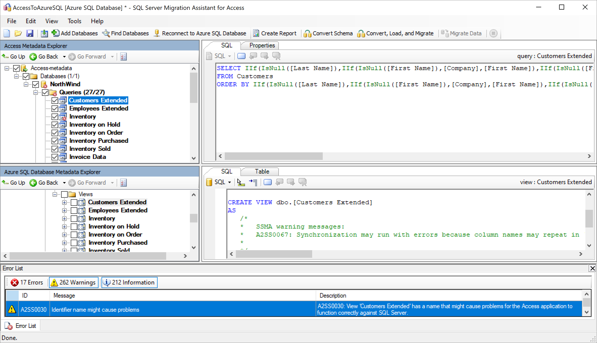

   Compare the converted objects to the original objects, as shown here: 

   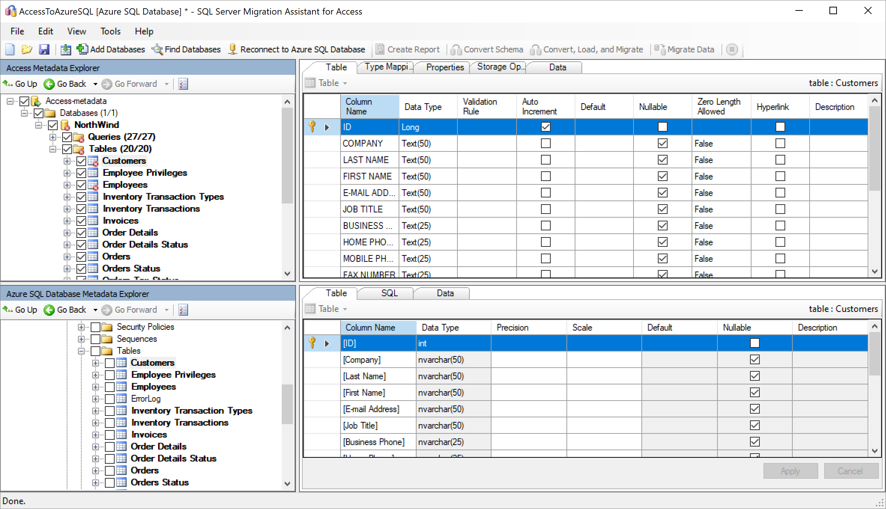

1. (Optional) To convert an individual object, right-click the object, and then select **Convert Schema**. Converted objects appear in bold text in **Access Metadata Explorer**: 

   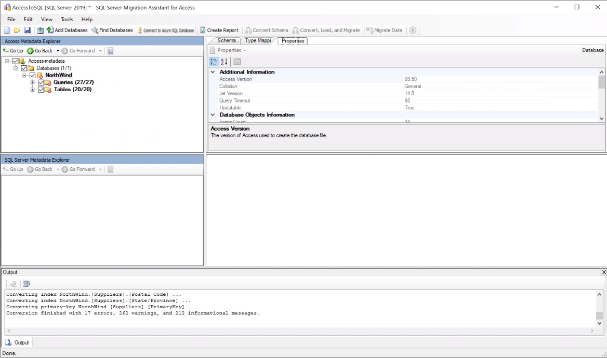
 
1. On the **Output** pane, select the **Review results** icon, and review the errors on the **Error list** pane. 

## Migrate the databases

After you've assessed your databases and addressed any discrepancies, you can run the migration process. Migrating data is a bulk-load operation that moves rows of data into Azure SQL Database in transactions. The number of rows to be loaded into Azure SQL Database in each transaction is configured in the project settings.

To migrate data by using SSMA for Access, follow these steps: 

1. If you haven't already done so, select **Connect to Azure SQL Database**, and provide connection details. 
1. On the **Azure SQL Database Metadata Explorer** pane, right-click the database you're working with, and then select **Synchronize with Database**. This action publishes the Access schema to the Azure SQL Database instance.

   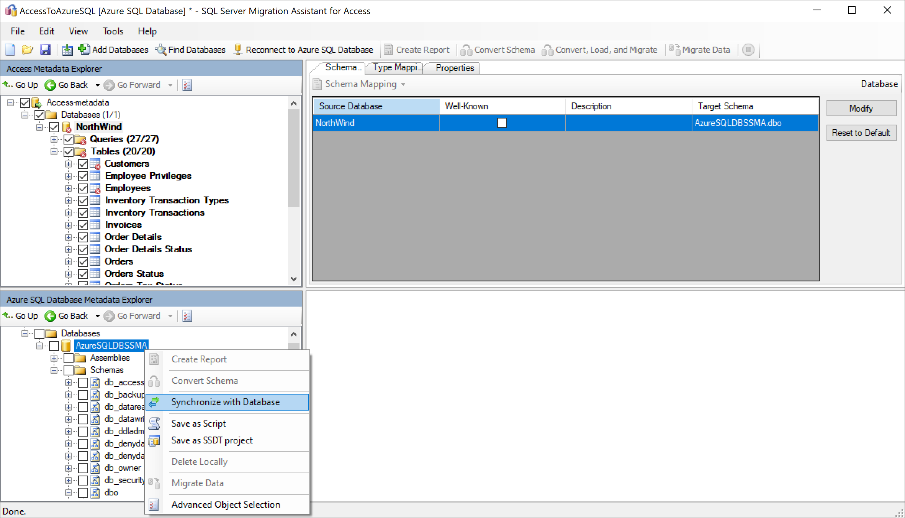

1. On the **Synchronize with the Database** pane, review the mapping between your source project and your target:

   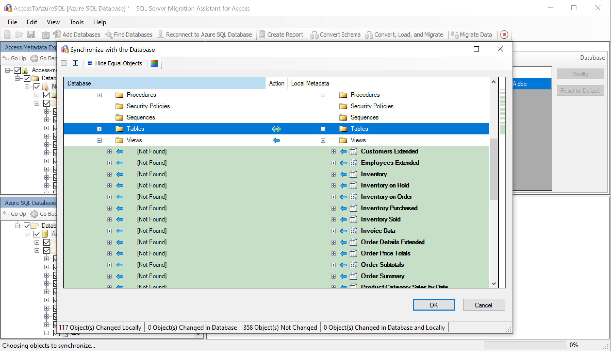

1. On the **Access Metadata Explorer** pane, select the check boxes next to the items you want to migrate. To migrate the entire database, select the check box next to the database. 

1. Right-click the database or object you want to migrate, and then select **Migrate Data**. 
   To migrate data for an entire database, select the check box next to the database name. To migrate data from individual tables, expand the database, expand **Tables**, and then select the check box next to the table. To omit data from individual tables, clear the check box.

    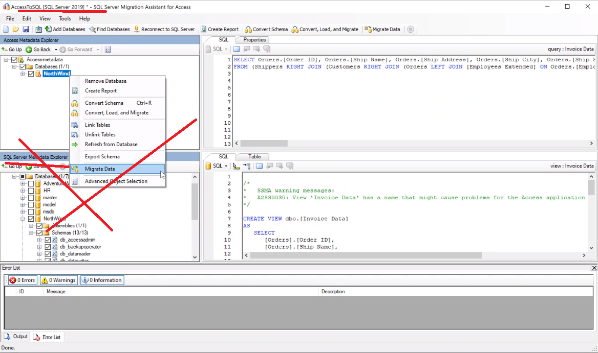

    Review the migrated data, as shown in the following screenshot: 

    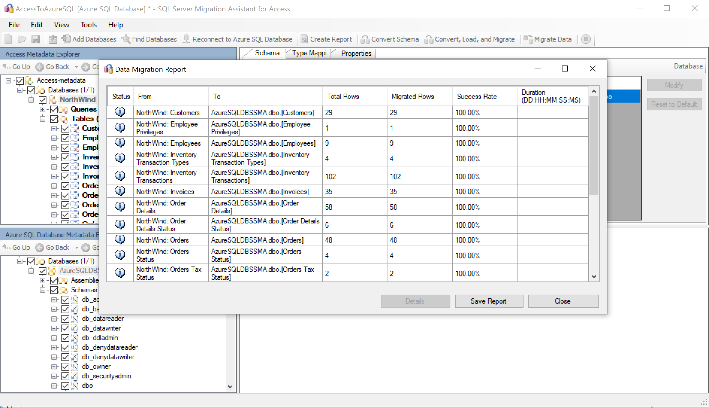

1. Connect to your Azure SQL Database instance by using [SQL Server Management Studio](/sql/ssms/download-sql-server-management-studio-ssms), and validate the migration by reviewing the data and schema.

   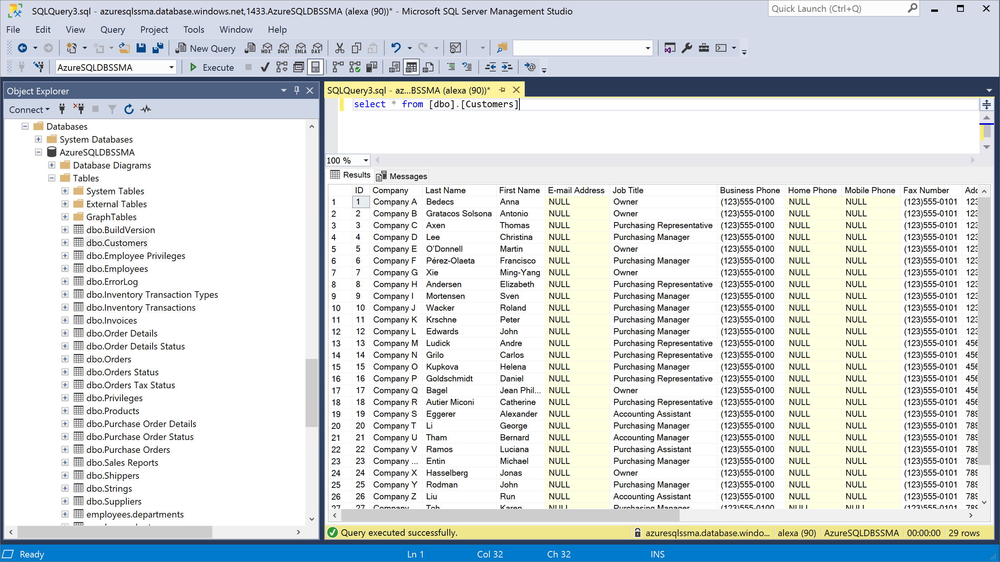

## Post-migration 

After you've successfully completed the *migration* stage, you need to complete a series of post-migration tasks to ensure that everything is functioning as smoothly and efficiently as possible.

### Remediate applications

After the data is migrated to the target environment, all the applications that formerly consumed the source need to start consuming the target. Accomplishing this will in some cases require changes to the applications.

### Perform tests

The test approach to database migration consists of the following activities:

1. **Develop validation tests**: To test the database migration, you need to use SQL queries. You must create the validation queries to run against both the source and target databases. Your validation queries should cover the scope you've defined.

1. **Set up a test environment**: The test environment should contain a copy of the source database and the target database. Be sure to isolate the test environment.

1. **Run validation tests**: Run validation tests against the source and the target, and then analyze the results.

1. **Run performance tests**: Run performance tests against the source and the target, and then analyze and compare the results.

### Optimize

The post-migration phase is crucial for reconciling any data accuracy issues, verifying completeness, and addressing performance issues with the workload.

For more information about these issues and the steps to mitigate them, see the [Post-migration validation and optimization guide](/sql/relational-databases/post-migration-validation-and-optimization-guide).

## Migration assets 

For more assistance with completing this migration scenario, see the following resource. It was developed in support of a real-world migration project engagement.

| Title | Description |
| --- | --- |
| [Data workload assessment model and tool](https://github.com/Microsoft/DataMigrationTeam/tree/master/Data%20Workload%20Assessment%20Model%20and%20Tool) | Provides suggested “best fit” target platforms, cloud readiness, and application/database remediation levels for specified workloads. It offers simple, one-click calculation and report generation that helps to accelerate large estate assessments by providing an automated, uniform target-platform decision process. |

This resource was developed as part of the Data SQL Ninja Program, which is sponsored by the Azure Data Group engineering team. The core charter of the Data SQL Ninja program is to unblock and accelerate complex modernization and compete data platform migration opportunities to the Microsoft Azure Data platform. If you think your organization would be interested in participating in the Data SQL Ninja program, contact your account team and ask them to submit a nomination.

## Next steps

- For a matrix of Microsoft and third-party services and tools that are available to assist you with various database and data migration scenarios and specialty tasks, see [Service and tools for data migration](../../../dms/dms-tools-matrix.md).

- To learn more about Azure SQL Database see:
   - [An overview of SQL Database](../../database/sql-database-paas-overview.md)
   - [Azure total cost of ownership calculator](https://azure.microsoft.com/pricing/tco/calculator/) 

- To learn more about the framework and adoption cycle for cloud migrations, see
   -  [Cloud Adoption Framework for Azure](/azure/cloud-adoption-framework/migrate/azure-best-practices/contoso-migration-scale)
   -  [Best practices for costing and sizing workloads for migration to Azure](/azure/cloud-adoption-framework/migrate/azure-best-practices/migrate-best-practices-costs) 

- To assess the application access layer, see [Data Access Migration Toolkit (preview)](https://marketplace.visualstudio.com/items?itemName=ms-databasemigration.data-access-migration-toolkit).
- For information about how to perform Data Access Layer A/B testing, see [Overview of Database Experimentation Assistant](/sql/dea/database-experimentation-assistant-overview).

