# Migration guide:  MySQL to Azure SQL Database
[!INCLUDE[appliesto-sqldb-sqlmi](../../includes/appliesto-sqldb.md)]

This guide teaches you to migrate your MySQL database to Azure SQL Database using SQL Server Migration Assistant for MySQL (SSMA for MySQL). 

For other migration guides, see [Database Migration](https://docs.microsoft.com/data-migration). 

## Prerequisites

To migrate your MySQL database to Azure SQL Database, you need:

- To verify your source environment is supported. Currently, MySQL 5.6 and 5.7 is supported. 
- [SQL Server Migration Assistant for MySQL](https://www.microsoft.com/download/details.aspx?id=54257)
- Connectivity and proper permissions to access both source and target. 

## Pre-migration 

After you have met the prerequisites, you are ready to discover the topology of your environment and assess the feasibility of your migration.

### Assess 

By using [SQL Server Migration Assistant for MySQL](https://www.microsoft.com/download/details.aspx?id=54257), you can review database objects and data, and assess databases for migration.

To create an assessment, perform the following steps.

1. Open SQL Server Migration Assistant for MySQL. 
1. Select **File** from the menu and then choose **New Project**. 
1. Provide the project name, a location to save your project. Choose **Azure SQL Database** as the migration target. Select **OK**:

   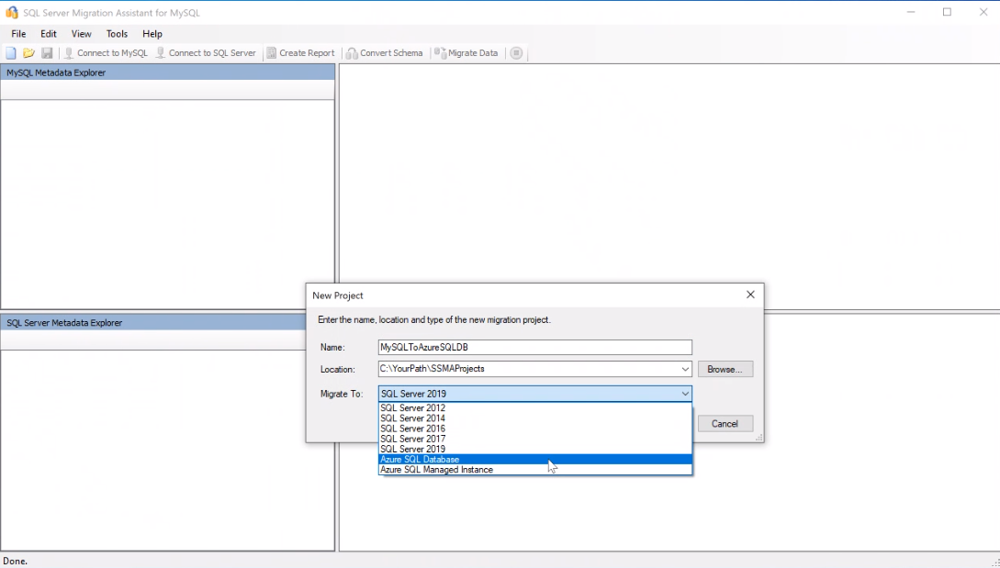

1. Choose **Connect to MySQL** and provide connection details to connect your MySQL server:

   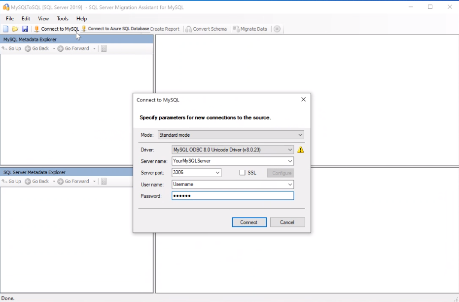

1. Right-click the MySQL schema in **MySQL Metadata Explorer** and choose **Create report**. Alternatively, you can select **Create report** from the top-line navigation bar:

   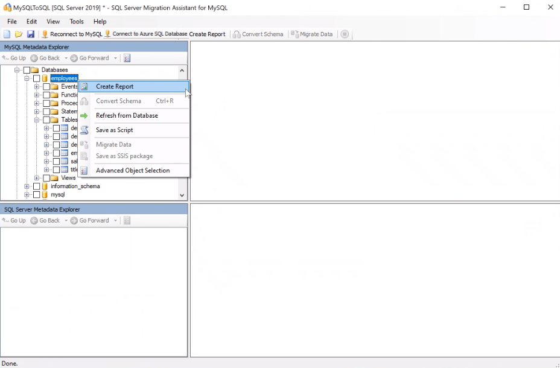

1. Review the HTML report to understand conversion statistics and any errors or warnings. You can also open the report in Excel to get an inventory of MySQL objects and the effort required to perform schema conversions. The default location for the report is in the report folder within SSMAProjects.
 
   For example: `drive:\Users\<username>\Documents\SSMAProjects\MySQLMigration\report\report_2016_11_12T02_47_55\`
 
   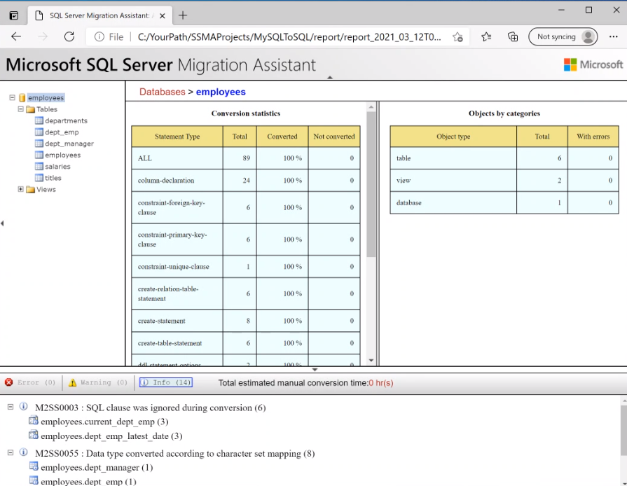

### Validate data types

Validate the default data type mappings and change them based on requirements if necessary. To do so, follow these steps: 

1. Select **Tools** from the menu. 
1. Select **Project Settings**. 
1. Select the **Type mappings** tab:

   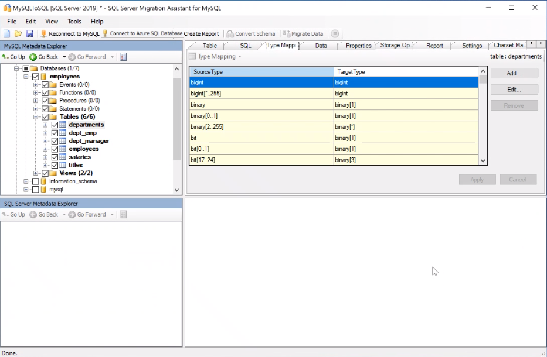

1. You can change the type mapping for each table by selecting the table in the **MySQL Metadata explorer**. 

### Convert schema 

To convert the schema, follow these steps: 

1. (Optional) To convert dynamic or ad-hoc queries, right-click the node and choose **Add statement**. 
1. Select **Connect to Azure SQL Database**. 
    1. Enter connection details to connect your database in Azure SQL Database.
    1. Choose your target SQL Database from the drop-down, or provide a new name, in which case a database will be created on the target server. 
    1. Provide authentication details. 
    1. Select **Connect**:

   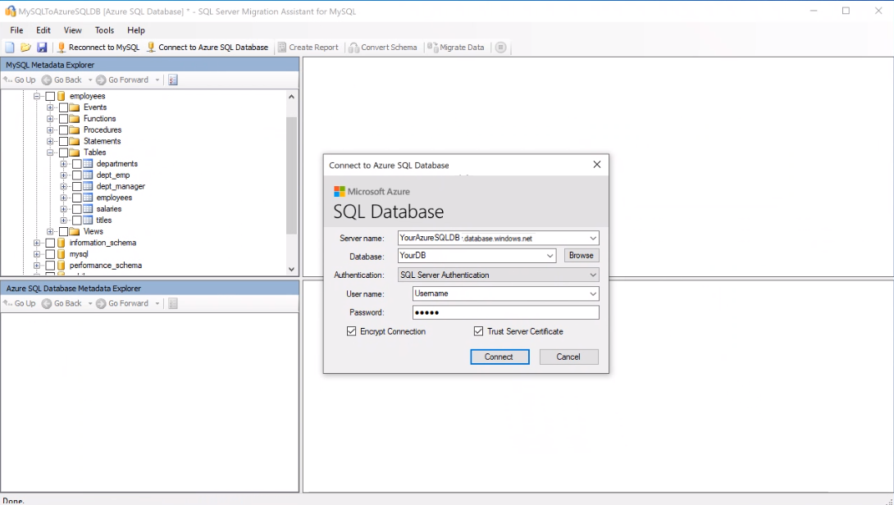
 
1. Right-click the schema and choose **Convert schema**. Alternatively, you can choose **Convert schema** from the top line navigation bar after choosing your database:

   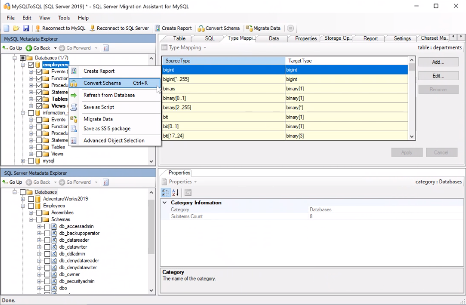

1. After the conversion completes, compare and review the converted objects to the original objects to identify potential problems and address them based on the recommendations:

   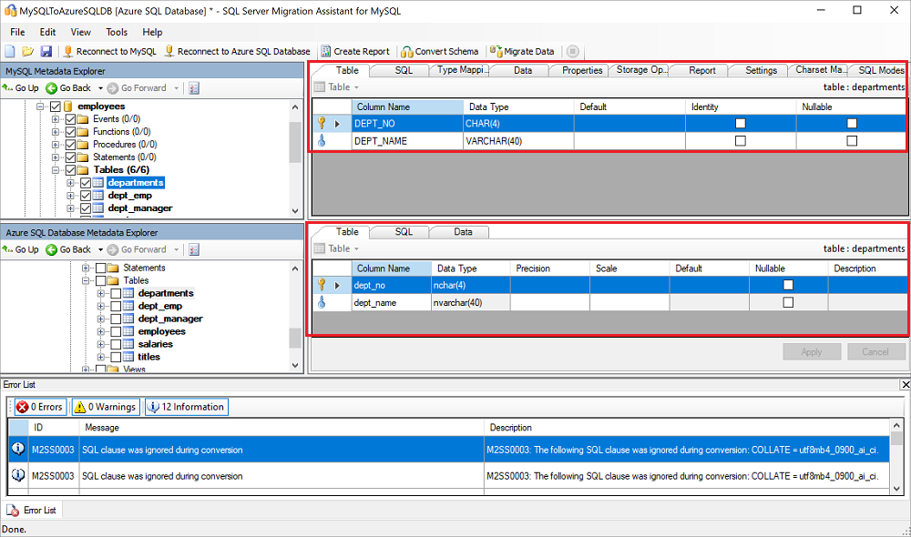

   Compare the converted Transact-SQL text to the original code and review the recommendations:

   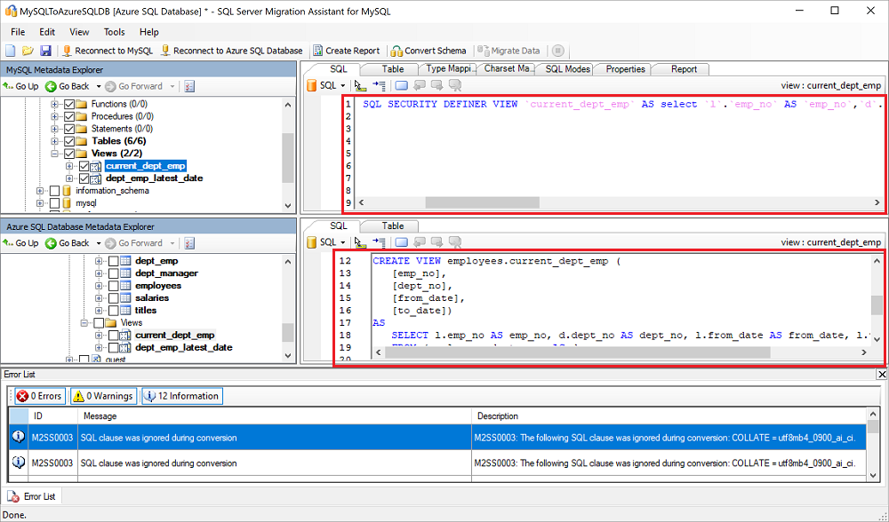

1. Select **Review results** in the Output pane, and review errors in the **Error list** pane. 
1. Save the project locally for an offline schema remediation exercise. Select **Save Project** from the **File** menu. This gives you an opportunity to evaluate the source and target schemas offline and perform remediation before you can publish the schema to SQL Database.

## Migrate 

After you have completed assessing your databases and addressing any discrepancies, the next step is to execute the migration process. Migration involves two steps – publishing the schema and migrating the data. 

To publish your schema and migrate the data, follow these steps: 

1. Publish the schema: Right-click the database from the **Azure SQL Database Metadata Explorer** and choose **Synchronize with Database**. This action publishes the MySQL schema to Azure SQL Database:

   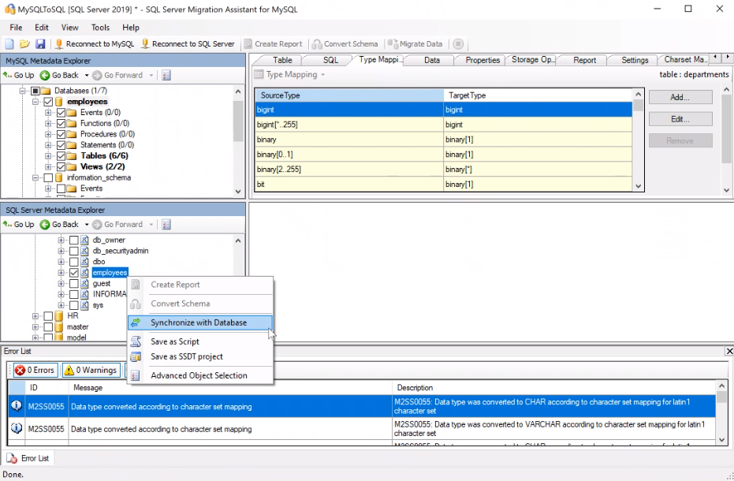

   Review the mapping between your source project and your target:

   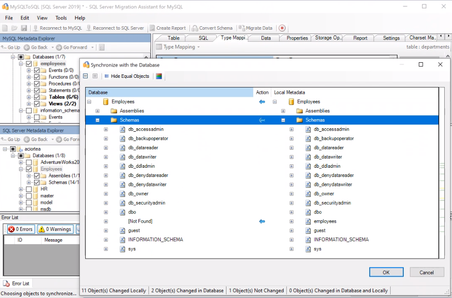

1. Migrate the data: Right-click the database or object you want to migrate in **MySQL Metadata Explorer**, and choose **Migrate data**. Alternatively, you can select **Migrate Data** from the top-line navigation bar. To migrate data for an entire database, select the check box next to the database name. To migrate data from individual tables, expand the database, expand Tables, and then select the check box next to the table. To omit data from individual tables, clear the check box:

   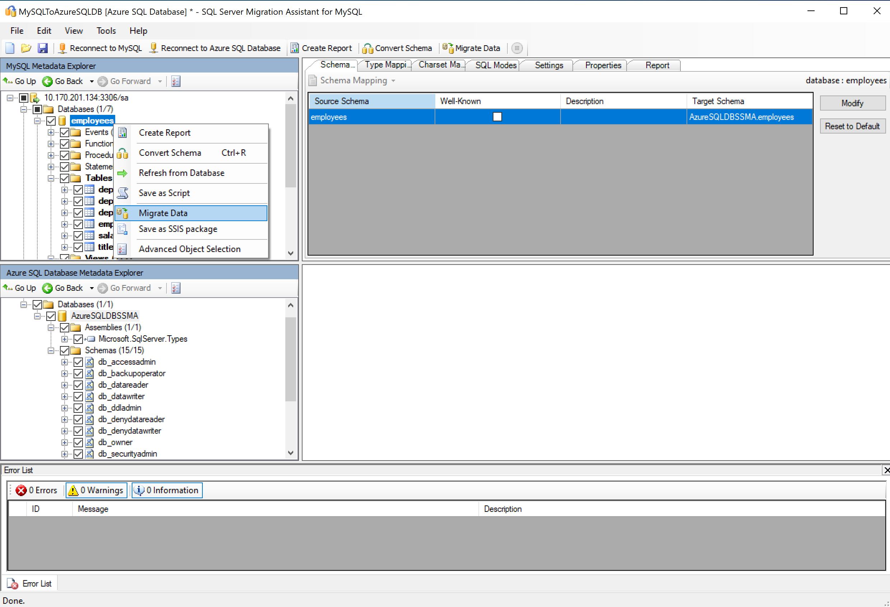

1. After migration completes, view the **Data Migration** report: 

   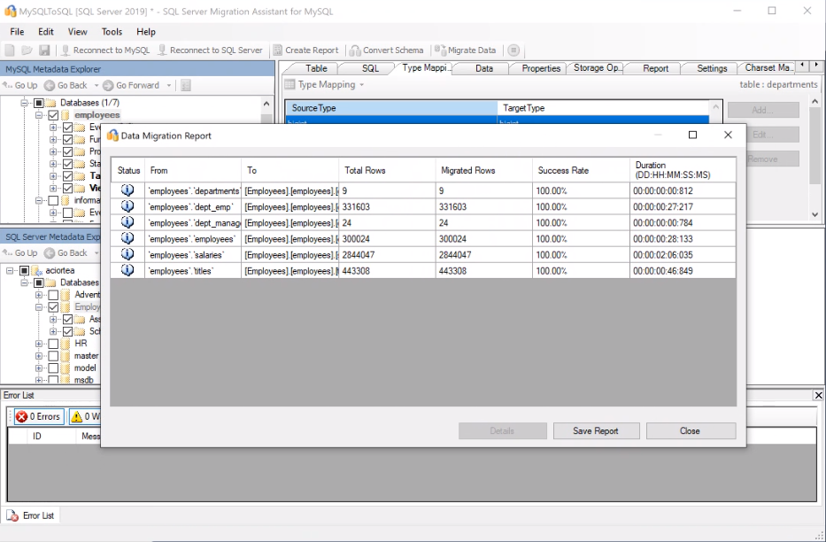

1. Connect to your Azure SQL Database by using [SQL Server Management Studio](/sql/ssms/download-sql-server-management-studio-ssms) and validate the migration by reviewing the data and schema:

    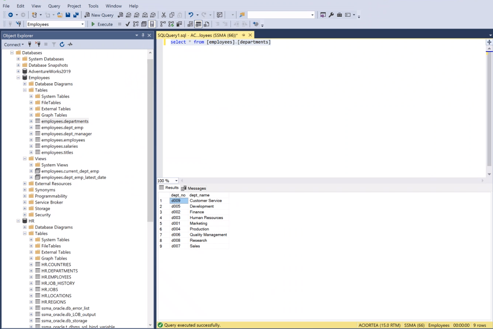

## Post-migration 

After you have successfully completed the **Migration** stage, you need to go through a series of post-migration tasks to ensure that everything is functioning as smoothly and efficiently as possible.

### Remediate applications

After the data is migrated to the target environment, all the applications that formerly consumed the source need to start consuming the target. Accomplishing this will in some cases require changes to the applications.

### Perform tests

The test approach for database migration consists of performing the following activities:

1. **Develop validation tests**. To test database migration, you need to use SQL queries. You must create the validation queries to run against both the source and the target databases. Your validation queries should cover the scope you have defined.

2. **Set up test environment**. The test environment should contain a copy of the source database and the target database. Be sure to isolate the test environment.

3. **Run validation tests**. Run the validation tests against the source and the target, and then analyze the results.

4. **Run performance tests**. Run performance test against the source and the target, and then analyze and compare the results.

### Optimize

The post-migration phase is crucial for reconciling any data accuracy issues and verifying completeness, as well as addressing performance issues with the workload.

For additional detail about these issues and specific steps to mitigate them, see the [Post-migration Validation and Optimization Guide](/sql/relational-databases/post-migration-validation-and-optimization-guide).

## Migration assets

For additional assistance with completing this migration scenario, please see the following resources, which were developed in support of a real-world migration project engagement.

| Title/link     | Description    |
| ---------------------------------------------- | ---------------------------------------------------- |
| [Data Workload Assessment Model and Tool](https://github.com/Microsoft/DataMigrationTeam/tree/master/Data%20Workload%20Assessment%20Model%20and%20Tool) | This tool provides suggested "best fit" target platforms, cloud readiness, and application/database remediation level for a given workload. It offers simple, one-click calculation and report generation that greatly helps to accelerate large estate assessments by providing and automated and uniform target platform decision process. |

These resources were developed as part of the Data SQL Ninja Program, which is sponsored by the Azure Data Group engineering team. The core charter of the Data SQL Ninja program is to unblock and accelerate complex modernization and compete data platform migration opportunities to Microsoft's Azure Data platform. If you think your organization would be interested in participating in the Data SQL Ninja program, please contact your account team and ask them to submit a nomination.

## Next steps 

- Be sure to check out the [Azure Total Cost of Ownership (TCO) Calculator](https://aka.ms/azure-tco) to help estimate the cost savings you can realize by migrating your workloads to Azure.

- For a matrix of the Microsoft and third-party services and tools that are available to assist you with various database and data migration scenarios as well as specialty tasks, see the article [Service and tools for data migration](https://docs.microsoft.com/azure/dms/dms-tools-matrix).

- For other migration guides, see [Database Migration](https://datamigration.microsoft.com/). 

For videos, see: 
- [Overview of the migration journey and the tools/services recommended for performing assessment and migration](https://azure.microsoft.com/resources/videos/overview-of-migration-and-recommended-tools-services/)
