# Migration guide: Oracle to Azure SQL Database

[!INCLUDE[appliesto-sqldb-sqlmi](../../includes/appliesto-sqldb.md)]

This guide teaches you [to migrate](https://azure.microsoft.com/migration/migration-journey) your Oracle schemas to Azure SQL Database by using [SQL Server Migration](https://azure.microsoft.com/migration/sql-server/) Assistant for Oracle (SSMA for Oracle).

For other migration guides, see [Azure Database Migration Guides](/data-migration).

## Prerequisites

Before you begin migrating your Oracle schema to SQL Database:

- Verify that your source environment is supported.
- Download [SSMA for Oracle](https://www.microsoft.com/download/details.aspx?id=54258).
- Have a target [SQL Database](../../database/single-database-create-quickstart.md) instance.
- Obtain the [necessary permissions for SSMA for Oracle](/sql/ssma/oracle/connecting-to-oracle-database-oracletosql) and [provider](/sql/ssma/oracle/connect-to-oracle-oracletosql).

## Pre-migration

After you've met the prerequisites, you're ready to discover the topology of your environment and assess the feasibility of your [Azure cloud migration](https://azure.microsoft.com/migration). This part of the process involves conducting an inventory of the databases that you need to migrate, assessing those databases for potential migration issues or blockers, and then resolving any items you might have uncovered.

### Assess

By using SSMA for Oracle, you can review database objects and data, assess databases for migration, migrate database objects to SQL Database, and then finally migrate data to the database.

To create an assessment:

1. Open [SSMA for Oracle](https://www.microsoft.com/download/details.aspx?id=54258).
1. Select **File**, and then select **New Project**.
1. Enter a project name and a location to save your project. Then select **Azure SQL Database** as the migration target from the drop-down list and select **OK**.

   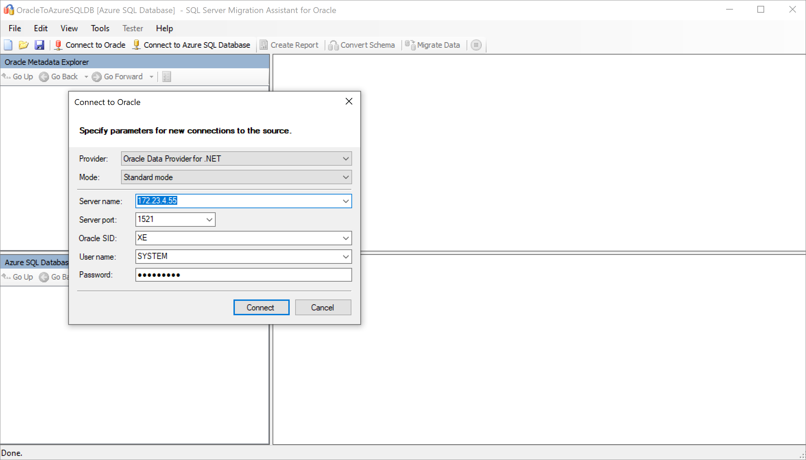

1. Select **Connect to Oracle**. Enter values for Oracle connection details in the **Connect to Oracle** dialog box.

1. Select the Oracle schemas you want to migrate.

   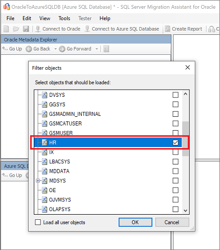

1. In **Oracle Metadata Explorer**, right-click the Oracle schema you want to migrate and then select **Create Report** to generate an HTML report. Instead, you can select a database and then select the **Create Report** tab.

   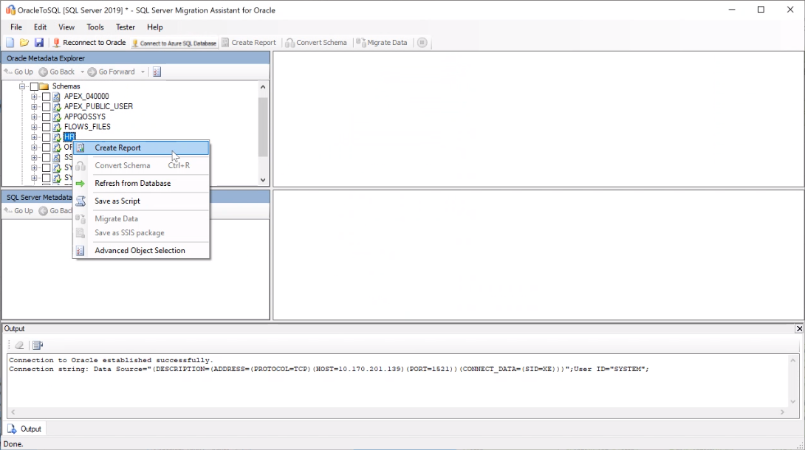

1. Review the HTML report to understand conversion statistics and any errors or warnings. You can also open the report in Excel to get an inventory of Oracle objects and the effort required to perform schema conversions. The default location for the report is in the report folder within SSMAProjects.

   For example, see `drive:\<username>\Documents\SSMAProjects\MyOracleMigration\report\report_2020_11_12T02_47_55\`.

   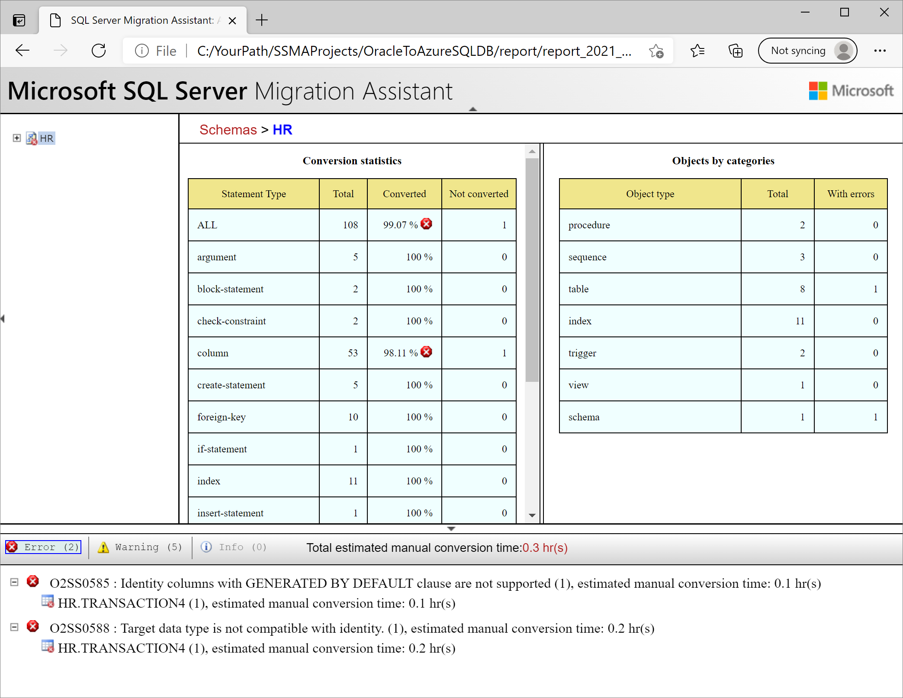

### Validate the data types

Validate the default data type mappings and change them based on requirements if necessary. To do so, follow these steps:

1. In SSMA for Oracle, select **Tools**, and then select **Project Settings**.
1. Select the **Type Mapping** tab.

   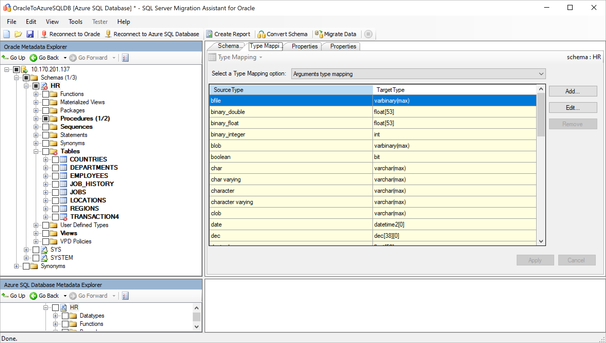

1. You can change the type mapping for each table by selecting the table in **Oracle Metadata Explorer**.

### Convert the schema

To convert the schema:

1. (Optional) Add dynamic or ad-hoc queries to statements. Right-click the node, and then select **Add statements**.
1. Select the **Connect to Azure SQL Database** tab.
    1. In **SQL Database**, enter connection details to connect your database.
    1. Select your target SQL Database instance from the drop-down list, or enter a new name, in which case a database will be created on the target server.
    1. Enter authentication details, and select **Connect**.

    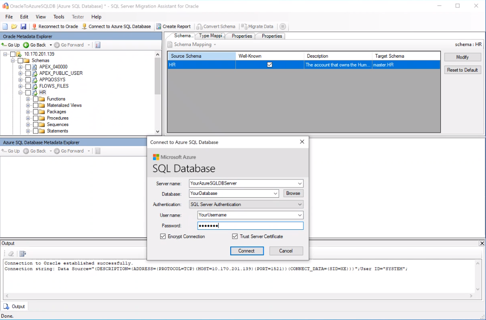

1. In **Oracle Metadata Explorer**, right-click the Oracle schema and then select **Convert Schema**. Instead, you can select your schema and then select the **Convert Schema** tab.

   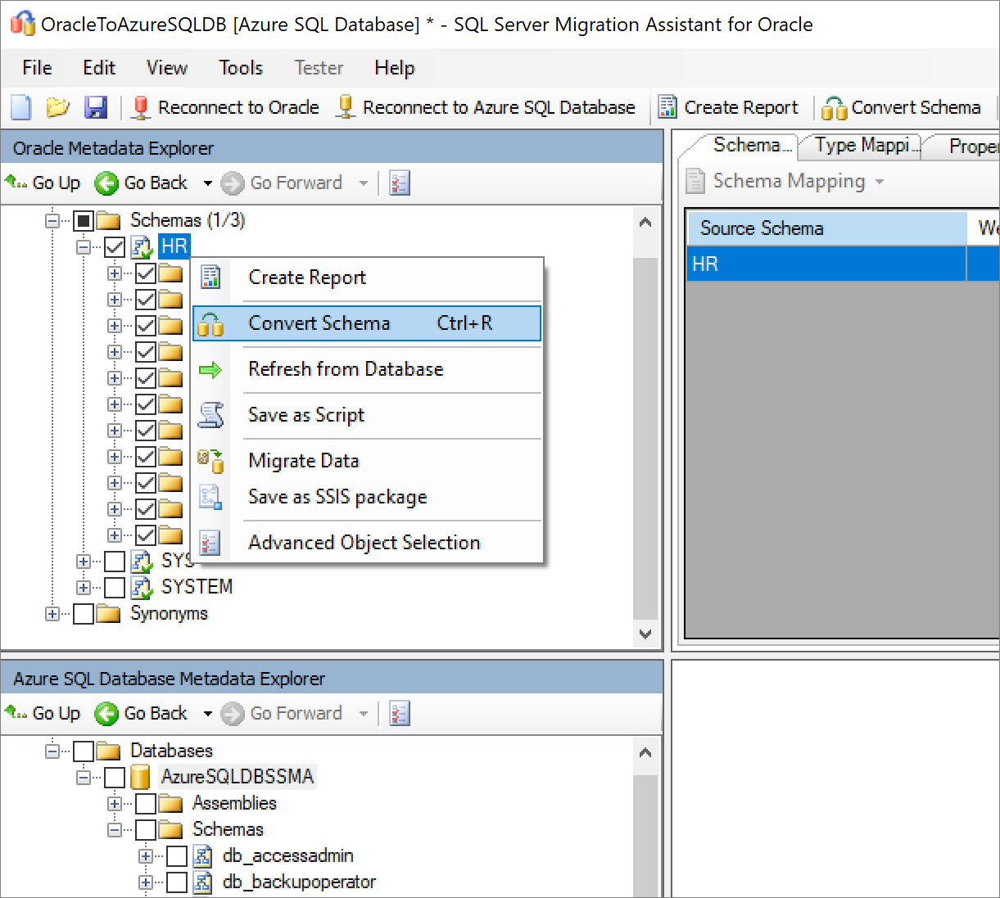

1. After the conversion finishes, compare and review the converted objects to the original objects to identify potential problems and address them based on the recommendations.

   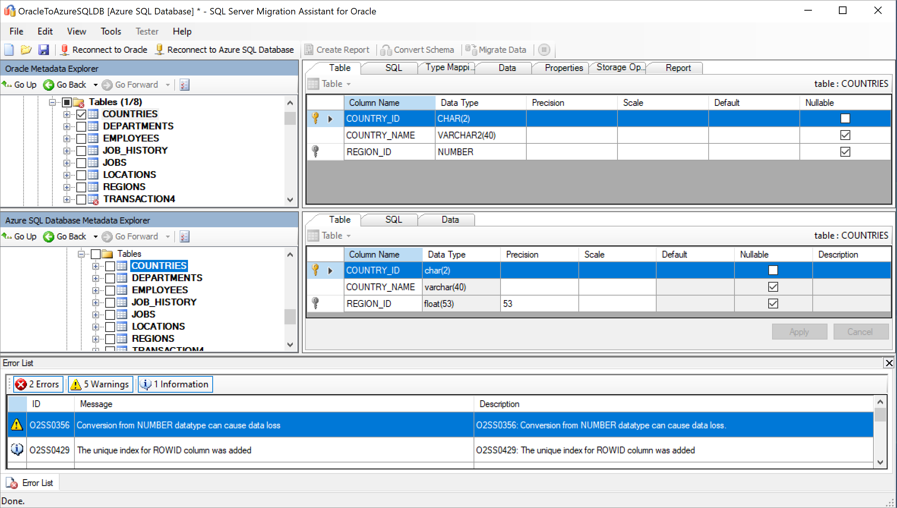

1. Compare the converted Transact-SQL text to the original stored procedures, and review the recommendations.

   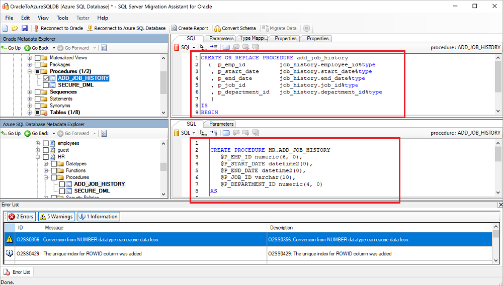

1. In the output pane, select **Review results** and review the errors in the **Error List** pane.
1. Save the project locally for an offline schema remediation exercise. On the **File** menu, select **Save Project**. This step gives you an opportunity to evaluate the source and target schemas offline and perform remediation before you publish the schema to SQL Database.

## Migrate

After you've assessed your databases and addressed any discrepancies, the next step is to run the migration process. Migration involves two steps: publishing the schema and migrating the data.

To publish your schema and migrate your data:

1. Publish the schema by right-clicking the database from the **Databases** node in **Azure SQL Database Metadata Explorer** and selecting **Synchronize with Database**.

   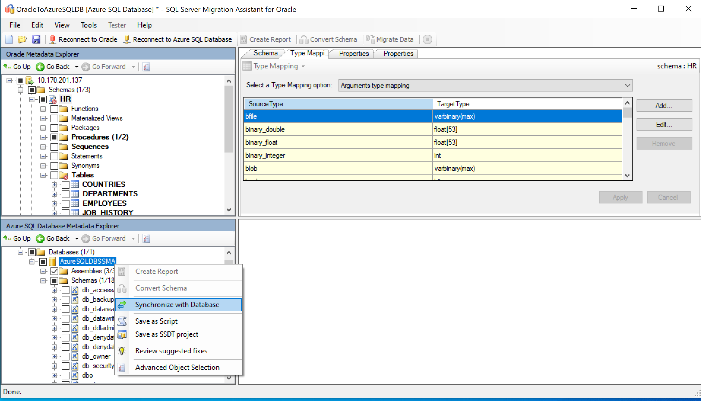

1. Review the mapping between your source project and your target.

   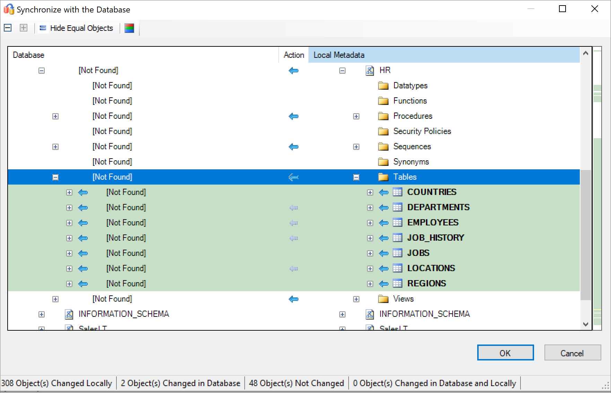

1. Migrate the data by right-clicking the database or object you want to migrate in **Oracle Metadata Explorer** and selecting **Migrate Data**. Instead, you can select the **Migrate Data** tab. To migrate data for an entire database, select the check box next to the database name. To migrate data from individual tables, expand the database, expand **Tables**, and then select the check boxes next to the tables. To omit data from individual tables, clear the check boxes.

   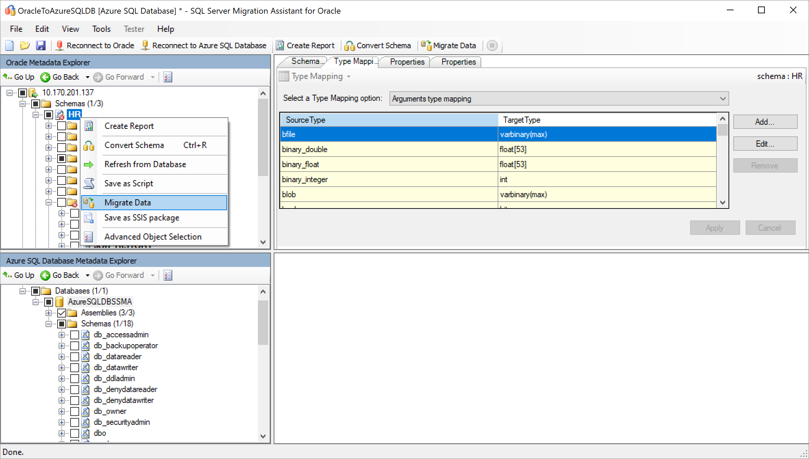

1. Enter connection details for both Oracle and SQL Database.
1. After the migration is completed, view the **Data Migration Report**.

   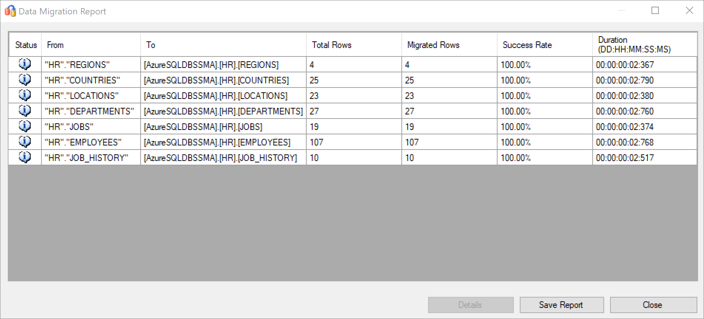

1. Connect to your SQL Database instance by using [SQL Server Management Studio](/sql/ssms/download-sql-server-management-studio-ssms), and validate the migration by reviewing the data and schema.

   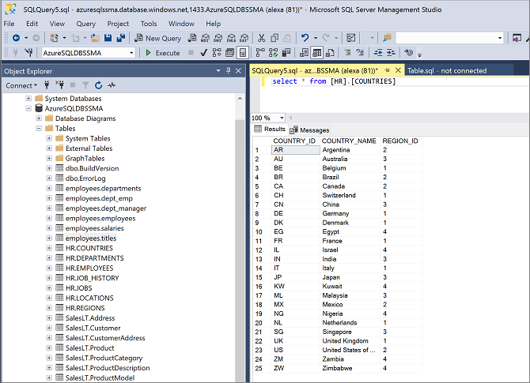

Instead, you can also use SQL Server Integration Services to perform the migration. To learn more, see:

- [Getting started with SQL Server Integration Services](/sql/integration-services/sql-server-integration-services)
- [SQL Server Integration Services for Azure and Hybrid Data Movement](https://download.microsoft.com/download/D/2/0/D20E1C5F-72EA-4505-9F26-FEF9550EFD44/SSIS%20Hybrid%20and%20Azure.docx)

## Post-migration

After you've successfully completed the *migration* stage, you need to complete a series of post-migration tasks to ensure that everything is functioning as smoothly and efficiently as possible.

### Remediate applications

After the data is migrated to the target environment, all the applications that formerly consumed the source need to start consuming the target. Accomplishing this task will require changes to the applications in some cases.

The [Data Access Migration Toolkit](https://marketplace.visualstudio.com/items?itemName=ms-databasemigration.data-access-migration-toolkit) is an extension for Visual Studio Code that allows you to analyze your Java source code and detect data access API calls and queries. The toolkit provides you with a single-pane view of what needs to be addressed to support the new database back end. To learn more, see the [Migrate your Java applications from Oracle](https://techcommunity.microsoft.com/t5/microsoft-data-migration/migrate-your-java-applications-from-oracle-to-sql-server-with/ba-p/368727) blog post.

### Perform tests

The test approach to database migration consists of the following activities:

1. **Develop validation tests**: To test the database migration, you need to use SQL queries. You must create the validation queries to run against both the source and the target databases. Your validation queries should cover the scope you've defined.
1. **Set up a test environment**: The test environment should contain a copy of the source database and the target database. Be sure to isolate the test environment.
1. **Run validation tests**: Run validation tests against the source and the target, and then analyze the results.
1. **Run performance tests**: Run performance tests against the source and the target, and then analyze and compare the results.

### Data Validation

Microsoft SQL Server Migration Assistant for Oracle Tester (SSMA Tester) allows you to test the migrated database objects the migrated data. The tester is primarily used to verify that converted objects behave in the same way.

#### Create test case

1. In SSMA for Oracle, select Tester followed by New Test Case.
   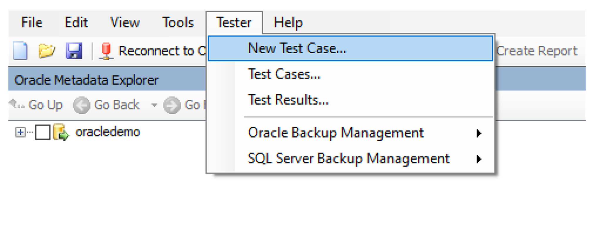

2. On the Test Case wizard, provide the following information.

   Name: Enter the name to identify the test case.

   Creation date: Today's current date, defined automatically.

   Last Modified date: filled in automatically, should not be changed.

   Description: Enter any additional information to identify the purpose of the test case.

 

3. On the Oracle object tree located on the left side, select the objects you want to evaluate during the testing process.

  :::image type="content" source="./media/oracle-to-sql-database-guide/tester-select-configure-objects.png" alt-text="Screenshot that shows step to  select and configure object.":::

In this example,  stored procedure ADD_REGION and table REGION are selected.

 To learn more, see  [Selecting and configuring objects to test.](/sql/ssma/oracle/selecting-and-configuring-objects-to-test-oracletosql)

4. Next, select the tables , foreign keys and other dependent objects from the Oracle object tree located on the left window.

  :::image type="content" source="./media//oracle-to-sql-database-guide/tester-select-configure-affected.png" alt-text="Screenshot that shows step to select and configure affected object.":::

To learn more, see [Selecting and configuring affected objects.](/sql/ssma/oracle/selecting-and-configuring-affected-objects-oracletosql)

5. In call ordering step, review the sequence of objects that will be evaluated. Change the order by clicking the buttons in the grid.

  :::image type="content" source="./media/oracle-to-sql-database-guide/test-call-ordering.png" alt-text="Screenshot that shows step to sequence test object execution.":::

6. In the finalize test case page review the information provided in the previous steps. Also, configure the test execution options as per the test scenario.

  :::image type="content" source="./media/oracle-to-sql-database-guide/tester-finalize-case.png" alt-text="Screenshot that shows step to  finalize object.":::

For more information on test case settings,[Finishing test case preparation](/sql/ssma/oracle/finishing-test-case-preparation-oracletosql)

7. Click on finish to create the test case.

  :::image type="content" source="./media//oracle-to-sql-database-guide/tester-test-repo.png" alt-text="Screenshot that shows step to test repo.":::

#### Run test case

When SSMA Tester runs a test case, the test engine executes the objects selected for testing and generates a verification report.

1. In the test repository page, select the test case and then click run.

  :::image type="content" source="./media/oracle-to-sql-database-guide/tester-repo-run.png" alt-text="Screenshot that shows to review  test repo.":::

2. Next, review the launch test case  and click run.

:::image type="content" source="./media/oracle-to-sql-database-guide/tester-run-test-case.png" alt-text="Screenshot that shows step to run test case":::

3. Next, provide  oracle  source credentials. Click connect after entering the credentials.

  :::image type="content" source="./media/oracle-to-sql-database-guide/tester-oracle-connect.png" alt-text="Screenshot that shows step to connect to  oracle source":::

4. In the next step,  provide target SQL Server credentials and click connect.

  :::image type="content" source="./media/oracle-to-sql-database-guide/tester-sql-connect.png" alt-text="Screenshot that shows step to connect to  sql target.":::

On success, it will go to initialization stage.

5. A real-time progress bar will show the execution status of the test run.

  :::image type="content" source="./media/oracle-to-sql-database-guide/tester-run-status.png" alt-text="Screenshot that shows  tester test progress.":::

6. After the test case is executed, review the report, which provides the statistics, any errors during the test run and a detail report.

 :::image type="content" source="./media/oracle-to-sql-database-guide/tester-test-result.png" alt-text="Screenshot that shows a sample tester test report":::

7. Click details to get more information.

  :::image type="content" source="./media/oracle-to-sql-database-guide/tester-test-success.png" alt-text="Screenshot that shows a sample  tester success report.":::

Example of positive data validation.

  :::image type="content" source="./media/oracle-to-sql-database-guide/tester-test-failed.png" alt-text="Screenshot that shows tester failure report.":::

Example of failed data validation.

### Optimize

The post-migration phase is crucial for reconciling any data accuracy issues, verifying completeness, and addressing performance issues with the workload.

> [!NOTE]
> For more information about these issues and the steps to mitigate them, see the [Post-migration validation and optimization guide](/sql/relational-databases/post-migration-validation-and-optimization-guide).

## Migration assets

For more assistance with completing this migration scenario, see the following resources. They were developed in support of a real-world migration project engagement.

| **Title/link**                                                                                                                                          | **Description**                                                                                                                                                                                                                                                                                                                                                                                       |
| ------------------------------------------------------------------------------------------------------------------------------------------------------- | ----------------------------------------------------------------------------------------------------------------------------------------------------------------------------------------------------------------------------------------------------------------------------------------------------------------------------------------------------------------------------------------------------- |
| [Data Workload Assessment Model and Tool](https://www.microsoft.com/download/details.aspx?id=103130) | This tool provides suggested "best fit" target platforms, cloud readiness, and application or database remediation level for a given workload. It offers simple, one-click calculation and report generation that helps to accelerate large estate assessments by providing an automated and uniform target platform decision process.                                                          |
| [Oracle Inventory Script Artifacts](https://www.microsoft.com/download/details.aspx?id=103121)                 | This asset includes a PL/SQL query that hits Oracle system tables and provides a count of objects by schema type, object type, and status. It also provides a rough estimate of raw data in each schema and the sizing of tables in each schema, with results stored in a CSV format.                                                                                                               |
| [Automate SSMA Oracle Assessment Collection & Consolidation](https://www.microsoft.com/download/details.aspx?id=103120)                                             | This set of resources uses a .csv file as entry (sources.csv in the project folders) to produce the xml files that are needed to run an SSMA assessment in console mode. The source.csv is provided by the customer based on an inventory of existing Oracle instances. The output files are AssessmentReportGeneration_source_1.xml, ServersConnectionFile.xml, and VariableValueFile.xml.|
| [Oracle to SQL DB - Database Compare utility](https://www.microsoft.com/download/details.aspx?id=103016)|SSMA for Oracle Tester is the recommended tool to automatically validate the database object conversion and data migration, and it's a superset of Database Compare functionality.  If you're looking for an alternative data validation option, you can use the Database Compare utility to compare data down to the row or column level in all or selected tables, rows, and columns.|

The Data SQL Engineering team developed these resources. This team's core charter is to unblock and accelerate complex modernization for data platform migration projects to Microsoft's Azure data platform.

## Next steps

- For a matrix of Microsoft and third-party services and tools that are available to assist you with various database and data migration scenarios and specialty tasks, see [Services and tools for data migration](../../../dms/dms-tools-matrix.md).

- To learn more about SQL Database, see:
  - [An overview of Azure SQL Database](../../database/sql-database-paas-overview.md)
  - [Azure Total Cost of Ownership (TCO) Calculator](https://azure.microsoft.com/pricing/tco/calculator/)

- To learn more about the framework and adoption cycle for cloud migrations, see:
   -  [Cloud Adoption Framework for Azure](/azure/cloud-adoption-framework/migrate/azure-best-practices/contoso-migration-scale)
   -  [Best practices for costing and sizing workloads for migration to Azure](/azure/cloud-adoption-framework/migrate/azure-best-practices/migrate-best-practices-costs)
   -  [Cloud Migration Resources](https://azure.microsoft.com/migration/resources)

- For video content, see:
    - [Overview of the migration journey and the tools and services recommended for performing assessment and migration](https://azure.microsoft.com/resources/videos/overview-of-migration-and-recommended-tools-services/)
