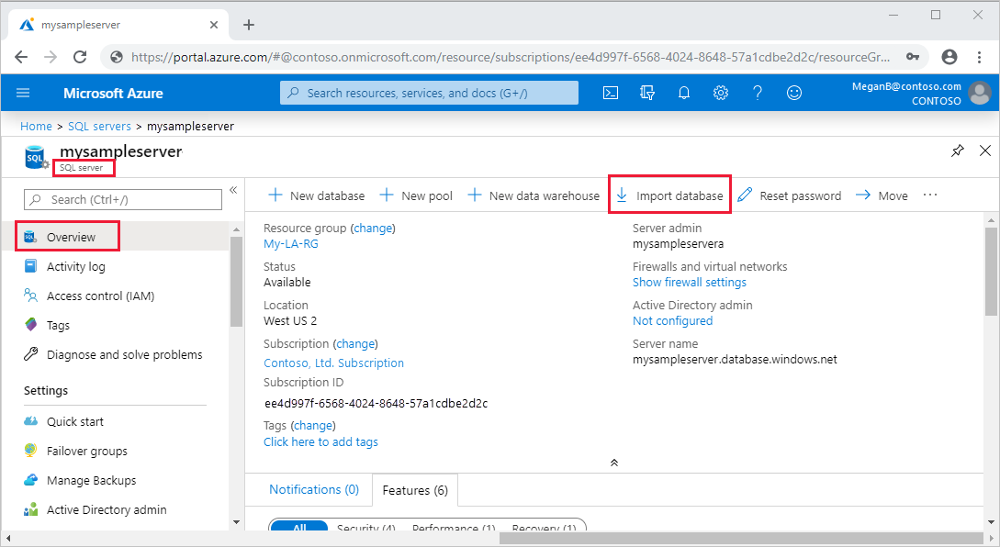

# Migration guide: SQL Server to SQL Database
[!INCLUDE[appliesto-sqldb-sqlmi](../../includes/appliesto-sqlmi.md)]

This guide helps you migrate your SQL Server instance to Azure SQL Database. 

You can migrate SQL Server running on-premises or on: 

- SQL Server on Virtual Machines  
- Amazon Web Services (AWS) EC2 
- Amazon Relational Database Service (AWS RDS) 
- Compute Engine (Google Cloud Platform - GCP)  
- Cloud SQL for SQL Server (Google Cloud Platform – GCP) 

For more migration information, see the [migration overview](sql-server-to-database-overview.md). For other scenarios, see the [Database Migration Guide](https://datamigration.microsoft.com/).

:::image type="content" source="media/sql-server-to-database-overview/migration-process-flow-small.png" alt-text="Migration process flow":::

## Prerequisites 

To migrate your SQL Server to Azure SQL Database, make sure you check the following pre-requisites: 

- Choose a [migration method](sql-server-to-database-overview.md#migration-options) and the corresponding tools that are required for the chosen method
- Install [Data Migration Assistant (DMA)](https://www.microsoft.com/en-us/download/details.aspx?id=53595) on a machine that can connect to your source SQL Server
- Create a target [Azure SQL Database](/azure/azure-sql/database/single-database-create-quickstart?tabs=azure-portal)

## Pre-migration

After you've verified that your source environment is supported, start with the pre-migration stage. Discover all of the existing data sources, assess migration feasibility, and identify any blocking issues that might prevent your migration. 

### Discover

In the Discover phase, scan the network to identify all SQL Server instances and features used by your organization. 

Use [Azure Migrate](../../../migrate/migrate-services-overview.md) to assesses migration suitability of on-premises servers, perform performance-based sizing, and provide cost estimations for running them in Azure. 

Alternatively, use the [Microsoft Assessment and Planning Toolkit (the "MAP Toolkit")](https://www.microsoft.com/download/details.aspx?id=7826) to assess your current IT infrastructure. The toolkit provides a powerful inventory, assessment, and reporting tool to simplify the migration planning process. 

For more information about tools available to use for the Discover phase, see [Services and tools available for data migration scenarios](../../../dms/dms-tools-matrix.md). 

### Assess 

After data sources have been discovered, assess any on-premises SQL Server database(s) that can be migrated to Azure SQL Database to identify migration blockers or compatibility issues. 

You can use the Data Migration Assistant (version 4.1 and later) to assess databases to get: 

- [Azure target recommendations](/sql/dma/dma-assess-sql-data-estate-to-sqldb)
- [Azure SKU recommendations](/sql/dma/dma-sku-recommend-sql-db)

To assess your environment using the Database Migration Assessment, follow these steps: 

1. Open the [Data Migration Assistant (DMA)](https://www.microsoft.com/en-us/download/details.aspx?id=53595). 
1. Select **File** and then choose **New assessment**. 
1. Specify a project name, select SQL Server as the source server type, and then select Azure SQL Database as the target server type. 
1. Select the type(s) of assessment reports that you want to generate. For example, database compatibility and feature parity. 
    - The **feature parity** category provides a comprehensive set of recommendations, alternatives available in Azure, and mitigating steps to help you plan your migration project. 
    - The **compatibility issues** category identifies partially supported or unsupported feature compatibility issues that might block migration as well as recommendations to address them. 
    > [!IMPORTANT]
    >Based on the type of assessment, the permissions required on the source SQL Server can be different. 
    > - For the **feature parity** advisor, the credentials provided to connect to source SQL Server database must be a member of the *sysadmin* server role.
    > - For the compatibility issues advisor, the credentials provided must have at least `CONNECT SQL`, `VIEW SERVER STATE` and `VIEW ANY DEFINITION` permissions.
    > - DMA will highlight the permissions required for the chosen advisor before running the assessment.
1. Specify the source connection details for your SQL Server and connect to the source database.
1. Select **Start assessment**. 
1. When the process is complete, select and review the assessment reports for migration blocking and feature parity issues. The assessment report can also be exported to a file that can be shared with other teams or personnel in your organization. 
1. Determine the database compatibility level that minimizes post-migration efforts.  
1. Identify the best Azure SQL Database SKU for your on-premises workload. 

To learn more, see [Perform a SQL Server migration assessment with Data Migration Assistant](/sql/dma/dma-assesssqlonprem).

 > [!NOTE]
   >After running the assessment, if you encounter multiple blockers and confirm that your SQL Server database is not ready for migration to Azure SQL Database, then:
>- Identify if there are instance scoped dependencies that are required for your workload and choose [Azure SQL Managed Instance](/azure/azure-sql/migration-guides/managed-instance/sql-server-to-managed-instance-overview) as a target for your database migration.
>- If both Azure SQL Database and Azure SQL Managed Instance are not suitable as a target for your database migration, choose [SQL Server on Azure Virtual Machines](/azure/azure-sql/migration-guides/virtual-machines/sql-server/to-sql-server-on-azure-vm-overview) for your database migration.

#### Scaled Assessments and Analysis
Data Migration Assistant supports performing scaled assessments and consolidation of the assessment reports for analysis. If you have multiple servers and databases that need to be assessed and analysed at scale to provide a wider view of the data estate, click on the following links to learn more.

- [Performing scaled assessments using Powershell](https://docs.microsoft.com/sql/dma/dma-consolidatereports?view=sqlallproducts-allversions)
- [Analyzing assessment reports using Power BI](https://docs.microsoft.com/sql/dma/dma-consolidatereports?view=sqlallproducts-allversions#dma-reports)

> [!IMPORTANT]
>Running assessments at scale for multiple databases especially large ones can also be automated using [DMA's Command Line Utility](https://docs.microsoft.com/sql/dma/dma-commandline?view=sqlallproducts-allversions) which also allows the results to be uploaded to [Azure Migrate](https://docs.microsoft.com/sql/dma/dma-assess-sql-data-estate-to-sqldb?view=sqlallproducts-allversions#view-target-readiness-assessment-results) for further analysis and target readiness.

## Migrate

After you have completed tasks associated with the Pre-migration stage, you are ready to perform the schema and data migration. 

Migrate your data using your chosen [migration method](sql-server-to-database-overview.md#migration-options). The popular options for migrating to Azure SQL Database are described below.

#### Import a BACPAC file to migrate a database (requires downtime during the migration)
To import from a BACPAC file to Azure SQL Database using the Azure portal , follow the steps below:
1. Open the Azure portal and navigate to the desired SQL Server page. On the toolbar, select **Import database**.
	 
2. Specify the storage account details that contains the BACPAC file.
3. Specify the new database size and enter credentials for the new database.
	 
4. Click OK on the Import Database blade to start the import process.
5. After the BACPAC file is imported (which can be verified under **Settings** -> **Import/Export history**), select **SQL databases** and verify the new database is **Online**.
	> [!NOTE]
	>- To maximize import speed by providing more and faster resources, scale your database to a higher service tier and compute size during the import process. You can then scale down after the import is successful. 
	>- The imported database's compatibility level is based on the source database's compatibility level.

For a detailed tutorial of this migration option, see [Import a BACPAC file to a database in Azure SQL Database](/azure/azure-sql/database/database-import). 

#### Migration with native backup and restore (Offline size of data operation)
RESTORE of native backups (.bak files) taken from a SQL Server instance, available on [Azure Storage](https://azure.microsoft.com/services/storage/), is one of the key capabilities of SQL Managed Instance that enables quick and easy offline database migration.

The following diagram provides a high-level overview of the process:

1. You can backup database(s) to Azure Blob storage service natively with SQL Server 2012 SP1 CU2 and above. Manage your backups to Azure Blob storage (also referred to as SQL Server Backup to URL) by following the instructions to [Backup with SSMS](https://docs.microsoft.com/sql/relational-databases/backup-restore/sql-server-backup-to-url?view=sqlallproducts-allversions#BackupTaskSSMS).
	> [!NOTE]
	> For SQL Server versions previous to SQL Server 2012 SP1 CU2, you can use the add-in SQL Server Backup to Microsoft Azure Tool to quickly and easily create backups to Microsoft Azure storage. For more information, see [download center](https://go.microsoft.com/fwlink/?LinkID=324399).

To learn more about this migration option, see [Restore a database to Azure SQL Managed Instance with SSMS](https://docs.microsoft.com/azure/azure-sql/managed-instance/restore-sample-database-quickstart).

## Data sync and cutover

During offline migrations, the data on the source and target is static so skip data sync for these scenarios. 

However, when using online migration options (DMS, transactional replication, etc.), the source data and schema continues to change and drift from the target. During data sync, ensure that all changes on the source are captured and applied to the target during the online migration process. 

After you verify that data is the same at both source and target, you can cutover from the source to the target environment. It is important to plan the cutover process with business / application teams to ensure there is minimal interruption during cutover and that it does not affect your business continuity. 

> [!IMPORTANT]
> For details on the specific steps associated with performing a cutover as part of online migrations using DMS, see [Performing migration cutover](/azure/dms/tutorial-sql-server-azure-sql-online#perform-migration-cutover).

## Post-migration

After you have successfully completed the migration stage, go through a series of post-migration tasks to ensure that everything is functioning smoothly and efficiently. 

The post-migration phase is crucial for reconciling any data accuracy issues and verifying completeness, as well as addressing performance issues with the workload. 

### Remediate applications 

After the data is migrated to the target environment, all the applications that formerly consumed the source need to start consuming the target. Accomplishing this will, in some cases, require changes to the applications.

### Perform tests

The test approach for database migration consists of the following activities:

1. **Develop validation tests**: To test database migration, you need to use SQL queries. You must create the validation queries to run against both the source and the target databases. Your validation queries should cover the scope you have defined.
1. **Set up test environment**: The test environment should contain a copy of the source database and the target database. Be sure to isolate the test environment.
1. **Run validation tests**: Run the validation tests against the source and the target, and then analyze the results.
1. **Run performance tests**: Run performance test against the source and the target, and then analyze and compare the results.

   > [!NOTE]
   > For assistance developing and running post-migration validation tests, consider the Data Quality Solution available from the partner [QuerySurge](https://www.querysurge.com/company/partners/microsoft). 

## Leverage advanced features 

Be sure to take advantage of the advanced cloud-based features offered by SQL Database, such as [built-in high availability](../../database/high-availability-sla.md), [threat detection](../../database/advanced-data-security.md), and [monitoring and tuning your workload](../../database/monitor-tune-overview.md). 

Some SQL Server features are only available once the [database compatibility level](/sql/relational-databases/databases/view-or-change-the-compatibility-level-of-a-database) is changed to the latest compatibility level (150). 

To learn more, see [managing Azure SQL Database after migration](/azure/azure-sql/database/manage-data-after-migrating-to-database)

## Next steps

- For a matrix of the Microsoft and third-party services and tools that are available to assist you with various database and data migration scenarios as well as specialty tasks, see [Service and tools for data migration](../../../dms/dms-tools-matrix.md).

- To learn more about Azure SQL Database see:
	- [Deployment models, purchasing models and service tiers in Azure SQL Database](/azure/azure-sql/database/sql-database-paas-overview)

   - [Azure total Cost of Ownership Calculator](https://azure.microsoft.com/pricing/tco/calculator/) 

- To learn more about the framework and adoption cycle for Cloud migrations, see
   -  [Cloud Adoption Framework for Azure](/azure/cloud-adoption-framework/migrate/azure-best-practices/contoso-migration-scale)
   -  [Best practices for costing and sizing workloads migrate to Azure](/azure/cloud-adoption-framework/migrate/azure-best-practices/migrate-best-practices-costs) 

- To assess the Application access layer, see [Data Access Migration Toolkit (Preview)](https://marketplace.visualstudio.com/items?itemName=ms-databasemigration.data-access-migration-toolkit)
- For details on how to perform Data Access Layer A/B testing see [Database Experimentation Assistant](/sql/dea/database-experimentation-assistant-overview).
